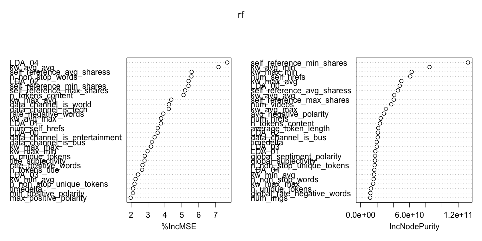

Project 2
================
Yilin Xie
July 3, 2020

  - [Introduction](#introduction)
      - [Data preprocessing](#data-preprocessing)
      - [Data split](#data-split)
      - [Summarizations](#summarizations)
  - [Ensemble model fit](#ensemble-model-fit)
      - [On train set](#on-train-set)
      - [On test set](#on-test-set)
  - [Linear regression fit](#linear-regression-fit)
      - [On train set](#on-train-set-1)
      - [On test set](#on-test-set-1)

## Introduction

The perpose of this project is going to analyze an online news
popularity data set
<https://archive.ics.uci.edu/ml/datasets/Online+News+Popularity#> and
predict **shares** by backward linear regression and random forest.
Firstly I read it into R session and determine which variables that I
would deal with.

``` r
news <- read.csv("/Users/yilinxie/Desktop/ST558/Project/Project2/OnlineNewsPopularity.csv")
head(news)
```

    ##                                                              url timedelta
    ## 1   http://mashable.com/2013/01/07/amazon-instant-video-browser/       731
    ## 2    http://mashable.com/2013/01/07/ap-samsung-sponsored-tweets/       731
    ## 3 http://mashable.com/2013/01/07/apple-40-billion-app-downloads/       731
    ## 4       http://mashable.com/2013/01/07/astronaut-notre-dame-bcs/       731
    ## 5               http://mashable.com/2013/01/07/att-u-verse-apps/       731
    ## 6               http://mashable.com/2013/01/07/beewi-smart-toys/       731
    ##   n_tokens_title n_tokens_content n_unique_tokens n_non_stop_words
    ## 1             12              219       0.6635945                1
    ## 2              9              255       0.6047431                1
    ## 3              9              211       0.5751295                1
    ## 4              9              531       0.5037879                1
    ## 5             13             1072       0.4156456                1
    ## 6             10              370       0.5598886                1
    ##   n_non_stop_unique_tokens num_hrefs num_self_hrefs num_imgs num_videos
    ## 1                0.8153846         4              2        1          0
    ## 2                0.7919463         3              1        1          0
    ## 3                0.6638655         3              1        1          0
    ## 4                0.6656347         9              0        1          0
    ## 5                0.5408895        19             19       20          0
    ## 6                0.6981982         2              2        0          0
    ##   average_token_length num_keywords data_channel_is_lifestyle
    ## 1             4.680365            5                         0
    ## 2             4.913725            4                         0
    ## 3             4.393365            6                         0
    ## 4             4.404896            7                         0
    ## 5             4.682836            7                         0
    ## 6             4.359459            9                         0
    ##   data_channel_is_entertainment data_channel_is_bus data_channel_is_socmed
    ## 1                             1                   0                      0
    ## 2                             0                   1                      0
    ## 3                             0                   1                      0
    ## 4                             1                   0                      0
    ## 5                             0                   0                      0
    ## 6                             0                   0                      0
    ##   data_channel_is_tech data_channel_is_world kw_min_min kw_max_min kw_avg_min
    ## 1                    0                     0          0          0          0
    ## 2                    0                     0          0          0          0
    ## 3                    0                     0          0          0          0
    ## 4                    0                     0          0          0          0
    ## 5                    1                     0          0          0          0
    ## 6                    1                     0          0          0          0
    ##   kw_min_max kw_max_max kw_avg_max kw_min_avg kw_max_avg kw_avg_avg
    ## 1          0          0          0          0          0          0
    ## 2          0          0          0          0          0          0
    ## 3          0          0          0          0          0          0
    ## 4          0          0          0          0          0          0
    ## 5          0          0          0          0          0          0
    ## 6          0          0          0          0          0          0
    ##   self_reference_min_shares self_reference_max_shares
    ## 1                       496                       496
    ## 2                         0                         0
    ## 3                       918                       918
    ## 4                         0                         0
    ## 5                       545                     16000
    ## 6                      8500                      8500
    ##   self_reference_avg_sharess weekday_is_monday weekday_is_tuesday
    ## 1                    496.000                 1                  0
    ## 2                      0.000                 1                  0
    ## 3                    918.000                 1                  0
    ## 4                      0.000                 1                  0
    ## 5                   3151.158                 1                  0
    ## 6                   8500.000                 1                  0
    ##   weekday_is_wednesday weekday_is_thursday weekday_is_friday
    ## 1                    0                   0                 0
    ## 2                    0                   0                 0
    ## 3                    0                   0                 0
    ## 4                    0                   0                 0
    ## 5                    0                   0                 0
    ## 6                    0                   0                 0
    ##   weekday_is_saturday weekday_is_sunday is_weekend     LDA_00     LDA_01
    ## 1                   0                 0          0 0.50033120 0.37827893
    ## 2                   0                 0          0 0.79975569 0.05004668
    ## 3                   0                 0          0 0.21779229 0.03333446
    ## 4                   0                 0          0 0.02857322 0.41929964
    ## 5                   0                 0          0 0.02863281 0.02879355
    ## 6                   0                 0          0 0.02224528 0.30671758
    ##       LDA_02     LDA_03     LDA_04 global_subjectivity
    ## 1 0.04000468 0.04126265 0.04012254           0.5216171
    ## 2 0.05009625 0.05010067 0.05000071           0.3412458
    ## 3 0.03335142 0.03333354 0.68218829           0.7022222
    ## 4 0.49465083 0.02890472 0.02857160           0.4298497
    ## 5 0.02857518 0.02857168 0.88542678           0.5135021
    ## 6 0.02223128 0.02222429 0.62658158           0.4374086
    ##   global_sentiment_polarity global_rate_positive_words
    ## 1                0.09256198                 0.04566210
    ## 2                0.14894781                 0.04313725
    ## 3                0.32333333                 0.05687204
    ## 4                0.10070467                 0.04143126
    ## 5                0.28100348                 0.07462687
    ## 6                0.07118419                 0.02972973
    ##   global_rate_negative_words rate_positive_words rate_negative_words
    ## 1                0.013698630           0.7692308           0.2307692
    ## 2                0.015686275           0.7333333           0.2666667
    ## 3                0.009478673           0.8571429           0.1428571
    ## 4                0.020715631           0.6666667           0.3333333
    ## 5                0.012126866           0.8602151           0.1397849
    ## 6                0.027027027           0.5238095           0.4761905
    ##   avg_positive_polarity min_positive_polarity max_positive_polarity
    ## 1             0.3786364            0.10000000                   0.7
    ## 2             0.2869146            0.03333333                   0.7
    ## 3             0.4958333            0.10000000                   1.0
    ## 4             0.3859652            0.13636364                   0.8
    ## 5             0.4111274            0.03333333                   1.0
    ## 6             0.3506100            0.13636364                   0.6
    ##   avg_negative_polarity min_negative_polarity max_negative_polarity
    ## 1            -0.3500000                -0.600            -0.2000000
    ## 2            -0.1187500                -0.125            -0.1000000
    ## 3            -0.4666667                -0.800            -0.1333333
    ## 4            -0.3696970                -0.600            -0.1666667
    ## 5            -0.2201923                -0.500            -0.0500000
    ## 6            -0.1950000                -0.400            -0.1000000
    ##   title_subjectivity title_sentiment_polarity abs_title_subjectivity
    ## 1          0.5000000               -0.1875000             0.00000000
    ## 2          0.0000000                0.0000000             0.50000000
    ## 3          0.0000000                0.0000000             0.50000000
    ## 4          0.0000000                0.0000000             0.50000000
    ## 5          0.4545455                0.1363636             0.04545455
    ## 6          0.6428571                0.2142857             0.14285714
    ##   abs_title_sentiment_polarity shares
    ## 1                    0.1875000    593
    ## 2                    0.0000000    711
    ## 3                    0.0000000   1500
    ## 4                    0.0000000   1200
    ## 5                    0.1363636    505
    ## 6                    0.2142857    855

``` r
sum(is.na(news$shares) )
```

    ## [1] 0

As shown above, it is a huge data set with 39644 rows and 61 colomns. It
contains factor variables, numeric variables and dummy variables. The
task is to predict the 61st variable **shares**. Then I’m going to
preprocess the data to get it in the form I need.

### Data preprocessing

``` r
library(tidyverse)
## Filters out the data for the specified weekday
news1 <- filter(news, weekday_is_monday == "1")
## Remove the useless colomns
news1 <- select(news1, -url, -weekday_is_monday, -weekday_is_tuesday, -weekday_is_wednesday, -weekday_is_thursday, -weekday_is_friday, -weekday_is_saturday, -weekday_is_sunday, -is_weekend)
r = nrow(news1);c = ncol(news1)
r;c
```

    ## [1] 6661

    ## [1] 52

Since n\>\>p, this is not a high dimension data set. I would use and to
predict **shares** by the entire variables.

### Data split

``` r
set.seed(123)
sub <- sample(1:r, 0.7*r)
train <- news1[sub,]
test <- news1[-sub,]
```

### Summarizations

We can look at the distribution of **shares** through the histogram and
see some statistics of the total variables in a summary table.

``` r
nrow(train)
```

    ## [1] 4662

``` r
hist(train$shares)
```

<!-- -->

``` r
hist(log(train$shares))
```

<!-- -->

``` r
t(summary(train))
```

    ##                                                                    
    ##   timedelta                   Min.   : 10.0      1st Qu.:164.0     
    ## n_tokens_title                Min.   : 4.0       1st Qu.: 9.0      
    ## n_tokens_content              Min.   :   0.0     1st Qu.: 248.0    
    ## n_unique_tokens               Min.   :0.0000     1st Qu.:0.4751    
    ## n_non_stop_words              Min.   :0.0000     1st Qu.:1.0000    
    ## n_non_stop_unique_tokens      Min.   :0.0000     1st Qu.:0.6296    
    ##   num_hrefs                   Min.   :  0.00     1st Qu.:  4.00    
    ## num_self_hrefs                Min.   : 0.00      1st Qu.: 1.00     
    ##    num_imgs                   Min.   : 0.000     1st Qu.: 1.000    
    ##   num_videos                  Min.   : 0.000     1st Qu.: 0.000    
    ## average_token_length          Min.   :0.000      1st Qu.:4.482     
    ##  num_keywords                 Min.   : 1.000     1st Qu.: 6.000    
    ## data_channel_is_lifestyle     Min.   :0.00000    1st Qu.:0.00000   
    ## data_channel_is_entertainment Min.   :0.0000     1st Qu.:0.0000    
    ## data_channel_is_bus           Min.   :0.0000     1st Qu.:0.0000    
    ## data_channel_is_socmed        Min.   :0.00000    1st Qu.:0.00000   
    ## data_channel_is_tech          Min.   :0.0000     1st Qu.:0.0000    
    ## data_channel_is_world         Min.   :0.0000     1st Qu.:0.0000    
    ##   kw_min_min                  Min.   : -1.00     1st Qu.: -1.00    
    ##   kw_max_min                  Min.   :    0      1st Qu.:  441     
    ##   kw_avg_min                  Min.   :   -1.0    1st Qu.:  138.4   
    ##   kw_min_max                  Min.   :     0     1st Qu.:     0    
    ##   kw_max_max                  Min.   :     0     1st Qu.:843300    
    ##   kw_avg_max                  Min.   :     0     1st Qu.:174712    
    ##   kw_min_avg                  Min.   :  -1       1st Qu.:   0      
    ##   kw_max_avg                  Min.   :     0     1st Qu.:  3534    
    ##   kw_avg_avg                  Min.   :    0      1st Qu.: 2364     
    ## self_reference_min_shares     Min.   :     0     1st Qu.:   684    
    ## self_reference_max_shares     Min.   :     0     1st Qu.:  1100    
    ## self_reference_avg_sharess    Min.   :     0     1st Qu.:  1069    
    ##     LDA_00                    Min.   :0.01818    1st Qu.:0.02527   
    ##     LDA_01                    Min.   :0.01819    1st Qu.:0.02505   
    ##     LDA_02                    Min.   :0.01819    1st Qu.:0.02857   
    ##     LDA_03                    Min.   :0.01819    1st Qu.:0.02857   
    ##     LDA_04                    Min.   :0.01818    1st Qu.:0.02857   
    ## global_subjectivity           Min.   :0.0000     1st Qu.:0.3952    
    ## global_sentiment_polarity     Min.   :-0.38021   1st Qu.: 0.05676  
    ## global_rate_positive_words    Min.   :0.00000    1st Qu.:0.02857   
    ## global_rate_negative_words    Min.   :0.000000   1st Qu.:0.009838  
    ## rate_positive_words           Min.   :0.0000     1st Qu.:0.6000    
    ## rate_negative_words           Min.   :0.0000     1st Qu.:0.1875    
    ## avg_positive_polarity         Min.   :0.0000     1st Qu.:0.3057    
    ## min_positive_polarity         Min.   :0.00000    1st Qu.:0.05000   
    ## max_positive_polarity         Min.   :0.0000     1st Qu.:0.6000    
    ## avg_negative_polarity         Min.   :-1.0000    1st Qu.:-0.3293   
    ## min_negative_polarity         Min.   :-1.0000    1st Qu.:-0.7000   
    ## max_negative_polarity         Min.   :-1.0000    1st Qu.:-0.1250   
    ## title_subjectivity            Min.   :0.0000     1st Qu.:0.0000    
    ## title_sentiment_polarity      Min.   :-1.00000   1st Qu.: 0.00000  
    ## abs_title_subjectivity        Min.   :0.0000     1st Qu.:0.1500    
    ## abs_title_sentiment_polarity  Min.   :0.0000     1st Qu.:0.0000    
    ##     shares                    Min.   :     1.0   1st Qu.:   916.2  
    ##                                                                    
    ##   timedelta                   Median :339.0      Mean   :352.3     
    ## n_tokens_title                Median :10.0       Mean   :10.4      
    ## n_tokens_content              Median : 395.0     Mean   : 539.4    
    ## n_unique_tokens               Median :0.5439     Mean   :0.5331    
    ## n_non_stop_words              Median :1.0000     Mean   :0.9728    
    ## n_non_stop_unique_tokens      Median :0.6923     Mean   :0.6756    
    ##   num_hrefs                   Median :  7.00     Mean   : 10.71    
    ## num_self_hrefs                Median : 3.00      Mean   : 3.42     
    ##    num_imgs                   Median : 1.000     Mean   : 4.497    
    ##   num_videos                  Median : 0.000     Mean   : 1.352    
    ## average_token_length          Median :4.656      Mean   :4.553     
    ##  num_keywords                 Median : 7.000     Mean   : 7.145    
    ## data_channel_is_lifestyle     Median :0.00000    Mean   :0.05148   
    ## data_channel_is_entertainment Median :0.0000     Mean   :0.2023    
    ## data_channel_is_bus           Median :0.0000     Mean   :0.1774    
    ## data_channel_is_socmed        Median :0.00000    Mean   :0.05298   
    ## data_channel_is_tech          Median :0.0000     Mean   :0.1843    
    ## data_channel_is_world         Median :0.0000     Mean   :0.1976    
    ##   kw_min_min                  Median : -1.00     Mean   : 26.74    
    ##   kw_max_min                  Median :  646      Mean   : 1097     
    ##   kw_avg_min                  Median :  231.1    Mean   :  302.8   
    ##   kw_min_max                  Median :  1300     Mean   : 12148    
    ##   kw_max_max                  Median :843300     Mean   :750627    
    ##   kw_avg_max                  Median :244492     Mean   :260296    
    ##   kw_min_avg                  Median : 959       Mean   :1074      
    ##   kw_max_avg                  Median :  4325     Mean   :  5455    
    ##   kw_avg_avg                  Median : 2848      Mean   : 3069     
    ## self_reference_min_shares     Median :  1200     Mean   :  3830    
    ## self_reference_max_shares     Median :  2900     Mean   :  9828    
    ## self_reference_avg_sharess    Median :  2200     Mean   :  6222    
    ##     LDA_00                    Median :0.03346    Mean   :0.19372   
    ##     LDA_01                    Median :0.03337    Mean   :0.15205   
    ##     LDA_02                    Median :0.04000    Mean   :0.20278   
    ##     LDA_03                    Median :0.04000    Mean   :0.21837   
    ##     LDA_04                    Median :0.04039    Mean   :0.23308   
    ## global_subjectivity           Median :0.4524     Mean   :0.4420    
    ## global_sentiment_polarity     Median : 0.11895   Mean   : 0.11766  
    ## global_rate_positive_words    Median :0.03865    Mean   :0.03951   
    ## global_rate_negative_words    Median :0.015432   Mean   :0.016883  
    ## rate_positive_words           Median :0.7105     Mean   :0.6820    
    ## rate_negative_words           Median :0.2800     Mean   :0.2906    
    ## avg_positive_polarity         Median :0.3583     Mean   :0.3547    
    ## min_positive_polarity         Median :0.10000    Mean   :0.09549   
    ## max_positive_polarity         Median :0.8000     Mean   :0.7626    
    ## avg_negative_polarity         Median :-0.2539    Mean   :-0.2593   
    ## min_negative_polarity         Median :-0.5000    Mean   :-0.5184   
    ## max_negative_polarity         Median :-0.1000    Mean   :-0.1061   
    ## title_subjectivity            Median :0.1000     Mean   :0.2736    
    ## title_sentiment_polarity      Median : 0.00000   Mean   : 0.06593  
    ## abs_title_subjectivity        Median :0.5000     Mean   :0.3401    
    ## abs_title_sentiment_polarity  Median :0.0000     Mean   :0.1497    
    ##     shares                    Median :  1400.0   Mean   :  3818.4  
    ##                                                                    
    ##   timedelta                   3rd Qu.:542.0      Max.   :731.0     
    ## n_tokens_title                3rd Qu.:12.0       Max.   :18.0      
    ## n_tokens_content              3rd Qu.: 710.0     Max.   :7764.0    
    ## n_unique_tokens               3rd Qu.:0.6092     Max.   :0.9143    
    ## n_non_stop_words              3rd Qu.:1.0000     Max.   :1.0000    
    ## n_non_stop_unique_tokens      3rd Qu.:0.7562     Max.   :1.0000    
    ##   num_hrefs                   3rd Qu.: 13.00     Max.   :158.00    
    ## num_self_hrefs                3rd Qu.: 4.00      Max.   :51.00     
    ##    num_imgs                   3rd Qu.: 3.000     Max.   :93.000    
    ##   num_videos                  3rd Qu.: 1.000     Max.   :75.000    
    ## average_token_length          3rd Qu.:4.841      Max.   :8.042     
    ##  num_keywords                 3rd Qu.: 9.000     Max.   :10.000    
    ## data_channel_is_lifestyle     3rd Qu.:0.00000    Max.   :1.00000   
    ## data_channel_is_entertainment 3rd Qu.:0.0000     Max.   :1.0000    
    ## data_channel_is_bus           3rd Qu.:0.0000     Max.   :1.0000    
    ## data_channel_is_socmed        3rd Qu.:0.00000    Max.   :1.00000   
    ## data_channel_is_tech          3rd Qu.:0.0000     Max.   :1.0000    
    ## data_channel_is_world         3rd Qu.:0.0000     Max.   :1.0000    
    ##   kw_min_min                  3rd Qu.:  4.00     Max.   :318.00    
    ##   kw_max_min                  3rd Qu.: 1000      Max.   :97200     
    ##   kw_avg_min                  3rd Qu.:  356.0    Max.   :17011.2   
    ##   kw_min_max                  3rd Qu.:  7100     Max.   :843300    
    ##   kw_max_max                  3rd Qu.:843300     Max.   :843300    
    ##   kw_avg_max                  3rd Qu.:333302     Max.   :843300    
    ##   kw_min_avg                  3rd Qu.:1982       Max.   :3595      
    ##   kw_max_avg                  3rd Qu.:  5969     Max.   :145720    
    ##   kw_avg_avg                  3rd Qu.: 3567      Max.   :20754     
    ## self_reference_min_shares     3rd Qu.:  2600     Max.   :690400    
    ## self_reference_max_shares     3rd Qu.:  8300     Max.   :843300    
    ## self_reference_avg_sharess    3rd Qu.:  5372     Max.   :690400    
    ##     LDA_00                    3rd Qu.:0.27639    Max.   :0.91999   
    ##     LDA_01                    3rd Qu.:0.17224    Max.   :0.91997   
    ##     LDA_02                    3rd Qu.:0.30459    Max.   :0.92000   
    ##     LDA_03                    3rd Qu.:0.34911    Max.   :0.91997   
    ##     LDA_04                    3rd Qu.:0.39866    Max.   :0.92708   
    ## global_subjectivity           3rd Qu.:0.5049     Max.   :0.8667    
    ## global_sentiment_polarity     3rd Qu.: 0.17572   Max.   : 0.55455  
    ## global_rate_positive_words    3rd Qu.:0.04983    Max.   :0.13636   
    ## global_rate_negative_words    3rd Qu.:0.021856   Max.   :0.092160  
    ## rate_positive_words           3rd Qu.:0.8000     Max.   :1.0000    
    ## rate_negative_words           3rd Qu.:0.3846     Max.   :1.0000    
    ## avg_positive_polarity         3rd Qu.:0.4126     Max.   :1.0000    
    ## min_positive_polarity         3rd Qu.:0.10000    Max.   :1.00000   
    ## max_positive_polarity         3rd Qu.:1.0000     Max.   :1.0000    
    ## avg_negative_polarity         3rd Qu.:-0.1854    Max.   : 0.0000   
    ## min_negative_polarity         3rd Qu.:-0.3000    Max.   : 0.0000   
    ## max_negative_polarity         3rd Qu.:-0.0500    Max.   : 0.0000   
    ## title_subjectivity            3rd Qu.:0.5000     Max.   :1.0000    
    ## title_sentiment_polarity      3rd Qu.: 0.13636   Max.   : 1.00000  
    ## abs_title_subjectivity        3rd Qu.:0.5000     Max.   :0.5000    
    ## abs_title_sentiment_polarity  3rd Qu.:0.2500     Max.   :1.0000    
    ##     shares                    3rd Qu.:  2700.0   Max.   :690400.0

## Ensemble model fit

A random forest is a forest constructed in a random way, and the forest
is composed of many unrelated decision trees. Therefore, in theory, the
performance of random forest is generally better than that of a single
decision tree, because the results of random forest are determined by
voting on the results of multiple decision trees. But here, I’m using a
random forest for regression.

### On train set

``` r
library(randomForest)
```

    ## randomForest 4.6-14

    ## Type rfNews() to see new features/changes/bug fixes.

    ## 
    ## Attaching package: 'randomForest'

    ## The following object is masked from 'package:dplyr':
    ## 
    ##     combine

    ## The following object is masked from 'package:ggplot2':
    ## 
    ##     margin

``` r
rf <- randomForest(shares ~ ., data = train, importance=TRUE)
rf
```

    ## 
    ## Call:
    ##  randomForest(formula = shares ~ ., data = train, importance = TRUE) 
    ##                Type of random forest: regression
    ##                      Number of trees: 500
    ## No. of variables tried at each split: 17
    ## 
    ##           Mean of squared residuals: 293154447
    ##                     % Var explained: -3.82

``` r
importance(rf)
```

    ##                                    %IncMSE IncNodePurity
    ## timedelta                      2.121449219   19546621417
    ## n_tokens_title                 2.649654340    6181374340
    ## n_tokens_content               5.101060976   23379451422
    ## n_unique_tokens                2.809563128   12224371048
    ## n_non_stop_words               5.568214612   15734429848
    ## n_non_stop_unique_tokens       2.202107373   16972604297
    ## num_hrefs                      1.776042012   24432723609
    ## num_self_hrefs                 3.579601705   60884590018
    ## num_imgs                      -1.501227930   11442922327
    ## num_videos                     0.996607361   37420130041
    ## average_token_length           0.822913144   21326350092
    ## num_keywords                   1.833208860    4728421890
    ## data_channel_is_lifestyle      1.208069473    2130267873
    ## data_channel_is_entertainment  3.390701471     678482287
    ## data_channel_is_bus            3.233996699   20781085446
    ## data_channel_is_socmed         1.413221073     258977348
    ## data_channel_is_tech           4.230424624     257831325
    ## data_channel_is_world          4.233789364     862663736
    ## kw_min_min                     1.457558995    4128975477
    ## kw_max_min                     2.972135918   62589925293
    ## kw_avg_min                    -0.003149479   84658906768
    ## kw_min_max                     1.269435820    8512718181
    ## kw_max_max                     3.182437014   15026599194
    ## kw_avg_max                     3.774839690   30902158348
    ## kw_min_avg                     2.265037027   16341772696
    ## kw_max_avg                     4.376097482   49821256209
    ## kw_avg_avg                     7.169958091   40966703440
    ## self_reference_min_shares      5.393014333  131932944356
    ## self_reference_max_shares      5.197750331   40494974247
    ## self_reference_avg_sharess     5.579943252   45562037899
    ## LDA_00                         3.568037175   47841530522
    ## LDA_01                         3.756589334   17738491865
    ## LDA_02                         5.400128893   20956877196
    ## LDA_03                         2.418314222   19519931104
    ## LDA_04                         7.686686457   16469065130
    ## global_subjectivity            1.661768244   17307569957
    ## global_sentiment_polarity      1.696398712   17371264975
    ## global_rate_positive_words     0.941965708    7597893570
    ## global_rate_negative_words     0.199966905   11605408574
    ## rate_positive_words            2.672191549    9743166958
    ## rate_negative_words            3.906948683    7275508635
    ## avg_positive_polarity          1.438287195    8801671090
    ## min_positive_polarity          2.111472812    3268450247
    ## max_positive_polarity          1.973536324    6135634856
    ## avg_negative_polarity         -0.262898610   28242341486
    ## min_negative_polarity         -1.509897839    9116898577
    ## max_negative_polarity         -0.364892681    8375723347
    ## title_subjectivity             2.794123535    4120634279
    ## title_sentiment_polarity      -1.544863404    9627611134
    ## abs_title_subjectivity         0.306299282    5738758516
    ## abs_title_sentiment_polarity   1.826004774    6417534726

``` r
varImpPlot(rf)
```

<!-- -->

### On test set

``` r
rf.test <- predict(rf, newdata = test[,-52])
mean((test$shares-rf.test)^2)
```

    ## [1] 80333539

## Linear regression fit

I choose stepwise regression to fit this model, more specificly, the
backward way. This data set contains too many variables. And since I’m
not an expert on journalism, I can’t tell which factors should have a
real effect on the predicted variables. If I manually removed the
variables by their significance in the model and compared the
differences between the models, this would be a lot of work. So I want
to use a backward regression model based on the AIC criteria to
automatically determine which variables should be included or removed
from the model.

### On train set

``` r
lm.step <- step(lm(shares ~ .,data = train))
```

    ## Start:  AIC=90491.36
    ## shares ~ timedelta + n_tokens_title + n_tokens_content + n_unique_tokens + 
    ##     n_non_stop_words + n_non_stop_unique_tokens + num_hrefs + 
    ##     num_self_hrefs + num_imgs + num_videos + average_token_length + 
    ##     num_keywords + data_channel_is_lifestyle + data_channel_is_entertainment + 
    ##     data_channel_is_bus + data_channel_is_socmed + data_channel_is_tech + 
    ##     data_channel_is_world + kw_min_min + kw_max_min + kw_avg_min + 
    ##     kw_min_max + kw_max_max + kw_avg_max + kw_min_avg + kw_max_avg + 
    ##     kw_avg_avg + self_reference_min_shares + self_reference_max_shares + 
    ##     self_reference_avg_sharess + LDA_00 + LDA_01 + LDA_02 + LDA_03 + 
    ##     LDA_04 + global_subjectivity + global_sentiment_polarity + 
    ##     global_rate_positive_words + global_rate_negative_words + 
    ##     rate_positive_words + rate_negative_words + avg_positive_polarity + 
    ##     min_positive_polarity + max_positive_polarity + avg_negative_polarity + 
    ##     min_negative_polarity + max_negative_polarity + title_subjectivity + 
    ##     title_sentiment_polarity + abs_title_subjectivity + abs_title_sentiment_polarity
    ## 
    ## 
    ## Step:  AIC=90491.36
    ## shares ~ timedelta + n_tokens_title + n_tokens_content + n_unique_tokens + 
    ##     n_non_stop_words + n_non_stop_unique_tokens + num_hrefs + 
    ##     num_self_hrefs + num_imgs + num_videos + average_token_length + 
    ##     num_keywords + data_channel_is_lifestyle + data_channel_is_entertainment + 
    ##     data_channel_is_bus + data_channel_is_socmed + data_channel_is_tech + 
    ##     data_channel_is_world + kw_min_min + kw_max_min + kw_avg_min + 
    ##     kw_min_max + kw_max_max + kw_avg_max + kw_min_avg + kw_max_avg + 
    ##     kw_avg_avg + self_reference_min_shares + self_reference_max_shares + 
    ##     self_reference_avg_sharess + LDA_00 + LDA_01 + LDA_02 + LDA_03 + 
    ##     global_subjectivity + global_sentiment_polarity + global_rate_positive_words + 
    ##     global_rate_negative_words + rate_positive_words + rate_negative_words + 
    ##     avg_positive_polarity + min_positive_polarity + max_positive_polarity + 
    ##     avg_negative_polarity + min_negative_polarity + max_negative_polarity + 
    ##     title_subjectivity + title_sentiment_polarity + abs_title_subjectivity + 
    ##     abs_title_sentiment_polarity
    ## 
    ##                                 Df  Sum of Sq        RSS   AIC
    ## - data_channel_is_world          1 2.3754e+04 1.2272e+12 90489
    ## - n_non_stop_words               1 1.5813e+05 1.2272e+12 90489
    ## - global_rate_positive_words     1 1.0868e+06 1.2272e+12 90489
    ## - rate_negative_words            1 2.5665e+06 1.2272e+12 90489
    ## - title_sentiment_polarity       1 2.7460e+06 1.2272e+12 90489
    ## - rate_positive_words            1 5.7724e+06 1.2272e+12 90489
    ## - data_channel_is_bus            1 8.5641e+06 1.2272e+12 90489
    ## - LDA_02                         1 9.7571e+06 1.2272e+12 90489
    ## - LDA_01                         1 1.3507e+07 1.2272e+12 90489
    ## - self_reference_max_shares      1 1.4731e+07 1.2272e+12 90489
    ## - LDA_03                         1 2.1503e+07 1.2272e+12 90489
    ## - max_negative_polarity          1 2.2669e+07 1.2272e+12 90489
    ## - n_unique_tokens                1 2.4143e+07 1.2272e+12 90489
    ## - kw_max_min                     1 2.7370e+07 1.2272e+12 90489
    ## - num_hrefs                      1 3.5722e+07 1.2272e+12 90490
    ## - n_tokens_content               1 4.3425e+07 1.2272e+12 90490
    ## - kw_avg_max                     1 5.6334e+07 1.2272e+12 90490
    ## - data_channel_is_lifestyle      1 6.0154e+07 1.2272e+12 90490
    ## - title_subjectivity             1 8.4511e+07 1.2273e+12 90490
    ## - min_negative_polarity          1 9.0017e+07 1.2273e+12 90490
    ## - n_non_stop_unique_tokens       1 1.1741e+08 1.2273e+12 90490
    ## - abs_title_sentiment_polarity   1 1.3275e+08 1.2273e+12 90490
    ## - self_reference_avg_sharess     1 1.3957e+08 1.2273e+12 90490
    ## - data_channel_is_tech           1 1.4686e+08 1.2273e+12 90490
    ## - global_sentiment_polarity      1 1.4710e+08 1.2273e+12 90490
    ## - avg_positive_polarity          1 1.5014e+08 1.2273e+12 90490
    ## - max_positive_polarity          1 1.5172e+08 1.2273e+12 90490
    ## - kw_min_max                     1 1.5592e+08 1.2273e+12 90490
    ## - avg_negative_polarity          1 1.7130e+08 1.2273e+12 90490
    ## - global_rate_negative_words     1 1.7419e+08 1.2274e+12 90490
    ## - LDA_00                         1 1.9062e+08 1.2274e+12 90490
    ## - num_imgs                       1 1.9277e+08 1.2274e+12 90490
    ## - num_self_hrefs                 1 2.1621e+08 1.2274e+12 90490
    ## - data_channel_is_socmed         1 2.6345e+08 1.2274e+12 90490
    ## - num_videos                     1 2.6469e+08 1.2274e+12 90490
    ## - abs_title_subjectivity         1 2.8179e+08 1.2275e+12 90490
    ## - kw_avg_min                     1 2.9160e+08 1.2275e+12 90490
    ## - num_keywords                   1 3.1928e+08 1.2275e+12 90491
    ## - kw_max_max                     1 3.3179e+08 1.2275e+12 90491
    ## - data_channel_is_entertainment  1 3.6737e+08 1.2275e+12 90491
    ## - n_tokens_title                 1 4.6932e+08 1.2276e+12 90491
    ## <none>                                        1.2272e+12 90491
    ## - average_token_length           1 6.2214e+08 1.2278e+12 90492
    ## - global_subjectivity            1 6.3900e+08 1.2278e+12 90492
    ## - timedelta                      1 7.1156e+08 1.2279e+12 90492
    ## - min_positive_polarity          1 7.6247e+08 1.2279e+12 90492
    ## - kw_min_min                     1 1.0174e+09 1.2282e+12 90493
    ## - kw_min_avg                     1 1.3561e+09 1.2285e+12 90495
    ## - self_reference_min_shares      1 9.5429e+09 1.2367e+12 90525
    ## - kw_avg_avg                     1 9.5925e+09 1.2368e+12 90526
    ## - kw_max_avg                     1 1.5181e+10 1.2424e+12 90547
    ## 
    ## Step:  AIC=90489.36
    ## shares ~ timedelta + n_tokens_title + n_tokens_content + n_unique_tokens + 
    ##     n_non_stop_words + n_non_stop_unique_tokens + num_hrefs + 
    ##     num_self_hrefs + num_imgs + num_videos + average_token_length + 
    ##     num_keywords + data_channel_is_lifestyle + data_channel_is_entertainment + 
    ##     data_channel_is_bus + data_channel_is_socmed + data_channel_is_tech + 
    ##     kw_min_min + kw_max_min + kw_avg_min + kw_min_max + kw_max_max + 
    ##     kw_avg_max + kw_min_avg + kw_max_avg + kw_avg_avg + self_reference_min_shares + 
    ##     self_reference_max_shares + self_reference_avg_sharess + 
    ##     LDA_00 + LDA_01 + LDA_02 + LDA_03 + global_subjectivity + 
    ##     global_sentiment_polarity + global_rate_positive_words + 
    ##     global_rate_negative_words + rate_positive_words + rate_negative_words + 
    ##     avg_positive_polarity + min_positive_polarity + max_positive_polarity + 
    ##     avg_negative_polarity + min_negative_polarity + max_negative_polarity + 
    ##     title_subjectivity + title_sentiment_polarity + abs_title_subjectivity + 
    ##     abs_title_sentiment_polarity
    ## 
    ##                                 Df  Sum of Sq        RSS   AIC
    ## - n_non_stop_words               1 1.5201e+05 1.2272e+12 90487
    ## - global_rate_positive_words     1 1.0830e+06 1.2272e+12 90487
    ## - rate_negative_words            1 2.6140e+06 1.2272e+12 90487
    ## - title_sentiment_polarity       1 2.7464e+06 1.2272e+12 90487
    ## - rate_positive_words            1 5.8356e+06 1.2272e+12 90487
    ## - LDA_02                         1 1.1092e+07 1.2272e+12 90487
    ## - data_channel_is_bus            1 1.3648e+07 1.2272e+12 90487
    ## - self_reference_max_shares      1 1.4715e+07 1.2272e+12 90487
    ## - LDA_01                         1 1.5154e+07 1.2272e+12 90487
    ## - max_negative_polarity          1 2.2669e+07 1.2272e+12 90487
    ## - n_unique_tokens                1 2.4409e+07 1.2272e+12 90487
    ## - LDA_03                         1 2.5912e+07 1.2272e+12 90487
    ## - kw_max_min                     1 2.7365e+07 1.2272e+12 90487
    ## - num_hrefs                      1 3.5700e+07 1.2272e+12 90488
    ## - n_tokens_content               1 4.3424e+07 1.2272e+12 90488
    ## - kw_avg_max                     1 5.7244e+07 1.2272e+12 90488
    ## - title_subjectivity             1 8.4543e+07 1.2273e+12 90488
    ## - data_channel_is_lifestyle      1 8.7141e+07 1.2273e+12 90488
    ## - min_negative_polarity          1 8.9993e+07 1.2273e+12 90488
    ## - n_non_stop_unique_tokens       1 1.1823e+08 1.2273e+12 90488
    ## - abs_title_sentiment_polarity   1 1.3277e+08 1.2273e+12 90488
    ## - self_reference_avg_sharess     1 1.3956e+08 1.2273e+12 90488
    ## - global_sentiment_polarity      1 1.4711e+08 1.2273e+12 90488
    ## - avg_positive_polarity          1 1.5022e+08 1.2273e+12 90488
    ## - max_positive_polarity          1 1.5175e+08 1.2273e+12 90488
    ## - kw_min_max                     1 1.5619e+08 1.2273e+12 90488
    ## - avg_negative_polarity          1 1.7129e+08 1.2273e+12 90488
    ## - global_rate_negative_words     1 1.7514e+08 1.2274e+12 90488
    ## - LDA_00                         1 1.9120e+08 1.2274e+12 90488
    ## - num_imgs                       1 1.9298e+08 1.2274e+12 90488
    ## - num_self_hrefs                 1 2.1623e+08 1.2274e+12 90488
    ## - data_channel_is_tech           1 2.6421e+08 1.2274e+12 90488
    ## - num_videos                     1 2.6510e+08 1.2274e+12 90488
    ## - abs_title_subjectivity         1 2.8181e+08 1.2275e+12 90488
    ## - kw_avg_min                     1 2.9164e+08 1.2275e+12 90488
    ## - num_keywords                   1 3.1934e+08 1.2275e+12 90489
    ## - kw_max_max                     1 3.3440e+08 1.2275e+12 90489
    ## - data_channel_is_socmed         1 3.8443e+08 1.2276e+12 90489
    ## - n_tokens_title                 1 4.6931e+08 1.2276e+12 90489
    ## - data_channel_is_entertainment  1 4.9024e+08 1.2277e+12 90489
    ## <none>                                        1.2272e+12 90489
    ## - average_token_length           1 6.2265e+08 1.2278e+12 90490
    ## - global_subjectivity            1 6.4025e+08 1.2278e+12 90490
    ## - timedelta                      1 7.1665e+08 1.2279e+12 90490
    ## - min_positive_polarity          1 7.6383e+08 1.2279e+12 90490
    ## - kw_min_min                     1 1.0180e+09 1.2282e+12 90491
    ## - kw_min_avg                     1 1.3650e+09 1.2285e+12 90493
    ## - self_reference_min_shares      1 9.5498e+09 1.2367e+12 90524
    ## - kw_avg_avg                     1 9.9239e+09 1.2371e+12 90525
    ## - kw_max_avg                     1 1.5524e+10 1.2427e+12 90546
    ## 
    ## Step:  AIC=90487.37
    ## shares ~ timedelta + n_tokens_title + n_tokens_content + n_unique_tokens + 
    ##     n_non_stop_unique_tokens + num_hrefs + num_self_hrefs + num_imgs + 
    ##     num_videos + average_token_length + num_keywords + data_channel_is_lifestyle + 
    ##     data_channel_is_entertainment + data_channel_is_bus + data_channel_is_socmed + 
    ##     data_channel_is_tech + kw_min_min + kw_max_min + kw_avg_min + 
    ##     kw_min_max + kw_max_max + kw_avg_max + kw_min_avg + kw_max_avg + 
    ##     kw_avg_avg + self_reference_min_shares + self_reference_max_shares + 
    ##     self_reference_avg_sharess + LDA_00 + LDA_01 + LDA_02 + LDA_03 + 
    ##     global_subjectivity + global_sentiment_polarity + global_rate_positive_words + 
    ##     global_rate_negative_words + rate_positive_words + rate_negative_words + 
    ##     avg_positive_polarity + min_positive_polarity + max_positive_polarity + 
    ##     avg_negative_polarity + min_negative_polarity + max_negative_polarity + 
    ##     title_subjectivity + title_sentiment_polarity + abs_title_subjectivity + 
    ##     abs_title_sentiment_polarity
    ## 
    ##                                 Df  Sum of Sq        RSS   AIC
    ## - global_rate_positive_words     1 1.0974e+06 1.2272e+12 90485
    ## - title_sentiment_polarity       1 2.7511e+06 1.2272e+12 90485
    ## - LDA_02                         1 1.1087e+07 1.2272e+12 90485
    ## - data_channel_is_bus            1 1.3599e+07 1.2272e+12 90485
    ## - self_reference_max_shares      1 1.4737e+07 1.2272e+12 90485
    ## - LDA_01                         1 1.5152e+07 1.2272e+12 90485
    ## - max_negative_polarity          1 2.2684e+07 1.2272e+12 90485
    ## - n_unique_tokens                1 2.4479e+07 1.2272e+12 90485
    ## - rate_negative_words            1 2.4598e+07 1.2272e+12 90485
    ## - LDA_03                         1 2.5884e+07 1.2272e+12 90485
    ## - kw_max_min                     1 2.7262e+07 1.2272e+12 90485
    ## - num_hrefs                      1 3.5560e+07 1.2272e+12 90486
    ## - n_tokens_content               1 4.3308e+07 1.2272e+12 90486
    ## - kw_avg_max                     1 5.7287e+07 1.2272e+12 90486
    ## - rate_positive_words            1 5.9991e+07 1.2272e+12 90486
    ## - title_subjectivity             1 8.4633e+07 1.2273e+12 90486
    ## - data_channel_is_lifestyle      1 8.7035e+07 1.2273e+12 90486
    ## - min_negative_polarity          1 8.9934e+07 1.2273e+12 90486
    ## - n_non_stop_unique_tokens       1 1.2057e+08 1.2273e+12 90486
    ## - abs_title_sentiment_polarity   1 1.3280e+08 1.2273e+12 90486
    ## - self_reference_avg_sharess     1 1.3962e+08 1.2273e+12 90486
    ## - global_sentiment_polarity      1 1.4719e+08 1.2273e+12 90486
    ## - avg_positive_polarity          1 1.5015e+08 1.2273e+12 90486
    ## - max_positive_polarity          1 1.5161e+08 1.2273e+12 90486
    ## - kw_min_max                     1 1.5632e+08 1.2273e+12 90486
    ## - avg_negative_polarity          1 1.7125e+08 1.2273e+12 90486
    ## - global_rate_negative_words     1 1.7509e+08 1.2274e+12 90486
    ## - LDA_00                         1 1.9111e+08 1.2274e+12 90486
    ## - num_imgs                       1 1.9349e+08 1.2274e+12 90486
    ## - num_self_hrefs                 1 2.1658e+08 1.2274e+12 90486
    ## - data_channel_is_tech           1 2.6408e+08 1.2274e+12 90486
    ## - num_videos                     1 2.6511e+08 1.2274e+12 90486
    ## - abs_title_subjectivity         1 2.8186e+08 1.2275e+12 90486
    ## - kw_avg_min                     1 2.9240e+08 1.2275e+12 90486
    ## - num_keywords                   1 3.1925e+08 1.2275e+12 90487
    ## - kw_max_max                     1 3.3456e+08 1.2275e+12 90487
    ## - data_channel_is_socmed         1 3.8428e+08 1.2276e+12 90487
    ## - n_tokens_title                 1 4.6952e+08 1.2276e+12 90487
    ## - data_channel_is_entertainment  1 4.9016e+08 1.2277e+12 90487
    ## <none>                                        1.2272e+12 90487
    ## - global_subjectivity            1 6.4512e+08 1.2278e+12 90488
    ## - average_token_length           1 6.6523e+08 1.2278e+12 90488
    ## - timedelta                      1 7.1786e+08 1.2279e+12 90488
    ## - min_positive_polarity          1 7.6383e+08 1.2279e+12 90488
    ## - kw_min_min                     1 1.0199e+09 1.2282e+12 90489
    ## - kw_min_avg                     1 1.3650e+09 1.2285e+12 90491
    ## - self_reference_min_shares      1 9.5497e+09 1.2367e+12 90522
    ## - kw_avg_avg                     1 9.9239e+09 1.2371e+12 90523
    ## - kw_max_avg                     1 1.5524e+10 1.2427e+12 90544
    ## 
    ## Step:  AIC=90485.37
    ## shares ~ timedelta + n_tokens_title + n_tokens_content + n_unique_tokens + 
    ##     n_non_stop_unique_tokens + num_hrefs + num_self_hrefs + num_imgs + 
    ##     num_videos + average_token_length + num_keywords + data_channel_is_lifestyle + 
    ##     data_channel_is_entertainment + data_channel_is_bus + data_channel_is_socmed + 
    ##     data_channel_is_tech + kw_min_min + kw_max_min + kw_avg_min + 
    ##     kw_min_max + kw_max_max + kw_avg_max + kw_min_avg + kw_max_avg + 
    ##     kw_avg_avg + self_reference_min_shares + self_reference_max_shares + 
    ##     self_reference_avg_sharess + LDA_00 + LDA_01 + LDA_02 + LDA_03 + 
    ##     global_subjectivity + global_sentiment_polarity + global_rate_negative_words + 
    ##     rate_positive_words + rate_negative_words + avg_positive_polarity + 
    ##     min_positive_polarity + max_positive_polarity + avg_negative_polarity + 
    ##     min_negative_polarity + max_negative_polarity + title_subjectivity + 
    ##     title_sentiment_polarity + abs_title_subjectivity + abs_title_sentiment_polarity
    ## 
    ##                                 Df  Sum of Sq        RSS   AIC
    ## - title_sentiment_polarity       1 2.6849e+06 1.2272e+12 90483
    ## - LDA_02                         1 1.1094e+07 1.2272e+12 90483
    ## - data_channel_is_bus            1 1.3772e+07 1.2272e+12 90483
    ## - self_reference_max_shares      1 1.4753e+07 1.2272e+12 90483
    ## - LDA_01                         1 1.4970e+07 1.2272e+12 90483
    ## - max_negative_polarity          1 2.3646e+07 1.2272e+12 90483
    ## - n_unique_tokens                1 2.5302e+07 1.2272e+12 90483
    ## - LDA_03                         1 2.5873e+07 1.2272e+12 90483
    ## - kw_max_min                     1 2.7300e+07 1.2272e+12 90483
    ## - rate_negative_words            1 2.8206e+07 1.2272e+12 90483
    ## - num_hrefs                      1 3.6325e+07 1.2272e+12 90484
    ## - n_tokens_content               1 4.4205e+07 1.2272e+12 90484
    ## - kw_avg_max                     1 5.7128e+07 1.2272e+12 90484
    ## - rate_positive_words            1 5.8943e+07 1.2272e+12 90484
    ## - title_subjectivity             1 8.5184e+07 1.2273e+12 90484
    ## - data_channel_is_lifestyle      1 8.7077e+07 1.2273e+12 90484
    ## - min_negative_polarity          1 8.9365e+07 1.2273e+12 90484
    ## - n_non_stop_unique_tokens       1 1.2085e+08 1.2273e+12 90484
    ## - abs_title_sentiment_polarity   1 1.3309e+08 1.2273e+12 90484
    ## - self_reference_avg_sharess     1 1.3975e+08 1.2273e+12 90484
    ## - kw_min_max                     1 1.5621e+08 1.2273e+12 90484
    ## - max_positive_polarity          1 1.5672e+08 1.2273e+12 90484
    ## - avg_negative_polarity          1 1.7079e+08 1.2273e+12 90484
    ## - avg_positive_polarity          1 1.7208e+08 1.2274e+12 90484
    ## - LDA_00                         1 1.9032e+08 1.2274e+12 90484
    ## - global_sentiment_polarity      1 1.9307e+08 1.2274e+12 90484
    ## - num_imgs                       1 1.9560e+08 1.2274e+12 90484
    ## - num_self_hrefs                 1 2.1635e+08 1.2274e+12 90484
    ## - data_channel_is_tech           1 2.6533e+08 1.2274e+12 90484
    ## - num_videos                     1 2.6681e+08 1.2274e+12 90484
    ## - abs_title_subjectivity         1 2.8506e+08 1.2275e+12 90484
    ## - kw_avg_min                     1 2.9233e+08 1.2275e+12 90484
    ## - num_keywords                   1 3.1853e+08 1.2275e+12 90485
    ## - kw_max_max                     1 3.3355e+08 1.2275e+12 90485
    ## - global_rate_negative_words     1 3.5930e+08 1.2275e+12 90485
    ## - data_channel_is_socmed         1 3.8782e+08 1.2276e+12 90485
    ## - n_tokens_title                 1 4.7012e+08 1.2276e+12 90485
    ## - data_channel_is_entertainment  1 4.9121e+08 1.2277e+12 90485
    ## <none>                                        1.2272e+12 90485
    ## - global_subjectivity            1 6.4431e+08 1.2278e+12 90486
    ## - average_token_length           1 6.6441e+08 1.2278e+12 90486
    ## - timedelta                      1 7.1691e+08 1.2279e+12 90486
    ## - min_positive_polarity          1 7.6300e+08 1.2279e+12 90486
    ## - kw_min_min                     1 1.0193e+09 1.2282e+12 90487
    ## - kw_min_avg                     1 1.3646e+09 1.2285e+12 90489
    ## - self_reference_min_shares      1 9.5500e+09 1.2367e+12 90520
    ## - kw_avg_avg                     1 9.9269e+09 1.2371e+12 90521
    ## - kw_max_avg                     1 1.5525e+10 1.2427e+12 90542
    ## 
    ## Step:  AIC=90483.38
    ## shares ~ timedelta + n_tokens_title + n_tokens_content + n_unique_tokens + 
    ##     n_non_stop_unique_tokens + num_hrefs + num_self_hrefs + num_imgs + 
    ##     num_videos + average_token_length + num_keywords + data_channel_is_lifestyle + 
    ##     data_channel_is_entertainment + data_channel_is_bus + data_channel_is_socmed + 
    ##     data_channel_is_tech + kw_min_min + kw_max_min + kw_avg_min + 
    ##     kw_min_max + kw_max_max + kw_avg_max + kw_min_avg + kw_max_avg + 
    ##     kw_avg_avg + self_reference_min_shares + self_reference_max_shares + 
    ##     self_reference_avg_sharess + LDA_00 + LDA_01 + LDA_02 + LDA_03 + 
    ##     global_subjectivity + global_sentiment_polarity + global_rate_negative_words + 
    ##     rate_positive_words + rate_negative_words + avg_positive_polarity + 
    ##     min_positive_polarity + max_positive_polarity + avg_negative_polarity + 
    ##     min_negative_polarity + max_negative_polarity + title_subjectivity + 
    ##     abs_title_subjectivity + abs_title_sentiment_polarity
    ## 
    ##                                 Df  Sum of Sq        RSS   AIC
    ## - LDA_02                         1 1.1469e+07 1.2272e+12 90481
    ## - data_channel_is_bus            1 1.3501e+07 1.2272e+12 90481
    ## - self_reference_max_shares      1 1.4779e+07 1.2272e+12 90481
    ## - LDA_01                         1 1.4800e+07 1.2272e+12 90481
    ## - max_negative_polarity          1 2.4477e+07 1.2272e+12 90481
    ## - LDA_03                         1 2.5270e+07 1.2272e+12 90481
    ## - n_unique_tokens                1 2.5581e+07 1.2272e+12 90481
    ## - kw_max_min                     1 2.7599e+07 1.2272e+12 90481
    ## - rate_negative_words            1 2.8395e+07 1.2272e+12 90481
    ## - num_hrefs                      1 3.6047e+07 1.2272e+12 90482
    ## - n_tokens_content               1 4.4740e+07 1.2272e+12 90482
    ## - kw_avg_max                     1 5.7316e+07 1.2272e+12 90482
    ## - rate_positive_words            1 5.8889e+07 1.2272e+12 90482
    ## - data_channel_is_lifestyle      1 8.5894e+07 1.2273e+12 90482
    ## - title_subjectivity             1 9.2123e+07 1.2273e+12 90482
    ## - min_negative_polarity          1 9.2146e+07 1.2273e+12 90482
    ## - n_non_stop_unique_tokens       1 1.2095e+08 1.2273e+12 90482
    ## - self_reference_avg_sharess     1 1.3962e+08 1.2273e+12 90482
    ## - kw_min_max                     1 1.5578e+08 1.2273e+12 90482
    ## - max_positive_polarity          1 1.5663e+08 1.2273e+12 90482
    ## - avg_negative_polarity          1 1.6844e+08 1.2273e+12 90482
    ## - abs_title_sentiment_polarity   1 1.6952e+08 1.2274e+12 90482
    ## - avg_positive_polarity          1 1.7164e+08 1.2274e+12 90482
    ## - global_sentiment_polarity      1 1.9063e+08 1.2274e+12 90482
    ## - LDA_00                         1 1.9203e+08 1.2274e+12 90482
    ## - num_imgs                       1 1.9721e+08 1.2274e+12 90482
    ## - num_self_hrefs                 1 2.1665e+08 1.2274e+12 90482
    ## - data_channel_is_tech           1 2.6330e+08 1.2274e+12 90482
    ## - num_videos                     1 2.6964e+08 1.2275e+12 90482
    ## - abs_title_subjectivity         1 2.8349e+08 1.2275e+12 90482
    ## - kw_avg_min                     1 2.9130e+08 1.2275e+12 90482
    ## - num_keywords                   1 3.1857e+08 1.2275e+12 90483
    ## - kw_max_max                     1 3.3217e+08 1.2275e+12 90483
    ## - global_rate_negative_words     1 3.6655e+08 1.2275e+12 90483
    ## - data_channel_is_socmed         1 3.8615e+08 1.2276e+12 90483
    ## - n_tokens_title                 1 4.6864e+08 1.2277e+12 90483
    ## - data_channel_is_entertainment  1 4.8950e+08 1.2277e+12 90483
    ## <none>                                        1.2272e+12 90483
    ## - global_subjectivity            1 6.4420e+08 1.2278e+12 90484
    ## - average_token_length           1 6.6321e+08 1.2278e+12 90484
    ## - timedelta                      1 7.1624e+08 1.2279e+12 90484
    ## - min_positive_polarity          1 7.6212e+08 1.2279e+12 90484
    ## - kw_min_min                     1 1.0168e+09 1.2282e+12 90485
    ## - kw_min_avg                     1 1.3666e+09 1.2285e+12 90487
    ## - self_reference_min_shares      1 9.5585e+09 1.2367e+12 90518
    ## - kw_avg_avg                     1 9.9250e+09 1.2371e+12 90519
    ## - kw_max_avg                     1 1.5524e+10 1.2427e+12 90540
    ## 
    ## Step:  AIC=90481.42
    ## shares ~ timedelta + n_tokens_title + n_tokens_content + n_unique_tokens + 
    ##     n_non_stop_unique_tokens + num_hrefs + num_self_hrefs + num_imgs + 
    ##     num_videos + average_token_length + num_keywords + data_channel_is_lifestyle + 
    ##     data_channel_is_entertainment + data_channel_is_bus + data_channel_is_socmed + 
    ##     data_channel_is_tech + kw_min_min + kw_max_min + kw_avg_min + 
    ##     kw_min_max + kw_max_max + kw_avg_max + kw_min_avg + kw_max_avg + 
    ##     kw_avg_avg + self_reference_min_shares + self_reference_max_shares + 
    ##     self_reference_avg_sharess + LDA_00 + LDA_01 + LDA_03 + global_subjectivity + 
    ##     global_sentiment_polarity + global_rate_negative_words + 
    ##     rate_positive_words + rate_negative_words + avg_positive_polarity + 
    ##     min_positive_polarity + max_positive_polarity + avg_negative_polarity + 
    ##     min_negative_polarity + max_negative_polarity + title_subjectivity + 
    ##     abs_title_subjectivity + abs_title_sentiment_polarity
    ## 
    ##                                 Df  Sum of Sq        RSS   AIC
    ## - self_reference_max_shares      1 1.4245e+07 1.2272e+12 90479
    ## - max_negative_polarity          1 2.5292e+07 1.2272e+12 90480
    ## - n_unique_tokens                1 2.6267e+07 1.2272e+12 90480
    ## - kw_max_min                     1 2.6860e+07 1.2272e+12 90480
    ## - data_channel_is_bus            1 2.7802e+07 1.2272e+12 90480
    ## - rate_negative_words            1 2.8244e+07 1.2272e+12 90480
    ## - num_hrefs                      1 3.6131e+07 1.2272e+12 90480
    ## - n_tokens_content               1 4.3514e+07 1.2272e+12 90480
    ## - LDA_01                         1 4.9181e+07 1.2272e+12 90480
    ## - kw_avg_max                     1 5.5337e+07 1.2272e+12 90480
    ## - rate_positive_words            1 5.7031e+07 1.2272e+12 90480
    ## - LDA_03                         1 8.5191e+07 1.2273e+12 90480
    ## - title_subjectivity             1 9.2074e+07 1.2273e+12 90480
    ## - min_negative_polarity          1 9.4122e+07 1.2273e+12 90480
    ## - n_non_stop_unique_tokens       1 1.2221e+08 1.2273e+12 90480
    ## - self_reference_avg_sharess     1 1.3786e+08 1.2273e+12 90480
    ## - kw_min_max                     1 1.5716e+08 1.2274e+12 90480
    ## - max_positive_polarity          1 1.5758e+08 1.2274e+12 90480
    ## - avg_negative_polarity          1 1.6662e+08 1.2274e+12 90480
    ## - data_channel_is_lifestyle      1 1.6929e+08 1.2274e+12 90480
    ## - abs_title_sentiment_polarity   1 1.7020e+08 1.2274e+12 90480
    ## - avg_positive_polarity          1 1.7186e+08 1.2274e+12 90480
    ## - LDA_00                         1 1.8834e+08 1.2274e+12 90480
    ## - global_sentiment_polarity      1 1.8928e+08 1.2274e+12 90480
    ## - num_imgs                       1 1.9422e+08 1.2274e+12 90480
    ## - num_self_hrefs                 1 2.0963e+08 1.2274e+12 90480
    ## - num_videos                     1 2.7035e+08 1.2275e+12 90480
    ## - abs_title_subjectivity         1 2.8503e+08 1.2275e+12 90481
    ## - kw_avg_min                     1 2.9476e+08 1.2275e+12 90481
    ## - num_keywords                   1 3.1416e+08 1.2275e+12 90481
    ## - kw_max_max                     1 3.3018e+08 1.2275e+12 90481
    ## - global_rate_negative_words     1 3.7168e+08 1.2276e+12 90481
    ## - data_channel_is_socmed         1 4.4094e+08 1.2276e+12 90481
    ## - n_tokens_title                 1 4.6551e+08 1.2277e+12 90481
    ## <none>                                        1.2272e+12 90481
    ## - data_channel_is_entertainment  1 5.2788e+08 1.2277e+12 90481
    ## - global_subjectivity            1 6.3656e+08 1.2278e+12 90482
    ## - average_token_length           1 6.5409e+08 1.2278e+12 90482
    ## - timedelta                      1 7.1153e+08 1.2279e+12 90482
    ## - data_channel_is_tech           1 7.1979e+08 1.2279e+12 90482
    ## - min_positive_polarity          1 7.6863e+08 1.2280e+12 90482
    ## - kw_min_min                     1 1.0149e+09 1.2282e+12 90483
    ## - kw_min_avg                     1 1.3562e+09 1.2285e+12 90485
    ## - self_reference_min_shares      1 9.5729e+09 1.2368e+12 90516
    ## - kw_avg_avg                     1 1.0025e+10 1.2372e+12 90517
    ## - kw_max_avg                     1 1.5612e+10 1.2428e+12 90538
    ## 
    ## Step:  AIC=90479.48
    ## shares ~ timedelta + n_tokens_title + n_tokens_content + n_unique_tokens + 
    ##     n_non_stop_unique_tokens + num_hrefs + num_self_hrefs + num_imgs + 
    ##     num_videos + average_token_length + num_keywords + data_channel_is_lifestyle + 
    ##     data_channel_is_entertainment + data_channel_is_bus + data_channel_is_socmed + 
    ##     data_channel_is_tech + kw_min_min + kw_max_min + kw_avg_min + 
    ##     kw_min_max + kw_max_max + kw_avg_max + kw_min_avg + kw_max_avg + 
    ##     kw_avg_avg + self_reference_min_shares + self_reference_avg_sharess + 
    ##     LDA_00 + LDA_01 + LDA_03 + global_subjectivity + global_sentiment_polarity + 
    ##     global_rate_negative_words + rate_positive_words + rate_negative_words + 
    ##     avg_positive_polarity + min_positive_polarity + max_positive_polarity + 
    ##     avg_negative_polarity + min_negative_polarity + max_negative_polarity + 
    ##     title_subjectivity + abs_title_subjectivity + abs_title_sentiment_polarity
    ## 
    ##                                 Df  Sum of Sq        RSS   AIC
    ## - max_negative_polarity          1 2.5239e+07 1.2272e+12 90478
    ## - n_unique_tokens                1 2.5887e+07 1.2272e+12 90478
    ## - kw_max_min                     1 2.7149e+07 1.2272e+12 90478
    ## - data_channel_is_bus            1 2.7350e+07 1.2272e+12 90478
    ## - rate_negative_words            1 2.8911e+07 1.2272e+12 90478
    ## - num_hrefs                      1 3.6396e+07 1.2272e+12 90478
    ## - n_tokens_content               1 4.4118e+07 1.2273e+12 90478
    ## - LDA_01                         1 4.8141e+07 1.2273e+12 90478
    ## - kw_avg_max                     1 5.5381e+07 1.2273e+12 90478
    ## - rate_positive_words            1 5.8034e+07 1.2273e+12 90478
    ## - LDA_03                         1 8.3689e+07 1.2273e+12 90478
    ## - title_subjectivity             1 9.2602e+07 1.2273e+12 90478
    ## - min_negative_polarity          1 9.2728e+07 1.2273e+12 90478
    ## - n_non_stop_unique_tokens       1 1.2056e+08 1.2273e+12 90478
    ## - max_positive_polarity          1 1.5754e+08 1.2274e+12 90478
    ## - kw_min_max                     1 1.5763e+08 1.2274e+12 90478
    ## - avg_negative_polarity          1 1.6725e+08 1.2274e+12 90478
    ## - data_channel_is_lifestyle      1 1.6829e+08 1.2274e+12 90478
    ## - abs_title_sentiment_polarity   1 1.6975e+08 1.2274e+12 90478
    ## - avg_positive_polarity          1 1.7145e+08 1.2274e+12 90478
    ## - LDA_00                         1 1.8783e+08 1.2274e+12 90478
    ## - global_sentiment_polarity      1 1.8944e+08 1.2274e+12 90478
    ## - num_imgs                       1 1.9390e+08 1.2274e+12 90478
    ## - num_self_hrefs                 1 1.9674e+08 1.2274e+12 90478
    ## - num_videos                     1 2.6404e+08 1.2275e+12 90478
    ## - abs_title_subjectivity         1 2.8566e+08 1.2275e+12 90479
    ## - kw_avg_min                     1 2.9299e+08 1.2275e+12 90479
    ## - num_keywords                   1 3.1409e+08 1.2275e+12 90479
    ## - kw_max_max                     1 3.2895e+08 1.2275e+12 90479
    ## - global_rate_negative_words     1 3.7132e+08 1.2276e+12 90479
    ## - data_channel_is_socmed         1 4.3915e+08 1.2276e+12 90479
    ## - n_tokens_title                 1 4.7248e+08 1.2277e+12 90479
    ## <none>                                        1.2272e+12 90479
    ## - data_channel_is_entertainment  1 5.2852e+08 1.2277e+12 90479
    ## - global_subjectivity            1 6.3973e+08 1.2278e+12 90480
    ## - average_token_length           1 6.5488e+08 1.2279e+12 90480
    ## - self_reference_avg_sharess     1 6.5813e+08 1.2279e+12 90480
    ## - data_channel_is_tech           1 7.1443e+08 1.2279e+12 90480
    ## - timedelta                      1 7.2045e+08 1.2279e+12 90480
    ## - min_positive_polarity          1 7.7262e+08 1.2280e+12 90480
    ## - kw_min_min                     1 1.0156e+09 1.2282e+12 90481
    ## - kw_min_avg                     1 1.3515e+09 1.2286e+12 90483
    ## - kw_avg_avg                     1 1.0015e+10 1.2372e+12 90515
    ## - kw_max_avg                     1 1.5602e+10 1.2428e+12 90536
    ## - self_reference_min_shares      1 2.3846e+10 1.2511e+12 90567
    ## 
    ## Step:  AIC=90477.57
    ## shares ~ timedelta + n_tokens_title + n_tokens_content + n_unique_tokens + 
    ##     n_non_stop_unique_tokens + num_hrefs + num_self_hrefs + num_imgs + 
    ##     num_videos + average_token_length + num_keywords + data_channel_is_lifestyle + 
    ##     data_channel_is_entertainment + data_channel_is_bus + data_channel_is_socmed + 
    ##     data_channel_is_tech + kw_min_min + kw_max_min + kw_avg_min + 
    ##     kw_min_max + kw_max_max + kw_avg_max + kw_min_avg + kw_max_avg + 
    ##     kw_avg_avg + self_reference_min_shares + self_reference_avg_sharess + 
    ##     LDA_00 + LDA_01 + LDA_03 + global_subjectivity + global_sentiment_polarity + 
    ##     global_rate_negative_words + rate_positive_words + rate_negative_words + 
    ##     avg_positive_polarity + min_positive_polarity + max_positive_polarity + 
    ##     avg_negative_polarity + min_negative_polarity + title_subjectivity + 
    ##     abs_title_subjectivity + abs_title_sentiment_polarity
    ## 
    ##                                 Df  Sum of Sq        RSS   AIC
    ## - n_unique_tokens                1 2.2235e+07 1.2273e+12 90476
    ## - data_channel_is_bus            1 2.6788e+07 1.2273e+12 90476
    ## - kw_max_min                     1 2.7336e+07 1.2273e+12 90476
    ## - rate_negative_words            1 3.2666e+07 1.2273e+12 90476
    ## - num_hrefs                      1 3.3546e+07 1.2273e+12 90476
    ## - n_tokens_content               1 4.2510e+07 1.2273e+12 90476
    ## - LDA_01                         1 5.0887e+07 1.2273e+12 90476
    ## - kw_avg_max                     1 5.3889e+07 1.2273e+12 90476
    ## - rate_positive_words            1 6.0685e+07 1.2273e+12 90476
    ## - min_negative_polarity          1 6.7761e+07 1.2273e+12 90476
    ## - LDA_03                         1 8.6923e+07 1.2273e+12 90476
    ## - title_subjectivity             1 9.0290e+07 1.2273e+12 90476
    ## - n_non_stop_unique_tokens       1 1.1452e+08 1.2273e+12 90476
    ## - kw_min_max                     1 1.5875e+08 1.2274e+12 90476
    ## - max_positive_polarity          1 1.6278e+08 1.2274e+12 90476
    ## - avg_positive_polarity          1 1.6353e+08 1.2274e+12 90476
    ## - abs_title_sentiment_polarity   1 1.6442e+08 1.2274e+12 90476
    ## - data_channel_is_lifestyle      1 1.7043e+08 1.2274e+12 90476
    ## - global_sentiment_polarity      1 1.7164e+08 1.2274e+12 90476
    ## - LDA_00                         1 1.8576e+08 1.2274e+12 90476
    ## - num_self_hrefs                 1 1.9046e+08 1.2274e+12 90476
    ## - num_imgs                       1 1.9377e+08 1.2274e+12 90476
    ## - num_videos                     1 2.5608e+08 1.2275e+12 90477
    ## - abs_title_subjectivity         1 2.8314e+08 1.2275e+12 90477
    ## - kw_avg_min                     1 2.9266e+08 1.2275e+12 90477
    ## - num_keywords                   1 3.2037e+08 1.2276e+12 90477
    ## - kw_max_max                     1 3.2677e+08 1.2276e+12 90477
    ## - global_rate_negative_words     1 3.8954e+08 1.2276e+12 90477
    ## - data_channel_is_socmed         1 4.3604e+08 1.2277e+12 90477
    ## - n_tokens_title                 1 4.7230e+08 1.2277e+12 90477
    ## <none>                                        1.2272e+12 90478
    ## - data_channel_is_entertainment  1 5.2973e+08 1.2278e+12 90478
    ## - global_subjectivity            1 6.1497e+08 1.2278e+12 90478
    ## - avg_negative_polarity          1 6.2843e+08 1.2279e+12 90478
    ## - average_token_length           1 6.5685e+08 1.2279e+12 90478
    ## - self_reference_avg_sharess     1 6.6587e+08 1.2279e+12 90478
    ## - data_channel_is_tech           1 7.1054e+08 1.2279e+12 90478
    ## - timedelta                      1 7.3109e+08 1.2280e+12 90478
    ## - min_positive_polarity          1 7.5919e+08 1.2280e+12 90478
    ## - kw_min_min                     1 1.0091e+09 1.2282e+12 90479
    ## - kw_min_avg                     1 1.3486e+09 1.2286e+12 90481
    ## - kw_avg_avg                     1 1.0012e+10 1.2372e+12 90513
    ## - kw_max_avg                     1 1.5603e+10 1.2428e+12 90534
    ## - self_reference_min_shares      1 2.3824e+10 1.2511e+12 90565
    ## 
    ## Step:  AIC=90475.66
    ## shares ~ timedelta + n_tokens_title + n_tokens_content + n_non_stop_unique_tokens + 
    ##     num_hrefs + num_self_hrefs + num_imgs + num_videos + average_token_length + 
    ##     num_keywords + data_channel_is_lifestyle + data_channel_is_entertainment + 
    ##     data_channel_is_bus + data_channel_is_socmed + data_channel_is_tech + 
    ##     kw_min_min + kw_max_min + kw_avg_min + kw_min_max + kw_max_max + 
    ##     kw_avg_max + kw_min_avg + kw_max_avg + kw_avg_avg + self_reference_min_shares + 
    ##     self_reference_avg_sharess + LDA_00 + LDA_01 + LDA_03 + global_subjectivity + 
    ##     global_sentiment_polarity + global_rate_negative_words + 
    ##     rate_positive_words + rate_negative_words + avg_positive_polarity + 
    ##     min_positive_polarity + max_positive_polarity + avg_negative_polarity + 
    ##     min_negative_polarity + title_subjectivity + abs_title_subjectivity + 
    ##     abs_title_sentiment_polarity
    ## 
    ##                                 Df  Sum of Sq        RSS   AIC
    ## - n_tokens_content               1 2.3950e+07 1.2273e+12 90474
    ## - kw_max_min                     1 2.6307e+07 1.2273e+12 90474
    ## - data_channel_is_bus            1 2.7389e+07 1.2273e+12 90474
    ## - num_hrefs                      1 2.8974e+07 1.2273e+12 90474
    ## - rate_negative_words            1 3.9420e+07 1.2273e+12 90474
    ## - kw_avg_max                     1 5.5970e+07 1.2273e+12 90474
    ## - LDA_01                         1 5.5993e+07 1.2273e+12 90474
    ## - rate_positive_words            1 6.8621e+07 1.2273e+12 90474
    ## - min_negative_polarity          1 8.5641e+07 1.2273e+12 90474
    ## - title_subjectivity             1 9.1912e+07 1.2273e+12 90474
    ## - LDA_03                         1 1.0771e+08 1.2274e+12 90474
    ## - max_positive_polarity          1 1.5076e+08 1.2274e+12 90474
    ## - kw_min_max                     1 1.5849e+08 1.2274e+12 90474
    ## - abs_title_sentiment_polarity   1 1.6561e+08 1.2274e+12 90474
    ## - avg_positive_polarity          1 1.6650e+08 1.2274e+12 90474
    ## - data_channel_is_lifestyle      1 1.6896e+08 1.2274e+12 90474
    ## - global_sentiment_polarity      1 1.7552e+08 1.2274e+12 90474
    ## - num_imgs                       1 1.7707e+08 1.2274e+12 90474
    ## - n_non_stop_unique_tokens       1 1.8152e+08 1.2274e+12 90474
    ## - num_self_hrefs                 1 1.8784e+08 1.2274e+12 90474
    ## - LDA_00                         1 1.8818e+08 1.2274e+12 90474
    ## - num_videos                     1 2.4310e+08 1.2275e+12 90475
    ## - abs_title_subjectivity         1 2.9010e+08 1.2275e+12 90475
    ## - kw_avg_min                     1 2.9765e+08 1.2276e+12 90475
    ## - num_keywords                   1 3.1875e+08 1.2276e+12 90475
    ## - kw_max_max                     1 3.2384e+08 1.2276e+12 90475
    ## - global_rate_negative_words     1 4.0801e+08 1.2277e+12 90475
    ## - data_channel_is_socmed         1 4.4378e+08 1.2277e+12 90475
    ## - n_tokens_title                 1 4.6995e+08 1.2277e+12 90475
    ## <none>                                        1.2273e+12 90476
    ## - data_channel_is_entertainment  1 5.3030e+08 1.2278e+12 90476
    ## - avg_negative_polarity          1 6.0868e+08 1.2279e+12 90476
    ## - global_subjectivity            1 6.1842e+08 1.2279e+12 90476
    ## - self_reference_avg_sharess     1 6.7206e+08 1.2279e+12 90476
    ## - timedelta                      1 7.1259e+08 1.2280e+12 90476
    ## - data_channel_is_tech           1 7.2575e+08 1.2280e+12 90476
    ## - average_token_length           1 7.9501e+08 1.2280e+12 90477
    ## - min_positive_polarity          1 8.2976e+08 1.2281e+12 90477
    ## - kw_min_min                     1 1.0089e+09 1.2283e+12 90477
    ## - kw_min_avg                     1 1.3542e+09 1.2286e+12 90479
    ## - kw_avg_avg                     1 9.9937e+09 1.2372e+12 90511
    ## - kw_max_avg                     1 1.5589e+10 1.2428e+12 90533
    ## - self_reference_min_shares      1 2.3802e+10 1.2511e+12 90563
    ## 
    ## Step:  AIC=90473.75
    ## shares ~ timedelta + n_tokens_title + n_non_stop_unique_tokens + 
    ##     num_hrefs + num_self_hrefs + num_imgs + num_videos + average_token_length + 
    ##     num_keywords + data_channel_is_lifestyle + data_channel_is_entertainment + 
    ##     data_channel_is_bus + data_channel_is_socmed + data_channel_is_tech + 
    ##     kw_min_min + kw_max_min + kw_avg_min + kw_min_max + kw_max_max + 
    ##     kw_avg_max + kw_min_avg + kw_max_avg + kw_avg_avg + self_reference_min_shares + 
    ##     self_reference_avg_sharess + LDA_00 + LDA_01 + LDA_03 + global_subjectivity + 
    ##     global_sentiment_polarity + global_rate_negative_words + 
    ##     rate_positive_words + rate_negative_words + avg_positive_polarity + 
    ##     min_positive_polarity + max_positive_polarity + avg_negative_polarity + 
    ##     min_negative_polarity + title_subjectivity + abs_title_subjectivity + 
    ##     abs_title_sentiment_polarity
    ## 
    ##                                 Df  Sum of Sq        RSS   AIC
    ## - num_hrefs                      1 2.0727e+07 1.2273e+12 90472
    ## - kw_max_min                     1 2.5680e+07 1.2273e+12 90472
    ## - data_channel_is_bus            1 2.6881e+07 1.2273e+12 90472
    ## - rate_negative_words            1 2.7756e+07 1.2273e+12 90472
    ## - rate_positive_words            1 5.2174e+07 1.2273e+12 90472
    ## - LDA_01                         1 5.3681e+07 1.2273e+12 90472
    ## - kw_avg_max                     1 5.4928e+07 1.2273e+12 90472
    ## - min_negative_polarity          1 6.3587e+07 1.2273e+12 90472
    ## - title_subjectivity             1 9.1289e+07 1.2274e+12 90472
    ## - LDA_03                         1 9.7414e+07 1.2274e+12 90472
    ## - kw_min_max                     1 1.5869e+08 1.2274e+12 90472
    ## - abs_title_sentiment_polarity   1 1.6426e+08 1.2274e+12 90472
    ## - num_imgs                       1 1.6573e+08 1.2274e+12 90472
    ## - data_channel_is_lifestyle      1 1.7062e+08 1.2274e+12 90472
    ## - avg_positive_polarity          1 1.7223e+08 1.2275e+12 90472
    ## - global_sentiment_polarity      1 1.7454e+08 1.2275e+12 90472
    ## - num_self_hrefs                 1 1.7610e+08 1.2275e+12 90472
    ## - max_positive_polarity          1 1.7750e+08 1.2275e+12 90472
    ## - LDA_00                         1 1.8363e+08 1.2275e+12 90472
    ## - num_videos                     1 2.2921e+08 1.2275e+12 90473
    ## - n_non_stop_unique_tokens       1 2.7419e+08 1.2276e+12 90473
    ## - abs_title_subjectivity         1 2.8963e+08 1.2276e+12 90473
    ## - kw_avg_min                     1 2.9945e+08 1.2276e+12 90473
    ## - num_keywords                   1 3.1862e+08 1.2276e+12 90473
    ## - kw_max_max                     1 3.2771e+08 1.2276e+12 90473
    ## - global_rate_negative_words     1 4.0266e+08 1.2277e+12 90473
    ## - data_channel_is_socmed         1 4.3939e+08 1.2277e+12 90473
    ## - n_tokens_title                 1 4.6689e+08 1.2277e+12 90474
    ## <none>                                        1.2273e+12 90474
    ## - data_channel_is_entertainment  1 5.4514e+08 1.2278e+12 90474
    ## - global_subjectivity            1 6.2090e+08 1.2279e+12 90474
    ## - self_reference_avg_sharess     1 6.7804e+08 1.2280e+12 90474
    ## - data_channel_is_tech           1 7.1939e+08 1.2280e+12 90474
    ## - timedelta                      1 7.2557e+08 1.2280e+12 90475
    ## - avg_negative_polarity          1 7.3452e+08 1.2280e+12 90475
    ## - average_token_length           1 7.7245e+08 1.2281e+12 90475
    ## - min_positive_polarity          1 8.1077e+08 1.2281e+12 90475
    ## - kw_min_min                     1 1.0178e+09 1.2283e+12 90476
    ## - kw_min_avg                     1 1.3650e+09 1.2286e+12 90477
    ## - kw_avg_avg                     1 1.0066e+10 1.2373e+12 90510
    ## - kw_max_avg                     1 1.5695e+10 1.2430e+12 90531
    ## - self_reference_min_shares      1 2.3816e+10 1.2511e+12 90561
    ## 
    ## Step:  AIC=90471.83
    ## shares ~ timedelta + n_tokens_title + n_non_stop_unique_tokens + 
    ##     num_self_hrefs + num_imgs + num_videos + average_token_length + 
    ##     num_keywords + data_channel_is_lifestyle + data_channel_is_entertainment + 
    ##     data_channel_is_bus + data_channel_is_socmed + data_channel_is_tech + 
    ##     kw_min_min + kw_max_min + kw_avg_min + kw_min_max + kw_max_max + 
    ##     kw_avg_max + kw_min_avg + kw_max_avg + kw_avg_avg + self_reference_min_shares + 
    ##     self_reference_avg_sharess + LDA_00 + LDA_01 + LDA_03 + global_subjectivity + 
    ##     global_sentiment_polarity + global_rate_negative_words + 
    ##     rate_positive_words + rate_negative_words + avg_positive_polarity + 
    ##     min_positive_polarity + max_positive_polarity + avg_negative_polarity + 
    ##     min_negative_polarity + title_subjectivity + abs_title_subjectivity + 
    ##     abs_title_sentiment_polarity
    ## 
    ##                                 Df  Sum of Sq        RSS   AIC
    ## - rate_negative_words            1 2.6009e+07 1.2273e+12 90470
    ## - kw_max_min                     1 2.7609e+07 1.2273e+12 90470
    ## - data_channel_is_bus            1 2.7624e+07 1.2273e+12 90470
    ## - rate_positive_words            1 4.6569e+07 1.2273e+12 90470
    ## - LDA_01                         1 5.4839e+07 1.2274e+12 90470
    ## - kw_avg_max                     1 5.9161e+07 1.2274e+12 90470
    ## - min_negative_polarity          1 7.6994e+07 1.2274e+12 90470
    ## - title_subjectivity             1 9.0141e+07 1.2274e+12 90470
    ## - LDA_03                         1 9.4568e+07 1.2274e+12 90470
    ## - kw_min_max                     1 1.5811e+08 1.2275e+12 90470
    ## - abs_title_sentiment_polarity   1 1.6665e+08 1.2275e+12 90470
    ## - data_channel_is_lifestyle      1 1.7104e+08 1.2275e+12 90470
    ## - max_positive_polarity          1 1.7125e+08 1.2275e+12 90470
    ## - avg_positive_polarity          1 1.7203e+08 1.2275e+12 90470
    ## - global_sentiment_polarity      1 1.7223e+08 1.2275e+12 90470
    ## - num_imgs                       1 1.8312e+08 1.2275e+12 90471
    ## - LDA_00                         1 1.8798e+08 1.2275e+12 90471
    ## - num_self_hrefs                 1 2.2985e+08 1.2275e+12 90471
    ## - num_videos                     1 2.5477e+08 1.2276e+12 90471
    ## - n_non_stop_unique_tokens       1 2.5762e+08 1.2276e+12 90471
    ## - abs_title_subjectivity         1 2.9231e+08 1.2276e+12 90471
    ## - kw_avg_min                     1 2.9299e+08 1.2276e+12 90471
    ## - kw_max_max                     1 3.2457e+08 1.2276e+12 90471
    ## - num_keywords                   1 3.2605e+08 1.2276e+12 90471
    ## - global_rate_negative_words     1 4.3801e+08 1.2277e+12 90471
    ## - data_channel_is_socmed         1 4.4373e+08 1.2277e+12 90472
    ## - n_tokens_title                 1 4.6330e+08 1.2278e+12 90472
    ## <none>                                        1.2273e+12 90472
    ## - data_channel_is_entertainment  1 5.5093e+08 1.2279e+12 90472
    ## - global_subjectivity            1 6.4881e+08 1.2279e+12 90472
    ## - self_reference_avg_sharess     1 6.7806e+08 1.2280e+12 90472
    ## - avg_negative_polarity          1 7.1876e+08 1.2280e+12 90473
    ## - timedelta                      1 7.3454e+08 1.2280e+12 90473
    ## - data_channel_is_tech           1 7.4160e+08 1.2280e+12 90473
    ## - average_token_length           1 7.5321e+08 1.2281e+12 90473
    ## - min_positive_polarity          1 8.2814e+08 1.2281e+12 90473
    ## - kw_min_min                     1 1.0192e+09 1.2283e+12 90474
    ## - kw_min_avg                     1 1.3826e+09 1.2287e+12 90475
    ## - kw_avg_avg                     1 1.0329e+10 1.2376e+12 90509
    ## - kw_max_avg                     1 1.5885e+10 1.2432e+12 90530
    ## - self_reference_min_shares      1 2.3796e+10 1.2511e+12 90559
    ## 
    ## Step:  AIC=90469.93
    ## shares ~ timedelta + n_tokens_title + n_non_stop_unique_tokens + 
    ##     num_self_hrefs + num_imgs + num_videos + average_token_length + 
    ##     num_keywords + data_channel_is_lifestyle + data_channel_is_entertainment + 
    ##     data_channel_is_bus + data_channel_is_socmed + data_channel_is_tech + 
    ##     kw_min_min + kw_max_min + kw_avg_min + kw_min_max + kw_max_max + 
    ##     kw_avg_max + kw_min_avg + kw_max_avg + kw_avg_avg + self_reference_min_shares + 
    ##     self_reference_avg_sharess + LDA_00 + LDA_01 + LDA_03 + global_subjectivity + 
    ##     global_sentiment_polarity + global_rate_negative_words + 
    ##     rate_positive_words + avg_positive_polarity + min_positive_polarity + 
    ##     max_positive_polarity + avg_negative_polarity + min_negative_polarity + 
    ##     title_subjectivity + abs_title_subjectivity + abs_title_sentiment_polarity
    ## 
    ##                                 Df  Sum of Sq        RSS   AIC
    ## - rate_positive_words            1 2.0816e+07 1.2273e+12 90468
    ## - data_channel_is_bus            1 2.3522e+07 1.2273e+12 90468
    ## - kw_max_min                     1 2.6221e+07 1.2274e+12 90468
    ## - LDA_01                         1 5.6792e+07 1.2274e+12 90468
    ## - kw_avg_max                     1 6.5591e+07 1.2274e+12 90468
    ## - min_negative_polarity          1 8.6308e+07 1.2274e+12 90468
    ## - title_subjectivity             1 9.1543e+07 1.2274e+12 90468
    ## - LDA_03                         1 9.8465e+07 1.2274e+12 90468
    ## - kw_min_max                     1 1.5921e+08 1.2275e+12 90469
    ## - data_channel_is_lifestyle      1 1.6199e+08 1.2275e+12 90469
    ## - max_positive_polarity          1 1.6364e+08 1.2275e+12 90469
    ## - abs_title_sentiment_polarity   1 1.6518e+08 1.2275e+12 90469
    ## - LDA_00                         1 1.8293e+08 1.2275e+12 90469
    ## - num_imgs                       1 1.9659e+08 1.2275e+12 90469
    ## - avg_positive_polarity          1 2.1000e+08 1.2275e+12 90469
    ## - num_self_hrefs                 1 2.3762e+08 1.2276e+12 90469
    ## - global_sentiment_polarity      1 2.4001e+08 1.2276e+12 90469
    ## - num_videos                     1 2.5051e+08 1.2276e+12 90469
    ## - abs_title_subjectivity         1 2.9674e+08 1.2276e+12 90469
    ## - kw_avg_min                     1 2.9754e+08 1.2276e+12 90469
    ## - num_keywords                   1 3.1857e+08 1.2276e+12 90469
    ## - kw_max_max                     1 3.1884e+08 1.2276e+12 90469
    ## - n_non_stop_unique_tokens       1 3.5913e+08 1.2277e+12 90469
    ## - global_rate_negative_words     1 4.1343e+08 1.2277e+12 90469
    ## - data_channel_is_socmed         1 4.3071e+08 1.2278e+12 90470
    ## - n_tokens_title                 1 4.8095e+08 1.2278e+12 90470
    ## <none>                                        1.2273e+12 90470
    ## - data_channel_is_entertainment  1 5.3330e+08 1.2279e+12 90470
    ## - self_reference_avg_sharess     1 6.7784e+08 1.2280e+12 90471
    ## - global_subjectivity            1 6.9555e+08 1.2280e+12 90471
    ## - avg_negative_polarity          1 6.9955e+08 1.2280e+12 90471
    ## - data_channel_is_tech           1 7.1711e+08 1.2280e+12 90471
    ## - timedelta                      1 7.3155e+08 1.2281e+12 90471
    ## - min_positive_polarity          1 8.1798e+08 1.2281e+12 90471
    ## - kw_min_min                     1 1.0248e+09 1.2284e+12 90472
    ## - average_token_length           1 1.2338e+09 1.2286e+12 90473
    ## - kw_min_avg                     1 1.3750e+09 1.2287e+12 90473
    ## - kw_avg_avg                     1 1.0314e+10 1.2376e+12 90507
    ## - kw_max_avg                     1 1.5870e+10 1.2432e+12 90528
    ## - self_reference_min_shares      1 2.3823e+10 1.2511e+12 90558
    ## 
    ## Step:  AIC=90468.01
    ## shares ~ timedelta + n_tokens_title + n_non_stop_unique_tokens + 
    ##     num_self_hrefs + num_imgs + num_videos + average_token_length + 
    ##     num_keywords + data_channel_is_lifestyle + data_channel_is_entertainment + 
    ##     data_channel_is_bus + data_channel_is_socmed + data_channel_is_tech + 
    ##     kw_min_min + kw_max_min + kw_avg_min + kw_min_max + kw_max_max + 
    ##     kw_avg_max + kw_min_avg + kw_max_avg + kw_avg_avg + self_reference_min_shares + 
    ##     self_reference_avg_sharess + LDA_00 + LDA_01 + LDA_03 + global_subjectivity + 
    ##     global_sentiment_polarity + global_rate_negative_words + 
    ##     avg_positive_polarity + min_positive_polarity + max_positive_polarity + 
    ##     avg_negative_polarity + min_negative_polarity + title_subjectivity + 
    ##     abs_title_subjectivity + abs_title_sentiment_polarity
    ## 
    ##                                 Df  Sum of Sq        RSS   AIC
    ## - data_channel_is_bus            1 2.0358e+07 1.2274e+12 90466
    ## - kw_max_min                     1 2.6986e+07 1.2274e+12 90466
    ## - LDA_01                         1 5.5434e+07 1.2274e+12 90466
    ## - kw_avg_max                     1 6.7587e+07 1.2274e+12 90466
    ## - min_negative_polarity          1 8.3427e+07 1.2274e+12 90466
    ## - title_subjectivity             1 9.2944e+07 1.2274e+12 90466
    ## - LDA_03                         1 9.7938e+07 1.2274e+12 90466
    ## - max_positive_polarity          1 1.4550e+08 1.2275e+12 90467
    ## - data_channel_is_lifestyle      1 1.5710e+08 1.2275e+12 90467
    ## - kw_min_max                     1 1.5779e+08 1.2275e+12 90467
    ## - abs_title_sentiment_polarity   1 1.6545e+08 1.2275e+12 90467
    ## - LDA_00                         1 1.8427e+08 1.2275e+12 90467
    ## - avg_positive_polarity          1 1.8919e+08 1.2275e+12 90467
    ## - num_imgs                       1 2.0184e+08 1.2275e+12 90467
    ## - num_self_hrefs                 1 2.3925e+08 1.2276e+12 90467
    ## - global_sentiment_polarity      1 2.4352e+08 1.2276e+12 90467
    ## - num_videos                     1 2.5901e+08 1.2276e+12 90467
    ## - abs_title_subjectivity         1 2.8858e+08 1.2276e+12 90467
    ## - kw_avg_min                     1 2.9568e+08 1.2276e+12 90467
    ## - kw_max_max                     1 3.1377e+08 1.2277e+12 90467
    ## - num_keywords                   1 3.1803e+08 1.2277e+12 90467
    ## - data_channel_is_socmed         1 4.1606e+08 1.2278e+12 90468
    ## - n_non_stop_unique_tokens       1 4.4321e+08 1.2278e+12 90468
    ## - n_tokens_title                 1 4.8601e+08 1.2278e+12 90468
    ## - data_channel_is_entertainment  1 5.1918e+08 1.2279e+12 90468
    ## <none>                                        1.2273e+12 90468
    ## - global_rate_negative_words     1 6.7325e+08 1.2280e+12 90469
    ## - self_reference_avg_sharess     1 6.7919e+08 1.2280e+12 90469
    ## - data_channel_is_tech           1 6.9683e+08 1.2280e+12 90469
    ## - avg_negative_polarity          1 7.3714e+08 1.2281e+12 90469
    ## - timedelta                      1 7.4068e+08 1.2281e+12 90469
    ## - global_subjectivity            1 7.5360e+08 1.2281e+12 90469
    ## - min_positive_polarity          1 8.3109e+08 1.2282e+12 90469
    ## - kw_min_min                     1 1.0146e+09 1.2284e+12 90470
    ## - kw_min_avg                     1 1.3687e+09 1.2287e+12 90471
    ## - average_token_length           1 1.4733e+09 1.2288e+12 90472
    ## - kw_avg_avg                     1 1.0303e+10 1.2376e+12 90505
    ## - kw_max_avg                     1 1.5872e+10 1.2432e+12 90526
    ## - self_reference_min_shares      1 2.3830e+10 1.2512e+12 90556
    ## 
    ## Step:  AIC=90466.08
    ## shares ~ timedelta + n_tokens_title + n_non_stop_unique_tokens + 
    ##     num_self_hrefs + num_imgs + num_videos + average_token_length + 
    ##     num_keywords + data_channel_is_lifestyle + data_channel_is_entertainment + 
    ##     data_channel_is_socmed + data_channel_is_tech + kw_min_min + 
    ##     kw_max_min + kw_avg_min + kw_min_max + kw_max_max + kw_avg_max + 
    ##     kw_min_avg + kw_max_avg + kw_avg_avg + self_reference_min_shares + 
    ##     self_reference_avg_sharess + LDA_00 + LDA_01 + LDA_03 + global_subjectivity + 
    ##     global_sentiment_polarity + global_rate_negative_words + 
    ##     avg_positive_polarity + min_positive_polarity + max_positive_polarity + 
    ##     avg_negative_polarity + min_negative_polarity + title_subjectivity + 
    ##     abs_title_subjectivity + abs_title_sentiment_polarity
    ## 
    ##                                 Df  Sum of Sq        RSS   AIC
    ## - kw_max_min                     1 3.0031e+07 1.2274e+12 90464
    ## - LDA_01                         1 5.8324e+07 1.2274e+12 90464
    ## - kw_avg_max                     1 8.0861e+07 1.2274e+12 90464
    ## - min_negative_polarity          1 8.5634e+07 1.2275e+12 90464
    ## - title_subjectivity             1 9.0811e+07 1.2275e+12 90464
    ## - LDA_03                         1 9.3078e+07 1.2275e+12 90464
    ## - data_channel_is_lifestyle      1 1.3913e+08 1.2275e+12 90465
    ## - max_positive_polarity          1 1.4826e+08 1.2275e+12 90465
    ## - kw_min_max                     1 1.5474e+08 1.2275e+12 90465
    ## - abs_title_sentiment_polarity   1 1.6655e+08 1.2275e+12 90465
    ## - avg_positive_polarity          1 1.9267e+08 1.2276e+12 90465
    ## - num_imgs                       1 2.0005e+08 1.2276e+12 90465
    ## - LDA_00                         1 2.2985e+08 1.2276e+12 90465
    ## - num_self_hrefs                 1 2.3501e+08 1.2276e+12 90465
    ## - global_sentiment_polarity      1 2.4583e+08 1.2276e+12 90465
    ## - num_videos                     1 2.6046e+08 1.2276e+12 90465
    ## - kw_avg_min                     1 2.8677e+08 1.2277e+12 90465
    ## - abs_title_subjectivity         1 2.9683e+08 1.2277e+12 90465
    ## - kw_max_max                     1 3.1178e+08 1.2277e+12 90465
    ## - num_keywords                   1 3.1919e+08 1.2277e+12 90465
    ## - data_channel_is_socmed         1 4.2109e+08 1.2278e+12 90466
    ## - n_non_stop_unique_tokens       1 4.3552e+08 1.2278e+12 90466
    ## - n_tokens_title                 1 4.8179e+08 1.2278e+12 90466
    ## - data_channel_is_entertainment  1 4.9938e+08 1.2279e+12 90466
    ## <none>                                        1.2274e+12 90466
    ## - global_rate_negative_words     1 6.6836e+08 1.2280e+12 90467
    ## - self_reference_avg_sharess     1 6.7489e+08 1.2280e+12 90467
    ## - data_channel_is_tech           1 6.8086e+08 1.2280e+12 90467
    ## - timedelta                      1 7.2739e+08 1.2281e+12 90467
    ## - avg_negative_polarity          1 7.3677e+08 1.2281e+12 90467
    ## - global_subjectivity            1 7.5294e+08 1.2281e+12 90467
    ## - min_positive_polarity          1 8.3622e+08 1.2282e+12 90467
    ## - kw_min_min                     1 1.0154e+09 1.2284e+12 90468
    ## - kw_min_avg                     1 1.3906e+09 1.2288e+12 90469
    ## - average_token_length           1 1.4682e+09 1.2288e+12 90470
    ## - kw_avg_avg                     1 1.0488e+10 1.2379e+12 90504
    ## - kw_max_avg                     1 1.6006e+10 1.2434e+12 90524
    ## - self_reference_min_shares      1 2.3843e+10 1.2512e+12 90554
    ## 
    ## Step:  AIC=90464.2
    ## shares ~ timedelta + n_tokens_title + n_non_stop_unique_tokens + 
    ##     num_self_hrefs + num_imgs + num_videos + average_token_length + 
    ##     num_keywords + data_channel_is_lifestyle + data_channel_is_entertainment + 
    ##     data_channel_is_socmed + data_channel_is_tech + kw_min_min + 
    ##     kw_avg_min + kw_min_max + kw_max_max + kw_avg_max + kw_min_avg + 
    ##     kw_max_avg + kw_avg_avg + self_reference_min_shares + self_reference_avg_sharess + 
    ##     LDA_00 + LDA_01 + LDA_03 + global_subjectivity + global_sentiment_polarity + 
    ##     global_rate_negative_words + avg_positive_polarity + min_positive_polarity + 
    ##     max_positive_polarity + avg_negative_polarity + min_negative_polarity + 
    ##     title_subjectivity + abs_title_subjectivity + abs_title_sentiment_polarity
    ## 
    ##                                 Df  Sum of Sq        RSS   AIC
    ## - LDA_01                         1 6.0491e+07 1.2275e+12 90462
    ## - kw_avg_max                     1 6.6009e+07 1.2275e+12 90462
    ## - min_negative_polarity          1 8.4006e+07 1.2275e+12 90463
    ## - title_subjectivity             1 9.0843e+07 1.2275e+12 90463
    ## - LDA_03                         1 9.3477e+07 1.2275e+12 90463
    ## - data_channel_is_lifestyle      1 1.3079e+08 1.2275e+12 90463
    ## - max_positive_polarity          1 1.5141e+08 1.2275e+12 90463
    ## - kw_min_max                     1 1.5323e+08 1.2275e+12 90463
    ## - abs_title_sentiment_polarity   1 1.6438e+08 1.2276e+12 90463
    ## - avg_positive_polarity          1 1.9476e+08 1.2276e+12 90463
    ## - num_imgs                       1 2.0384e+08 1.2276e+12 90463
    ## - LDA_00                         1 2.2008e+08 1.2276e+12 90463
    ## - num_self_hrefs                 1 2.3411e+08 1.2276e+12 90463
    ## - global_sentiment_polarity      1 2.4742e+08 1.2276e+12 90463
    ## - num_videos                     1 2.6815e+08 1.2277e+12 90463
    ## - abs_title_subjectivity         1 2.9808e+08 1.2277e+12 90463
    ## - kw_max_max                     1 3.1982e+08 1.2277e+12 90463
    ## - num_keywords                   1 3.4036e+08 1.2277e+12 90463
    ## - data_channel_is_socmed         1 4.2625e+08 1.2278e+12 90464
    ## - n_non_stop_unique_tokens       1 4.3704e+08 1.2278e+12 90464
    ## - n_tokens_title                 1 4.8250e+08 1.2279e+12 90464
    ## - data_channel_is_entertainment  1 4.9078e+08 1.2279e+12 90464
    ## <none>                                        1.2274e+12 90464
    ## - self_reference_avg_sharess     1 6.6599e+08 1.2281e+12 90465
    ## - global_rate_negative_words     1 6.6613e+08 1.2281e+12 90465
    ## - data_channel_is_tech           1 6.7541e+08 1.2281e+12 90465
    ## - timedelta                      1 7.0075e+08 1.2281e+12 90465
    ## - avg_negative_polarity          1 7.4204e+08 1.2281e+12 90465
    ## - global_subjectivity            1 7.5127e+08 1.2281e+12 90465
    ## - min_positive_polarity          1 8.3626e+08 1.2282e+12 90465
    ## - kw_min_min                     1 1.1393e+09 1.2285e+12 90467
    ## - kw_min_avg                     1 1.3686e+09 1.2288e+12 90467
    ## - average_token_length           1 1.4663e+09 1.2289e+12 90468
    ## - kw_avg_min                     1 5.4888e+09 1.2329e+12 90483
    ## - kw_avg_avg                     1 1.0512e+10 1.2379e+12 90502
    ## - kw_max_avg                     1 1.6214e+10 1.2436e+12 90523
    ## - self_reference_min_shares      1 2.3822e+10 1.2512e+12 90552
    ## 
    ## Step:  AIC=90462.43
    ## shares ~ timedelta + n_tokens_title + n_non_stop_unique_tokens + 
    ##     num_self_hrefs + num_imgs + num_videos + average_token_length + 
    ##     num_keywords + data_channel_is_lifestyle + data_channel_is_entertainment + 
    ##     data_channel_is_socmed + data_channel_is_tech + kw_min_min + 
    ##     kw_avg_min + kw_min_max + kw_max_max + kw_avg_max + kw_min_avg + 
    ##     kw_max_avg + kw_avg_avg + self_reference_min_shares + self_reference_avg_sharess + 
    ##     LDA_00 + LDA_03 + global_subjectivity + global_sentiment_polarity + 
    ##     global_rate_negative_words + avg_positive_polarity + min_positive_polarity + 
    ##     max_positive_polarity + avg_negative_polarity + min_negative_polarity + 
    ##     title_subjectivity + abs_title_subjectivity + abs_title_sentiment_polarity
    ## 
    ##                                 Df  Sum of Sq        RSS   AIC
    ## - LDA_03                         1 4.2779e+07 1.2275e+12 90461
    ## - kw_avg_max                     1 6.7427e+07 1.2275e+12 90461
    ## - min_negative_polarity          1 8.8605e+07 1.2275e+12 90461
    ## - title_subjectivity             1 9.3595e+07 1.2276e+12 90461
    ## - data_channel_is_lifestyle      1 1.0895e+08 1.2276e+12 90461
    ## - kw_min_max                     1 1.5035e+08 1.2276e+12 90461
    ## - max_positive_polarity          1 1.5065e+08 1.2276e+12 90461
    ## - abs_title_sentiment_polarity   1 1.6251e+08 1.2276e+12 90461
    ## - num_imgs                       1 1.8906e+08 1.2276e+12 90461
    ## - avg_positive_polarity          1 1.9504e+08 1.2277e+12 90461
    ## - num_self_hrefs                 1 2.3999e+08 1.2277e+12 90461
    ## - global_sentiment_polarity      1 2.5421e+08 1.2277e+12 90461
    ## - num_videos                     1 2.6922e+08 1.2277e+12 90461
    ## - kw_max_max                     1 2.9474e+08 1.2278e+12 90462
    ## - abs_title_subjectivity         1 3.0164e+08 1.2278e+12 90462
    ## - LDA_00                         1 3.1084e+08 1.2278e+12 90462
    ## - num_keywords                   1 3.5509e+08 1.2278e+12 90462
    ## - n_non_stop_unique_tokens       1 4.2212e+08 1.2279e+12 90462
    ## - data_channel_is_socmed         1 4.3429e+08 1.2279e+12 90462
    ## - n_tokens_title                 1 4.8477e+08 1.2279e+12 90462
    ## <none>                                        1.2275e+12 90462
    ## - data_channel_is_tech           1 6.1975e+08 1.2281e+12 90463
    ## - self_reference_avg_sharess     1 6.6662e+08 1.2281e+12 90463
    ## - timedelta                      1 6.8432e+08 1.2281e+12 90463
    ## - global_rate_negative_words     1 6.8823e+08 1.2281e+12 90463
    ## - global_subjectivity            1 7.2042e+08 1.2282e+12 90463
    ## - avg_negative_polarity          1 7.2215e+08 1.2282e+12 90463
    ## - min_positive_polarity          1 8.5127e+08 1.2283e+12 90464
    ## - kw_min_min                     1 1.1220e+09 1.2286e+12 90465
    ## - data_channel_is_entertainment  1 1.2434e+09 1.2287e+12 90465
    ## - kw_min_avg                     1 1.3094e+09 1.2288e+12 90465
    ## - average_token_length           1 1.4105e+09 1.2289e+12 90466
    ## - kw_avg_min                     1 5.5202e+09 1.2330e+12 90481
    ## - kw_avg_avg                     1 1.0857e+10 1.2383e+12 90501
    ## - kw_max_avg                     1 1.6330e+10 1.2438e+12 90522
    ## - self_reference_min_shares      1 2.3814e+10 1.2513e+12 90550
    ## 
    ## Step:  AIC=90460.59
    ## shares ~ timedelta + n_tokens_title + n_non_stop_unique_tokens + 
    ##     num_self_hrefs + num_imgs + num_videos + average_token_length + 
    ##     num_keywords + data_channel_is_lifestyle + data_channel_is_entertainment + 
    ##     data_channel_is_socmed + data_channel_is_tech + kw_min_min + 
    ##     kw_avg_min + kw_min_max + kw_max_max + kw_avg_max + kw_min_avg + 
    ##     kw_max_avg + kw_avg_avg + self_reference_min_shares + self_reference_avg_sharess + 
    ##     LDA_00 + global_subjectivity + global_sentiment_polarity + 
    ##     global_rate_negative_words + avg_positive_polarity + min_positive_polarity + 
    ##     max_positive_polarity + avg_negative_polarity + min_negative_polarity + 
    ##     title_subjectivity + abs_title_subjectivity + abs_title_sentiment_polarity
    ## 
    ##                                 Df  Sum of Sq        RSS   AIC
    ## - data_channel_is_lifestyle      1 9.2537e+07 1.2276e+12 90459
    ## - kw_avg_max                     1 9.5370e+07 1.2276e+12 90459
    ## - min_negative_polarity          1 9.6703e+07 1.2276e+12 90459
    ## - title_subjectivity             1 9.7311e+07 1.2276e+12 90459
    ## - kw_min_max                     1 1.4120e+08 1.2276e+12 90459
    ## - max_positive_polarity          1 1.4823e+08 1.2276e+12 90459
    ## - abs_title_sentiment_polarity   1 1.6161e+08 1.2277e+12 90459
    ## - num_imgs                       1 1.6778e+08 1.2277e+12 90459
    ## - avg_positive_polarity          1 1.9300e+08 1.2277e+12 90459
    ## - num_self_hrefs                 1 2.3861e+08 1.2277e+12 90459
    ## - num_videos                     1 2.4458e+08 1.2277e+12 90460
    ## - global_sentiment_polarity      1 2.6110e+08 1.2278e+12 90460
    ## - kw_max_max                     1 2.6216e+08 1.2278e+12 90460
    ## - abs_title_subjectivity         1 2.9248e+08 1.2278e+12 90460
    ## - num_keywords                   1 3.3751e+08 1.2278e+12 90460
    ## - n_non_stop_unique_tokens       1 4.1750e+08 1.2279e+12 90460
    ## - data_channel_is_socmed         1 4.4286e+08 1.2279e+12 90460
    ## - LDA_00                         1 4.4561e+08 1.2279e+12 90460
    ## - n_tokens_title                 1 4.7766e+08 1.2280e+12 90460
    ## <none>                                        1.2275e+12 90461
    ## - data_channel_is_tech           1 5.7702e+08 1.2281e+12 90461
    ## - timedelta                      1 6.5632e+08 1.2282e+12 90461
    ## - self_reference_avg_sharess     1 6.6934e+08 1.2282e+12 90461
    ## - global_rate_negative_words     1 7.0493e+08 1.2282e+12 90461
    ## - global_subjectivity            1 7.0719e+08 1.2282e+12 90461
    ## - avg_negative_polarity          1 7.0766e+08 1.2282e+12 90461
    ## - min_positive_polarity          1 8.6348e+08 1.2284e+12 90462
    ## - kw_min_min                     1 1.1033e+09 1.2286e+12 90463
    ## - kw_min_avg                     1 1.2670e+09 1.2288e+12 90463
    ## - data_channel_is_entertainment  1 1.2925e+09 1.2288e+12 90463
    ## - average_token_length           1 1.3727e+09 1.2289e+12 90464
    ## - kw_avg_min                     1 5.5485e+09 1.2330e+12 90480
    ## - kw_avg_avg                     1 1.1859e+10 1.2394e+12 90503
    ## - kw_max_avg                     1 1.6735e+10 1.2442e+12 90522
    ## - self_reference_min_shares      1 2.3815e+10 1.2513e+12 90548
    ## 
    ## Step:  AIC=90458.94
    ## shares ~ timedelta + n_tokens_title + n_non_stop_unique_tokens + 
    ##     num_self_hrefs + num_imgs + num_videos + average_token_length + 
    ##     num_keywords + data_channel_is_entertainment + data_channel_is_socmed + 
    ##     data_channel_is_tech + kw_min_min + kw_avg_min + kw_min_max + 
    ##     kw_max_max + kw_avg_max + kw_min_avg + kw_max_avg + kw_avg_avg + 
    ##     self_reference_min_shares + self_reference_avg_sharess + 
    ##     LDA_00 + global_subjectivity + global_sentiment_polarity + 
    ##     global_rate_negative_words + avg_positive_polarity + min_positive_polarity + 
    ##     max_positive_polarity + avg_negative_polarity + min_negative_polarity + 
    ##     title_subjectivity + abs_title_subjectivity + abs_title_sentiment_polarity
    ## 
    ##                                 Df  Sum of Sq        RSS   AIC
    ## - kw_avg_max                     1 6.2684e+07 1.2277e+12 90457
    ## - min_negative_polarity          1 9.1731e+07 1.2277e+12 90457
    ## - title_subjectivity             1 9.6098e+07 1.2277e+12 90457
    ## - max_positive_polarity          1 1.5074e+08 1.2277e+12 90458
    ## - kw_min_max                     1 1.5548e+08 1.2277e+12 90458
    ## - abs_title_sentiment_polarity   1 1.6482e+08 1.2278e+12 90458
    ## - num_imgs                       1 1.6843e+08 1.2278e+12 90458
    ## - avg_positive_polarity          1 1.9561e+08 1.2278e+12 90458
    ## - num_videos                     1 2.4410e+08 1.2278e+12 90458
    ## - num_self_hrefs                 1 2.4676e+08 1.2278e+12 90458
    ## - kw_max_max                     1 2.7447e+08 1.2279e+12 90458
    ## - global_sentiment_polarity      1 2.8106e+08 1.2279e+12 90458
    ## - abs_title_subjectivity         1 2.9662e+08 1.2279e+12 90458
    ## - num_keywords                   1 3.3486e+08 1.2279e+12 90458
    ## - data_channel_is_socmed         1 3.9882e+08 1.2280e+12 90458
    ## - n_non_stop_unique_tokens       1 3.9950e+08 1.2280e+12 90458
    ## - LDA_00                         1 4.5870e+08 1.2281e+12 90459
    ## - n_tokens_title                 1 4.9248e+08 1.2281e+12 90459
    ## - data_channel_is_tech           1 5.1127e+08 1.2281e+12 90459
    ## <none>                                        1.2276e+12 90459
    ## - timedelta                      1 6.5779e+08 1.2283e+12 90459
    ## - self_reference_avg_sharess     1 6.7296e+08 1.2283e+12 90459
    ## - global_subjectivity            1 6.9091e+08 1.2283e+12 90460
    ## - avg_negative_polarity          1 7.0541e+08 1.2283e+12 90460
    ## - global_rate_negative_words     1 7.0785e+08 1.2283e+12 90460
    ## - min_positive_polarity          1 8.5537e+08 1.2284e+12 90460
    ## - kw_min_min                     1 1.0803e+09 1.2287e+12 90461
    ## - data_channel_is_entertainment  1 1.2046e+09 1.2288e+12 90462
    ## - kw_min_avg                     1 1.2488e+09 1.2288e+12 90462
    ## - average_token_length           1 1.3267e+09 1.2289e+12 90462
    ## - kw_avg_min                     1 5.5856e+09 1.2332e+12 90478
    ## - kw_avg_avg                     1 1.1780e+10 1.2394e+12 90501
    ## - kw_max_avg                     1 1.6643e+10 1.2442e+12 90520
    ## - self_reference_min_shares      1 2.3780e+10 1.2514e+12 90546
    ## 
    ## Step:  AIC=90457.18
    ## shares ~ timedelta + n_tokens_title + n_non_stop_unique_tokens + 
    ##     num_self_hrefs + num_imgs + num_videos + average_token_length + 
    ##     num_keywords + data_channel_is_entertainment + data_channel_is_socmed + 
    ##     data_channel_is_tech + kw_min_min + kw_avg_min + kw_min_max + 
    ##     kw_max_max + kw_min_avg + kw_max_avg + kw_avg_avg + self_reference_min_shares + 
    ##     self_reference_avg_sharess + LDA_00 + global_subjectivity + 
    ##     global_sentiment_polarity + global_rate_negative_words + 
    ##     avg_positive_polarity + min_positive_polarity + max_positive_polarity + 
    ##     avg_negative_polarity + min_negative_polarity + title_subjectivity + 
    ##     abs_title_subjectivity + abs_title_sentiment_polarity
    ## 
    ##                                 Df  Sum of Sq        RSS   AIC
    ## - title_subjectivity             1 9.5142e+07 1.2278e+12 90456
    ## - min_negative_polarity          1 1.0279e+08 1.2278e+12 90456
    ## - max_positive_polarity          1 1.4428e+08 1.2278e+12 90456
    ## - abs_title_sentiment_polarity   1 1.6137e+08 1.2278e+12 90456
    ## - num_imgs                       1 1.6723e+08 1.2278e+12 90456
    ## - avg_positive_polarity          1 1.9543e+08 1.2279e+12 90456
    ## - num_videos                     1 2.0915e+08 1.2279e+12 90456
    ## - kw_min_max                     1 2.4073e+08 1.2279e+12 90456
    ## - num_self_hrefs                 1 2.4910e+08 1.2279e+12 90456
    ## - global_sentiment_polarity      1 2.8287e+08 1.2279e+12 90456
    ## - abs_title_subjectivity         1 2.8917e+08 1.2279e+12 90456
    ## - data_channel_is_socmed         1 3.5895e+08 1.2280e+12 90457
    ## - kw_max_max                     1 3.7088e+08 1.2280e+12 90457
    ## - n_non_stop_unique_tokens       1 3.8462e+08 1.2280e+12 90457
    ## - LDA_00                         1 4.1218e+08 1.2281e+12 90457
    ## - n_tokens_title                 1 4.7402e+08 1.2281e+12 90457
    ## - data_channel_is_tech           1 4.9540e+08 1.2282e+12 90457
    ## - num_keywords                   1 5.1186e+08 1.2282e+12 90457
    ## <none>                                        1.2277e+12 90457
    ## - self_reference_avg_sharess     1 6.5556e+08 1.2283e+12 90458
    ## - avg_negative_polarity          1 6.7824e+08 1.2283e+12 90458
    ## - global_subjectivity            1 6.9310e+08 1.2283e+12 90458
    ## - global_rate_negative_words     1 7.0899e+08 1.2284e+12 90458
    ## - timedelta                      1 7.4726e+08 1.2284e+12 90458
    ## - min_positive_polarity          1 8.5919e+08 1.2285e+12 90458
    ## - kw_min_min                     1 1.0373e+09 1.2287e+12 90459
    ## - data_channel_is_entertainment  1 1.1424e+09 1.2288e+12 90460
    ## - kw_min_avg                     1 1.2065e+09 1.2289e+12 90460
    ## - average_token_length           1 1.2841e+09 1.2289e+12 90460
    ## - kw_avg_min                     1 5.9757e+09 1.2336e+12 90478
    ## - kw_avg_avg                     1 1.3325e+10 1.2410e+12 90506
    ## - kw_max_avg                     1 1.6983e+10 1.2446e+12 90519
    ## - self_reference_min_shares      1 2.3903e+10 1.2516e+12 90545
    ## 
    ## Step:  AIC=90455.54
    ## shares ~ timedelta + n_tokens_title + n_non_stop_unique_tokens + 
    ##     num_self_hrefs + num_imgs + num_videos + average_token_length + 
    ##     num_keywords + data_channel_is_entertainment + data_channel_is_socmed + 
    ##     data_channel_is_tech + kw_min_min + kw_avg_min + kw_min_max + 
    ##     kw_max_max + kw_min_avg + kw_max_avg + kw_avg_avg + self_reference_min_shares + 
    ##     self_reference_avg_sharess + LDA_00 + global_subjectivity + 
    ##     global_sentiment_polarity + global_rate_negative_words + 
    ##     avg_positive_polarity + min_positive_polarity + max_positive_polarity + 
    ##     avg_negative_polarity + min_negative_polarity + abs_title_subjectivity + 
    ##     abs_title_sentiment_polarity
    ## 
    ##                                 Df  Sum of Sq        RSS   AIC
    ## - abs_title_sentiment_polarity   1 7.1896e+07 1.2278e+12 90454
    ## - min_negative_polarity          1 1.0246e+08 1.2279e+12 90454
    ## - max_positive_polarity          1 1.4817e+08 1.2279e+12 90454
    ## - num_imgs                       1 1.6702e+08 1.2279e+12 90454
    ## - num_videos                     1 2.0835e+08 1.2280e+12 90454
    ## - avg_positive_polarity          1 2.1487e+08 1.2280e+12 90454
    ## - kw_min_max                     1 2.3276e+08 1.2280e+12 90454
    ## - num_self_hrefs                 1 2.3745e+08 1.2280e+12 90454
    ## - global_sentiment_polarity      1 2.7949e+08 1.2280e+12 90455
    ## - data_channel_is_socmed         1 3.4990e+08 1.2281e+12 90455
    ## - kw_max_max                     1 3.6378e+08 1.2281e+12 90455
    ## - n_non_stop_unique_tokens       1 3.9146e+08 1.2281e+12 90455
    ## - LDA_00                         1 4.2149e+08 1.2282e+12 90455
    ## - abs_title_subjectivity         1 4.6473e+08 1.2282e+12 90455
    ## - n_tokens_title                 1 4.7493e+08 1.2282e+12 90455
    ## - data_channel_is_tech           1 4.8519e+08 1.2282e+12 90455
    ## - num_keywords                   1 5.2349e+08 1.2283e+12 90456
    ## <none>                                        1.2278e+12 90456
    ## - global_subjectivity            1 6.3558e+08 1.2284e+12 90456
    ## - self_reference_avg_sharess     1 6.6592e+08 1.2284e+12 90456
    ## - avg_negative_polarity          1 6.8463e+08 1.2284e+12 90456
    ## - global_rate_negative_words     1 7.2528e+08 1.2285e+12 90456
    ## - timedelta                      1 7.5934e+08 1.2285e+12 90456
    ## - min_positive_polarity          1 8.8700e+08 1.2286e+12 90457
    ## - kw_min_min                     1 1.0379e+09 1.2288e+12 90457
    ## - data_channel_is_entertainment  1 1.1177e+09 1.2289e+12 90458
    ## - kw_min_avg                     1 1.1973e+09 1.2289e+12 90458
    ## - average_token_length           1 1.2532e+09 1.2290e+12 90458
    ## - kw_avg_min                     1 5.9632e+09 1.2337e+12 90476
    ## - kw_avg_avg                     1 1.3279e+10 1.2410e+12 90504
    ## - kw_max_avg                     1 1.6953e+10 1.2447e+12 90517
    ## - self_reference_min_shares      1 2.3861e+10 1.2516e+12 90543
    ## 
    ## Step:  AIC=90453.81
    ## shares ~ timedelta + n_tokens_title + n_non_stop_unique_tokens + 
    ##     num_self_hrefs + num_imgs + num_videos + average_token_length + 
    ##     num_keywords + data_channel_is_entertainment + data_channel_is_socmed + 
    ##     data_channel_is_tech + kw_min_min + kw_avg_min + kw_min_max + 
    ##     kw_max_max + kw_min_avg + kw_max_avg + kw_avg_avg + self_reference_min_shares + 
    ##     self_reference_avg_sharess + LDA_00 + global_subjectivity + 
    ##     global_sentiment_polarity + global_rate_negative_words + 
    ##     avg_positive_polarity + min_positive_polarity + max_positive_polarity + 
    ##     avg_negative_polarity + min_negative_polarity + abs_title_subjectivity
    ## 
    ##                                 Df  Sum of Sq        RSS   AIC
    ## - min_negative_polarity          1 1.0176e+08 1.2279e+12 90452
    ## - max_positive_polarity          1 1.4858e+08 1.2280e+12 90452
    ## - num_imgs                       1 1.6759e+08 1.2280e+12 90452
    ## - num_videos                     1 2.1612e+08 1.2280e+12 90453
    ## - num_self_hrefs                 1 2.2966e+08 1.2281e+12 90453
    ## - kw_min_max                     1 2.3299e+08 1.2281e+12 90453
    ## - avg_positive_polarity          1 2.3679e+08 1.2281e+12 90453
    ## - global_sentiment_polarity      1 2.7708e+08 1.2281e+12 90453
    ## - data_channel_is_socmed         1 3.4831e+08 1.2282e+12 90453
    ## - kw_max_max                     1 3.6093e+08 1.2282e+12 90453
    ## - n_non_stop_unique_tokens       1 3.7426e+08 1.2282e+12 90453
    ## - abs_title_subjectivity         1 3.9315e+08 1.2282e+12 90453
    ## - LDA_00                         1 4.0849e+08 1.2282e+12 90453
    ## - n_tokens_title                 1 4.7890e+08 1.2283e+12 90454
    ## - data_channel_is_tech           1 4.9980e+08 1.2283e+12 90454
    ## - num_keywords                   1 5.2138e+08 1.2283e+12 90454
    ## <none>                                        1.2278e+12 90454
    ## - global_subjectivity            1 6.4699e+08 1.2285e+12 90454
    ## - self_reference_avg_sharess     1 6.6428e+08 1.2285e+12 90454
    ## - avg_negative_polarity          1 6.9463e+08 1.2285e+12 90454
    ## - global_rate_negative_words     1 7.1727e+08 1.2285e+12 90455
    ## - timedelta                      1 7.6284e+08 1.2286e+12 90455
    ## - min_positive_polarity          1 9.0709e+08 1.2287e+12 90455
    ## - kw_min_min                     1 1.0240e+09 1.2288e+12 90456
    ## - data_channel_is_entertainment  1 1.1212e+09 1.2289e+12 90456
    ## - kw_min_avg                     1 1.1902e+09 1.2290e+12 90456
    ## - average_token_length           1 1.2771e+09 1.2291e+12 90457
    ## - kw_avg_min                     1 5.9561e+09 1.2338e+12 90474
    ## - kw_avg_avg                     1 1.3344e+10 1.2412e+12 90502
    ## - kw_max_avg                     1 1.7021e+10 1.2448e+12 90516
    ## - self_reference_min_shares      1 2.3878e+10 1.2517e+12 90542
    ## 
    ## Step:  AIC=90452.2
    ## shares ~ timedelta + n_tokens_title + n_non_stop_unique_tokens + 
    ##     num_self_hrefs + num_imgs + num_videos + average_token_length + 
    ##     num_keywords + data_channel_is_entertainment + data_channel_is_socmed + 
    ##     data_channel_is_tech + kw_min_min + kw_avg_min + kw_min_max + 
    ##     kw_max_max + kw_min_avg + kw_max_avg + kw_avg_avg + self_reference_min_shares + 
    ##     self_reference_avg_sharess + LDA_00 + global_subjectivity + 
    ##     global_sentiment_polarity + global_rate_negative_words + 
    ##     avg_positive_polarity + min_positive_polarity + max_positive_polarity + 
    ##     avg_negative_polarity + abs_title_subjectivity
    ## 
    ##                                 Df  Sum of Sq        RSS   AIC
    ## - max_positive_polarity          1 1.0810e+08 1.2280e+12 90451
    ## - num_imgs                       1 1.6557e+08 1.2281e+12 90451
    ## - num_videos                     1 2.2313e+08 1.2281e+12 90451
    ## - kw_min_max                     1 2.3307e+08 1.2282e+12 90451
    ## - avg_positive_polarity          1 2.4795e+08 1.2282e+12 90451
    ## - num_self_hrefs                 1 2.4916e+08 1.2282e+12 90451
    ## - n_non_stop_unique_tokens       1 3.2660e+08 1.2283e+12 90451
    ## - global_sentiment_polarity      1 3.3854e+08 1.2283e+12 90451
    ## - kw_max_max                     1 3.5224e+08 1.2283e+12 90452
    ## - data_channel_is_socmed         1 3.5443e+08 1.2283e+12 90452
    ## - LDA_00                         1 4.0545e+08 1.2283e+12 90452
    ## - abs_title_subjectivity         1 4.0873e+08 1.2283e+12 90452
    ## - n_tokens_title                 1 4.6809e+08 1.2284e+12 90452
    ## <none>                                        1.2279e+12 90452
    ## - data_channel_is_tech           1 5.2786e+08 1.2285e+12 90452
    ## - num_keywords                   1 5.3201e+08 1.2285e+12 90452
    ## - global_rate_negative_words     1 6.4715e+08 1.2286e+12 90453
    ## - self_reference_avg_sharess     1 6.5905e+08 1.2286e+12 90453
    ## - global_subjectivity            1 7.0045e+08 1.2286e+12 90453
    ## - timedelta                      1 7.2466e+08 1.2286e+12 90453
    ## - min_positive_polarity          1 1.0098e+09 1.2289e+12 90454
    ## - kw_min_min                     1 1.0219e+09 1.2289e+12 90454
    ## - data_channel_is_entertainment  1 1.1474e+09 1.2291e+12 90455
    ## - kw_min_avg                     1 1.1638e+09 1.2291e+12 90455
    ## - average_token_length           1 1.2581e+09 1.2292e+12 90455
    ## - avg_negative_polarity          1 1.8010e+09 1.2297e+12 90457
    ## - kw_avg_min                     1 6.0357e+09 1.2340e+12 90473
    ## - kw_avg_avg                     1 1.3246e+10 1.2412e+12 90500
    ## - kw_max_avg                     1 1.6929e+10 1.2449e+12 90514
    ## - self_reference_min_shares      1 2.3926e+10 1.2519e+12 90540
    ## 
    ## Step:  AIC=90450.61
    ## shares ~ timedelta + n_tokens_title + n_non_stop_unique_tokens + 
    ##     num_self_hrefs + num_imgs + num_videos + average_token_length + 
    ##     num_keywords + data_channel_is_entertainment + data_channel_is_socmed + 
    ##     data_channel_is_tech + kw_min_min + kw_avg_min + kw_min_max + 
    ##     kw_max_max + kw_min_avg + kw_max_avg + kw_avg_avg + self_reference_min_shares + 
    ##     self_reference_avg_sharess + LDA_00 + global_subjectivity + 
    ##     global_sentiment_polarity + global_rate_negative_words + 
    ##     avg_positive_polarity + min_positive_polarity + avg_negative_polarity + 
    ##     abs_title_subjectivity
    ## 
    ##                                 Df  Sum of Sq        RSS   AIC
    ## - avg_positive_polarity          1 1.4669e+08 1.2282e+12 90449
    ## - num_imgs                       1 1.5618e+08 1.2282e+12 90449
    ## - num_videos                     1 2.1416e+08 1.2282e+12 90449
    ## - num_self_hrefs                 1 2.2377e+08 1.2283e+12 90449
    ## - kw_min_max                     1 2.2574e+08 1.2283e+12 90449
    ## - data_channel_is_socmed         1 3.4068e+08 1.2284e+12 90450
    ## - kw_max_max                     1 3.5541e+08 1.2284e+12 90450
    ## - n_non_stop_unique_tokens       1 3.6841e+08 1.2284e+12 90450
    ## - LDA_00                         1 3.9686e+08 1.2284e+12 90450
    ## - global_sentiment_polarity      1 4.0786e+08 1.2284e+12 90450
    ## - abs_title_subjectivity         1 4.1528e+08 1.2284e+12 90450
    ## - n_tokens_title                 1 4.5786e+08 1.2285e+12 90450
    ## - num_keywords                   1 5.2381e+08 1.2286e+12 90451
    ## <none>                                        1.2280e+12 90451
    ## - data_channel_is_tech           1 5.3521e+08 1.2286e+12 90451
    ## - self_reference_avg_sharess     1 6.5093e+08 1.2287e+12 90451
    ## - global_subjectivity            1 6.9572e+08 1.2287e+12 90451
    ## - global_rate_negative_words     1 7.1438e+08 1.2287e+12 90451
    ## - timedelta                      1 7.3404e+08 1.2288e+12 90451
    ## - min_positive_polarity          1 9.0752e+08 1.2289e+12 90452
    ## - kw_min_min                     1 1.0234e+09 1.2291e+12 90452
    ## - data_channel_is_entertainment  1 1.1704e+09 1.2292e+12 90453
    ## - kw_min_avg                     1 1.1822e+09 1.2292e+12 90453
    ## - average_token_length           1 1.4081e+09 1.2294e+12 90454
    ## - avg_negative_polarity          1 1.7316e+09 1.2298e+12 90455
    ## - kw_avg_min                     1 6.0289e+09 1.2341e+12 90471
    ## - kw_avg_avg                     1 1.3380e+10 1.2414e+12 90499
    ## - kw_max_avg                     1 1.7019e+10 1.2451e+12 90513
    ## - self_reference_min_shares      1 2.4020e+10 1.2521e+12 90539
    ## 
    ## Step:  AIC=90449.17
    ## shares ~ timedelta + n_tokens_title + n_non_stop_unique_tokens + 
    ##     num_self_hrefs + num_imgs + num_videos + average_token_length + 
    ##     num_keywords + data_channel_is_entertainment + data_channel_is_socmed + 
    ##     data_channel_is_tech + kw_min_min + kw_avg_min + kw_min_max + 
    ##     kw_max_max + kw_min_avg + kw_max_avg + kw_avg_avg + self_reference_min_shares + 
    ##     self_reference_avg_sharess + LDA_00 + global_subjectivity + 
    ##     global_sentiment_polarity + global_rate_negative_words + 
    ##     min_positive_polarity + avg_negative_polarity + abs_title_subjectivity
    ## 
    ##                                 Df  Sum of Sq        RSS   AIC
    ## - num_imgs                       1 1.6022e+08 1.2283e+12 90448
    ## - kw_min_max                     1 2.2766e+08 1.2284e+12 90448
    ## - num_videos                     1 2.3166e+08 1.2284e+12 90448
    ## - num_self_hrefs                 1 2.3327e+08 1.2284e+12 90448
    ## - global_sentiment_polarity      1 2.6131e+08 1.2284e+12 90448
    ## - n_non_stop_unique_tokens       1 3.3705e+08 1.2285e+12 90448
    ## - kw_max_max                     1 3.5396e+08 1.2285e+12 90449
    ## - data_channel_is_socmed         1 3.5865e+08 1.2285e+12 90449
    ## - LDA_00                         1 3.9609e+08 1.2286e+12 90449
    ## - abs_title_subjectivity         1 4.5368e+08 1.2286e+12 90449
    ## - n_tokens_title                 1 4.5809e+08 1.2286e+12 90449
    ## - num_keywords                   1 5.2362e+08 1.2287e+12 90449
    ## <none>                                        1.2282e+12 90449
    ## - data_channel_is_tech           1 5.5198e+08 1.2287e+12 90449
    ## - global_rate_negative_words     1 5.6834e+08 1.2287e+12 90449
    ## - self_reference_avg_sharess     1 6.5177e+08 1.2288e+12 90450
    ## - timedelta                      1 7.2534e+08 1.2289e+12 90450
    ## - global_subjectivity            1 7.3084e+08 1.2289e+12 90450
    ## - min_positive_polarity          1 7.6970e+08 1.2289e+12 90450
    ## - kw_min_min                     1 1.0251e+09 1.2292e+12 90451
    ## - data_channel_is_entertainment  1 1.1194e+09 1.2293e+12 90451
    ## - kw_min_avg                     1 1.1853e+09 1.2294e+12 90452
    ## - average_token_length           1 1.2696e+09 1.2294e+12 90452
    ## - avg_negative_polarity          1 2.1429e+09 1.2303e+12 90455
    ## - kw_avg_min                     1 6.0554e+09 1.2342e+12 90470
    ## - kw_avg_avg                     1 1.3484e+10 1.2417e+12 90498
    ## - kw_max_avg                     1 1.7071e+10 1.2452e+12 90512
    ## - self_reference_min_shares      1 2.4017e+10 1.2522e+12 90537
    ## 
    ## Step:  AIC=90447.77
    ## shares ~ timedelta + n_tokens_title + n_non_stop_unique_tokens + 
    ##     num_self_hrefs + num_videos + average_token_length + num_keywords + 
    ##     data_channel_is_entertainment + data_channel_is_socmed + 
    ##     data_channel_is_tech + kw_min_min + kw_avg_min + kw_min_max + 
    ##     kw_max_max + kw_min_avg + kw_max_avg + kw_avg_avg + self_reference_min_shares + 
    ##     self_reference_avg_sharess + LDA_00 + global_subjectivity + 
    ##     global_sentiment_polarity + global_rate_negative_words + 
    ##     min_positive_polarity + avg_negative_polarity + abs_title_subjectivity
    ## 
    ##                                 Df  Sum of Sq        RSS   AIC
    ## - num_videos                     1 1.7599e+08 1.2285e+12 90446
    ## - n_non_stop_unique_tokens       1 1.9931e+08 1.2285e+12 90447
    ## - kw_min_max                     1 2.2354e+08 1.2286e+12 90447
    ## - global_sentiment_polarity      1 2.5093e+08 1.2286e+12 90447
    ## - LDA_00                         1 3.5096e+08 1.2287e+12 90447
    ## - kw_max_max                     1 3.5706e+08 1.2287e+12 90447
    ## - data_channel_is_socmed         1 3.7069e+08 1.2287e+12 90447
    ## - num_self_hrefs                 1 3.8542e+08 1.2287e+12 90447
    ## - abs_title_subjectivity         1 4.4224e+08 1.2288e+12 90447
    ## - n_tokens_title                 1 4.5041e+08 1.2288e+12 90447
    ## <none>                                        1.2283e+12 90448
    ## - global_rate_negative_words     1 5.3099e+08 1.2289e+12 90448
    ## - num_keywords                   1 5.3380e+08 1.2289e+12 90448
    ## - data_channel_is_tech           1 5.4879e+08 1.2289e+12 90448
    ## - self_reference_avg_sharess     1 6.5414e+08 1.2290e+12 90448
    ## - min_positive_polarity          1 7.3823e+08 1.2291e+12 90449
    ## - global_subjectivity            1 7.5996e+08 1.2291e+12 90449
    ## - timedelta                      1 7.7810e+08 1.2291e+12 90449
    ## - kw_min_min                     1 1.0324e+09 1.2294e+12 90450
    ## - data_channel_is_entertainment  1 1.0510e+09 1.2294e+12 90450
    ## - average_token_length           1 1.1111e+09 1.2294e+12 90450
    ## - kw_min_avg                     1 1.2302e+09 1.2296e+12 90450
    ## - avg_negative_polarity          1 2.1652e+09 1.2305e+12 90454
    ## - kw_avg_min                     1 6.0081e+09 1.2343e+12 90469
    ## - kw_avg_avg                     1 1.4273e+10 1.2426e+12 90500
    ## - kw_max_avg                     1 1.7462e+10 1.2458e+12 90512
    ## - self_reference_min_shares      1 2.4044e+10 1.2524e+12 90536
    ## 
    ## Step:  AIC=90446.44
    ## shares ~ timedelta + n_tokens_title + n_non_stop_unique_tokens + 
    ##     num_self_hrefs + average_token_length + num_keywords + data_channel_is_entertainment + 
    ##     data_channel_is_socmed + data_channel_is_tech + kw_min_min + 
    ##     kw_avg_min + kw_min_max + kw_max_max + kw_min_avg + kw_max_avg + 
    ##     kw_avg_avg + self_reference_min_shares + self_reference_avg_sharess + 
    ##     LDA_00 + global_subjectivity + global_sentiment_polarity + 
    ##     global_rate_negative_words + min_positive_polarity + avg_negative_polarity + 
    ##     abs_title_subjectivity
    ## 
    ##                                 Df  Sum of Sq        RSS   AIC
    ## - n_non_stop_unique_tokens       1 1.9201e+08 1.2287e+12 90445
    ## - kw_min_max                     1 2.1543e+08 1.2287e+12 90445
    ## - global_sentiment_polarity      1 2.1946e+08 1.2287e+12 90445
    ## - LDA_00                         1 3.2744e+08 1.2288e+12 90446
    ## - kw_max_max                     1 3.6547e+08 1.2289e+12 90446
    ## - data_channel_is_socmed         1 3.6783e+08 1.2289e+12 90446
    ## - abs_title_subjectivity         1 4.3440e+08 1.2289e+12 90446
    ## - global_rate_negative_words     1 4.4677e+08 1.2290e+12 90446
    ## - num_self_hrefs                 1 4.5294e+08 1.2290e+12 90446
    ## - n_tokens_title                 1 4.5877e+08 1.2290e+12 90446
    ## - num_keywords                   1 5.2110e+08 1.2290e+12 90446
    ## <none>                                        1.2285e+12 90446
    ## - data_channel_is_tech           1 5.9714e+08 1.2291e+12 90447
    ## - self_reference_avg_sharess     1 6.7056e+08 1.2292e+12 90447
    ## - global_subjectivity            1 7.5277e+08 1.2293e+12 90447
    ## - min_positive_polarity          1 7.6177e+08 1.2293e+12 90447
    ## - timedelta                      1 7.8327e+08 1.2293e+12 90447
    ## - data_channel_is_entertainment  1 9.9903e+08 1.2295e+12 90448
    ## - kw_min_min                     1 1.0154e+09 1.2295e+12 90448
    ## - average_token_length           1 1.1244e+09 1.2296e+12 90449
    ## - kw_min_avg                     1 1.2753e+09 1.2298e+12 90449
    ## - avg_negative_polarity          1 2.2189e+09 1.2307e+12 90453
    ## - kw_avg_min                     1 5.9937e+09 1.2345e+12 90467
    ## - kw_avg_avg                     1 1.4753e+10 1.2433e+12 90500
    ## - kw_max_avg                     1 1.7774e+10 1.2463e+12 90511
    ## - self_reference_min_shares      1 2.3983e+10 1.2525e+12 90535
    ## 
    ## Step:  AIC=90445.17
    ## shares ~ timedelta + n_tokens_title + num_self_hrefs + average_token_length + 
    ##     num_keywords + data_channel_is_entertainment + data_channel_is_socmed + 
    ##     data_channel_is_tech + kw_min_min + kw_avg_min + kw_min_max + 
    ##     kw_max_max + kw_min_avg + kw_max_avg + kw_avg_avg + self_reference_min_shares + 
    ##     self_reference_avg_sharess + LDA_00 + global_subjectivity + 
    ##     global_sentiment_polarity + global_rate_negative_words + 
    ##     min_positive_polarity + avg_negative_polarity + abs_title_subjectivity
    ## 
    ##                                 Df  Sum of Sq        RSS   AIC
    ## - global_sentiment_polarity      1 1.9427e+08 1.2289e+12 90444
    ## - kw_min_max                     1 2.1340e+08 1.2289e+12 90444
    ## - kw_max_max                     1 3.3684e+08 1.2290e+12 90444
    ## - data_channel_is_socmed         1 3.5660e+08 1.2291e+12 90445
    ## - LDA_00                         1 3.5777e+08 1.2291e+12 90445
    ## - num_self_hrefs                 1 3.6552e+08 1.2291e+12 90445
    ## - global_rate_negative_words     1 4.0161e+08 1.2291e+12 90445
    ## - abs_title_subjectivity         1 4.4743e+08 1.2292e+12 90445
    ## - num_keywords                   1 4.5795e+08 1.2292e+12 90445
    ## - n_tokens_title                 1 4.8784e+08 1.2292e+12 90445
    ## <none>                                        1.2287e+12 90445
    ## - data_channel_is_tech           1 5.5965e+08 1.2293e+12 90445
    ## - min_positive_polarity          1 6.4174e+08 1.2293e+12 90446
    ## - self_reference_avg_sharess     1 6.8195e+08 1.2294e+12 90446
    ## - global_subjectivity            1 8.5650e+08 1.2296e+12 90446
    ## - timedelta                      1 8.9027e+08 1.2296e+12 90447
    ## - average_token_length           1 9.4466e+08 1.2297e+12 90447
    ## - data_channel_is_entertainment  1 9.6657e+08 1.2297e+12 90447
    ## - kw_min_min                     1 1.0079e+09 1.2297e+12 90447
    ## - kw_min_avg                     1 1.3068e+09 1.2300e+12 90448
    ## - avg_negative_polarity          1 2.2157e+09 1.2309e+12 90452
    ## - kw_avg_min                     1 5.9836e+09 1.2347e+12 90466
    ## - kw_avg_avg                     1 1.4610e+10 1.2433e+12 90498
    ## - kw_max_avg                     1 1.7703e+10 1.2464e+12 90510
    ## - self_reference_min_shares      1 2.4101e+10 1.2528e+12 90534
    ## 
    ## Step:  AIC=90443.91
    ## shares ~ timedelta + n_tokens_title + num_self_hrefs + average_token_length + 
    ##     num_keywords + data_channel_is_entertainment + data_channel_is_socmed + 
    ##     data_channel_is_tech + kw_min_min + kw_avg_min + kw_min_max + 
    ##     kw_max_max + kw_min_avg + kw_max_avg + kw_avg_avg + self_reference_min_shares + 
    ##     self_reference_avg_sharess + LDA_00 + global_subjectivity + 
    ##     global_rate_negative_words + min_positive_polarity + avg_negative_polarity + 
    ##     abs_title_subjectivity
    ## 
    ##                                 Df  Sum of Sq        RSS   AIC
    ## - global_rate_negative_words     1 2.1382e+08 1.2291e+12 90443
    ## - kw_min_max                     1 2.1650e+08 1.2291e+12 90443
    ## - LDA_00                         1 3.0042e+08 1.2292e+12 90443
    ## - kw_max_max                     1 3.0801e+08 1.2292e+12 90443
    ## - num_self_hrefs                 1 3.5293e+08 1.2293e+12 90443
    ## - data_channel_is_socmed         1 3.7750e+08 1.2293e+12 90443
    ## - num_keywords                   1 4.3334e+08 1.2293e+12 90444
    ## - abs_title_subjectivity         1 4.8041e+08 1.2294e+12 90444
    ## - n_tokens_title                 1 4.9763e+08 1.2294e+12 90444
    ## <none>                                        1.2289e+12 90444
    ## - data_channel_is_tech           1 6.0193e+08 1.2295e+12 90444
    ## - min_positive_polarity          1 6.4362e+08 1.2295e+12 90444
    ## - global_subjectivity            1 6.6266e+08 1.2296e+12 90444
    ## - self_reference_avg_sharess     1 6.8778e+08 1.2296e+12 90445
    ## - timedelta                      1 8.3527e+08 1.2297e+12 90445
    ## - kw_min_min                     1 9.7625e+08 1.2299e+12 90446
    ## - average_token_length           1 1.0239e+09 1.2299e+12 90446
    ## - data_channel_is_entertainment  1 1.0783e+09 1.2300e+12 90446
    ## - kw_min_avg                     1 1.2892e+09 1.2302e+12 90447
    ## - avg_negative_polarity          1 3.1062e+09 1.2320e+12 90454
    ## - kw_avg_min                     1 5.9979e+09 1.2349e+12 90465
    ## - kw_avg_avg                     1 1.4478e+10 1.2434e+12 90497
    ## - kw_max_avg                     1 1.7663e+10 1.2466e+12 90508
    ## - self_reference_min_shares      1 2.4133e+10 1.2530e+12 90533
    ## 
    ## Step:  AIC=90442.72
    ## shares ~ timedelta + n_tokens_title + num_self_hrefs + average_token_length + 
    ##     num_keywords + data_channel_is_entertainment + data_channel_is_socmed + 
    ##     data_channel_is_tech + kw_min_min + kw_avg_min + kw_min_max + 
    ##     kw_max_max + kw_min_avg + kw_max_avg + kw_avg_avg + self_reference_min_shares + 
    ##     self_reference_avg_sharess + LDA_00 + global_subjectivity + 
    ##     min_positive_polarity + avg_negative_polarity + abs_title_subjectivity
    ## 
    ##                                 Df  Sum of Sq        RSS   AIC
    ## - kw_min_max                     1 2.2449e+08 1.2293e+12 90442
    ## - kw_max_max                     1 3.1491e+08 1.2294e+12 90442
    ## - LDA_00                         1 3.5319e+08 1.2295e+12 90442
    ## - data_channel_is_socmed         1 3.6417e+08 1.2295e+12 90442
    ## - num_self_hrefs                 1 3.7644e+08 1.2295e+12 90442
    ## - num_keywords                   1 4.4184e+08 1.2296e+12 90442
    ## - n_tokens_title                 1 4.9104e+08 1.2296e+12 90443
    ## - abs_title_subjectivity         1 5.1341e+08 1.2296e+12 90443
    ## <none>                                        1.2291e+12 90443
    ## - data_channel_is_tech           1 5.7127e+08 1.2297e+12 90443
    ## - global_subjectivity            1 6.3197e+08 1.2297e+12 90443
    ## - min_positive_polarity          1 6.3378e+08 1.2297e+12 90443
    ## - self_reference_avg_sharess     1 6.9504e+08 1.2298e+12 90443
    ## - timedelta                      1 8.2289e+08 1.2299e+12 90444
    ## - kw_min_min                     1 9.9462e+08 1.2301e+12 90444
    ## - data_channel_is_entertainment  1 1.1091e+09 1.2302e+12 90445
    ## - average_token_length           1 1.1330e+09 1.2302e+12 90445
    ## - kw_min_avg                     1 1.2801e+09 1.2304e+12 90446
    ## - avg_negative_polarity          1 2.8924e+09 1.2320e+12 90452
    ## - kw_avg_min                     1 6.0261e+09 1.2351e+12 90464
    ## - kw_avg_avg                     1 1.4397e+10 1.2435e+12 90495
    ## - kw_max_avg                     1 1.7599e+10 1.2467e+12 90507
    ## - self_reference_min_shares      1 2.4100e+10 1.2532e+12 90531
    ## 
    ## Step:  AIC=90441.57
    ## shares ~ timedelta + n_tokens_title + num_self_hrefs + average_token_length + 
    ##     num_keywords + data_channel_is_entertainment + data_channel_is_socmed + 
    ##     data_channel_is_tech + kw_min_min + kw_avg_min + kw_max_max + 
    ##     kw_min_avg + kw_max_avg + kw_avg_avg + self_reference_min_shares + 
    ##     self_reference_avg_sharess + LDA_00 + global_subjectivity + 
    ##     min_positive_polarity + avg_negative_polarity + abs_title_subjectivity
    ## 
    ##                                 Df  Sum of Sq        RSS   AIC
    ## - kw_max_max                     1 2.9846e+08 1.2296e+12 90441
    ## - LDA_00                         1 3.2593e+08 1.2297e+12 90441
    ## - data_channel_is_socmed         1 3.6457e+08 1.2297e+12 90441
    ## - num_self_hrefs                 1 3.7456e+08 1.2297e+12 90441
    ## - n_tokens_title                 1 4.9179e+08 1.2298e+12 90441
    ## - abs_title_subjectivity         1 5.2103e+08 1.2299e+12 90442
    ## <none>                                        1.2293e+12 90442
    ## - num_keywords                   1 5.6462e+08 1.2299e+12 90442
    ## - data_channel_is_tech           1 5.6942e+08 1.2299e+12 90442
    ## - min_positive_polarity          1 6.3455e+08 1.2300e+12 90442
    ## - global_subjectivity            1 6.4175e+08 1.2300e+12 90442
    ## - self_reference_avg_sharess     1 6.9870e+08 1.2300e+12 90442
    ## - timedelta                      1 8.5302e+08 1.2302e+12 90443
    ## - kw_min_min                     1 9.8414e+08 1.2303e+12 90443
    ## - data_channel_is_entertainment  1 1.0921e+09 1.2304e+12 90444
    ## - average_token_length           1 1.1299e+09 1.2305e+12 90444
    ## - kw_min_avg                     1 1.5648e+09 1.2309e+12 90446
    ## - avg_negative_polarity          1 2.8942e+09 1.2322e+12 90451
    ## - kw_avg_min                     1 6.2256e+09 1.2356e+12 90463
    ## - kw_avg_avg                     1 1.4242e+10 1.2436e+12 90493
    ## - kw_max_avg                     1 1.7557e+10 1.2469e+12 90506
    ## - self_reference_min_shares      1 2.4177e+10 1.2535e+12 90530
    ## 
    ## Step:  AIC=90440.7
    ## shares ~ timedelta + n_tokens_title + num_self_hrefs + average_token_length + 
    ##     num_keywords + data_channel_is_entertainment + data_channel_is_socmed + 
    ##     data_channel_is_tech + kw_min_min + kw_avg_min + kw_min_avg + 
    ##     kw_max_avg + kw_avg_avg + self_reference_min_shares + self_reference_avg_sharess + 
    ##     LDA_00 + global_subjectivity + min_positive_polarity + avg_negative_polarity + 
    ##     abs_title_subjectivity
    ## 
    ##                                 Df  Sum of Sq        RSS   AIC
    ## - LDA_00                         1 2.9444e+08 1.2299e+12 90440
    ## - data_channel_is_socmed         1 3.6820e+08 1.2300e+12 90440
    ## - num_self_hrefs                 1 3.9001e+08 1.2300e+12 90440
    ## - abs_title_subjectivity         1 4.9092e+08 1.2301e+12 90441
    ## - n_tokens_title                 1 4.9440e+08 1.2301e+12 90441
    ## <none>                                        1.2296e+12 90441
    ## - num_keywords                   1 5.7374e+08 1.2302e+12 90441
    ## - data_channel_is_tech           1 6.2055e+08 1.2303e+12 90441
    ## - min_positive_polarity          1 6.2886e+08 1.2303e+12 90441
    ## - global_subjectivity            1 6.8406e+08 1.2303e+12 90441
    ## - self_reference_avg_sharess     1 6.9287e+08 1.2303e+12 90441
    ## - kw_min_min                     1 7.0636e+08 1.2303e+12 90441
    ## - data_channel_is_entertainment  1 1.1507e+09 1.2308e+12 90443
    ## - average_token_length           1 1.2514e+09 1.2309e+12 90443
    ## - timedelta                      1 1.3388e+09 1.2310e+12 90444
    ## - kw_min_avg                     1 1.4442e+09 1.2311e+12 90444
    ## - avg_negative_polarity          1 2.9137e+09 1.2326e+12 90450
    ## - kw_avg_min                     1 6.2704e+09 1.2359e+12 90462
    ## - kw_avg_avg                     1 1.4096e+10 1.2437e+12 90492
    ## - kw_max_avg                     1 1.7258e+10 1.2469e+12 90504
    ## - self_reference_min_shares      1 2.4231e+10 1.2539e+12 90530
    ## 
    ## Step:  AIC=90439.82
    ## shares ~ timedelta + n_tokens_title + num_self_hrefs + average_token_length + 
    ##     num_keywords + data_channel_is_entertainment + data_channel_is_socmed + 
    ##     data_channel_is_tech + kw_min_min + kw_avg_min + kw_min_avg + 
    ##     kw_max_avg + kw_avg_avg + self_reference_min_shares + self_reference_avg_sharess + 
    ##     global_subjectivity + min_positive_polarity + avg_negative_polarity + 
    ##     abs_title_subjectivity
    ## 
    ##                                 Df  Sum of Sq        RSS   AIC
    ## - data_channel_is_socmed         1 3.1891e+08 1.2303e+12 90439
    ## - num_self_hrefs                 1 3.9566e+08 1.2303e+12 90439
    ## - abs_title_subjectivity         1 4.6880e+08 1.2304e+12 90440
    ## - num_keywords                   1 4.7183e+08 1.2304e+12 90440
    ## - n_tokens_title                 1 4.7473e+08 1.2304e+12 90440
    ## <none>                                        1.2299e+12 90440
    ## - self_reference_avg_sharess     1 7.0527e+08 1.2306e+12 90440
    ## - global_subjectivity            1 7.1023e+08 1.2306e+12 90441
    ## - kw_min_min                     1 7.2341e+08 1.2307e+12 90441
    ## - min_positive_polarity          1 7.6448e+08 1.2307e+12 90441
    ## - data_channel_is_tech           1 9.1459e+08 1.2308e+12 90441
    ## - average_token_length           1 1.1787e+09 1.2311e+12 90442
    ## - timedelta                      1 1.4010e+09 1.2313e+12 90443
    ## - kw_min_avg                     1 1.4122e+09 1.2313e+12 90443
    ## - data_channel_is_entertainment  1 1.6557e+09 1.2316e+12 90444
    ## - avg_negative_polarity          1 2.8327e+09 1.2328e+12 90449
    ## - kw_avg_min                     1 6.3469e+09 1.2363e+12 90462
    ## - kw_avg_avg                     1 1.3971e+10 1.2439e+12 90490
    ## - kw_max_avg                     1 1.7227e+10 1.2472e+12 90503
    ## - self_reference_min_shares      1 2.4219e+10 1.2542e+12 90529
    ## 
    ## Step:  AIC=90439.03
    ## shares ~ timedelta + n_tokens_title + num_self_hrefs + average_token_length + 
    ##     num_keywords + data_channel_is_entertainment + data_channel_is_tech + 
    ##     kw_min_min + kw_avg_min + kw_min_avg + kw_max_avg + kw_avg_avg + 
    ##     self_reference_min_shares + self_reference_avg_sharess + 
    ##     global_subjectivity + min_positive_polarity + avg_negative_polarity + 
    ##     abs_title_subjectivity
    ## 
    ##                                 Df  Sum of Sq        RSS   AIC
    ## - num_self_hrefs                 1 3.4236e+08 1.2306e+12 90438
    ## - abs_title_subjectivity         1 4.6714e+08 1.2307e+12 90439
    ## - num_keywords                   1 5.2635e+08 1.2308e+12 90439
    ## - n_tokens_title                 1 5.2709e+08 1.2308e+12 90439
    ## <none>                                        1.2303e+12 90439
    ## - global_subjectivity            1 6.6753e+08 1.2309e+12 90440
    ## - self_reference_avg_sharess     1 6.8679e+08 1.2309e+12 90440
    ## - min_positive_polarity          1 7.1606e+08 1.2310e+12 90440
    ## - kw_min_min                     1 7.6733e+08 1.2310e+12 90440
    ## - data_channel_is_tech           1 7.7653e+08 1.2310e+12 90440
    ## - average_token_length           1 1.1717e+09 1.2314e+12 90441
    ## - timedelta                      1 1.3854e+09 1.2316e+12 90442
    ## - kw_min_avg                     1 1.4037e+09 1.2317e+12 90442
    ## - data_channel_is_entertainment  1 1.4835e+09 1.2317e+12 90443
    ## - avg_negative_polarity          1 2.8997e+09 1.2332e+12 90448
    ## - kw_avg_min                     1 6.3243e+09 1.2366e+12 90461
    ## - kw_avg_avg                     1 1.3891e+10 1.2441e+12 90489
    ## - kw_max_avg                     1 1.7140e+10 1.2474e+12 90502
    ## - self_reference_min_shares      1 2.4221e+10 1.2545e+12 90528
    ## 
    ## Step:  AIC=90438.32
    ## shares ~ timedelta + n_tokens_title + average_token_length + 
    ##     num_keywords + data_channel_is_entertainment + data_channel_is_tech + 
    ##     kw_min_min + kw_avg_min + kw_min_avg + kw_max_avg + kw_avg_avg + 
    ##     self_reference_min_shares + self_reference_avg_sharess + 
    ##     global_subjectivity + min_positive_polarity + avg_negative_polarity + 
    ##     abs_title_subjectivity
    ## 
    ##                                 Df  Sum of Sq        RSS   AIC
    ## - abs_title_subjectivity         1 4.8347e+08 1.2311e+12 90438
    ## <none>                                        1.2306e+12 90438
    ## - n_tokens_title                 1 5.5806e+08 1.2312e+12 90438
    ## - data_channel_is_tech           1 5.7807e+08 1.2312e+12 90439
    ## - num_keywords                   1 6.1602e+08 1.2312e+12 90439
    ## - global_subjectivity            1 7.0624e+08 1.2313e+12 90439
    ## - self_reference_avg_sharess     1 7.5157e+08 1.2313e+12 90439
    ## - min_positive_polarity          1 8.3749e+08 1.2314e+12 90439
    ## - kw_min_min                     1 8.7433e+08 1.2315e+12 90440
    ## - average_token_length           1 1.0757e+09 1.2317e+12 90440
    ## - kw_min_avg                     1 1.3553e+09 1.2319e+12 90441
    ## - data_channel_is_entertainment  1 1.3692e+09 1.2320e+12 90442
    ## - timedelta                      1 1.5443e+09 1.2321e+12 90442
    ## - avg_negative_polarity          1 2.9176e+09 1.2335e+12 90447
    ## - kw_avg_min                     1 6.2792e+09 1.2369e+12 90460
    ## - kw_avg_avg                     1 1.3872e+10 1.2445e+12 90489
    ## - kw_max_avg                     1 1.7195e+10 1.2478e+12 90501
    ## - self_reference_min_shares      1 2.3932e+10 1.2545e+12 90526
    ## 
    ## Step:  AIC=90438.16
    ## shares ~ timedelta + n_tokens_title + average_token_length + 
    ##     num_keywords + data_channel_is_entertainment + data_channel_is_tech + 
    ##     kw_min_min + kw_avg_min + kw_min_avg + kw_max_avg + kw_avg_avg + 
    ##     self_reference_min_shares + self_reference_avg_sharess + 
    ##     global_subjectivity + min_positive_polarity + avg_negative_polarity
    ## 
    ##                                 Df  Sum of Sq        RSS   AIC
    ## - n_tokens_title                 1 4.2451e+08 1.2315e+12 90438
    ## <none>                                        1.2311e+12 90438
    ## - data_channel_is_tech           1 5.9467e+08 1.2317e+12 90438
    ## - num_keywords                   1 5.9680e+08 1.2317e+12 90438
    ## - global_subjectivity            1 6.9018e+08 1.2318e+12 90439
    ## - self_reference_avg_sharess     1 7.6581e+08 1.2318e+12 90439
    ## - min_positive_polarity          1 7.9122e+08 1.2319e+12 90439
    ## - kw_min_min                     1 8.7068e+08 1.2319e+12 90439
    ## - average_token_length           1 1.0558e+09 1.2321e+12 90440
    ## - kw_min_avg                     1 1.3665e+09 1.2324e+12 90441
    ## - data_channel_is_entertainment  1 1.4460e+09 1.2325e+12 90442
    ## - timedelta                      1 1.4649e+09 1.2325e+12 90442
    ## - avg_negative_polarity          1 2.8784e+09 1.2340e+12 90447
    ## - kw_avg_min                     1 6.3173e+09 1.2374e+12 90460
    ## - kw_avg_avg                     1 1.3822e+10 1.2449e+12 90488
    ## - kw_max_avg                     1 1.7162e+10 1.2482e+12 90501
    ## - self_reference_min_shares      1 2.3893e+10 1.2550e+12 90526
    ## 
    ## Step:  AIC=90437.76
    ## shares ~ timedelta + average_token_length + num_keywords + data_channel_is_entertainment + 
    ##     data_channel_is_tech + kw_min_min + kw_avg_min + kw_min_avg + 
    ##     kw_max_avg + kw_avg_avg + self_reference_min_shares + self_reference_avg_sharess + 
    ##     global_subjectivity + min_positive_polarity + avg_negative_polarity
    ## 
    ##                                 Df  Sum of Sq        RSS   AIC
    ## <none>                                        1.2315e+12 90438
    ## - data_channel_is_tech           1 5.7109e+08 1.2321e+12 90438
    ## - num_keywords                   1 5.9039e+08 1.2321e+12 90438
    ## - global_subjectivity            1 6.7507e+08 1.2322e+12 90438
    ## - self_reference_avg_sharess     1 7.5445e+08 1.2323e+12 90439
    ## - min_positive_polarity          1 7.8528e+08 1.2323e+12 90439
    ## - kw_min_min                     1 8.3316e+08 1.2323e+12 90439
    ## - average_token_length           1 1.1049e+09 1.2326e+12 90440
    ## - timedelta                      1 1.2067e+09 1.2327e+12 90440
    ## - data_channel_is_entertainment  1 1.2809e+09 1.2328e+12 90441
    ## - kw_min_avg                     1 1.4121e+09 1.2329e+12 90441
    ## - avg_negative_polarity          1 3.0087e+09 1.2345e+12 90447
    ## - kw_avg_min                     1 6.3257e+09 1.2378e+12 90460
    ## - kw_avg_avg                     1 1.3637e+10 1.2451e+12 90487
    ## - kw_max_avg                     1 1.6947e+10 1.2484e+12 90499
    ## - self_reference_min_shares      1 2.3832e+10 1.2553e+12 90525

``` r
summary(lm.step)
```

    ## 
    ## Call:
    ## lm(formula = shares ~ timedelta + average_token_length + num_keywords + 
    ##     data_channel_is_entertainment + data_channel_is_tech + kw_min_min + 
    ##     kw_avg_min + kw_min_avg + kw_max_avg + kw_avg_avg + self_reference_min_shares + 
    ##     self_reference_avg_sharess + global_subjectivity + min_positive_polarity + 
    ##     avg_negative_polarity, data = train)
    ## 
    ## Residuals:
    ##     Min      1Q  Median      3Q     Max 
    ## -120018   -2901   -1173     496  678492 
    ## 
    ## Coefficients:
    ##                                 Estimate Std. Error t value Pr(>|t|)    
    ## (Intercept)                   -4.469e+03  2.059e+03  -2.171  0.02998 *  
    ## timedelta                      3.025e+00  1.418e+00   2.134  0.03292 *  
    ## average_token_length          -7.915e+02  3.877e+02  -2.042  0.04125 *  
    ## num_keywords                   2.068e+02  1.385e+02   1.492  0.13566    
    ## data_channel_is_entertainment -1.366e+03  6.215e+02  -2.198  0.02798 *  
    ## data_channel_is_tech          -9.727e+02  6.627e+02  -1.468  0.14222    
    ## kw_min_min                    -7.559e+00  4.264e+00  -1.773  0.07631 .  
    ## kw_avg_min                     3.046e+00  6.235e-01   4.885 1.07e-06 ***
    ## kw_min_avg                    -6.748e-01  2.924e-01  -2.308  0.02104 *  
    ## kw_max_avg                    -7.719e-01  9.653e-02  -7.996 1.61e-15 ***
    ## kw_avg_avg                     3.155e+00  4.398e-01   7.173 8.51e-13 ***
    ## self_reference_min_shares      2.226e-01  2.347e-02   9.482  < 2e-16 ***
    ## self_reference_avg_sharess     2.875e-02  1.704e-02   1.687  0.09165 .  
    ## global_subjectivity            4.526e+03  2.836e+03   1.596  0.11059    
    ## min_positive_polarity         -6.121e+03  3.556e+03  -1.721  0.08528 .  
    ## avg_negative_polarity         -7.289e+03  2.163e+03  -3.369  0.00076 ***
    ## ---
    ## Signif. codes:  0 '***' 0.001 '**' 0.01 '*' 0.05 '.' 0.1 ' ' 1
    ## 
    ## Residual standard error: 16280 on 4646 degrees of freedom
    ## Multiple R-squared:  0.06454,    Adjusted R-squared:  0.06152 
    ## F-statistic: 21.37 on 15 and 4646 DF,  p-value: < 2.2e-16

Calculate the predicted mean square error on the train set:

``` r
train.pred <- predict(lm.step, train[,-52])
mean((train.pred - train$shares)^2)
```

    ## [1] 264157333

### On test set

Calculate the predicted mean square error on the test set:

``` r
test.pred <- predict(lm.step, test[,-52])
mean((test.pred - test$shares)^2)
```

    ## [1] 85833271
