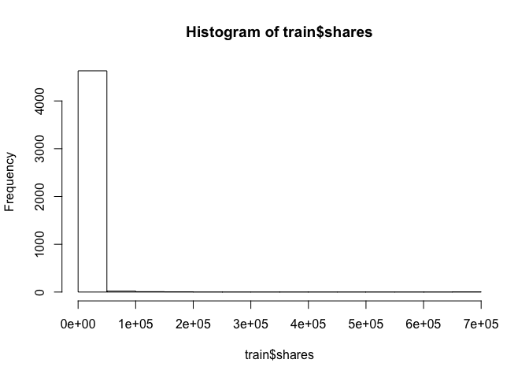
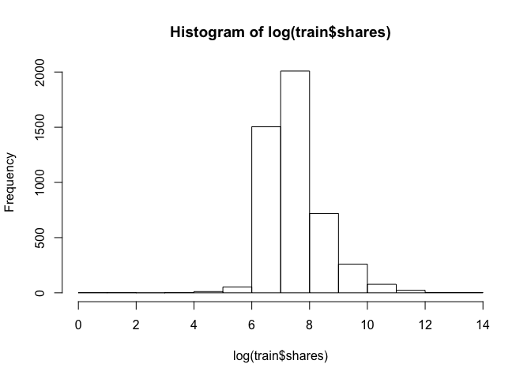
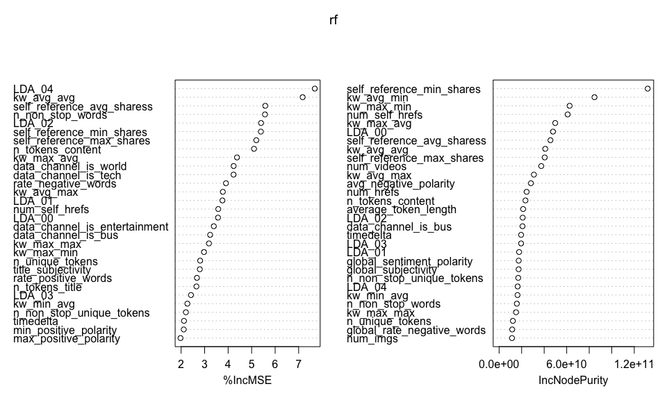

Project 2
================
Yilin Xie
July 3, 2020

  - [Introduction](#introduction)
      - [Data preprocessing](#data-preprocessing)
      - [Data split](#data-split)
      - [Summarizations](#summarizations)
  - [Ensemble model fit](#ensemble-model-fit)
      - [On train set](#on-train-set)
      - [On test set](#on-test-set)
  - [Linear regression fit](#linear-regression-fit)
      - [On train set](#on-train-set-1)
      - [On test set](#on-test-set-1)
  - [Conclusions](#conclusions)

## Introduction

The perpose of this project is going to analyze an online news
popularity data set
[here](https://archive.ics.uci.edu/ml/datasets/Online+News+Popularity)
and predict **shares** by backward linear regression and random forest.
Firstly I read it into R session and determine which variables that I
would deal with.

``` r
#Load the data
news <- read.csv("/Users/yilinxie/Desktop/ST558/Project/Project2/OnlineNewsPopularity.csv")
head(news)
```

    ##                                                              url timedelta
    ## 1   http://mashable.com/2013/01/07/amazon-instant-video-browser/       731
    ## 2    http://mashable.com/2013/01/07/ap-samsung-sponsored-tweets/       731
    ## 3 http://mashable.com/2013/01/07/apple-40-billion-app-downloads/       731
    ## 4       http://mashable.com/2013/01/07/astronaut-notre-dame-bcs/       731
    ## 5               http://mashable.com/2013/01/07/att-u-verse-apps/       731
    ## 6               http://mashable.com/2013/01/07/beewi-smart-toys/       731
    ##   n_tokens_title n_tokens_content n_unique_tokens n_non_stop_words
    ## 1             12              219       0.6635945                1
    ## 2              9              255       0.6047431                1
    ## 3              9              211       0.5751295                1
    ## 4              9              531       0.5037879                1
    ## 5             13             1072       0.4156456                1
    ## 6             10              370       0.5598886                1
    ##   n_non_stop_unique_tokens num_hrefs num_self_hrefs num_imgs num_videos
    ## 1                0.8153846         4              2        1          0
    ## 2                0.7919463         3              1        1          0
    ## 3                0.6638655         3              1        1          0
    ## 4                0.6656347         9              0        1          0
    ## 5                0.5408895        19             19       20          0
    ## 6                0.6981982         2              2        0          0
    ##   average_token_length num_keywords data_channel_is_lifestyle
    ## 1             4.680365            5                         0
    ## 2             4.913725            4                         0
    ## 3             4.393365            6                         0
    ## 4             4.404896            7                         0
    ## 5             4.682836            7                         0
    ## 6             4.359459            9                         0
    ##   data_channel_is_entertainment data_channel_is_bus data_channel_is_socmed
    ## 1                             1                   0                      0
    ## 2                             0                   1                      0
    ## 3                             0                   1                      0
    ## 4                             1                   0                      0
    ## 5                             0                   0                      0
    ## 6                             0                   0                      0
    ##   data_channel_is_tech data_channel_is_world kw_min_min kw_max_min kw_avg_min
    ## 1                    0                     0          0          0          0
    ## 2                    0                     0          0          0          0
    ## 3                    0                     0          0          0          0
    ## 4                    0                     0          0          0          0
    ## 5                    1                     0          0          0          0
    ## 6                    1                     0          0          0          0
    ##   kw_min_max kw_max_max kw_avg_max kw_min_avg kw_max_avg kw_avg_avg
    ## 1          0          0          0          0          0          0
    ## 2          0          0          0          0          0          0
    ## 3          0          0          0          0          0          0
    ## 4          0          0          0          0          0          0
    ## 5          0          0          0          0          0          0
    ## 6          0          0          0          0          0          0
    ##   self_reference_min_shares self_reference_max_shares
    ## 1                       496                       496
    ## 2                         0                         0
    ## 3                       918                       918
    ## 4                         0                         0
    ## 5                       545                     16000
    ## 6                      8500                      8500
    ##   self_reference_avg_sharess weekday_is_monday weekday_is_tuesday
    ## 1                    496.000                 1                  0
    ## 2                      0.000                 1                  0
    ## 3                    918.000                 1                  0
    ## 4                      0.000                 1                  0
    ## 5                   3151.158                 1                  0
    ## 6                   8500.000                 1                  0
    ##   weekday_is_wednesday weekday_is_thursday weekday_is_friday
    ## 1                    0                   0                 0
    ## 2                    0                   0                 0
    ## 3                    0                   0                 0
    ## 4                    0                   0                 0
    ## 5                    0                   0                 0
    ## 6                    0                   0                 0
    ##   weekday_is_saturday weekday_is_sunday is_weekend     LDA_00     LDA_01
    ## 1                   0                 0          0 0.50033120 0.37827893
    ## 2                   0                 0          0 0.79975569 0.05004668
    ## 3                   0                 0          0 0.21779229 0.03333446
    ## 4                   0                 0          0 0.02857322 0.41929964
    ## 5                   0                 0          0 0.02863281 0.02879355
    ## 6                   0                 0          0 0.02224528 0.30671758
    ##       LDA_02     LDA_03     LDA_04 global_subjectivity
    ## 1 0.04000468 0.04126265 0.04012254           0.5216171
    ## 2 0.05009625 0.05010067 0.05000071           0.3412458
    ## 3 0.03335142 0.03333354 0.68218829           0.7022222
    ## 4 0.49465083 0.02890472 0.02857160           0.4298497
    ## 5 0.02857518 0.02857168 0.88542678           0.5135021
    ## 6 0.02223128 0.02222429 0.62658158           0.4374086
    ##   global_sentiment_polarity global_rate_positive_words
    ## 1                0.09256198                 0.04566210
    ## 2                0.14894781                 0.04313725
    ## 3                0.32333333                 0.05687204
    ## 4                0.10070467                 0.04143126
    ## 5                0.28100348                 0.07462687
    ## 6                0.07118419                 0.02972973
    ##   global_rate_negative_words rate_positive_words rate_negative_words
    ## 1                0.013698630           0.7692308           0.2307692
    ## 2                0.015686275           0.7333333           0.2666667
    ## 3                0.009478673           0.8571429           0.1428571
    ## 4                0.020715631           0.6666667           0.3333333
    ## 5                0.012126866           0.8602151           0.1397849
    ## 6                0.027027027           0.5238095           0.4761905
    ##   avg_positive_polarity min_positive_polarity max_positive_polarity
    ## 1             0.3786364            0.10000000                   0.7
    ## 2             0.2869146            0.03333333                   0.7
    ## 3             0.4958333            0.10000000                   1.0
    ## 4             0.3859652            0.13636364                   0.8
    ## 5             0.4111274            0.03333333                   1.0
    ## 6             0.3506100            0.13636364                   0.6
    ##   avg_negative_polarity min_negative_polarity max_negative_polarity
    ## 1            -0.3500000                -0.600            -0.2000000
    ## 2            -0.1187500                -0.125            -0.1000000
    ## 3            -0.4666667                -0.800            -0.1333333
    ## 4            -0.3696970                -0.600            -0.1666667
    ## 5            -0.2201923                -0.500            -0.0500000
    ## 6            -0.1950000                -0.400            -0.1000000
    ##   title_subjectivity title_sentiment_polarity abs_title_subjectivity
    ## 1          0.5000000               -0.1875000             0.00000000
    ## 2          0.0000000                0.0000000             0.50000000
    ## 3          0.0000000                0.0000000             0.50000000
    ## 4          0.0000000                0.0000000             0.50000000
    ## 5          0.4545455                0.1363636             0.04545455
    ## 6          0.6428571                0.2142857             0.14285714
    ##   abs_title_sentiment_polarity shares
    ## 1                    0.1875000    593
    ## 2                    0.0000000    711
    ## 3                    0.0000000   1500
    ## 4                    0.0000000   1200
    ## 5                    0.1363636    505
    ## 6                    0.2142857    855

``` r
#detect NA value
sum(is.na(news$shares) )
```

    ## [1] 0

As shown above, it is a huge data set with 39644 rows and 61 colomns. It
contains factor variables, numeric variables and dummy variables. The
task is to predict the 61st variable **shares**. Then I’m going to
preprocess the data to get it in the form I need.

### Data preprocessing

``` r
library(tidyverse)
## Filters out the data for the specified weekday
news <- mutate(news, weekday = ifelse(weekday_is_monday == "1", "monday", ifelse(weekday_is_tuesday == "1", "tuesday", ifelse(weekday_is_wednesday == "1", "wednesday", ifelse(weekday_is_thursday == "1", "thursday", ifelse(weekday_is_friday, "friday", ifelse(weekday_is_saturday == "1", "saturday", "sunday")))))))
news1 <- filter(news, weekday == params$weekday)
## Remove the useless colomns
news1 <- select(news1, -url, -weekday_is_monday, -weekday_is_tuesday, -weekday_is_wednesday, -weekday_is_thursday, -weekday_is_friday, -weekday_is_saturday, -weekday_is_sunday, -is_weekend, -weekday)
r = nrow(news1)
c = ncol(news1)
r
```

    ## [1] 2737

``` r
c
```

    ## [1] 52

Since r\>\>c, this is not a high dimension data set. I would use and to
predict **shares** by the entire variables.

### Data split

``` r
#Set seed to make work reproducible
set.seed(123)
#randomly sample from the data
sub <- sample(1:r, 0.7*r)
#store training dataset (70% of the data) and test dataset (30% of the data)
train <- news1[sub,]
test <- news1[-sub,]
```

### Summarizations

We can look at the distribution of **shares** through the histogram and
see some statistics of the total variables in a summary table.

``` r
#number of rows of training dataset
nrow(train)
```

    ## [1] 1915

``` r
#draw histograms
hist(train$shares)
```

<!-- -->

``` r
hist(log(train$shares))
```

<!-- -->

``` r
#summary the training dataset
t(summary(train))
```

    ##                                                                    
    ##   timedelta                   Min.   : 11.0      1st Qu.:172.0     
    ## n_tokens_title                Min.   : 3.00      1st Qu.: 9.00     
    ## n_tokens_content              Min.   :   0.0     1st Qu.: 242.0    
    ## n_unique_tokens               Min.   :0.0000     1st Qu.:0.4607    
    ## n_non_stop_words              Min.   :0.0000     1st Qu.:1.0000    
    ## n_non_stop_unique_tokens      Min.   :0.0000     1st Qu.:0.6131    
    ##   num_hrefs                   Min.   :  0.00     1st Qu.:  5.00    
    ## num_self_hrefs                Min.   : 0.000     1st Qu.: 1.000    
    ##    num_imgs                   Min.   :  0.000    1st Qu.:  1.000   
    ##   num_videos                  Min.   : 0.000     1st Qu.: 0.000    
    ## average_token_length          Min.   :0.000      1st Qu.:4.483     
    ##  num_keywords                 Min.   : 1.000     1st Qu.: 6.000    
    ## data_channel_is_lifestyle     Min.   :0.00000    1st Qu.:0.00000   
    ## data_channel_is_entertainment Min.   :0.0000     1st Qu.:0.0000    
    ## data_channel_is_bus           Min.   :0.0000     1st Qu.:0.0000    
    ## data_channel_is_socmed        Min.   :0.00000    1st Qu.:0.00000   
    ## data_channel_is_tech          Min.   :0.0000     1st Qu.:0.0000    
    ## data_channel_is_world         Min.   :0.0000     1st Qu.:0.0000    
    ##   kw_min_min                  Min.   : -1.00     1st Qu.: -1.00    
    ##   kw_max_min                  Min.   :    0      1st Qu.:  471     
    ##   kw_avg_min                  Min.   :   -1.0    1st Qu.:  159.2   
    ##   kw_min_max                  Min.   :     0     1st Qu.:     0    
    ##   kw_max_max                  Min.   : 37400     1st Qu.:843300    
    ##   kw_avg_max                  Min.   :  7328     1st Qu.:170348    
    ##   kw_min_avg                  Min.   :   0       1st Qu.:   0      
    ##   kw_max_avg                  Min.   : 2536      1st Qu.: 3622     
    ##   kw_avg_avg                  Min.   :  743.5    1st Qu.: 2508.3   
    ## self_reference_min_shares     Min.   :     0     1st Qu.:   655    
    ## self_reference_max_shares     Min.   :     0     1st Qu.:  1000    
    ## self_reference_avg_sharess    Min.   :     0.0   1st Qu.:   972.2  
    ##     LDA_00                    Min.   :0.01887    1st Qu.:0.02283   
    ##     LDA_01                    Min.   :0.01820    1st Qu.:0.02500   
    ##     LDA_02                    Min.   :0.01819    1st Qu.:0.02500   
    ##     LDA_03                    Min.   :0.01830    1st Qu.:0.02533   
    ##     LDA_04                    Min.   :0.02000    1st Qu.:0.02532   
    ## global_subjectivity           Min.   :0.0000     1st Qu.:0.3984    
    ## global_sentiment_polarity     Min.   :-0.37393   1st Qu.: 0.05996  
    ## global_rate_positive_words    Min.   :0.00000    1st Qu.:0.02802   
    ## global_rate_negative_words    Min.   :0.00000    1st Qu.:0.01023   
    ## rate_positive_words           Min.   :0.0000     1st Qu.:0.6000    
    ## rate_negative_words           Min.   :0.0000     1st Qu.:0.1818    
    ## avg_positive_polarity         Min.   :0.0000     1st Qu.:0.3099    
    ## min_positive_polarity         Min.   :0.0000     1st Qu.:0.0500    
    ## max_positive_polarity         Min.   :0.0000     1st Qu.:0.6000    
    ## avg_negative_polarity         Min.   :-1.0000    1st Qu.:-0.3333   
    ## min_negative_polarity         Min.   :-1.0000    1st Qu.:-0.7500   
    ## max_negative_polarity         Min.   :-1.0000    1st Qu.:-0.1250   
    ## title_subjectivity            Min.   :0.0000     1st Qu.:0.0000    
    ## title_sentiment_polarity      Min.   :-1.00000   1st Qu.: 0.00000  
    ## abs_title_subjectivity        Min.   :0.0000     1st Qu.:0.1354    
    ## abs_title_sentiment_polarity  Min.   :0.0000     1st Qu.:0.0000    
    ##     shares                    Min.   :   89      1st Qu.: 1200     
    ##                                                                    
    ##   timedelta                   Median :347.0      Mean   :359.2     
    ## n_tokens_title                Median :10.00      Mean   :10.44     
    ## n_tokens_content              Median : 458.0     Mean   : 607.5    
    ## n_unique_tokens               Median :0.5271     Mean   :0.5269    
    ## n_non_stop_words              Median :1.0000     Mean   :0.9718    
    ## n_non_stop_unique_tokens      Median :0.6791     Mean   :0.6651    
    ##   num_hrefs                   Median :  9.00     Mean   : 12.65    
    ## num_self_hrefs                Median : 2.000     Mean   : 3.626    
    ##    num_imgs                   Median :  1.000    Mean   :  6.045   
    ##   num_videos                  Median : 0.000     Mean   : 1.002    
    ## average_token_length          Median :4.677      Mean   :4.583     
    ##  num_keywords                 Median : 8.000     Mean   : 7.662    
    ## data_channel_is_lifestyle     Median :0.00000    Mean   :0.07415   
    ## data_channel_is_entertainment Median :0.0000     Mean   :0.1896    
    ## data_channel_is_bus           Median :0.0000     Mean   :0.1264    
    ## data_channel_is_socmed        Median :0.00000    Mean   :0.05483   
    ## data_channel_is_tech          Median :0.0000     Mean   :0.1441    
    ## data_channel_is_world         Median :0.0000     Mean   :0.2052    
    ##   kw_min_min                  Median : -1.00     Mean   : 28.97    
    ##   kw_max_min                  Median :  693      Mean   : 1078     
    ##   kw_avg_min                  Median :  245.0    Mean   :  315.9   
    ##   kw_min_max                  Median :  1900     Mean   : 13136    
    ##   kw_max_max                  Median :843300     Mean   :752537    
    ##   kw_avg_max                  Median :236780     Mean   :245440    
    ##   kw_min_avg                  Median :1216       Mean   :1251      
    ##   kw_max_avg                  Median : 4800      Mean   : 5987     
    ##   kw_avg_avg                  Median : 3055.8    Mean   : 3298.1   
    ## self_reference_min_shares     Median :  1200     Mean   :  4792    
    ## self_reference_max_shares     Median :  2700     Mean   : 10404    
    ## self_reference_avg_sharess    Median :  2150.0   Mean   :  6654.1  
    ##     LDA_00                    Median :0.03333    Mean   :0.16235   
    ##     LDA_01                    Median :0.03334    Mean   :0.15742   
    ##     LDA_02                    Median :0.03337    Mean   :0.20293   
    ##     LDA_03                    Median :0.05000    Mean   :0.26623   
    ##     LDA_04                    Median :0.04000    Mean   :0.21108   
    ## global_subjectivity           Median :0.4590     Mean   :0.4482    
    ## global_sentiment_polarity     Median : 0.12308   Mean   : 0.12397  
    ## global_rate_positive_words    Median :0.03994    Mean   :0.04111   
    ## global_rate_negative_words    Median :0.01608    Mean   :0.01713   
    ## rate_positive_words           Median :0.7059     Mean   :0.6791    
    ## rate_negative_words           Median :0.2857     Mean   :0.2927    
    ## avg_positive_polarity         Median :0.3651     Mean   :0.3642    
    ## min_positive_polarity         Median :0.1000     Mean   :0.0968    
    ## max_positive_polarity         Median :0.8000     Mean   :0.7791    
    ## avg_negative_polarity         Median :-0.2640    Mean   :-0.2691   
    ## min_negative_polarity         Median :-0.5000    Mean   :-0.5476   
    ## max_negative_polarity         Median :-0.1000    Mean   :-0.1093   
    ## title_subjectivity            Median :0.2500     Mean   :0.3094    
    ## title_sentiment_polarity      Median : 0.00000   Mean   : 0.09499  
    ## abs_title_subjectivity        Median :0.4000     Mean   :0.3229    
    ## abs_title_sentiment_polarity  Median :0.1000     Mean   :0.1861    
    ##     shares                    Median : 1900      Mean   : 3702     
    ##                                                                    
    ##   timedelta                   3rd Qu.:543.0      Max.   :725.0     
    ## n_tokens_title                3rd Qu.:12.00      Max.   :18.00     
    ## n_tokens_content              3rd Qu.: 809.0     Max.   :8474.0    
    ## n_unique_tokens               3rd Qu.:0.6092     Max.   :0.9796    
    ## n_non_stop_words              3rd Qu.:1.0000     Max.   :1.0000    
    ## n_non_stop_unique_tokens      3rd Qu.:0.7530     Max.   :1.0000    
    ##   num_hrefs                   3rd Qu.: 17.00     Max.   :153.00    
    ## num_self_hrefs                3rd Qu.: 4.000     Max.   :36.000    
    ##    num_imgs                   3rd Qu.:  9.000    Max.   :128.000   
    ##   num_videos                  3rd Qu.: 1.000     Max.   :74.000    
    ## average_token_length          3rd Qu.:4.890      Max.   :7.218     
    ##  num_keywords                 3rd Qu.: 9.000     Max.   :10.000    
    ## data_channel_is_lifestyle     3rd Qu.:0.00000    Max.   :1.00000   
    ## data_channel_is_entertainment 3rd Qu.:0.0000     Max.   :1.0000    
    ## data_channel_is_bus           3rd Qu.:0.0000     Max.   :1.0000    
    ## data_channel_is_socmed        3rd Qu.:0.00000    Max.   :1.00000   
    ## data_channel_is_tech          3rd Qu.:0.0000     Max.   :1.0000    
    ## data_channel_is_world         3rd Qu.:0.0000     Max.   :1.0000    
    ##   kw_min_min                  3rd Qu.:  4.00     Max.   :217.00    
    ##   kw_max_min                  3rd Qu.: 1100      Max.   :81200     
    ##   kw_avg_min                  3rd Qu.:  375.3    Max.   :27123.0   
    ##   kw_min_max                  3rd Qu.:  9000     Max.   :843300    
    ##   kw_max_max                  3rd Qu.:843300     Max.   :843300    
    ##   kw_avg_max                  3rd Qu.:309360     Max.   :843300    
    ##   kw_min_avg                  3rd Qu.:2181       Max.   :3600      
    ##   kw_max_avg                  3rd Qu.: 6794      Max.   :81200     
    ##   kw_avg_avg                  3rd Qu.: 3847.4    Max.   :14715.2   
    ## self_reference_min_shares     3rd Qu.:  2600     Max.   :843300    
    ## self_reference_max_shares     3rd Qu.:  7750     Max.   :843300    
    ## self_reference_avg_sharess    3rd Qu.:  5089.6   Max.   :843300.0  
    ##     LDA_00                    3rd Qu.:0.17907    Max.   :0.91996   
    ##     LDA_01                    3rd Qu.:0.17470    Max.   :0.91994   
    ##     LDA_02                    3rd Qu.:0.30139    Max.   :0.92000   
    ##     LDA_03                    3rd Qu.:0.51623    Max.   :0.91998   
    ##     LDA_04                    3rd Qu.:0.31686    Max.   :0.92644   
    ## global_subjectivity           3rd Qu.:0.5146     Max.   :0.9125    
    ## global_sentiment_polarity     3rd Qu.: 0.18645   Max.   : 0.65500  
    ## global_rate_positive_words    3rd Qu.:0.05300    Max.   :0.13433   
    ## global_rate_negative_words    3rd Qu.:0.02240    Max.   :0.10112   
    ## rate_positive_words           3rd Qu.:0.8000     Max.   :1.0000    
    ## rate_negative_words           3rd Qu.:0.3846     Max.   :1.0000    
    ## avg_positive_polarity         3rd Qu.:0.4265     Max.   :1.0000    
    ## min_positive_polarity         3rd Qu.:0.1000     Max.   :1.0000    
    ## max_positive_polarity         3rd Qu.:1.0000     Max.   :1.0000    
    ## avg_negative_polarity         3rd Qu.:-0.1992    Max.   : 0.0000   
    ## min_negative_polarity         3rd Qu.:-0.3889    Max.   : 0.0000   
    ## max_negative_polarity         3rd Qu.:-0.0500    Max.   : 0.0000   
    ## title_subjectivity            3rd Qu.:0.5000     Max.   :1.0000    
    ## title_sentiment_polarity      3rd Qu.: 0.25000   Max.   : 1.00000  
    ## abs_title_subjectivity        3rd Qu.:0.5000     Max.   :0.5000    
    ## abs_title_sentiment_polarity  3rd Qu.:0.3000     Max.   :1.0000    
    ##     shares                    3rd Qu.: 3600      Max.   :69500

## Ensemble model fit

A random forest is a forest constructed in a random way, and the forest
is composed of many unrelated decision trees. Therefore, in theory, the
performance of random forest is generally better than that of a single
decision tree, because the results of random forest are determined by
voting on the results of multiple decision trees. But here, I’m using a
random forest for regression.

### On train set

``` r
#load package
library(randomForest)
#Get random forest model fit on training dataset
rf <- randomForest(shares ~ ., data = train, importance=TRUE)
rf
```

    ## 
    ## Call:
    ##  randomForest(formula = shares ~ ., data = train, importance = TRUE) 
    ##                Type of random forest: regression
    ##                      Number of trees: 500
    ## No. of variables tried at each split: 17
    ## 
    ##           Mean of squared residuals: 35940324
    ##                     % Var explained: -0.71

``` r
#variable importance measures
importance(rf)
```

    ##                                  %IncMSE IncNodePurity
    ## timedelta                      5.6464477    1188288102
    ## n_tokens_title                 0.5481549    2443470635
    ## n_tokens_content               3.3874354     973053719
    ## n_unique_tokens                6.7992910    1309823823
    ## n_non_stop_words               3.4589751     917660590
    ## n_non_stop_unique_tokens       6.2815442    1483592792
    ## num_hrefs                      4.6959904    1059444961
    ## num_self_hrefs                 3.6353459     797548593
    ## num_imgs                       5.2551012    1051034335
    ## num_videos                    -0.8658473     976092969
    ## average_token_length           9.6321533    2185089304
    ## num_keywords                   4.9742801     631278169
    ## data_channel_is_lifestyle      0.2043454      54113723
    ## data_channel_is_entertainment  0.5654577     200100820
    ## data_channel_is_bus            2.9483155     197496377
    ## data_channel_is_socmed         1.2445798     210489403
    ## data_channel_is_tech           4.7383165      96732040
    ## data_channel_is_world          3.0973297     276454763
    ## kw_min_min                     2.1834090     183263528
    ## kw_max_min                     4.0747109    1908718218
    ## kw_avg_min                     6.2881646    1926569455
    ## kw_min_max                     3.7467750     848294722
    ## kw_max_max                     1.1459425     117191234
    ## kw_avg_max                     4.6206665    1307294173
    ## kw_min_avg                     4.2998287     897324924
    ## kw_max_avg                     6.4124379    2311606556
    ## kw_avg_avg                     8.9454198    3285418851
    ## self_reference_min_shares      7.7075955    2139235151
    ## self_reference_max_shares      8.0561894    1438515352
    ## self_reference_avg_sharess     7.4375544    1774143149
    ## LDA_00                         6.5320050    1600916762
    ## LDA_01                         5.8930680    1700681516
    ## LDA_02                         6.1495606    1800779871
    ## LDA_03                         6.9500520    2754591629
    ## LDA_04                         6.7345132    1880842941
    ## global_subjectivity            6.3027528    1479273278
    ## global_sentiment_polarity      5.3968873    2178218627
    ## global_rate_positive_words     4.8610804    1194871478
    ## global_rate_negative_words     5.3700406    1392455089
    ## rate_positive_words            4.3205596    1035578869
    ## rate_negative_words            4.4090189     961868353
    ## avg_positive_polarity          5.9217104    1564466950
    ## min_positive_polarity          2.6301042     645575906
    ## max_positive_polarity          5.7837937     524020006
    ## avg_negative_polarity          4.0170866    1366591175
    ## min_negative_polarity          3.5199686     679762108
    ## max_negative_polarity          2.2764434    1142046964
    ## title_subjectivity             3.2728387     805618527
    ## title_sentiment_polarity       3.4242251    1174677576
    ## abs_title_subjectivity         2.6313475     504218690
    ## abs_title_sentiment_polarity   3.5997230     633106930

``` r
#draw dotplot of variable importance as measured by Random Forest
varImpPlot(rf)
```

<!-- -->

Calculate the predicted mean square error on the train set:

``` r
train.pred <- predict(rf, train[,-52])
mean((train.pred - train$shares)^2)
```

    ## [1] 7626337

So, the predicted mean square error on the training dataset is 68724773.

### On test set

``` r
rf.test <- predict(rf, newdata = test[,-52])
mean((test$shares-rf.test)^2)
```

    ## [1] 44424489

So, the predicted mean square error on the testing dataset is 80333539.

## Linear regression fit

I choose stepwise regression to fit this model, more specificly, the
backward way. This data set contains too many variables. And since I’m
not an expert on journalism, I can’t tell which factors should have a
real effect on the predicted variables. If I manually removed the
variables by their significance in the model and compared the
differences between the models, this would be a lot of work. So I want
to use a backward regression model based on the AIC criteria to
automatically determine which variables should be included or removed
from the model.

### On train set

``` r
#fit model
lm.step <- step(lm(shares ~ .,data = train))
```

    ## Start:  AIC=33266.97
    ## shares ~ timedelta + n_tokens_title + n_tokens_content + n_unique_tokens + 
    ##     n_non_stop_words + n_non_stop_unique_tokens + num_hrefs + 
    ##     num_self_hrefs + num_imgs + num_videos + average_token_length + 
    ##     num_keywords + data_channel_is_lifestyle + data_channel_is_entertainment + 
    ##     data_channel_is_bus + data_channel_is_socmed + data_channel_is_tech + 
    ##     data_channel_is_world + kw_min_min + kw_max_min + kw_avg_min + 
    ##     kw_min_max + kw_max_max + kw_avg_max + kw_min_avg + kw_max_avg + 
    ##     kw_avg_avg + self_reference_min_shares + self_reference_max_shares + 
    ##     self_reference_avg_sharess + LDA_00 + LDA_01 + LDA_02 + LDA_03 + 
    ##     LDA_04 + global_subjectivity + global_sentiment_polarity + 
    ##     global_rate_positive_words + global_rate_negative_words + 
    ##     rate_positive_words + rate_negative_words + avg_positive_polarity + 
    ##     min_positive_polarity + max_positive_polarity + avg_negative_polarity + 
    ##     min_negative_polarity + max_negative_polarity + title_subjectivity + 
    ##     title_sentiment_polarity + abs_title_subjectivity + abs_title_sentiment_polarity
    ## 
    ## 
    ## Step:  AIC=33266.97
    ## shares ~ timedelta + n_tokens_title + n_tokens_content + n_unique_tokens + 
    ##     n_non_stop_words + n_non_stop_unique_tokens + num_hrefs + 
    ##     num_self_hrefs + num_imgs + num_videos + average_token_length + 
    ##     num_keywords + data_channel_is_lifestyle + data_channel_is_entertainment + 
    ##     data_channel_is_bus + data_channel_is_socmed + data_channel_is_tech + 
    ##     data_channel_is_world + kw_min_min + kw_max_min + kw_avg_min + 
    ##     kw_min_max + kw_max_max + kw_avg_max + kw_min_avg + kw_max_avg + 
    ##     kw_avg_avg + self_reference_min_shares + self_reference_max_shares + 
    ##     self_reference_avg_sharess + LDA_00 + LDA_01 + LDA_02 + LDA_03 + 
    ##     LDA_04 + global_subjectivity + global_sentiment_polarity + 
    ##     global_rate_positive_words + global_rate_negative_words + 
    ##     rate_positive_words + avg_positive_polarity + min_positive_polarity + 
    ##     max_positive_polarity + avg_negative_polarity + min_negative_polarity + 
    ##     max_negative_polarity + title_subjectivity + title_sentiment_polarity + 
    ##     abs_title_subjectivity + abs_title_sentiment_polarity
    ## 
    ## 
    ## Step:  AIC=33266.97
    ## shares ~ timedelta + n_tokens_title + n_tokens_content + n_unique_tokens + 
    ##     n_non_stop_words + n_non_stop_unique_tokens + num_hrefs + 
    ##     num_self_hrefs + num_imgs + num_videos + average_token_length + 
    ##     num_keywords + data_channel_is_lifestyle + data_channel_is_entertainment + 
    ##     data_channel_is_bus + data_channel_is_socmed + data_channel_is_tech + 
    ##     data_channel_is_world + kw_min_min + kw_max_min + kw_avg_min + 
    ##     kw_min_max + kw_max_max + kw_avg_max + kw_min_avg + kw_max_avg + 
    ##     kw_avg_avg + self_reference_min_shares + self_reference_max_shares + 
    ##     self_reference_avg_sharess + LDA_00 + LDA_01 + LDA_02 + LDA_03 + 
    ##     global_subjectivity + global_sentiment_polarity + global_rate_positive_words + 
    ##     global_rate_negative_words + rate_positive_words + avg_positive_polarity + 
    ##     min_positive_polarity + max_positive_polarity + avg_negative_polarity + 
    ##     min_negative_polarity + max_negative_polarity + title_subjectivity + 
    ##     title_sentiment_polarity + abs_title_subjectivity + abs_title_sentiment_polarity
    ## 
    ##                                 Df Sum of Sq        RSS   AIC
    ## - avg_positive_polarity          1      8173 6.3674e+10 33265
    ## - data_channel_is_lifestyle      1    235553 6.3674e+10 33265
    ## - abs_title_sentiment_polarity   1    490751 6.3674e+10 33265
    ## - average_token_length           1    843582 6.3675e+10 33265
    ## - self_reference_max_shares      1   1086670 6.3675e+10 33265
    ## - kw_min_min                     1   1247816 6.3675e+10 33265
    ## - min_negative_polarity          1   1678204 6.3675e+10 33265
    ## - kw_max_max                     1   2343845 6.3676e+10 33265
    ## - n_tokens_content               1   2975956 6.3677e+10 33265
    ## - num_hrefs                      1   3031567 6.3677e+10 33265
    ## - num_videos                     1   3146328 6.3677e+10 33265
    ## - LDA_00                         1   3986060 6.3678e+10 33265
    ## - global_rate_negative_words     1   4339384 6.3678e+10 33265
    ## - n_unique_tokens                1   5442250 6.3679e+10 33265
    ## - kw_avg_min                     1   6127519 6.3680e+10 33265
    ## - global_subjectivity            1   7711710 6.3681e+10 33265
    ## - timedelta                      1   8231789 6.3682e+10 33265
    ## - max_negative_polarity          1   8464045 6.3682e+10 33265
    ## - num_imgs                       1   9789647 6.3684e+10 33265
    ## - num_self_hrefs                 1  10364051 6.3684e+10 33265
    ## - self_reference_avg_sharess     1  10452352 6.3684e+10 33265
    ## - kw_min_max                     1  10799410 6.3685e+10 33265
    ## - rate_positive_words            1  11249311 6.3685e+10 33265
    ## - n_non_stop_words               1  11795885 6.3686e+10 33265
    ## - min_positive_polarity          1  12232424 6.3686e+10 33265
    ## - kw_avg_max                     1  13034488 6.3687e+10 33265
    ## - max_positive_polarity          1  13723608 6.3687e+10 33265
    ## - n_non_stop_unique_tokens       1  14305746 6.3688e+10 33265
    ## - avg_negative_polarity          1  18407785 6.3692e+10 33266
    ## - self_reference_min_shares      1  21719420 6.3695e+10 33266
    ## - LDA_01                         1  26574675 6.3700e+10 33266
    ## - LDA_03                         1  31531074 6.3705e+10 33266
    ## - data_channel_is_entertainment  1  37646723 6.3711e+10 33266
    ## - title_sentiment_polarity       1  42246897 6.3716e+10 33266
    ## - num_keywords                   1  50187973 6.3724e+10 33266
    ## - kw_max_min                     1  61490604 6.3735e+10 33267
    ## <none>                                       6.3674e+10 33267
    ## - abs_title_subjectivity         1  71928930 6.3746e+10 33267
    ## - title_subjectivity             1  92929101 6.3767e+10 33268
    ## - data_channel_is_bus            1 106312822 6.3780e+10 33268
    ## - data_channel_is_tech           1 139118035 6.3813e+10 33269
    ## - global_sentiment_polarity      1 144593405 6.3818e+10 33269
    ## - n_tokens_title                 1 145578943 6.3819e+10 33269
    ## - LDA_02                         1 172413599 6.3846e+10 33270
    ## - data_channel_is_socmed         1 190129554 6.3864e+10 33271
    ## - global_rate_positive_words     1 197243930 6.3871e+10 33271
    ## - kw_min_avg                     1 222051007 6.3896e+10 33272
    ## - data_channel_is_world          1 279942896 6.3954e+10 33273
    ## - kw_max_avg                     1 444315785 6.4118e+10 33278
    ## - kw_avg_avg                     1 917549584 6.4591e+10 33292
    ## 
    ## Step:  AIC=33264.97
    ## shares ~ timedelta + n_tokens_title + n_tokens_content + n_unique_tokens + 
    ##     n_non_stop_words + n_non_stop_unique_tokens + num_hrefs + 
    ##     num_self_hrefs + num_imgs + num_videos + average_token_length + 
    ##     num_keywords + data_channel_is_lifestyle + data_channel_is_entertainment + 
    ##     data_channel_is_bus + data_channel_is_socmed + data_channel_is_tech + 
    ##     data_channel_is_world + kw_min_min + kw_max_min + kw_avg_min + 
    ##     kw_min_max + kw_max_max + kw_avg_max + kw_min_avg + kw_max_avg + 
    ##     kw_avg_avg + self_reference_min_shares + self_reference_max_shares + 
    ##     self_reference_avg_sharess + LDA_00 + LDA_01 + LDA_02 + LDA_03 + 
    ##     global_subjectivity + global_sentiment_polarity + global_rate_positive_words + 
    ##     global_rate_negative_words + rate_positive_words + min_positive_polarity + 
    ##     max_positive_polarity + avg_negative_polarity + min_negative_polarity + 
    ##     max_negative_polarity + title_subjectivity + title_sentiment_polarity + 
    ##     abs_title_subjectivity + abs_title_sentiment_polarity
    ## 
    ##                                 Df Sum of Sq        RSS   AIC
    ## - data_channel_is_lifestyle      1    239179 6.3674e+10 33263
    ## - abs_title_sentiment_polarity   1    496216 6.3674e+10 33263
    ## - average_token_length           1    851999 6.3675e+10 33263
    ## - self_reference_max_shares      1   1091425 6.3675e+10 33263
    ## - kw_min_min                     1   1250517 6.3675e+10 33263
    ## - min_negative_polarity          1   1678460 6.3675e+10 33263
    ## - kw_max_max                     1   2345346 6.3676e+10 33263
    ## - n_tokens_content               1   2971379 6.3677e+10 33263
    ## - num_hrefs                      1   3032950 6.3677e+10 33263
    ## - num_videos                     1   3140567 6.3677e+10 33263
    ## - LDA_00                         1   3990028 6.3678e+10 33263
    ## - global_rate_negative_words     1   4376571 6.3678e+10 33263
    ## - n_unique_tokens                1   5480666 6.3679e+10 33263
    ## - kw_avg_min                     1   6119347 6.3680e+10 33263
    ## - global_subjectivity            1   7709272 6.3681e+10 33263
    ## - timedelta                      1   8229316 6.3682e+10 33263
    ## - max_negative_polarity          1   8472184 6.3682e+10 33263
    ## - num_imgs                       1   9784216 6.3684e+10 33263
    ## - num_self_hrefs                 1  10380048 6.3684e+10 33263
    ## - self_reference_avg_sharess     1  10479219 6.3684e+10 33263
    ## - kw_min_max                     1  10807441 6.3685e+10 33263
    ## - rate_positive_words            1  11744739 6.3686e+10 33263
    ## - n_non_stop_words               1  11965119 6.3686e+10 33263
    ## - kw_avg_max                     1  13035486 6.3687e+10 33263
    ## - n_non_stop_unique_tokens       1  14311779 6.3688e+10 33263
    ## - min_positive_polarity          1  16215287 6.3690e+10 33263
    ## - avg_negative_polarity          1  18871217 6.3693e+10 33264
    ## - max_positive_polarity          1  19098742 6.3693e+10 33264
    ## - self_reference_min_shares      1  21761110 6.3696e+10 33264
    ## - LDA_01                         1  26569130 6.3700e+10 33264
    ## - LDA_03                         1  31523568 6.3705e+10 33264
    ## - data_channel_is_entertainment  1  37658624 6.3711e+10 33264
    ## - title_sentiment_polarity       1  42262911 6.3716e+10 33264
    ## - num_keywords                   1  50230445 6.3724e+10 33264
    ## - kw_max_min                     1  61484454 6.3735e+10 33265
    ## <none>                                       6.3674e+10 33265
    ## - abs_title_subjectivity         1  71950970 6.3746e+10 33265
    ## - title_subjectivity             1  93055236 6.3767e+10 33266
    ## - data_channel_is_bus            1 106306062 6.3780e+10 33266
    ## - data_channel_is_tech           1 139113478 6.3813e+10 33267
    ## - n_tokens_title                 1 145678822 6.3819e+10 33267
    ## - LDA_02                         1 172415555 6.3846e+10 33268
    ## - data_channel_is_socmed         1 190174725 6.3864e+10 33269
    ## - global_rate_positive_words     1 213340473 6.3887e+10 33269
    ## - kw_min_avg                     1 222042860 6.3896e+10 33270
    ## - global_sentiment_polarity      1 222711505 6.3896e+10 33270
    ## - data_channel_is_world          1 279958579 6.3954e+10 33271
    ## - kw_max_avg                     1 444355272 6.4118e+10 33276
    ## - kw_avg_avg                     1 918944126 6.4593e+10 33290
    ## 
    ## Step:  AIC=33262.98
    ## shares ~ timedelta + n_tokens_title + n_tokens_content + n_unique_tokens + 
    ##     n_non_stop_words + n_non_stop_unique_tokens + num_hrefs + 
    ##     num_self_hrefs + num_imgs + num_videos + average_token_length + 
    ##     num_keywords + data_channel_is_entertainment + data_channel_is_bus + 
    ##     data_channel_is_socmed + data_channel_is_tech + data_channel_is_world + 
    ##     kw_min_min + kw_max_min + kw_avg_min + kw_min_max + kw_max_max + 
    ##     kw_avg_max + kw_min_avg + kw_max_avg + kw_avg_avg + self_reference_min_shares + 
    ##     self_reference_max_shares + self_reference_avg_sharess + 
    ##     LDA_00 + LDA_01 + LDA_02 + LDA_03 + global_subjectivity + 
    ##     global_sentiment_polarity + global_rate_positive_words + 
    ##     global_rate_negative_words + rate_positive_words + min_positive_polarity + 
    ##     max_positive_polarity + avg_negative_polarity + min_negative_polarity + 
    ##     max_negative_polarity + title_subjectivity + title_sentiment_polarity + 
    ##     abs_title_subjectivity + abs_title_sentiment_polarity
    ## 
    ##                                 Df Sum of Sq        RSS   AIC
    ## - abs_title_sentiment_polarity   1    475655 6.3674e+10 33261
    ## - average_token_length           1    814640 6.3675e+10 33261
    ## - self_reference_max_shares      1   1086858 6.3675e+10 33261
    ## - kw_min_min                     1   1238136 6.3675e+10 33261
    ## - min_negative_polarity          1   1695926 6.3676e+10 33261
    ## - kw_max_max                     1   2282050 6.3676e+10 33261
    ## - n_tokens_content               1   2968797 6.3677e+10 33261
    ## - num_hrefs                      1   2978734 6.3677e+10 33261
    ## - num_videos                     1   3097428 6.3677e+10 33261
    ## - LDA_00                         1   3756605 6.3678e+10 33261
    ## - global_rate_negative_words     1   4407235 6.3678e+10 33261
    ## - n_unique_tokens                1   5310959 6.3679e+10 33261
    ## - kw_avg_min                     1   6105167 6.3680e+10 33261
    ## - global_subjectivity            1   7643680 6.3682e+10 33261
    ## - max_negative_polarity          1   8590733 6.3683e+10 33261
    ## - timedelta                      1   8635159 6.3683e+10 33261
    ## - num_imgs                       1   9684764 6.3684e+10 33261
    ## - num_self_hrefs                 1  10184302 6.3684e+10 33261
    ## - self_reference_avg_sharess     1  10447082 6.3684e+10 33261
    ## - kw_min_max                     1  11074483 6.3685e+10 33261
    ## - rate_positive_words            1  11854667 6.3686e+10 33261
    ## - n_non_stop_words               1  12185161 6.3686e+10 33261
    ## - kw_avg_max                     1  12801982 6.3687e+10 33261
    ## - n_non_stop_unique_tokens       1  14093147 6.3688e+10 33261
    ## - min_positive_polarity          1  16063254 6.3690e+10 33261
    ## - avg_negative_polarity          1  18919406 6.3693e+10 33262
    ## - max_positive_polarity          1  19086345 6.3693e+10 33262
    ## - self_reference_min_shares      1  21718969 6.3696e+10 33262
    ## - LDA_01                         1  40965207 6.3715e+10 33262
    ## - title_sentiment_polarity       1  42265624 6.3716e+10 33262
    ## - data_channel_is_entertainment  1  43603477 6.3718e+10 33262
    ## - LDA_03                         1  48184233 6.3722e+10 33262
    ## - num_keywords                   1  50377340 6.3724e+10 33262
    ## - kw_max_min                     1  61427362 6.3735e+10 33263
    ## <none>                                       6.3674e+10 33263
    ## - abs_title_subjectivity         1  71772393 6.3746e+10 33263
    ## - title_subjectivity             1  92845175 6.3767e+10 33264
    ## - data_channel_is_bus            1 130597393 6.3805e+10 33265
    ## - n_tokens_title                 1 146326578 6.3820e+10 33265
    ## - LDA_02                         1 182865854 6.3857e+10 33266
    ## - global_rate_positive_words     1 213101766 6.3887e+10 33267
    ## - global_sentiment_polarity      1 222595795 6.3897e+10 33268
    ## - kw_min_avg                     1 223874538 6.3898e+10 33268
    ## - data_channel_is_socmed         1 239225875 6.3913e+10 33268
    ## - data_channel_is_tech           1 255089953 6.3929e+10 33269
    ## - data_channel_is_world          1 353506994 6.4028e+10 33272
    ## - kw_max_avg                     1 444931123 6.4119e+10 33274
    ## - kw_avg_avg                     1 919300030 6.4593e+10 33288
    ## 
    ## Step:  AIC=33260.99
    ## shares ~ timedelta + n_tokens_title + n_tokens_content + n_unique_tokens + 
    ##     n_non_stop_words + n_non_stop_unique_tokens + num_hrefs + 
    ##     num_self_hrefs + num_imgs + num_videos + average_token_length + 
    ##     num_keywords + data_channel_is_entertainment + data_channel_is_bus + 
    ##     data_channel_is_socmed + data_channel_is_tech + data_channel_is_world + 
    ##     kw_min_min + kw_max_min + kw_avg_min + kw_min_max + kw_max_max + 
    ##     kw_avg_max + kw_min_avg + kw_max_avg + kw_avg_avg + self_reference_min_shares + 
    ##     self_reference_max_shares + self_reference_avg_sharess + 
    ##     LDA_00 + LDA_01 + LDA_02 + LDA_03 + global_subjectivity + 
    ##     global_sentiment_polarity + global_rate_positive_words + 
    ##     global_rate_negative_words + rate_positive_words + min_positive_polarity + 
    ##     max_positive_polarity + avg_negative_polarity + min_negative_polarity + 
    ##     max_negative_polarity + title_subjectivity + title_sentiment_polarity + 
    ##     abs_title_subjectivity
    ## 
    ##                                 Df Sum of Sq        RSS   AIC
    ## - average_token_length           1    791503 6.3675e+10 33259
    ## - self_reference_max_shares      1   1080222 6.3676e+10 33259
    ## - kw_min_min                     1   1262966 6.3676e+10 33259
    ## - min_negative_polarity          1   1746464 6.3676e+10 33259
    ## - kw_max_max                     1   2304176 6.3677e+10 33259
    ## - num_hrefs                      1   3020109 6.3677e+10 33259
    ## - n_tokens_content               1   3053958 6.3678e+10 33259
    ## - num_videos                     1   3171397 6.3678e+10 33259
    ## - LDA_00                         1   3800247 6.3678e+10 33259
    ## - global_rate_negative_words     1   4326578 6.3679e+10 33259
    ## - n_unique_tokens                1   5279595 6.3680e+10 33259
    ## - kw_avg_min                     1   6058228 6.3681e+10 33259
    ## - global_subjectivity            1   7798757 6.3682e+10 33259
    ## - max_negative_polarity          1   8307168 6.3683e+10 33259
    ## - timedelta                      1   8554882 6.3683e+10 33259
    ## - num_imgs                       1   9545301 6.3684e+10 33259
    ## - num_self_hrefs                 1  10111458 6.3685e+10 33259
    ## - self_reference_avg_sharess     1  10380640 6.3685e+10 33259
    ## - kw_min_max                     1  11211486 6.3686e+10 33259
    ## - rate_positive_words            1  11833594 6.3686e+10 33259
    ## - n_non_stop_words               1  12315453 6.3687e+10 33259
    ## - kw_avg_max                     1  12688075 6.3687e+10 33259
    ## - n_non_stop_unique_tokens       1  14101506 6.3689e+10 33259
    ## - min_positive_polarity          1  15990749 6.3690e+10 33259
    ## - avg_negative_polarity          1  18550030 6.3693e+10 33260
    ## - max_positive_polarity          1  19117338 6.3694e+10 33260
    ## - self_reference_min_shares      1  21613436 6.3696e+10 33260
    ## - LDA_01                         1  40950532 6.3715e+10 33260
    ## - data_channel_is_entertainment  1  43426945 6.3718e+10 33260
    ## - LDA_03                         1  47990968 6.3722e+10 33260
    ## - num_keywords                   1  50461246 6.3725e+10 33261
    ## - title_sentiment_polarity       1  53080953 6.3728e+10 33261
    ## - kw_max_min                     1  61245384 6.3736e+10 33261
    ## <none>                                       6.3674e+10 33261
    ## - abs_title_subjectivity         1  72109776 6.3747e+10 33261
    ## - data_channel_is_bus            1 130405869 6.3805e+10 33263
    ## - n_tokens_title                 1 146787354 6.3821e+10 33263
    ## - title_subjectivity             1 149007136 6.3823e+10 33263
    ## - LDA_02                         1 182592834 6.3857e+10 33264
    ## - global_rate_positive_words     1 212720224 6.3887e+10 33265
    ## - global_sentiment_polarity      1 222120419 6.3897e+10 33266
    ## - kw_min_avg                     1 224503017 6.3899e+10 33266
    ## - data_channel_is_socmed         1 239150634 6.3914e+10 33266
    ## - data_channel_is_tech           1 254773793 6.3929e+10 33267
    ## - data_channel_is_world          1 353132768 6.4028e+10 33270
    ## - kw_max_avg                     1 444506342 6.4119e+10 33272
    ## - kw_avg_avg                     1 918894016 6.4593e+10 33286
    ## 
    ## Step:  AIC=33259.01
    ## shares ~ timedelta + n_tokens_title + n_tokens_content + n_unique_tokens + 
    ##     n_non_stop_words + n_non_stop_unique_tokens + num_hrefs + 
    ##     num_self_hrefs + num_imgs + num_videos + num_keywords + data_channel_is_entertainment + 
    ##     data_channel_is_bus + data_channel_is_socmed + data_channel_is_tech + 
    ##     data_channel_is_world + kw_min_min + kw_max_min + kw_avg_min + 
    ##     kw_min_max + kw_max_max + kw_avg_max + kw_min_avg + kw_max_avg + 
    ##     kw_avg_avg + self_reference_min_shares + self_reference_max_shares + 
    ##     self_reference_avg_sharess + LDA_00 + LDA_01 + LDA_02 + LDA_03 + 
    ##     global_subjectivity + global_sentiment_polarity + global_rate_positive_words + 
    ##     global_rate_negative_words + rate_positive_words + min_positive_polarity + 
    ##     max_positive_polarity + avg_negative_polarity + min_negative_polarity + 
    ##     max_negative_polarity + title_subjectivity + title_sentiment_polarity + 
    ##     abs_title_subjectivity
    ## 
    ##                                 Df Sum of Sq        RSS   AIC
    ## - self_reference_max_shares      1   1078051 6.3676e+10 33257
    ## - kw_min_min                     1   1290155 6.3677e+10 33257
    ## - min_negative_polarity          1   1765198 6.3677e+10 33257
    ## - kw_max_max                     1   2329730 6.3678e+10 33257
    ## - num_hrefs                      1   2461296 6.3678e+10 33257
    ## - n_tokens_content               1   3209798 6.3678e+10 33257
    ## - num_videos                     1   3230678 6.3679e+10 33257
    ## - LDA_00                         1   4101198 6.3679e+10 33257
    ## - global_rate_negative_words     1   4534940 6.3680e+10 33257
    ## - kw_avg_min                     1   6105768 6.3681e+10 33257
    ## - n_unique_tokens                1   7194350 6.3682e+10 33257
    ## - global_subjectivity            1   8180043 6.3683e+10 33257
    ## - max_negative_polarity          1   8324249 6.3684e+10 33257
    ## - timedelta                      1   9058074 6.3684e+10 33257
    ## - num_imgs                       1   9337231 6.3685e+10 33257
    ## - num_self_hrefs                 1   9764705 6.3685e+10 33257
    ## - self_reference_avg_sharess     1  10371623 6.3686e+10 33257
    ## - kw_min_max                     1  11625065 6.3687e+10 33257
    ## - rate_positive_words            1  11990349 6.3687e+10 33257
    ## - kw_avg_max                     1  12603995 6.3688e+10 33257
    ## - min_positive_polarity          1  15490382 6.3691e+10 33257
    ## - n_non_stop_unique_tokens       1  18260564 6.3694e+10 33258
    ## - avg_negative_polarity          1  18701365 6.3694e+10 33258
    ## - max_positive_polarity          1  19237152 6.3695e+10 33258
    ## - self_reference_min_shares      1  21595622 6.3697e+10 33258
    ## - n_non_stop_words               1  38499931 6.3714e+10 33258
    ## - LDA_01                         1  40470607 6.3716e+10 33258
    ## - data_channel_is_entertainment  1  43607638 6.3719e+10 33258
    ## - LDA_03                         1  47925676 6.3723e+10 33258
    ## - num_keywords                   1  50574831 6.3726e+10 33259
    ## - title_sentiment_polarity       1  52839856 6.3728e+10 33259
    ## - kw_max_min                     1  61215704 6.3736e+10 33259
    ## <none>                                       6.3675e+10 33259
    ## - abs_title_subjectivity         1  72743392 6.3748e+10 33259
    ## - data_channel_is_bus            1 129614470 6.3805e+10 33261
    ## - title_subjectivity             1 148834856 6.3824e+10 33261
    ## - n_tokens_title                 1 149963566 6.3825e+10 33262
    ## - LDA_02                         1 187027636 6.3862e+10 33263
    ## - global_rate_positive_words     1 212182635 6.3887e+10 33263
    ## - global_sentiment_polarity      1 221898938 6.3897e+10 33264
    ## - kw_min_avg                     1 224180893 6.3899e+10 33264
    ## - data_channel_is_socmed         1 240060886 6.3915e+10 33264
    ## - data_channel_is_tech           1 253982311 6.3929e+10 33265
    ## - data_channel_is_world          1 352448560 6.4028e+10 33268
    ## - kw_max_avg                     1 444265555 6.4120e+10 33270
    ## - kw_avg_avg                     1 919204193 6.4594e+10 33284
    ## 
    ## Step:  AIC=33257.05
    ## shares ~ timedelta + n_tokens_title + n_tokens_content + n_unique_tokens + 
    ##     n_non_stop_words + n_non_stop_unique_tokens + num_hrefs + 
    ##     num_self_hrefs + num_imgs + num_videos + num_keywords + data_channel_is_entertainment + 
    ##     data_channel_is_bus + data_channel_is_socmed + data_channel_is_tech + 
    ##     data_channel_is_world + kw_min_min + kw_max_min + kw_avg_min + 
    ##     kw_min_max + kw_max_max + kw_avg_max + kw_min_avg + kw_max_avg + 
    ##     kw_avg_avg + self_reference_min_shares + self_reference_avg_sharess + 
    ##     LDA_00 + LDA_01 + LDA_02 + LDA_03 + global_subjectivity + 
    ##     global_sentiment_polarity + global_rate_positive_words + 
    ##     global_rate_negative_words + rate_positive_words + min_positive_polarity + 
    ##     max_positive_polarity + avg_negative_polarity + min_negative_polarity + 
    ##     max_negative_polarity + title_subjectivity + title_sentiment_polarity + 
    ##     abs_title_subjectivity
    ## 
    ##                                 Df Sum of Sq        RSS   AIC
    ## - kw_min_min                     1   1257423 6.3678e+10 33255
    ## - min_negative_polarity          1   1792461 6.3678e+10 33255
    ## - kw_max_max                     1   2339358 6.3679e+10 33255
    ## - num_hrefs                      1   2384890 6.3679e+10 33255
    ## - n_tokens_content               1   3148350 6.3679e+10 33255
    ## - num_videos                     1   3471434 6.3680e+10 33255
    ## - LDA_00                         1   4065382 6.3680e+10 33255
    ## - global_rate_negative_words     1   4550597 6.3681e+10 33255
    ## - kw_avg_min                     1   6076356 6.3682e+10 33255
    ## - n_unique_tokens                1   7333777 6.3684e+10 33255
    ## - global_subjectivity            1   8127788 6.3684e+10 33255
    ## - max_negative_polarity          1   8187382 6.3685e+10 33255
    ## - timedelta                      1   8690855 6.3685e+10 33255
    ## - num_self_hrefs                 1   8998571 6.3685e+10 33255
    ## - num_imgs                       1   9195390 6.3686e+10 33255
    ## - kw_min_max                     1  11374099 6.3688e+10 33255
    ## - rate_positive_words            1  12166127 6.3689e+10 33255
    ## - kw_avg_max                     1  13255728 6.3690e+10 33255
    ## - min_positive_polarity          1  15389919 6.3692e+10 33256
    ## - n_non_stop_unique_tokens       1  18514285 6.3695e+10 33256
    ## - avg_negative_polarity          1  18552629 6.3695e+10 33256
    ## - max_positive_polarity          1  19077313 6.3695e+10 33256
    ## - self_reference_avg_sharess     1  31067106 6.3707e+10 33256
    ## - n_non_stop_words               1  38953479 6.3715e+10 33256
    ## - LDA_01                         1  40337910 6.3717e+10 33256
    ## - data_channel_is_entertainment  1  43644829 6.3720e+10 33256
    ## - self_reference_min_shares      1  47765293 6.3724e+10 33256
    ## - LDA_03                         1  48226382 6.3725e+10 33256
    ## - num_keywords                   1  49990291 6.3726e+10 33257
    ## - title_sentiment_polarity       1  52552548 6.3729e+10 33257
    ## - kw_max_min                     1  61149650 6.3737e+10 33257
    ## <none>                                       6.3676e+10 33257
    ## - abs_title_subjectivity         1  73250061 6.3750e+10 33257
    ## - data_channel_is_bus            1 129565220 6.3806e+10 33259
    ## - title_subjectivity             1 149870383 6.3826e+10 33260
    ## - n_tokens_title                 1 150281872 6.3827e+10 33260
    ## - LDA_02                         1 186735319 6.3863e+10 33261
    ## - global_rate_positive_words     1 212071516 6.3888e+10 33261
    ## - global_sentiment_polarity      1 221562001 6.3898e+10 33262
    ## - kw_min_avg                     1 224446752 6.3901e+10 33262
    ## - data_channel_is_socmed         1 239041365 6.3915e+10 33262
    ## - data_channel_is_tech           1 253567703 6.3930e+10 33263
    ## - data_channel_is_world          1 352008829 6.4028e+10 33266
    ## - kw_max_avg                     1 444694107 6.4121e+10 33268
    ## - kw_avg_avg                     1 919401570 6.4596e+10 33282
    ## 
    ## Step:  AIC=33255.08
    ## shares ~ timedelta + n_tokens_title + n_tokens_content + n_unique_tokens + 
    ##     n_non_stop_words + n_non_stop_unique_tokens + num_hrefs + 
    ##     num_self_hrefs + num_imgs + num_videos + num_keywords + data_channel_is_entertainment + 
    ##     data_channel_is_bus + data_channel_is_socmed + data_channel_is_tech + 
    ##     data_channel_is_world + kw_max_min + kw_avg_min + kw_min_max + 
    ##     kw_max_max + kw_avg_max + kw_min_avg + kw_max_avg + kw_avg_avg + 
    ##     self_reference_min_shares + self_reference_avg_sharess + 
    ##     LDA_00 + LDA_01 + LDA_02 + LDA_03 + global_subjectivity + 
    ##     global_sentiment_polarity + global_rate_positive_words + 
    ##     global_rate_negative_words + rate_positive_words + min_positive_polarity + 
    ##     max_positive_polarity + avg_negative_polarity + min_negative_polarity + 
    ##     max_negative_polarity + title_subjectivity + title_sentiment_polarity + 
    ##     abs_title_subjectivity
    ## 
    ##                                 Df Sum of Sq        RSS   AIC
    ## - kw_max_max                     1   1087227 6.3679e+10 33253
    ## - min_negative_polarity          1   1721586 6.3679e+10 33253
    ## - num_hrefs                      1   2322026 6.3680e+10 33253
    ## - n_tokens_content               1   3232915 6.3681e+10 33253
    ## - num_videos                     1   3405706 6.3681e+10 33253
    ## - LDA_00                         1   4180875 6.3682e+10 33253
    ## - global_rate_negative_words     1   4496179 6.3682e+10 33253
    ## - kw_avg_min                     1   5918496 6.3684e+10 33253
    ## - n_unique_tokens                1   7340511 6.3685e+10 33253
    ## - global_subjectivity            1   7843146 6.3685e+10 33253
    ## - max_negative_polarity          1   8405371 6.3686e+10 33253
    ## - num_self_hrefs                 1   9189996 6.3687e+10 33253
    ## - num_imgs                       1   9203906 6.3687e+10 33253
    ## - timedelta                      1   9970122 6.3688e+10 33253
    ## - kw_min_max                     1  11143986 6.3689e+10 33253
    ## - rate_positive_words            1  11946994 6.3690e+10 33253
    ## - kw_avg_max                     1  13557612 6.3691e+10 33253
    ## - min_positive_polarity          1  15415372 6.3693e+10 33254
    ## - n_non_stop_unique_tokens       1  18673607 6.3696e+10 33254
    ## - max_positive_polarity          1  18787662 6.3696e+10 33254
    ## - avg_negative_polarity          1  18827952 6.3696e+10 33254
    ## - self_reference_avg_sharess     1  30408048 6.3708e+10 33254
    ## - n_non_stop_words               1  38789369 6.3716e+10 33254
    ## - LDA_01                         1  40731985 6.3718e+10 33254
    ## - data_channel_is_entertainment  1  43363296 6.3721e+10 33254
    ## - self_reference_min_shares      1  47053011 6.3725e+10 33254
    ## - LDA_03                         1  48421804 6.3726e+10 33255
    ## - num_keywords                   1  50348369 6.3728e+10 33255
    ## - title_sentiment_polarity       1  52744336 6.3730e+10 33255
    ## - kw_max_min                     1  60665343 6.3738e+10 33255
    ## <none>                                       6.3678e+10 33255
    ## - abs_title_subjectivity         1  73168929 6.3751e+10 33255
    ## - data_channel_is_bus            1 130499985 6.3808e+10 33257
    ## - title_subjectivity             1 149796250 6.3827e+10 33258
    ## - n_tokens_title                 1 150694101 6.3828e+10 33258
    ## - LDA_02                         1 186468883 6.3864e+10 33259
    ## - global_rate_positive_words     1 212397969 6.3890e+10 33259
    ## - global_sentiment_polarity      1 222706227 6.3900e+10 33260
    ## - kw_min_avg                     1 223849333 6.3901e+10 33260
    ## - data_channel_is_socmed         1 242787150 6.3920e+10 33260
    ## - data_channel_is_tech           1 253757275 6.3931e+10 33261
    ## - data_channel_is_world          1 352204262 6.4030e+10 33264
    ## - kw_max_avg                     1 445013161 6.4123e+10 33266
    ## - kw_avg_avg                     1 921051400 6.4599e+10 33281
    ## 
    ## Step:  AIC=33253.12
    ## shares ~ timedelta + n_tokens_title + n_tokens_content + n_unique_tokens + 
    ##     n_non_stop_words + n_non_stop_unique_tokens + num_hrefs + 
    ##     num_self_hrefs + num_imgs + num_videos + num_keywords + data_channel_is_entertainment + 
    ##     data_channel_is_bus + data_channel_is_socmed + data_channel_is_tech + 
    ##     data_channel_is_world + kw_max_min + kw_avg_min + kw_min_max + 
    ##     kw_avg_max + kw_min_avg + kw_max_avg + kw_avg_avg + self_reference_min_shares + 
    ##     self_reference_avg_sharess + LDA_00 + LDA_01 + LDA_02 + LDA_03 + 
    ##     global_subjectivity + global_sentiment_polarity + global_rate_positive_words + 
    ##     global_rate_negative_words + rate_positive_words + min_positive_polarity + 
    ##     max_positive_polarity + avg_negative_polarity + min_negative_polarity + 
    ##     max_negative_polarity + title_subjectivity + title_sentiment_polarity + 
    ##     abs_title_subjectivity
    ## 
    ##                                 Df Sum of Sq        RSS   AIC
    ## - min_negative_polarity          1   1717601 6.3680e+10 33251
    ## - num_hrefs                      1   2457260 6.3681e+10 33251
    ## - n_tokens_content               1   3189451 6.3682e+10 33251
    ## - num_videos                     1   3250410 6.3682e+10 33251
    ## - LDA_00                         1   4261057 6.3683e+10 33251
    ## - global_rate_negative_words     1   4483527 6.3683e+10 33251
    ## - kw_avg_min                     1   6054225 6.3685e+10 33251
    ## - n_unique_tokens                1   7255906 6.3686e+10 33251
    ## - global_subjectivity            1   8074710 6.3687e+10 33251
    ## - max_negative_polarity          1   8602907 6.3687e+10 33251
    ## - timedelta                      1   8900931 6.3688e+10 33251
    ## - num_self_hrefs                 1   9153813 6.3688e+10 33251
    ## - num_imgs                       1   9603852 6.3688e+10 33251
    ## - rate_positive_words            1  11929808 6.3691e+10 33251
    ## - kw_min_max                     1  12977569 6.3692e+10 33252
    ## - kw_avg_max                     1  13173768 6.3692e+10 33252
    ## - min_positive_polarity          1  15170729 6.3694e+10 33252
    ## - n_non_stop_unique_tokens       1  18353950 6.3697e+10 33252
    ## - avg_negative_polarity          1  18771969 6.3697e+10 33252
    ## - max_positive_polarity          1  19183564 6.3698e+10 33252
    ## - self_reference_avg_sharess     1  30633897 6.3709e+10 33252
    ## - n_non_stop_words               1  38128044 6.3717e+10 33252
    ## - LDA_01                         1  39954769 6.3719e+10 33252
    ## - data_channel_is_entertainment  1  46870620 6.3726e+10 33253
    ## - LDA_03                         1  47435770 6.3726e+10 33253
    ## - self_reference_min_shares      1  47490263 6.3726e+10 33253
    ## - title_sentiment_polarity       1  52933830 6.3732e+10 33253
    ## - num_keywords                   1  55795371 6.3734e+10 33253
    ## - kw_max_min                     1  61128197 6.3740e+10 33253
    ## <none>                                       6.3679e+10 33253
    ## - abs_title_subjectivity         1  72513307 6.3751e+10 33253
    ## - data_channel_is_bus            1 129743488 6.3808e+10 33255
    ## - title_subjectivity             1 148949435 6.3828e+10 33256
    ## - n_tokens_title                 1 149608093 6.3828e+10 33256
    ## - LDA_02                         1 187306868 6.3866e+10 33257
    ## - global_rate_positive_words     1 211630774 6.3890e+10 33257
    ## - global_sentiment_polarity      1 222232593 6.3901e+10 33258
    ## - kw_min_avg                     1 225927077 6.3905e+10 33258
    ## - data_channel_is_socmed         1 246280301 6.3925e+10 33259
    ## - data_channel_is_tech           1 256372136 6.3935e+10 33259
    ## - data_channel_is_world          1 357234292 6.4036e+10 33262
    ## - kw_max_avg                     1 446270549 6.4125e+10 33264
    ## - kw_avg_avg                     1 929481142 6.4608e+10 33279
    ## 
    ## Step:  AIC=33251.17
    ## shares ~ timedelta + n_tokens_title + n_tokens_content + n_unique_tokens + 
    ##     n_non_stop_words + n_non_stop_unique_tokens + num_hrefs + 
    ##     num_self_hrefs + num_imgs + num_videos + num_keywords + data_channel_is_entertainment + 
    ##     data_channel_is_bus + data_channel_is_socmed + data_channel_is_tech + 
    ##     data_channel_is_world + kw_max_min + kw_avg_min + kw_min_max + 
    ##     kw_avg_max + kw_min_avg + kw_max_avg + kw_avg_avg + self_reference_min_shares + 
    ##     self_reference_avg_sharess + LDA_00 + LDA_01 + LDA_02 + LDA_03 + 
    ##     global_subjectivity + global_sentiment_polarity + global_rate_positive_words + 
    ##     global_rate_negative_words + rate_positive_words + min_positive_polarity + 
    ##     max_positive_polarity + avg_negative_polarity + max_negative_polarity + 
    ##     title_subjectivity + title_sentiment_polarity + abs_title_subjectivity
    ## 
    ##                                 Df Sum of Sq        RSS   AIC
    ## - num_hrefs                      1   2687842 6.3683e+10 33249
    ## - num_videos                     1   3221358 6.3684e+10 33249
    ## - LDA_00                         1   4189924 6.3685e+10 33249
    ## - n_tokens_content               1   4486137 6.3685e+10 33249
    ## - global_rate_negative_words     1   4546760 6.3685e+10 33249
    ## - kw_avg_min                     1   6068405 6.3686e+10 33249
    ## - global_subjectivity            1   8255863 6.3689e+10 33249
    ## - n_unique_tokens                1   8406663 6.3689e+10 33249
    ## - timedelta                      1   8659177 6.3689e+10 33249
    ## - num_imgs                       1   8991807 6.3689e+10 33249
    ## - num_self_hrefs                 1   9164388 6.3690e+10 33249
    ## - rate_positive_words            1  11139786 6.3692e+10 33250
    ## - kw_min_max                     1  12916043 6.3693e+10 33250
    ## - kw_avg_max                     1  13503027 6.3694e+10 33250
    ## - min_positive_polarity          1  15435715 6.3696e+10 33250
    ## - max_negative_polarity          1  15558006 6.3696e+10 33250
    ## - max_positive_polarity          1  18320745 6.3699e+10 33250
    ## - n_non_stop_unique_tokens       1  19797856 6.3700e+10 33250
    ## - self_reference_avg_sharess     1  30547569 6.3711e+10 33250
    ## - n_non_stop_words               1  37152304 6.3718e+10 33250
    ## - LDA_01                         1  40493141 6.3721e+10 33250
    ## - data_channel_is_entertainment  1  46145105 6.3727e+10 33251
    ## - self_reference_min_shares      1  47381607 6.3728e+10 33251
    ## - LDA_03                         1  47547305 6.3728e+10 33251
    ## - title_sentiment_polarity       1  52267175 6.3733e+10 33251
    ## - num_keywords                   1  55164946 6.3736e+10 33251
    ## - avg_negative_polarity          1  59724598 6.3740e+10 33251
    ## - kw_max_min                     1  61325637 6.3742e+10 33251
    ## <none>                                       6.3680e+10 33251
    ## - abs_title_subjectivity         1  73767921 6.3754e+10 33251
    ## - data_channel_is_bus            1 129223021 6.3810e+10 33253
    ## - title_subjectivity             1 148772409 6.3829e+10 33254
    ## - n_tokens_title                 1 150012313 6.3830e+10 33254
    ## - LDA_02                         1 186441124 6.3867e+10 33255
    ## - global_rate_positive_words     1 210088460 6.3890e+10 33255
    ## - global_sentiment_polarity      1 221746560 6.3902e+10 33256
    ## - kw_min_avg                     1 226356100 6.3907e+10 33256
    ## - data_channel_is_socmed         1 245796997 6.3926e+10 33257
    ## - data_channel_is_tech           1 255752335 6.3936e+10 33257
    ## - data_channel_is_world          1 356320121 6.4037e+10 33260
    ## - kw_max_avg                     1 447226145 6.4128e+10 33263
    ## - kw_avg_avg                     1 930263231 6.4611e+10 33277
    ## 
    ## Step:  AIC=33249.25
    ## shares ~ timedelta + n_tokens_title + n_tokens_content + n_unique_tokens + 
    ##     n_non_stop_words + n_non_stop_unique_tokens + num_self_hrefs + 
    ##     num_imgs + num_videos + num_keywords + data_channel_is_entertainment + 
    ##     data_channel_is_bus + data_channel_is_socmed + data_channel_is_tech + 
    ##     data_channel_is_world + kw_max_min + kw_avg_min + kw_min_max + 
    ##     kw_avg_max + kw_min_avg + kw_max_avg + kw_avg_avg + self_reference_min_shares + 
    ##     self_reference_avg_sharess + LDA_00 + LDA_01 + LDA_02 + LDA_03 + 
    ##     global_subjectivity + global_sentiment_polarity + global_rate_positive_words + 
    ##     global_rate_negative_words + rate_positive_words + min_positive_polarity + 
    ##     max_positive_polarity + avg_negative_polarity + max_negative_polarity + 
    ##     title_subjectivity + title_sentiment_polarity + abs_title_subjectivity
    ## 
    ##                                 Df Sum of Sq        RSS   AIC
    ## - num_videos                     1   3334304 6.3686e+10 33247
    ## - LDA_00                         1   3951508 6.3687e+10 33247
    ## - global_rate_negative_words     1   4056806 6.3687e+10 33247
    ## - n_tokens_content               1   5511694 6.3689e+10 33247
    ## - kw_avg_min                     1   6145860 6.3689e+10 33247
    ## - num_self_hrefs                 1   7182788 6.3690e+10 33247
    ## - n_unique_tokens                1   7558649 6.3691e+10 33247
    ## - timedelta                      1   8294074 6.3691e+10 33247
    ## - global_subjectivity            1   9098484 6.3692e+10 33248
    ## - num_imgs                       1   9767789 6.3693e+10 33248
    ## - rate_positive_words            1  10738564 6.3694e+10 33248
    ## - kw_min_max                     1  12944655 6.3696e+10 33248
    ## - kw_avg_max                     1  14151821 6.3697e+10 33248
    ## - max_negative_polarity          1  16560794 6.3700e+10 33248
    ## - min_positive_polarity          1  17193926 6.3700e+10 33248
    ## - max_positive_polarity          1  17445674 6.3701e+10 33248
    ## - n_non_stop_unique_tokens       1  18080183 6.3701e+10 33248
    ## - self_reference_avg_sharess     1  29531981 6.3713e+10 33248
    ## - n_non_stop_words               1  35471266 6.3719e+10 33248
    ## - LDA_01                         1  40045626 6.3723e+10 33248
    ## - data_channel_is_entertainment  1  44433320 6.3728e+10 33249
    ## - self_reference_min_shares      1  46187660 6.3729e+10 33249
    ## - LDA_03                         1  47997111 6.3731e+10 33249
    ## - title_sentiment_polarity       1  52274790 6.3735e+10 33249
    ## - num_keywords                   1  55267199 6.3738e+10 33249
    ## - kw_max_min                     1  61364586 6.3744e+10 33249
    ## - avg_negative_polarity          1  62587586 6.3746e+10 33249
    ## <none>                                       6.3683e+10 33249
    ## - abs_title_subjectivity         1  73925793 6.3757e+10 33249
    ## - data_channel_is_bus            1 128485385 6.3812e+10 33251
    ## - n_tokens_title                 1 148459449 6.3832e+10 33252
    ## - title_subjectivity             1 149524750 6.3833e+10 33252
    ## - LDA_02                         1 185765373 6.3869e+10 33253
    ## - global_rate_positive_words     1 212975851 6.3896e+10 33254
    ## - global_sentiment_polarity      1 223788042 6.3907e+10 33254
    ## - kw_min_avg                     1 225599050 6.3909e+10 33254
    ## - data_channel_is_socmed         1 243549582 6.3927e+10 33255
    ## - data_channel_is_tech           1 253122120 6.3936e+10 33255
    ## - data_channel_is_world          1 354337052 6.4037e+10 33258
    ## - kw_max_avg                     1 450421305 6.4134e+10 33261
    ## - kw_avg_avg                     1 937601166 6.4621e+10 33275
    ## 
    ## Step:  AIC=33247.35
    ## shares ~ timedelta + n_tokens_title + n_tokens_content + n_unique_tokens + 
    ##     n_non_stop_words + n_non_stop_unique_tokens + num_self_hrefs + 
    ##     num_imgs + num_keywords + data_channel_is_entertainment + 
    ##     data_channel_is_bus + data_channel_is_socmed + data_channel_is_tech + 
    ##     data_channel_is_world + kw_max_min + kw_avg_min + kw_min_max + 
    ##     kw_avg_max + kw_min_avg + kw_max_avg + kw_avg_avg + self_reference_min_shares + 
    ##     self_reference_avg_sharess + LDA_00 + LDA_01 + LDA_02 + LDA_03 + 
    ##     global_subjectivity + global_sentiment_polarity + global_rate_positive_words + 
    ##     global_rate_negative_words + rate_positive_words + min_positive_polarity + 
    ##     max_positive_polarity + avg_negative_polarity + max_negative_polarity + 
    ##     title_subjectivity + title_sentiment_polarity + abs_title_subjectivity
    ## 
    ##                                 Df Sum of Sq        RSS   AIC
    ## - global_rate_negative_words     1   4149872 6.3691e+10 33245
    ## - LDA_00                         1   4173587 6.3691e+10 33245
    ## - kw_avg_min                     1   6082017 6.3693e+10 33246
    ## - n_unique_tokens                1   6519617 6.3693e+10 33246
    ## - num_self_hrefs                 1   6944936 6.3693e+10 33246
    ## - n_tokens_content               1   7258394 6.3694e+10 33246
    ## - num_imgs                       1   8290354 6.3695e+10 33246
    ## - timedelta                      1   8891992 6.3695e+10 33246
    ## - global_subjectivity            1   9240353 6.3696e+10 33246
    ## - rate_positive_words            1  10696523 6.3697e+10 33246
    ## - kw_avg_max                     1  13135095 6.3700e+10 33246
    ## - kw_min_max                     1  13417192 6.3700e+10 33246
    ## - n_non_stop_unique_tokens       1  16602818 6.3703e+10 33246
    ## - min_positive_polarity          1  17038865 6.3703e+10 33246
    ## - max_positive_polarity          1  17227406 6.3704e+10 33246
    ## - max_negative_polarity          1  17670823 6.3704e+10 33246
    ## - self_reference_avg_sharess     1  29512573 6.3716e+10 33246
    ## - n_non_stop_words               1  36079746 6.3723e+10 33246
    ## - LDA_01                         1  39412154 6.3726e+10 33247
    ## - self_reference_min_shares      1  46168563 6.3733e+10 33247
    ## - data_channel_is_entertainment  1  47990776 6.3734e+10 33247
    ## - LDA_03                         1  50534895 6.3737e+10 33247
    ## - title_sentiment_polarity       1  51273242 6.3738e+10 33247
    ## - num_keywords                   1  56463676 6.3743e+10 33247
    ## - kw_max_min                     1  60979167 6.3747e+10 33247
    ## - avg_negative_polarity          1  64424722 6.3751e+10 33247
    ## <none>                                       6.3686e+10 33247
    ## - abs_title_subjectivity         1  74163508 6.3761e+10 33248
    ## - data_channel_is_bus            1 129740082 6.3816e+10 33249
    ## - n_tokens_title                 1 149024059 6.3835e+10 33250
    ## - title_subjectivity             1 151095974 6.3838e+10 33250
    ## - LDA_02                         1 185739004 6.3872e+10 33251
    ## - global_rate_positive_words     1 212582218 6.3899e+10 33252
    ## - global_sentiment_polarity      1 225305141 6.3912e+10 33252
    ## - kw_min_avg                     1 225662154 6.3912e+10 33252
    ## - data_channel_is_socmed         1 247376751 6.3934e+10 33253
    ## - data_channel_is_tech           1 253263577 6.3940e+10 33253
    ## - data_channel_is_world          1 356268204 6.4043e+10 33256
    ## - kw_max_avg                     1 449696467 6.4136e+10 33259
    ## - kw_avg_avg                     1 935890985 6.4622e+10 33273
    ## 
    ## Step:  AIC=33245.47
    ## shares ~ timedelta + n_tokens_title + n_tokens_content + n_unique_tokens + 
    ##     n_non_stop_words + n_non_stop_unique_tokens + num_self_hrefs + 
    ##     num_imgs + num_keywords + data_channel_is_entertainment + 
    ##     data_channel_is_bus + data_channel_is_socmed + data_channel_is_tech + 
    ##     data_channel_is_world + kw_max_min + kw_avg_min + kw_min_max + 
    ##     kw_avg_max + kw_min_avg + kw_max_avg + kw_avg_avg + self_reference_min_shares + 
    ##     self_reference_avg_sharess + LDA_00 + LDA_01 + LDA_02 + LDA_03 + 
    ##     global_subjectivity + global_sentiment_polarity + global_rate_positive_words + 
    ##     rate_positive_words + min_positive_polarity + max_positive_polarity + 
    ##     avg_negative_polarity + max_negative_polarity + title_subjectivity + 
    ##     title_sentiment_polarity + abs_title_subjectivity
    ## 
    ##                                 Df Sum of Sq        RSS   AIC
    ## - LDA_00                         1   4264857 6.3695e+10 33244
    ## - kw_avg_min                     1   6028913 6.3697e+10 33244
    ## - n_unique_tokens                1   6550343 6.3697e+10 33244
    ## - num_self_hrefs                 1   6608073 6.3697e+10 33244
    ## - rate_positive_words            1   6961288 6.3698e+10 33244
    ## - n_tokens_content               1   6998276 6.3698e+10 33244
    ## - num_imgs                       1   8678983 6.3699e+10 33244
    ## - timedelta                      1   9695438 6.3700e+10 33244
    ## - global_subjectivity            1  12170215 6.3703e+10 33244
    ## - kw_avg_max                     1  13372975 6.3704e+10 33244
    ## - kw_min_max                     1  13828943 6.3704e+10 33244
    ## - max_positive_polarity          1  14987800 6.3706e+10 33244
    ## - n_non_stop_unique_tokens       1  16993727 6.3708e+10 33244
    ## - min_positive_polarity          1  17612463 6.3708e+10 33244
    ## - max_negative_polarity          1  18079118 6.3709e+10 33244
    ## - self_reference_avg_sharess     1  29927430 6.3721e+10 33244
    ## - n_non_stop_words               1  33496207 6.3724e+10 33244
    ## - LDA_01                         1  39861723 6.3730e+10 33245
    ## - self_reference_min_shares      1  46789644 6.3737e+10 33245
    ## - data_channel_is_entertainment  1  47825787 6.3738e+10 33245
    ## - LDA_03                         1  50400536 6.3741e+10 33245
    ## - title_sentiment_polarity       1  52158510 6.3743e+10 33245
    ## - num_keywords                   1  55073317 6.3746e+10 33245
    ## - kw_max_min                     1  61046451 6.3752e+10 33245
    ## - avg_negative_polarity          1  62975351 6.3754e+10 33245
    ## <none>                                       6.3691e+10 33245
    ## - abs_title_subjectivity         1  75220038 6.3766e+10 33246
    ## - data_channel_is_bus            1 128773629 6.3819e+10 33247
    ## - n_tokens_title                 1 148790493 6.3839e+10 33248
    ## - title_subjectivity             1 153586291 6.3844e+10 33248
    ## - LDA_02                         1 187186556 6.3878e+10 33249
    ## - global_sentiment_polarity      1 225635060 6.3916e+10 33250
    ## - kw_min_avg                     1 226557492 6.3917e+10 33250
    ## - data_channel_is_socmed         1 247027984 6.3938e+10 33251
    ## - data_channel_is_tech           1 251598300 6.3942e+10 33251
    ## - global_rate_positive_words     1 307141264 6.3998e+10 33253
    ## - data_channel_is_world          1 353661746 6.4044e+10 33254
    ## - kw_max_avg                     1 449783791 6.4140e+10 33257
    ## - kw_avg_avg                     1 937171781 6.4628e+10 33271
    ## 
    ## Step:  AIC=33243.6
    ## shares ~ timedelta + n_tokens_title + n_tokens_content + n_unique_tokens + 
    ##     n_non_stop_words + n_non_stop_unique_tokens + num_self_hrefs + 
    ##     num_imgs + num_keywords + data_channel_is_entertainment + 
    ##     data_channel_is_bus + data_channel_is_socmed + data_channel_is_tech + 
    ##     data_channel_is_world + kw_max_min + kw_avg_min + kw_min_max + 
    ##     kw_avg_max + kw_min_avg + kw_max_avg + kw_avg_avg + self_reference_min_shares + 
    ##     self_reference_avg_sharess + LDA_01 + LDA_02 + LDA_03 + global_subjectivity + 
    ##     global_sentiment_polarity + global_rate_positive_words + 
    ##     rate_positive_words + min_positive_polarity + max_positive_polarity + 
    ##     avg_negative_polarity + max_negative_polarity + title_subjectivity + 
    ##     title_sentiment_polarity + abs_title_subjectivity
    ## 
    ##                                 Df Sum of Sq        RSS   AIC
    ## - kw_avg_min                     1   6218021 6.3701e+10 33242
    ## - n_unique_tokens                1   6645594 6.3701e+10 33242
    ## - n_tokens_content               1   6964747 6.3702e+10 33242
    ## - rate_positive_words            1   7328432 6.3702e+10 33242
    ## - num_self_hrefs                 1   7993023 6.3703e+10 33242
    ## - num_imgs                       1   9123017 6.3704e+10 33242
    ## - timedelta                      1   9149762 6.3704e+10 33242
    ## - global_subjectivity            1  12341858 6.3707e+10 33242
    ## - kw_min_max                     1  13242310 6.3708e+10 33242
    ## - kw_avg_max                     1  14394892 6.3709e+10 33242
    ## - max_positive_polarity          1  15527718 6.3710e+10 33242
    ## - n_non_stop_unique_tokens       1  16982438 6.3712e+10 33242
    ## - min_positive_polarity          1  17782088 6.3713e+10 33242
    ## - max_negative_polarity          1  18057855 6.3713e+10 33242
    ## - self_reference_avg_sharess     1  29988569 6.3725e+10 33243
    ## - n_non_stop_words               1  32570416 6.3727e+10 33243
    ## - data_channel_is_entertainment  1  44777120 6.3740e+10 33243
    ## - self_reference_min_shares      1  46853449 6.3742e+10 33243
    ## - title_sentiment_polarity       1  52342973 6.3747e+10 33243
    ## - num_keywords                   1  56886897 6.3752e+10 33243
    ## - LDA_01                         1  57537623 6.3752e+10 33243
    ## - kw_max_min                     1  61619386 6.3756e+10 33243
    ## - avg_negative_polarity          1  62518958 6.3757e+10 33243
    ## <none>                                       6.3695e+10 33244
    ## - abs_title_subjectivity         1  74698615 6.3770e+10 33244
    ## - LDA_03                         1  74770436 6.3770e+10 33244
    ## - n_tokens_title                 1 149966168 6.3845e+10 33246
    ## - title_subjectivity             1 152591231 6.3847e+10 33246
    ## - data_channel_is_bus            1 173794132 6.3869e+10 33247
    ## - LDA_02                         1 187859224 6.3883e+10 33247
    ## - kw_min_avg                     1 223596804 6.3918e+10 33248
    ## - global_sentiment_polarity      1 224571899 6.3919e+10 33248
    ## - data_channel_is_socmed         1 249403171 6.3944e+10 33249
    ## - data_channel_is_tech           1 281889196 6.3977e+10 33250
    ## - global_rate_positive_words     1 313487194 6.4008e+10 33251
    ## - data_channel_is_world          1 350291804 6.4045e+10 33252
    ## - kw_max_avg                     1 447692910 6.4143e+10 33255
    ## - kw_avg_avg                     1 933058545 6.4628e+10 33269
    ## 
    ## Step:  AIC=33241.79
    ## shares ~ timedelta + n_tokens_title + n_tokens_content + n_unique_tokens + 
    ##     n_non_stop_words + n_non_stop_unique_tokens + num_self_hrefs + 
    ##     num_imgs + num_keywords + data_channel_is_entertainment + 
    ##     data_channel_is_bus + data_channel_is_socmed + data_channel_is_tech + 
    ##     data_channel_is_world + kw_max_min + kw_min_max + kw_avg_max + 
    ##     kw_min_avg + kw_max_avg + kw_avg_avg + self_reference_min_shares + 
    ##     self_reference_avg_sharess + LDA_01 + LDA_02 + LDA_03 + global_subjectivity + 
    ##     global_sentiment_polarity + global_rate_positive_words + 
    ##     rate_positive_words + min_positive_polarity + max_positive_polarity + 
    ##     avg_negative_polarity + max_negative_polarity + title_subjectivity + 
    ##     title_sentiment_polarity + abs_title_subjectivity
    ## 
    ##                                 Df Sum of Sq        RSS   AIC
    ## - n_unique_tokens                1   6864051 6.3708e+10 33240
    ## - n_tokens_content               1   7185896 6.3708e+10 33240
    ## - timedelta                      1   7207402 6.3708e+10 33240
    ## - rate_positive_words            1   7477485 6.3709e+10 33240
    ## - num_self_hrefs                 1   8494087 6.3710e+10 33240
    ## - num_imgs                       1   8967851 6.3710e+10 33240
    ## - kw_avg_max                     1  12789485 6.3714e+10 33240
    ## - global_subjectivity            1  12828370 6.3714e+10 33240
    ## - kw_min_max                     1  13550058 6.3715e+10 33240
    ## - max_positive_polarity          1  16047917 6.3717e+10 33240
    ## - n_non_stop_unique_tokens       1  17119873 6.3718e+10 33240
    ## - min_positive_polarity          1  17398902 6.3718e+10 33240
    ## - max_negative_polarity          1  18320967 6.3719e+10 33240
    ## - self_reference_avg_sharess     1  30010166 6.3731e+10 33241
    ## - n_non_stop_words               1  33246561 6.3734e+10 33241
    ## - data_channel_is_entertainment  1  44573796 6.3746e+10 33241
    ## - self_reference_min_shares      1  46695030 6.3748e+10 33241
    ## - title_sentiment_polarity       1  51131843 6.3752e+10 33241
    ## - LDA_01                         1  57012084 6.3758e+10 33242
    ## - num_keywords                   1  62502553 6.3764e+10 33242
    ## - avg_negative_polarity          1  63146276 6.3764e+10 33242
    ## <none>                                       6.3701e+10 33242
    ## - LDA_03                         1  73689439 6.3775e+10 33242
    ## - abs_title_subjectivity         1  76688934 6.3778e+10 33242
    ## - n_tokens_title                 1 149190422 6.3850e+10 33244
    ## - title_subjectivity             1 154132361 6.3855e+10 33244
    ## - kw_max_min                     1 161510998 6.3863e+10 33245
    ## - data_channel_is_bus            1 170689585 6.3872e+10 33245
    ## - LDA_02                         1 186852177 6.3888e+10 33245
    ## - kw_min_avg                     1 219132274 6.3920e+10 33246
    ## - global_sentiment_polarity      1 225806686 6.3927e+10 33247
    ## - data_channel_is_socmed         1 245775855 6.3947e+10 33247
    ## - data_channel_is_tech           1 280276110 6.3981e+10 33248
    ## - global_rate_positive_words     1 314903497 6.4016e+10 33249
    ## - data_channel_is_world          1 347607798 6.4049e+10 33250
    ## - kw_max_avg                     1 448368455 6.4149e+10 33253
    ## - kw_avg_avg                     1 928420596 6.4629e+10 33267
    ## 
    ## Step:  AIC=33240
    ## shares ~ timedelta + n_tokens_title + n_tokens_content + n_non_stop_words + 
    ##     n_non_stop_unique_tokens + num_self_hrefs + num_imgs + num_keywords + 
    ##     data_channel_is_entertainment + data_channel_is_bus + data_channel_is_socmed + 
    ##     data_channel_is_tech + data_channel_is_world + kw_max_min + 
    ##     kw_min_max + kw_avg_max + kw_min_avg + kw_max_avg + kw_avg_avg + 
    ##     self_reference_min_shares + self_reference_avg_sharess + 
    ##     LDA_01 + LDA_02 + LDA_03 + global_subjectivity + global_sentiment_polarity + 
    ##     global_rate_positive_words + rate_positive_words + min_positive_polarity + 
    ##     max_positive_polarity + avg_negative_polarity + max_negative_polarity + 
    ##     title_subjectivity + title_sentiment_polarity + abs_title_subjectivity
    ## 
    ##                                 Df Sum of Sq        RSS   AIC
    ## - timedelta                      1   6252957 6.3714e+10 33238
    ## - num_imgs                       1   6838359 6.3715e+10 33238
    ## - rate_positive_words            1   6877770 6.3715e+10 33238
    ## - num_self_hrefs                 1   7524037 6.3715e+10 33238
    ## - max_positive_polarity          1  12180467 6.3720e+10 33238
    ## - global_subjectivity            1  12203892 6.3720e+10 33238
    ## - n_non_stop_unique_tokens       1  13147246 6.3721e+10 33238
    ## - kw_min_max                     1  13352572 6.3721e+10 33238
    ## - kw_avg_max                     1  13479818 6.3721e+10 33238
    ## - n_tokens_content               1  17834364 6.3726e+10 33239
    ## - min_positive_polarity          1  23767277 6.3732e+10 33239
    ## - max_negative_polarity          1  24251127 6.3732e+10 33239
    ## - self_reference_avg_sharess     1  30586425 6.3739e+10 33239
    ## - n_non_stop_words               1  39512777 6.3747e+10 33239
    ## - data_channel_is_entertainment  1  47554734 6.3755e+10 33239
    ## - self_reference_min_shares      1  47569486 6.3755e+10 33239
    ## - title_sentiment_polarity       1  50770719 6.3759e+10 33240
    ## - LDA_01                         1  51217709 6.3759e+10 33240
    ## - num_keywords                   1  59678295 6.3768e+10 33240
    ## <none>                                       6.3708e+10 33240
    ## - LDA_03                         1  67499360 6.3775e+10 33240
    ## - avg_negative_polarity          1  69956479 6.3778e+10 33240
    ## - abs_title_subjectivity         1  76824496 6.3785e+10 33240
    ## - title_subjectivity             1 150327884 6.3858e+10 33243
    ## - n_tokens_title                 1 150838953 6.3859e+10 33243
    ## - kw_max_min                     1 161763246 6.3870e+10 33243
    ## - data_channel_is_bus            1 173749195 6.3882e+10 33243
    ## - LDA_02                         1 190480142 6.3898e+10 33244
    ## - kw_min_avg                     1 220309078 6.3928e+10 33245
    ## - global_sentiment_polarity      1 227048596 6.3935e+10 33245
    ## - data_channel_is_socmed         1 251821927 6.3960e+10 33246
    ## - data_channel_is_tech           1 282070974 6.3990e+10 33246
    ## - global_rate_positive_words     1 324109535 6.4032e+10 33248
    ## - data_channel_is_world          1 349448884 6.4057e+10 33248
    ## - kw_max_avg                     1 446724911 6.4155e+10 33251
    ## - kw_avg_avg                     1 926452367 6.4634e+10 33266
    ## 
    ## Step:  AIC=33238.18
    ## shares ~ n_tokens_title + n_tokens_content + n_non_stop_words + 
    ##     n_non_stop_unique_tokens + num_self_hrefs + num_imgs + num_keywords + 
    ##     data_channel_is_entertainment + data_channel_is_bus + data_channel_is_socmed + 
    ##     data_channel_is_tech + data_channel_is_world + kw_max_min + 
    ##     kw_min_max + kw_avg_max + kw_min_avg + kw_max_avg + kw_avg_avg + 
    ##     self_reference_min_shares + self_reference_avg_sharess + 
    ##     LDA_01 + LDA_02 + LDA_03 + global_subjectivity + global_sentiment_polarity + 
    ##     global_rate_positive_words + rate_positive_words + min_positive_polarity + 
    ##     max_positive_polarity + avg_negative_polarity + max_negative_polarity + 
    ##     title_subjectivity + title_sentiment_polarity + abs_title_subjectivity
    ## 
    ##                                 Df Sum of Sq        RSS   AIC
    ## - num_self_hrefs                 1   6645658 6.3721e+10 33236
    ## - num_imgs                       1   6749433 6.3721e+10 33236
    ## - rate_positive_words            1   7331486 6.3722e+10 33236
    ## - kw_min_max                     1  10957540 6.3725e+10 33237
    ## - global_subjectivity            1  11824714 6.3726e+10 33237
    ## - max_positive_polarity          1  12338267 6.3727e+10 33237
    ## - n_non_stop_unique_tokens       1  13816426 6.3728e+10 33237
    ## - n_tokens_content               1  16918879 6.3731e+10 33237
    ## - min_positive_polarity          1  23135359 6.3737e+10 33237
    ## - max_negative_polarity          1  23746370 6.3738e+10 33237
    ## - self_reference_avg_sharess     1  30041446 6.3744e+10 33237
    ## - kw_avg_max                     1  31558473 6.3746e+10 33237
    ## - n_non_stop_words               1  40296448 6.3754e+10 33237
    ## - data_channel_is_entertainment  1  43326109 6.3758e+10 33237
    ## - self_reference_min_shares      1  47151380 6.3761e+10 33238
    ## - title_sentiment_polarity       1  49976582 6.3764e+10 33238
    ## - LDA_01                         1  54684174 6.3769e+10 33238
    ## - num_keywords                   1  55003687 6.3769e+10 33238
    ## <none>                                       6.3714e+10 33238
    ## - avg_negative_polarity          1  69804046 6.3784e+10 33238
    ## - LDA_03                         1  73189713 6.3787e+10 33238
    ## - abs_title_subjectivity         1  75813636 6.3790e+10 33238
    ## - n_tokens_title                 1 145221944 6.3859e+10 33241
    ## - title_subjectivity             1 151569923 6.3866e+10 33241
    ## - kw_max_min                     1 161011652 6.3875e+10 33241
    ## - data_channel_is_bus            1 181128241 6.3895e+10 33242
    ## - LDA_02                         1 191382027 6.3906e+10 33242
    ## - kw_min_avg                     1 223298249 6.3937e+10 33243
    ## - global_sentiment_polarity      1 226274235 6.3940e+10 33243
    ## - data_channel_is_socmed         1 251914095 6.3966e+10 33244
    ## - data_channel_is_tech           1 283377126 6.3998e+10 33245
    ## - global_rate_positive_words     1 320429086 6.4035e+10 33246
    ## - data_channel_is_world          1 343215313 6.4057e+10 33246
    ## - kw_max_avg                     1 444505377 6.4159e+10 33249
    ## - kw_avg_avg                     1 921259377 6.4635e+10 33264
    ## 
    ## Step:  AIC=33236.38
    ## shares ~ n_tokens_title + n_tokens_content + n_non_stop_words + 
    ##     n_non_stop_unique_tokens + num_imgs + num_keywords + data_channel_is_entertainment + 
    ##     data_channel_is_bus + data_channel_is_socmed + data_channel_is_tech + 
    ##     data_channel_is_world + kw_max_min + kw_min_max + kw_avg_max + 
    ##     kw_min_avg + kw_max_avg + kw_avg_avg + self_reference_min_shares + 
    ##     self_reference_avg_sharess + LDA_01 + LDA_02 + LDA_03 + global_subjectivity + 
    ##     global_sentiment_polarity + global_rate_positive_words + 
    ##     rate_positive_words + min_positive_polarity + max_positive_polarity + 
    ##     avg_negative_polarity + max_negative_polarity + title_subjectivity + 
    ##     title_sentiment_polarity + abs_title_subjectivity
    ## 
    ##                                 Df Sum of Sq        RSS   AIC
    ## - num_imgs                       1   4539272 6.3725e+10 33235
    ## - rate_positive_words            1   6937835 6.3728e+10 33235
    ## - kw_min_max                     1  10331112 6.3731e+10 33235
    ## - global_subjectivity            1  11917034 6.3733e+10 33235
    ## - n_non_stop_unique_tokens       1  13101369 6.3734e+10 33235
    ## - max_positive_polarity          1  13754195 6.3735e+10 33235
    ## - n_tokens_content               1  15581801 6.3736e+10 33235
    ## - min_positive_polarity          1  20974521 6.3742e+10 33235
    ## - max_negative_polarity          1  23036572 6.3744e+10 33235
    ## - kw_avg_max                     1  32485180 6.3753e+10 33235
    ## - self_reference_avg_sharess     1  34914830 6.3756e+10 33235
    ## - n_non_stop_words               1  40344271 6.3761e+10 33236
    ## - data_channel_is_entertainment  1  45111886 6.3766e+10 33236
    ## - num_keywords                   1  50660286 6.3771e+10 33236
    ## - title_sentiment_polarity       1  50923138 6.3772e+10 33236
    ## - LDA_01                         1  51206445 6.3772e+10 33236
    ## - self_reference_min_shares      1  53655850 6.3774e+10 33236
    ## <none>                                       6.3721e+10 33236
    ## - avg_negative_polarity          1  68988365 6.3790e+10 33236
    ## - LDA_03                         1  71572729 6.3792e+10 33237
    ## - abs_title_subjectivity         1  75810845 6.3797e+10 33237
    ## - n_tokens_title                 1 147244281 6.3868e+10 33239
    ## - title_subjectivity             1 155650321 6.3876e+10 33239
    ## - kw_max_min                     1 161165959 6.3882e+10 33239
    ## - data_channel_is_bus            1 181829398 6.3903e+10 33240
    ## - LDA_02                         1 191098255 6.3912e+10 33240
    ## - global_sentiment_polarity      1 230690877 6.3952e+10 33241
    ## - kw_min_avg                     1 234484720 6.3955e+10 33241
    ## - data_channel_is_socmed         1 247173545 6.3968e+10 33242
    ## - data_channel_is_tech           1 276762124 6.3998e+10 33243
    ## - global_rate_positive_words     1 323634250 6.4044e+10 33244
    ## - data_channel_is_world          1 341071779 6.4062e+10 33245
    ## - kw_max_avg                     1 445185841 6.4166e+10 33248
    ## - kw_avg_avg                     1 926402275 6.4647e+10 33262
    ## 
    ## Step:  AIC=33234.52
    ## shares ~ n_tokens_title + n_tokens_content + n_non_stop_words + 
    ##     n_non_stop_unique_tokens + num_keywords + data_channel_is_entertainment + 
    ##     data_channel_is_bus + data_channel_is_socmed + data_channel_is_tech + 
    ##     data_channel_is_world + kw_max_min + kw_min_max + kw_avg_max + 
    ##     kw_min_avg + kw_max_avg + kw_avg_avg + self_reference_min_shares + 
    ##     self_reference_avg_sharess + LDA_01 + LDA_02 + LDA_03 + global_subjectivity + 
    ##     global_sentiment_polarity + global_rate_positive_words + 
    ##     rate_positive_words + min_positive_polarity + max_positive_polarity + 
    ##     avg_negative_polarity + max_negative_polarity + title_subjectivity + 
    ##     title_sentiment_polarity + abs_title_subjectivity
    ## 
    ##                                 Df Sum of Sq        RSS   AIC
    ## - rate_positive_words            1   6929704 6.3732e+10 33233
    ## - n_non_stop_unique_tokens       1   9084814 6.3734e+10 33233
    ## - kw_min_max                     1  10542062 6.3736e+10 33233
    ## - global_subjectivity            1  11789509 6.3737e+10 33233
    ## - max_positive_polarity          1  13975930 6.3739e+10 33233
    ## - n_tokens_content               1  20093872 6.3745e+10 33233
    ## - min_positive_polarity          1  20242019 6.3746e+10 33233
    ## - max_negative_polarity          1  21814654 6.3747e+10 33233
    ## - kw_avg_max                     1  33583912 6.3759e+10 33234
    ## - self_reference_avg_sharess     1  34517233 6.3760e+10 33234
    ## - n_non_stop_words               1  36414642 6.3762e+10 33234
    ## - data_channel_is_entertainment  1  43435587 6.3769e+10 33234
    ## - title_sentiment_polarity       1  50051562 6.3775e+10 33234
    ## - num_keywords                   1  51976237 6.3777e+10 33234
    ## - self_reference_min_shares      1  53005767 6.3778e+10 33234
    ## - LDA_01                         1  56599572 6.3782e+10 33234
    ## <none>                                       6.3725e+10 33235
    ## - avg_negative_polarity          1  68148667 6.3794e+10 33235
    ## - abs_title_subjectivity         1  74842864 6.3800e+10 33235
    ## - LDA_03                         1  78176968 6.3804e+10 33235
    ## - n_tokens_title                 1 144943498 6.3870e+10 33237
    ## - title_subjectivity             1 156364248 6.3882e+10 33237
    ## - kw_max_min                     1 159690567 6.3885e+10 33237
    ## - data_channel_is_bus            1 177673539 6.3903e+10 33238
    ## - LDA_02                         1 191949077 6.3917e+10 33238
    ## - global_sentiment_polarity      1 230607510 6.3956e+10 33239
    ## - kw_min_avg                     1 235660531 6.3961e+10 33240
    ## - data_channel_is_socmed         1 244287108 6.3970e+10 33240
    ## - data_channel_is_tech           1 273896231 6.3999e+10 33241
    ## - global_rate_positive_words     1 329999088 6.4055e+10 33242
    ## - data_channel_is_world          1 337149166 6.4063e+10 33243
    ## - kw_max_avg                     1 449867715 6.4175e+10 33246
    ## - kw_avg_avg                     1 935407192 6.4661e+10 33260
    ## 
    ## Step:  AIC=33232.73
    ## shares ~ n_tokens_title + n_tokens_content + n_non_stop_words + 
    ##     n_non_stop_unique_tokens + num_keywords + data_channel_is_entertainment + 
    ##     data_channel_is_bus + data_channel_is_socmed + data_channel_is_tech + 
    ##     data_channel_is_world + kw_max_min + kw_min_max + kw_avg_max + 
    ##     kw_min_avg + kw_max_avg + kw_avg_avg + self_reference_min_shares + 
    ##     self_reference_avg_sharess + LDA_01 + LDA_02 + LDA_03 + global_subjectivity + 
    ##     global_sentiment_polarity + global_rate_positive_words + 
    ##     min_positive_polarity + max_positive_polarity + avg_negative_polarity + 
    ##     max_negative_polarity + title_subjectivity + title_sentiment_polarity + 
    ##     abs_title_subjectivity
    ## 
    ##                                 Df Sum of Sq        RSS   AIC
    ## - n_non_stop_unique_tokens       1   8654713 6.3741e+10 33231
    ## - kw_min_max                     1  10576111 6.3743e+10 33231
    ## - global_subjectivity            1  11234655 6.3744e+10 33231
    ## - max_negative_polarity          1  18343876 6.3751e+10 33231
    ## - max_positive_polarity          1  18650611 6.3751e+10 33231
    ## - n_tokens_content               1  20313282 6.3753e+10 33231
    ## - min_positive_polarity          1  28458284 6.3761e+10 33232
    ## - n_non_stop_words               1  29856392 6.3762e+10 33232
    ## - kw_avg_max                     1  32243916 6.3765e+10 33232
    ## - self_reference_avg_sharess     1  34229950 6.3767e+10 33232
    ## - data_channel_is_entertainment  1  45159471 6.3777e+10 33232
    ## - title_sentiment_polarity       1  48734793 6.3781e+10 33232
    ## - self_reference_min_shares      1  52645565 6.3785e+10 33232
    ## - num_keywords                   1  53598136 6.3786e+10 33232
    ## - LDA_01                         1  56083975 6.3788e+10 33232
    ## <none>                                       6.3732e+10 33233
    ## - avg_negative_polarity          1  66981516 6.3799e+10 33233
    ## - abs_title_subjectivity         1  75329682 6.3808e+10 33233
    ## - LDA_03                         1  75969914 6.3808e+10 33233
    ## - n_tokens_title                 1 147189254 6.3879e+10 33235
    ## - title_subjectivity             1 155150153 6.3887e+10 33235
    ## - kw_max_min                     1 160299667 6.3893e+10 33236
    ## - data_channel_is_bus            1 184286218 6.3917e+10 33236
    ## - LDA_02                         1 190551372 6.3923e+10 33236
    ## - kw_min_avg                     1 238631499 6.3971e+10 33238
    ## - data_channel_is_socmed         1 248340635 6.3981e+10 33238
    ## - data_channel_is_tech           1 280104048 6.4012e+10 33239
    ## - global_rate_positive_words     1 323628368 6.4056e+10 33240
    ## - data_channel_is_world          1 334502110 6.4067e+10 33241
    ## - kw_max_avg                     1 451455693 6.4184e+10 33244
    ## - global_sentiment_polarity      1 490427516 6.4223e+10 33245
    ## - kw_avg_avg                     1 935344827 6.4668e+10 33259
    ## 
    ## Step:  AIC=33230.99
    ## shares ~ n_tokens_title + n_tokens_content + n_non_stop_words + 
    ##     num_keywords + data_channel_is_entertainment + data_channel_is_bus + 
    ##     data_channel_is_socmed + data_channel_is_tech + data_channel_is_world + 
    ##     kw_max_min + kw_min_max + kw_avg_max + kw_min_avg + kw_max_avg + 
    ##     kw_avg_avg + self_reference_min_shares + self_reference_avg_sharess + 
    ##     LDA_01 + LDA_02 + LDA_03 + global_subjectivity + global_sentiment_polarity + 
    ##     global_rate_positive_words + min_positive_polarity + max_positive_polarity + 
    ##     avg_negative_polarity + max_negative_polarity + title_subjectivity + 
    ##     title_sentiment_polarity + abs_title_subjectivity
    ## 
    ##                                 Df Sum of Sq        RSS   AIC
    ## - kw_min_max                     1  10313773 6.3751e+10 33229
    ## - n_tokens_content               1  12283109 6.3753e+10 33229
    ## - global_subjectivity            1  12361670 6.3753e+10 33229
    ## - max_negative_polarity          1  18529708 6.3759e+10 33230
    ## - max_positive_polarity          1  21861410 6.3763e+10 33230
    ## - n_non_stop_words               1  21984185 6.3763e+10 33230
    ## - min_positive_polarity          1  25247672 6.3766e+10 33230
    ## - kw_avg_max                     1  30776889 6.3772e+10 33230
    ## - self_reference_avg_sharess     1  33867735 6.3775e+10 33230
    ## - data_channel_is_entertainment  1  42793572 6.3784e+10 33230
    ## - title_sentiment_polarity       1  49591356 6.3791e+10 33230
    ## - num_keywords                   1  51215274 6.3792e+10 33231
    ## - self_reference_min_shares      1  52297055 6.3793e+10 33231
    ## - LDA_01                         1  60565077 6.3802e+10 33231
    ## - avg_negative_polarity          1  66273584 6.3807e+10 33231
    ## <none>                                       6.3741e+10 33231
    ## - abs_title_subjectivity         1  75154100 6.3816e+10 33231
    ## - LDA_03                         1  76207484 6.3817e+10 33231
    ## - n_tokens_title                 1 149658961 6.3891e+10 33233
    ## - title_subjectivity             1 150612699 6.3892e+10 33234
    ## - kw_max_min                     1 160805736 6.3902e+10 33234
    ## - data_channel_is_bus            1 183899381 6.3925e+10 33235
    ## - LDA_02                         1 188094504 6.3929e+10 33235
    ## - kw_min_avg                     1 242111542 6.3983e+10 33236
    ## - data_channel_is_socmed         1 249326467 6.3990e+10 33236
    ## - data_channel_is_tech           1 284655401 6.4026e+10 33238
    ## - global_rate_positive_words     1 317829175 6.4059e+10 33239
    ## - data_channel_is_world          1 333455788 6.4074e+10 33239
    ## - kw_max_avg                     1 449265347 6.4190e+10 33242
    ## - global_sentiment_polarity      1 483060002 6.4224e+10 33243
    ## - kw_avg_avg                     1 931639311 6.4673e+10 33257
    ## 
    ## Step:  AIC=33229.3
    ## shares ~ n_tokens_title + n_tokens_content + n_non_stop_words + 
    ##     num_keywords + data_channel_is_entertainment + data_channel_is_bus + 
    ##     data_channel_is_socmed + data_channel_is_tech + data_channel_is_world + 
    ##     kw_max_min + kw_avg_max + kw_min_avg + kw_max_avg + kw_avg_avg + 
    ##     self_reference_min_shares + self_reference_avg_sharess + 
    ##     LDA_01 + LDA_02 + LDA_03 + global_subjectivity + global_sentiment_polarity + 
    ##     global_rate_positive_words + min_positive_polarity + max_positive_polarity + 
    ##     avg_negative_polarity + max_negative_polarity + title_subjectivity + 
    ##     title_sentiment_polarity + abs_title_subjectivity
    ## 
    ##                                 Df Sum of Sq        RSS   AIC
    ## - n_tokens_content               1  12495435 6.3764e+10 33228
    ## - global_subjectivity            1  12698825 6.3764e+10 33228
    ## - max_negative_polarity          1  19101303 6.3770e+10 33228
    ## - n_non_stop_words               1  22257407 6.3774e+10 33228
    ## - max_positive_polarity          1  23069173 6.3774e+10 33228
    ## - min_positive_polarity          1  24485301 6.3776e+10 33228
    ## - self_reference_avg_sharess     1  34108330 6.3785e+10 33228
    ## - data_channel_is_entertainment  1  42393294 6.3794e+10 33229
    ## - kw_avg_max                     1  46705352 6.3798e+10 33229
    ## - title_sentiment_polarity       1  49229660 6.3800e+10 33229
    ## - self_reference_min_shares      1  52784894 6.3804e+10 33229
    ## - num_keywords                   1  59971321 6.3811e+10 33229
    ## - LDA_01                         1  60961014 6.3812e+10 33229
    ## <none>                                       6.3751e+10 33229
    ## - avg_negative_polarity          1  67471053 6.3819e+10 33229
    ## - abs_title_subjectivity         1  75171181 6.3826e+10 33230
    ## - LDA_03                         1  79236718 6.3831e+10 33230
    ## - title_subjectivity             1 151483987 6.3903e+10 33232
    ## - n_tokens_title                 1 155011165 6.3906e+10 33232
    ## - kw_max_min                     1 164539926 6.3916e+10 33232
    ## - LDA_02                         1 182196573 6.3933e+10 33233
    ## - data_channel_is_bus            1 189240814 6.3941e+10 33233
    ## - data_channel_is_socmed         1 240495876 6.3992e+10 33235
    ## - kw_min_avg                     1 279462194 6.4031e+10 33236
    ## - data_channel_is_tech           1 285654060 6.4037e+10 33236
    ## - global_rate_positive_words     1 318671733 6.4070e+10 33237
    ## - data_channel_is_world          1 330733278 6.4082e+10 33237
    ## - kw_max_avg                     1 461202690 6.4212e+10 33241
    ## - global_sentiment_polarity      1 483882137 6.4235e+10 33242
    ## - kw_avg_avg                     1 956081610 6.4707e+10 33256
    ## 
    ## Step:  AIC=33227.67
    ## shares ~ n_tokens_title + n_non_stop_words + num_keywords + data_channel_is_entertainment + 
    ##     data_channel_is_bus + data_channel_is_socmed + data_channel_is_tech + 
    ##     data_channel_is_world + kw_max_min + kw_avg_max + kw_min_avg + 
    ##     kw_max_avg + kw_avg_avg + self_reference_min_shares + self_reference_avg_sharess + 
    ##     LDA_01 + LDA_02 + LDA_03 + global_subjectivity + global_sentiment_polarity + 
    ##     global_rate_positive_words + min_positive_polarity + max_positive_polarity + 
    ##     avg_negative_polarity + max_negative_polarity + title_subjectivity + 
    ##     title_sentiment_polarity + abs_title_subjectivity
    ## 
    ##                                 Df Sum of Sq        RSS   AIC
    ## - global_subjectivity            1  10936934 6.3775e+10 33226
    ## - max_positive_polarity          1  15434512 6.3779e+10 33226
    ## - n_non_stop_words               1  20206107 6.3784e+10 33226
    ## - max_negative_polarity          1  27293297 6.3791e+10 33226
    ## - min_positive_polarity          1  33210593 6.3797e+10 33227
    ## - self_reference_avg_sharess     1  34403768 6.3798e+10 33227
    ## - kw_avg_max                     1  46764302 6.3811e+10 33227
    ## - data_channel_is_entertainment  1  47274990 6.3811e+10 33227
    ## - title_sentiment_polarity       1  48484733 6.3812e+10 33227
    ## - self_reference_min_shares      1  52804040 6.3817e+10 33227
    ## - LDA_01                         1  60290877 6.3824e+10 33227
    ## - num_keywords                   1  63148624 6.3827e+10 33228
    ## <none>                                       6.3764e+10 33228
    ## - abs_title_subjectivity         1  74440062 6.3838e+10 33228
    ## - avg_negative_polarity          1  77035738 6.3841e+10 33228
    ## - LDA_03                         1  77868697 6.3842e+10 33228
    ## - title_subjectivity             1 148773117 6.3913e+10 33230
    ## - n_tokens_title                 1 152232950 6.3916e+10 33230
    ## - kw_max_min                     1 163328753 6.3927e+10 33231
    ## - LDA_02                         1 178342921 6.3942e+10 33231
    ## - data_channel_is_bus            1 197690002 6.3961e+10 33232
    ## - data_channel_is_socmed         1 245385872 6.4009e+10 33233
    ## - kw_min_avg                     1 276364622 6.4040e+10 33234
    ## - data_channel_is_tech           1 292635775 6.4056e+10 33234
    ## - global_rate_positive_words     1 327792689 6.4092e+10 33235
    ## - data_channel_is_world          1 334570888 6.4098e+10 33236
    ## - kw_max_avg                     1 460958245 6.4225e+10 33239
    ## - global_sentiment_polarity      1 483870219 6.4248e+10 33240
    ## - kw_avg_avg                     1 955217751 6.4719e+10 33254
    ## 
    ## Step:  AIC=33226
    ## shares ~ n_tokens_title + n_non_stop_words + num_keywords + data_channel_is_entertainment + 
    ##     data_channel_is_bus + data_channel_is_socmed + data_channel_is_tech + 
    ##     data_channel_is_world + kw_max_min + kw_avg_max + kw_min_avg + 
    ##     kw_max_avg + kw_avg_avg + self_reference_min_shares + self_reference_avg_sharess + 
    ##     LDA_01 + LDA_02 + LDA_03 + global_sentiment_polarity + global_rate_positive_words + 
    ##     min_positive_polarity + max_positive_polarity + avg_negative_polarity + 
    ##     max_negative_polarity + title_subjectivity + title_sentiment_polarity + 
    ##     abs_title_subjectivity
    ## 
    ##                                 Df Sum of Sq        RSS   AIC
    ## - n_non_stop_words               1  11149903 6.3786e+10 33224
    ## - max_positive_polarity          1  15023010 6.3790e+10 33224
    ## - min_positive_polarity          1  29404890 6.3804e+10 33225
    ## - max_negative_polarity          1  33243425 6.3808e+10 33225
    ## - self_reference_avg_sharess     1  34051497 6.3809e+10 33225
    ## - kw_avg_max                     1  45622178 6.3820e+10 33225
    ## - data_channel_is_entertainment  1  46150827 6.3821e+10 33225
    ## - title_sentiment_polarity       1  50238775 6.3825e+10 33226
    ## - self_reference_min_shares      1  52596119 6.3827e+10 33226
    ## - LDA_01                         1  56942765 6.3832e+10 33226
    ## - num_keywords                   1  64604242 6.3839e+10 33226
    ## <none>                                       6.3775e+10 33226
    ## - LDA_03                         1  78288762 6.3853e+10 33226
    ## - abs_title_subjectivity         1  81880451 6.3857e+10 33226
    ## - avg_negative_polarity          1 114546316 6.3889e+10 33227
    ## - n_tokens_title                 1 151440892 6.3926e+10 33229
    ## - kw_max_min                     1 161703769 6.3936e+10 33229
    ## - title_subjectivity             1 167890867 6.3943e+10 33229
    ## - LDA_02                         1 183409183 6.3958e+10 33230
    ## - data_channel_is_bus            1 191242680 6.3966e+10 33230
    ## - data_channel_is_socmed         1 242429699 6.4017e+10 33231
    ## - kw_min_avg                     1 288138603 6.4063e+10 33233
    ## - data_channel_is_tech           1 295342817 6.4070e+10 33233
    ## - global_rate_positive_words     1 317784991 6.4092e+10 33234
    ## - data_channel_is_world          1 328141529 6.4103e+10 33234
    ## - kw_max_avg                     1 469204389 6.4244e+10 33238
    ## - global_sentiment_polarity      1 526995302 6.4302e+10 33240
    ## - kw_avg_avg                     1 984222363 6.4759e+10 33253
    ## 
    ## Step:  AIC=33224.34
    ## shares ~ n_tokens_title + num_keywords + data_channel_is_entertainment + 
    ##     data_channel_is_bus + data_channel_is_socmed + data_channel_is_tech + 
    ##     data_channel_is_world + kw_max_min + kw_avg_max + kw_min_avg + 
    ##     kw_max_avg + kw_avg_avg + self_reference_min_shares + self_reference_avg_sharess + 
    ##     LDA_01 + LDA_02 + LDA_03 + global_sentiment_polarity + global_rate_positive_words + 
    ##     min_positive_polarity + max_positive_polarity + avg_negative_polarity + 
    ##     max_negative_polarity + title_subjectivity + title_sentiment_polarity + 
    ##     abs_title_subjectivity
    ## 
    ##                                 Df Sum of Sq        RSS   AIC
    ## - max_positive_polarity          1  33578434 6.3819e+10 33223
    ## - max_negative_polarity          1  34800002 6.3821e+10 33223
    ## - self_reference_avg_sharess     1  35931671 6.3822e+10 33223
    ## - kw_avg_max                     1  42021071 6.3828e+10 33224
    ## - data_channel_is_entertainment  1  43975400 6.3830e+10 33224
    ## - min_positive_polarity          1  46530854 6.3832e+10 33224
    ## - title_sentiment_polarity       1  49655815 6.3836e+10 33224
    ## - self_reference_min_shares      1  54644321 6.3840e+10 33224
    ## - LDA_01                         1  58385192 6.3844e+10 33224
    ## <none>                                       6.3786e+10 33224
    ## - num_keywords                   1  69204621 6.3855e+10 33224
    ## - abs_title_subjectivity         1  80150399 6.3866e+10 33225
    ## - LDA_03                         1  80490535 6.3866e+10 33225
    ## - avg_negative_polarity          1 106140836 6.3892e+10 33226
    ## - n_tokens_title                 1 151353285 6.3937e+10 33227
    ## - kw_max_min                     1 164677766 6.3951e+10 33227
    ## - title_subjectivity             1 169775729 6.3956e+10 33227
    ## - LDA_02                         1 184403054 6.3970e+10 33228
    ## - data_channel_is_bus            1 185724169 6.3972e+10 33228
    ## - data_channel_is_socmed         1 238150585 6.4024e+10 33229
    ## - kw_min_avg                     1 284034233 6.4070e+10 33231
    ## - data_channel_is_tech           1 288470229 6.4074e+10 33231
    ## - data_channel_is_world          1 320659537 6.4107e+10 33232
    ## - global_rate_positive_words     1 367725927 6.4154e+10 33233
    ## - kw_max_avg                     1 467648015 6.4253e+10 33236
    ## - global_sentiment_polarity      1 544736432 6.4331e+10 33239
    ## - kw_avg_avg                     1 984925965 6.4771e+10 33252
    ## 
    ## Step:  AIC=33223.34
    ## shares ~ n_tokens_title + num_keywords + data_channel_is_entertainment + 
    ##     data_channel_is_bus + data_channel_is_socmed + data_channel_is_tech + 
    ##     data_channel_is_world + kw_max_min + kw_avg_max + kw_min_avg + 
    ##     kw_max_avg + kw_avg_avg + self_reference_min_shares + self_reference_avg_sharess + 
    ##     LDA_01 + LDA_02 + LDA_03 + global_sentiment_polarity + global_rate_positive_words + 
    ##     min_positive_polarity + avg_negative_polarity + max_negative_polarity + 
    ##     title_subjectivity + title_sentiment_polarity + abs_title_subjectivity
    ## 
    ##                                 Df Sum of Sq        RSS   AIC
    ## - max_negative_polarity          1  16288246 6.3836e+10 33222
    ## - self_reference_avg_sharess     1  38246406 6.3858e+10 33222
    ## - kw_avg_max                     1  40146271 6.3860e+10 33223
    ## - data_channel_is_entertainment  1  40553823 6.3860e+10 33223
    ## - title_sentiment_polarity       1  47649847 6.3867e+10 33223
    ## - min_positive_polarity          1  47769525 6.3867e+10 33223
    ## - self_reference_min_shares      1  56501334 6.3876e+10 33223
    ## - LDA_01                         1  63274702 6.3883e+10 33223
    ## <none>                                       6.3819e+10 33223
    ## - num_keywords                   1  68894185 6.3888e+10 33223
    ## - avg_negative_polarity          1  73461631 6.3893e+10 33224
    ## - abs_title_subjectivity         1  83601809 6.3903e+10 33224
    ## - LDA_03                         1  84614405 6.3904e+10 33224
    ## - n_tokens_title                 1 150796330 6.3970e+10 33226
    ## - kw_max_min                     1 160071272 6.3979e+10 33226
    ## - title_subjectivity             1 170447604 6.3990e+10 33226
    ## - data_channel_is_bus            1 177343907 6.3997e+10 33227
    ## - LDA_02                         1 180756476 6.4000e+10 33227
    ## - data_channel_is_socmed         1 234520906 6.4054e+10 33228
    ## - kw_min_avg                     1 278081809 6.4098e+10 33230
    ## - data_channel_is_tech           1 284645455 6.4104e+10 33230
    ## - data_channel_is_world          1 315154571 6.4135e+10 33231
    ## - global_rate_positive_words     1 389687049 6.4209e+10 33233
    ## - kw_max_avg                     1 460441771 6.4280e+10 33235
    ## - global_sentiment_polarity      1 536782573 6.4356e+10 33237
    ## - kw_avg_avg                     1 972341854 6.4792e+10 33250
    ## 
    ## Step:  AIC=33221.83
    ## shares ~ n_tokens_title + num_keywords + data_channel_is_entertainment + 
    ##     data_channel_is_bus + data_channel_is_socmed + data_channel_is_tech + 
    ##     data_channel_is_world + kw_max_min + kw_avg_max + kw_min_avg + 
    ##     kw_max_avg + kw_avg_avg + self_reference_min_shares + self_reference_avg_sharess + 
    ##     LDA_01 + LDA_02 + LDA_03 + global_sentiment_polarity + global_rate_positive_words + 
    ##     min_positive_polarity + avg_negative_polarity + title_subjectivity + 
    ##     title_sentiment_polarity + abs_title_subjectivity
    ## 
    ##                                 Df Sum of Sq        RSS   AIC
    ## - self_reference_avg_sharess     1  38160821 6.3874e+10 33221
    ## - kw_avg_max                     1  38821983 6.3875e+10 33221
    ## - data_channel_is_entertainment  1  44540474 6.3880e+10 33221
    ## - title_sentiment_polarity       1  49993585 6.3886e+10 33221
    ## - self_reference_min_shares      1  56535742 6.3892e+10 33222
    ## - LDA_01                         1  57098998 6.3893e+10 33222
    ## - min_positive_polarity          1  57477972 6.3893e+10 33222
    ## - avg_negative_polarity          1  59888613 6.3896e+10 33222
    ## <none>                                       6.3836e+10 33222
    ## - num_keywords                   1  69430001 6.3905e+10 33222
    ## - LDA_03                         1  80357056 6.3916e+10 33222
    ## - abs_title_subjectivity         1  85746636 6.3921e+10 33222
    ## - n_tokens_title                 1 148358677 6.3984e+10 33224
    ## - kw_max_min                     1 159724932 6.3995e+10 33225
    ## - data_channel_is_bus            1 173382616 6.4009e+10 33225
    ## - title_subjectivity             1 175866120 6.4012e+10 33225
    ## - LDA_02                         1 179901726 6.4016e+10 33225
    ## - data_channel_is_socmed         1 230873921 6.4067e+10 33227
    ## - data_channel_is_tech           1 282052493 6.4118e+10 33228
    ## - kw_min_avg                     1 283000957 6.4119e+10 33228
    ## - data_channel_is_world          1 311366317 6.4147e+10 33229
    ## - global_rate_positive_words     1 376255689 6.4212e+10 33231
    ## - kw_max_avg                     1 462634248 6.4298e+10 33234
    ## - global_sentiment_polarity      1 521017365 6.4357e+10 33235
    ## - kw_avg_avg                     1 975629943 6.4811e+10 33249
    ## 
    ## Step:  AIC=33220.98
    ## shares ~ n_tokens_title + num_keywords + data_channel_is_entertainment + 
    ##     data_channel_is_bus + data_channel_is_socmed + data_channel_is_tech + 
    ##     data_channel_is_world + kw_max_min + kw_avg_max + kw_min_avg + 
    ##     kw_max_avg + kw_avg_avg + self_reference_min_shares + LDA_01 + 
    ##     LDA_02 + LDA_03 + global_sentiment_polarity + global_rate_positive_words + 
    ##     min_positive_polarity + avg_negative_polarity + title_subjectivity + 
    ##     title_sentiment_polarity + abs_title_subjectivity
    ## 
    ##                                 Df Sum of Sq        RSS   AIC
    ## - self_reference_min_shares      1  38006936 6.3912e+10 33220
    ## - data_channel_is_entertainment  1  40314924 6.3914e+10 33220
    ## - kw_avg_max                     1  43598932 6.3917e+10 33220
    ## - title_sentiment_polarity       1  49975794 6.3924e+10 33220
    ## - min_positive_polarity          1  56971675 6.3931e+10 33221
    ## - avg_negative_polarity          1  57124690 6.3931e+10 33221
    ## - LDA_01                         1  57699492 6.3932e+10 33221
    ## - num_keywords                   1  61126940 6.3935e+10 33221
    ## <none>                                       6.3874e+10 33221
    ## - LDA_03                         1  78812471 6.3953e+10 33221
    ## - abs_title_subjectivity         1  87189541 6.3961e+10 33222
    ## - n_tokens_title                 1 148812994 6.4023e+10 33223
    ## - kw_max_min                     1 161784681 6.4036e+10 33224
    ## - data_channel_is_bus            1 171043796 6.4045e+10 33224
    ## - title_subjectivity             1 177008285 6.4051e+10 33224
    ## - LDA_02                         1 182199711 6.4056e+10 33224
    ## - data_channel_is_socmed         1 218383604 6.4092e+10 33226
    ## - data_channel_is_tech           1 277230001 6.4151e+10 33227
    ## - kw_min_avg                     1 278358729 6.4152e+10 33227
    ## - data_channel_is_world          1 309724732 6.4184e+10 33228
    ## - global_rate_positive_words     1 371738320 6.4246e+10 33230
    ## - kw_max_avg                     1 455601406 6.4329e+10 33233
    ## - global_sentiment_polarity      1 517198250 6.4391e+10 33234
    ## - kw_avg_avg                     1 966646785 6.4841e+10 33248
    ## 
    ## Step:  AIC=33220.12
    ## shares ~ n_tokens_title + num_keywords + data_channel_is_entertainment + 
    ##     data_channel_is_bus + data_channel_is_socmed + data_channel_is_tech + 
    ##     data_channel_is_world + kw_max_min + kw_avg_max + kw_min_avg + 
    ##     kw_max_avg + kw_avg_avg + LDA_01 + LDA_02 + LDA_03 + global_sentiment_polarity + 
    ##     global_rate_positive_words + min_positive_polarity + avg_negative_polarity + 
    ##     title_subjectivity + title_sentiment_polarity + abs_title_subjectivity
    ## 
    ##                                 Df Sum of Sq        RSS   AIC
    ## - data_channel_is_entertainment  1  35184278 6.3947e+10 33219
    ## - kw_avg_max                     1  42740153 6.3955e+10 33219
    ## - title_sentiment_polarity       1  50522002 6.3962e+10 33220
    ## - avg_negative_polarity          1  57210919 6.3969e+10 33220
    ## - min_positive_polarity          1  57239119 6.3969e+10 33220
    ## - num_keywords                   1  59387895 6.3971e+10 33220
    ## - LDA_01                         1  60147980 6.3972e+10 33220
    ## <none>                                       6.3912e+10 33220
    ## - LDA_03                         1  80836249 6.3993e+10 33221
    ## - abs_title_subjectivity         1  90171424 6.4002e+10 33221
    ## - n_tokens_title                 1 155019634 6.4067e+10 33223
    ## - kw_max_min                     1 159986319 6.4072e+10 33223
    ## - data_channel_is_bus            1 165457334 6.4077e+10 33223
    ## - title_subjectivity             1 175002175 6.4087e+10 33223
    ## - LDA_02                         1 184820627 6.4097e+10 33224
    ## - data_channel_is_socmed         1 223333706 6.4135e+10 33225
    ## - data_channel_is_tech           1 275556662 6.4187e+10 33226
    ## - kw_min_avg                     1 285425522 6.4197e+10 33227
    ## - data_channel_is_world          1 305502943 6.4217e+10 33227
    ## - global_rate_positive_words     1 370027785 6.4282e+10 33229
    ## - kw_max_avg                     1 455466688 6.4367e+10 33232
    ## - global_sentiment_polarity      1 512585088 6.4424e+10 33233
    ## - kw_avg_avg                     1 969607127 6.4881e+10 33247
    ## 
    ## Step:  AIC=33219.17
    ## shares ~ n_tokens_title + num_keywords + data_channel_is_bus + 
    ##     data_channel_is_socmed + data_channel_is_tech + data_channel_is_world + 
    ##     kw_max_min + kw_avg_max + kw_min_avg + kw_max_avg + kw_avg_avg + 
    ##     LDA_01 + LDA_02 + LDA_03 + global_sentiment_polarity + global_rate_positive_words + 
    ##     min_positive_polarity + avg_negative_polarity + title_subjectivity + 
    ##     title_sentiment_polarity + abs_title_subjectivity
    ## 
    ##                              Df Sum of Sq        RSS   AIC
    ## - kw_avg_max                  1  42893055 6.3990e+10 33218
    ## - title_sentiment_polarity    1  51758267 6.3999e+10 33219
    ## - num_keywords                1  51762812 6.3999e+10 33219
    ## - avg_negative_polarity       1  60089946 6.4007e+10 33219
    ## <none>                                    6.3947e+10 33219
    ## - min_positive_polarity       1  75228628 6.4022e+10 33219
    ## - LDA_01                      1  91776679 6.4039e+10 33220
    ## - abs_title_subjectivity      1  93340692 6.4040e+10 33220
    ## - LDA_03                      1 103628539 6.4051e+10 33220
    ## - data_channel_is_bus         1 141399535 6.4088e+10 33221
    ## - kw_max_min                  1 162598372 6.4110e+10 33222
    ## - LDA_02                      1 174761352 6.4122e+10 33222
    ## - n_tokens_title              1 176510914 6.4124e+10 33222
    ## - title_subjectivity          1 177451353 6.4125e+10 33222
    ## - data_channel_is_socmed      1 195821671 6.4143e+10 33223
    ## - data_channel_is_tech        1 243966934 6.4191e+10 33224
    ## - kw_min_avg                  1 266143894 6.4213e+10 33225
    ## - data_channel_is_world       1 270334944 6.4217e+10 33225
    ## - global_rate_positive_words  1 414582701 6.4362e+10 33230
    ## - kw_max_avg                  1 424015271 6.4371e+10 33230
    ## - global_sentiment_polarity   1 513793548 6.4461e+10 33232
    ## - kw_avg_avg                  1 941318803 6.4888e+10 33245
    ## 
    ## Step:  AIC=33218.45
    ## shares ~ n_tokens_title + num_keywords + data_channel_is_bus + 
    ##     data_channel_is_socmed + data_channel_is_tech + data_channel_is_world + 
    ##     kw_max_min + kw_min_avg + kw_max_avg + kw_avg_avg + LDA_01 + 
    ##     LDA_02 + LDA_03 + global_sentiment_polarity + global_rate_positive_words + 
    ##     min_positive_polarity + avg_negative_polarity + title_subjectivity + 
    ##     title_sentiment_polarity + abs_title_subjectivity
    ## 
    ##                              Df Sum of Sq        RSS   AIC
    ## - title_sentiment_polarity    1  47014685 6.4037e+10 33218
    ## - avg_negative_polarity       1  60922008 6.4051e+10 33218
    ## <none>                                    6.3990e+10 33218
    ## - min_positive_polarity       1  69045725 6.4059e+10 33219
    ## - LDA_01                      1  90710994 6.4081e+10 33219
    ## - LDA_03                      1  90716087 6.4081e+10 33219
    ## - num_keywords                1 100252294 6.4090e+10 33219
    ## - abs_title_subjectivity      1 102347362 6.4092e+10 33220
    ## - data_channel_is_bus         1 112863144 6.4103e+10 33220
    ## - n_tokens_title              1 156983603 6.4147e+10 33221
    ## - title_subjectivity          1 179100965 6.4169e+10 33222
    ## - kw_max_min                  1 182949092 6.4173e+10 33222
    ## - LDA_02                      1 205312657 6.4195e+10 33223
    ## - data_channel_is_socmed      1 216242876 6.4206e+10 33223
    ## - data_channel_is_tech        1 233118613 6.4223e+10 33223
    ## - kw_min_avg                  1 260500292 6.4250e+10 33224
    ## - data_channel_is_world       1 271018393 6.4261e+10 33225
    ## - kw_max_avg                  1 382371563 6.4372e+10 33228
    ## - global_rate_positive_words  1 405156841 6.4395e+10 33229
    ## - global_sentiment_polarity   1 527904300 6.4518e+10 33232
    ## - kw_avg_avg                  1 938444701 6.4928e+10 33244
    ## 
    ## Step:  AIC=33217.86
    ## shares ~ n_tokens_title + num_keywords + data_channel_is_bus + 
    ##     data_channel_is_socmed + data_channel_is_tech + data_channel_is_world + 
    ##     kw_max_min + kw_min_avg + kw_max_avg + kw_avg_avg + LDA_01 + 
    ##     LDA_02 + LDA_03 + global_sentiment_polarity + global_rate_positive_words + 
    ##     min_positive_polarity + avg_negative_polarity + title_subjectivity + 
    ##     abs_title_subjectivity
    ## 
    ##                              Df Sum of Sq        RSS   AIC
    ## - avg_negative_polarity       1  61474489 6.4098e+10 33218
    ## - min_positive_polarity       1  62992202 6.4100e+10 33218
    ## <none>                                    6.4037e+10 33218
    ## - LDA_03                      1  91720596 6.4129e+10 33219
    ## - LDA_01                      1  96630937 6.4134e+10 33219
    ## - num_keywords                1 101420919 6.4138e+10 33219
    ## - data_channel_is_bus         1 111951795 6.4149e+10 33219
    ## - abs_title_subjectivity      1 131063186 6.4168e+10 33220
    ## - title_subjectivity          1 154071571 6.4191e+10 33220
    ## - n_tokens_title              1 155173750 6.4192e+10 33220
    ## - kw_max_min                  1 179370075 6.4216e+10 33221
    ## - LDA_02                      1 195849607 6.4233e+10 33222
    ## - data_channel_is_socmed      1 213776850 6.4251e+10 33222
    ## - data_channel_is_tech        1 231044964 6.4268e+10 33223
    ## - kw_min_avg                  1 256049474 6.4293e+10 33224
    ## - data_channel_is_world       1 265069727 6.4302e+10 33224
    ## - kw_max_avg                  1 387057673 6.4424e+10 33227
    ## - global_rate_positive_words  1 394570217 6.4432e+10 33228
    ## - global_sentiment_polarity   1 482885107 6.4520e+10 33230
    ## - kw_avg_avg                  1 941433671 6.4978e+10 33244
    ## 
    ## Step:  AIC=33217.7
    ## shares ~ n_tokens_title + num_keywords + data_channel_is_bus + 
    ##     data_channel_is_socmed + data_channel_is_tech + data_channel_is_world + 
    ##     kw_max_min + kw_min_avg + kw_max_avg + kw_avg_avg + LDA_01 + 
    ##     LDA_02 + LDA_03 + global_sentiment_polarity + global_rate_positive_words + 
    ##     min_positive_polarity + title_subjectivity + abs_title_subjectivity
    ## 
    ##                              Df Sum of Sq        RSS   AIC
    ## - min_positive_polarity       1  48176761 6.4147e+10 33217
    ## <none>                                    6.4098e+10 33218
    ## - LDA_01                      1  94239426 6.4193e+10 33219
    ## - LDA_03                      1  95898831 6.4194e+10 33219
    ## - num_keywords                1  99830691 6.4198e+10 33219
    ## - data_channel_is_bus         1 106249745 6.4205e+10 33219
    ## - abs_title_subjectivity      1 142545004 6.4241e+10 33220
    ## - n_tokens_title              1 155775601 6.4254e+10 33220
    ## - kw_max_min                  1 164196363 6.4263e+10 33221
    ## - title_subjectivity          1 171164655 6.4270e+10 33221
    ## - LDA_02                      1 205787943 6.4304e+10 33222
    ## - data_channel_is_socmed      1 220706118 6.4319e+10 33222
    ## - data_channel_is_tech        1 225529870 6.4324e+10 33222
    ## - kw_min_avg                  1 260069852 6.4359e+10 33223
    ## - data_channel_is_world       1 268537241 6.4367e+10 33224
    ## - global_rate_positive_words  1 335771473 6.4434e+10 33226
    ## - kw_max_avg                  1 376472714 6.4475e+10 33227
    ## - global_sentiment_polarity   1 422781270 6.4521e+10 33228
    ## - kw_avg_avg                  1 941932098 6.5040e+10 33244
    ## 
    ## Step:  AIC=33217.14
    ## shares ~ n_tokens_title + num_keywords + data_channel_is_bus + 
    ##     data_channel_is_socmed + data_channel_is_tech + data_channel_is_world + 
    ##     kw_max_min + kw_min_avg + kw_max_avg + kw_avg_avg + LDA_01 + 
    ##     LDA_02 + LDA_03 + global_sentiment_polarity + global_rate_positive_words + 
    ##     title_subjectivity + abs_title_subjectivity
    ## 
    ##                              Df Sum of Sq        RSS   AIC
    ## <none>                                    6.4147e+10 33217
    ## - LDA_01                      1  81877020 6.4229e+10 33218
    ## - LDA_03                      1  84829885 6.4231e+10 33218
    ## - num_keywords                1 103798881 6.4250e+10 33218
    ## - data_channel_is_bus         1 116876394 6.4264e+10 33219
    ## - abs_title_subjectivity      1 147636870 6.4294e+10 33220
    ## - kw_max_min                  1 165551251 6.4312e+10 33220
    ## - n_tokens_title              1 168603636 6.4315e+10 33220
    ## - title_subjectivity          1 172086018 6.4319e+10 33220
    ## - LDA_02                      1 206345631 6.4353e+10 33221
    ## - data_channel_is_tech        1 222078072 6.4369e+10 33222
    ## - data_channel_is_socmed      1 231110944 6.4378e+10 33222
    ## - kw_min_avg                  1 254428114 6.4401e+10 33223
    ## - data_channel_is_world       1 270242509 6.4417e+10 33223
    ## - global_rate_positive_words  1 305920303 6.4453e+10 33224
    ## - kw_max_avg                  1 364530854 6.4511e+10 33226
    ## - global_sentiment_polarity   1 386561730 6.4533e+10 33227
    ## - kw_avg_avg                  1 920692320 6.5067e+10 33242

``` r
#summary the model
summary(lm.step)
```

    ## 
    ## Call:
    ## lm(formula = shares ~ n_tokens_title + num_keywords + data_channel_is_bus + 
    ##     data_channel_is_socmed + data_channel_is_tech + data_channel_is_world + 
    ##     kw_max_min + kw_min_avg + kw_max_avg + kw_avg_avg + LDA_01 + 
    ##     LDA_02 + LDA_03 + global_sentiment_polarity + global_rate_positive_words + 
    ##     title_subjectivity + abs_title_subjectivity, data = train)
    ## 
    ## Residuals:
    ##    Min     1Q Median     3Q    Max 
    ##  -8573  -2381  -1173    174  64141 
    ## 
    ## Coefficients:
    ##                              Estimate Std. Error t value Pr(>|t|)    
    ## (Intercept)                -3.496e+03  1.353e+03  -2.584 0.009832 ** 
    ## n_tokens_title              1.440e+02  6.447e+01   2.233 0.025668 *  
    ## num_keywords                1.320e+02  7.535e+01   1.752 0.079929 .  
    ## data_channel_is_bus         1.108e+03  5.958e+02   1.859 0.063163 .  
    ## data_channel_is_socmed      1.763e+03  6.744e+02   2.614 0.009012 ** 
    ## data_channel_is_tech        1.453e+03  5.671e+02   2.563 0.010462 *  
    ## data_channel_is_world       1.944e+03  6.877e+02   2.827 0.004748 ** 
    ## kw_max_min                  1.338e-01  6.048e-02   2.213 0.027040 *  
    ## kw_min_avg                 -4.555e-01  1.661e-01  -2.743 0.006145 ** 
    ## kw_max_avg                 -2.008e-01  6.116e-02  -3.283 0.001045 ** 
    ## kw_avg_avg                  1.531e+00  2.934e-01   5.218 2.01e-07 ***
    ## LDA_01                      1.243e+03  7.985e+02   1.556 0.119859    
    ## LDA_02                     -2.467e+03  9.988e+02  -2.470 0.013588 *  
    ## LDA_03                      1.170e+03  7.385e+02   1.584 0.113389    
    ## global_sentiment_polarity   5.307e+03  1.570e+03   3.381 0.000737 ***
    ## global_rate_positive_words -2.718e+04  9.036e+03  -3.008 0.002666 ** 
    ## title_subjectivity          1.065e+03  4.719e+02   2.256 0.024190 *  
    ## abs_title_subjectivity      1.676e+03  8.021e+02   2.090 0.036795 *  
    ## ---
    ## Signif. codes:  0 '***' 0.001 '**' 0.01 '*' 0.05 '.' 0.1 ' ' 1
    ## 
    ## Residual standard error: 5815 on 1897 degrees of freedom
    ## Multiple R-squared:  0.06141,    Adjusted R-squared:  0.053 
    ## F-statistic: 7.301 on 17 and 1897 DF,  p-value: < 2.2e-16

Calculate the predicted mean square error on the train set:

``` r
train.pred <- predict(lm.step, train[,-52])
mean((train.pred - train$shares)^2)
```

    ## [1] 33496932

So, the predicted mean square error on the training dataset is
264157333.

### On test set

Calculate the predicted mean square error on the test set:

``` r
test.pred <- predict(lm.step, test[,-52])
mean((test.pred - test$shares)^2)
```

    ## [1] 43847066

So, the predicted mean square error on the testing dataset is 85833271.

## Conclusions

In this project, random forest and backward stepwise regression were
used to predict the number of shares in social networks (popularity)
about articles published by Mashable in a period of two years. Random
forest is a kind of ensemble learning, which uses decision tree as weak
classifier. Backward stepwise regression gradually removes the less
significant variables on the basis that all variables are included in
the regression model. As for data collected about Monday, shares of
referenced articles in Mashable, average keyword and average shares of
worst keyword are variables considered important to the results by both
models. The random forest showed slight overfitting and backward
stepwise regression showed severe underfitting. However, the two
eventually performed similarly on the test set with random forest
slightly superior to backward stepwise regression. But this is not the
strictest way to compare the performance of the two models. Multiple
data sets can be divided and predicted to calculate the mean MSE.
