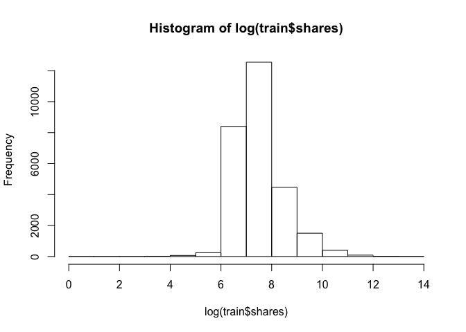

Project 2
================
Yilin Xie
July 3, 2020

  - [Introduction](#introduction)
      - [Data preprocessing](#data-preprocessing)
      - [Data split](#data-split)
      - [Summarizations](#summarizations)
  - [Ensemble model fit](#ensemble-model-fit)
      - [On train set](#on-train-set)
      - [On test set](#on-test-set)
  - [Linear regression fit](#linear-regression-fit)
      - [On train set](#on-train-set-1)
      - [On test set](#on-test-set-1)
  - [Conclusions](#conclusions)

## Introduction

The perpose of this project is going to analyze an online news
popularity data set
[here](https://archive.ics.uci.edu/ml/datasets/Online+News+Popularity)
and predict **shares** by backward linear regression and random forest.
Firstly I read it into R session and determine which variables that I
would deal with.

``` r
#Load the data
news <- read.csv("/Users/yilinxie/Desktop/ST558/Project/Project2/OnlineNewsPopularity.csv")
head(news)
```

    ##                                                              url timedelta n_tokens_title n_tokens_content
    ## 1   http://mashable.com/2013/01/07/amazon-instant-video-browser/       731             12              219
    ## 2    http://mashable.com/2013/01/07/ap-samsung-sponsored-tweets/       731              9              255
    ## 3 http://mashable.com/2013/01/07/apple-40-billion-app-downloads/       731              9              211
    ## 4       http://mashable.com/2013/01/07/astronaut-notre-dame-bcs/       731              9              531
    ## 5               http://mashable.com/2013/01/07/att-u-verse-apps/       731             13             1072
    ## 6               http://mashable.com/2013/01/07/beewi-smart-toys/       731             10              370
    ##   n_unique_tokens n_non_stop_words n_non_stop_unique_tokens num_hrefs num_self_hrefs num_imgs num_videos
    ## 1       0.6635945                1                0.8153846         4              2        1          0
    ## 2       0.6047431                1                0.7919463         3              1        1          0
    ## 3       0.5751295                1                0.6638655         3              1        1          0
    ## 4       0.5037879                1                0.6656347         9              0        1          0
    ## 5       0.4156456                1                0.5408895        19             19       20          0
    ## 6       0.5598886                1                0.6981982         2              2        0          0
    ##   average_token_length num_keywords data_channel_is_lifestyle data_channel_is_entertainment data_channel_is_bus
    ## 1             4.680365            5                         0                             1                   0
    ## 2             4.913725            4                         0                             0                   1
    ## 3             4.393365            6                         0                             0                   1
    ## 4             4.404896            7                         0                             1                   0
    ## 5             4.682836            7                         0                             0                   0
    ## 6             4.359459            9                         0                             0                   0
    ##   data_channel_is_socmed data_channel_is_tech data_channel_is_world kw_min_min kw_max_min kw_avg_min kw_min_max
    ## 1                      0                    0                     0          0          0          0          0
    ## 2                      0                    0                     0          0          0          0          0
    ## 3                      0                    0                     0          0          0          0          0
    ## 4                      0                    0                     0          0          0          0          0
    ## 5                      0                    1                     0          0          0          0          0
    ## 6                      0                    1                     0          0          0          0          0
    ##   kw_max_max kw_avg_max kw_min_avg kw_max_avg kw_avg_avg self_reference_min_shares self_reference_max_shares
    ## 1          0          0          0          0          0                       496                       496
    ## 2          0          0          0          0          0                         0                         0
    ## 3          0          0          0          0          0                       918                       918
    ## 4          0          0          0          0          0                         0                         0
    ## 5          0          0          0          0          0                       545                     16000
    ## 6          0          0          0          0          0                      8500                      8500
    ##   self_reference_avg_sharess weekday_is_monday weekday_is_tuesday weekday_is_wednesday weekday_is_thursday
    ## 1                    496.000                 1                  0                    0                   0
    ## 2                      0.000                 1                  0                    0                   0
    ## 3                    918.000                 1                  0                    0                   0
    ## 4                      0.000                 1                  0                    0                   0
    ## 5                   3151.158                 1                  0                    0                   0
    ## 6                   8500.000                 1                  0                    0                   0
    ##   weekday_is_friday weekday_is_saturday weekday_is_sunday is_weekend     LDA_00     LDA_01     LDA_02     LDA_03
    ## 1                 0                   0                 0          0 0.50033120 0.37827893 0.04000468 0.04126265
    ## 2                 0                   0                 0          0 0.79975569 0.05004668 0.05009625 0.05010067
    ## 3                 0                   0                 0          0 0.21779229 0.03333446 0.03335142 0.03333354
    ## 4                 0                   0                 0          0 0.02857322 0.41929964 0.49465083 0.02890472
    ## 5                 0                   0                 0          0 0.02863281 0.02879355 0.02857518 0.02857168
    ## 6                 0                   0                 0          0 0.02224528 0.30671758 0.02223128 0.02222429
    ##       LDA_04 global_subjectivity global_sentiment_polarity global_rate_positive_words global_rate_negative_words
    ## 1 0.04012254           0.5216171                0.09256198                 0.04566210                0.013698630
    ## 2 0.05000071           0.3412458                0.14894781                 0.04313725                0.015686275
    ## 3 0.68218829           0.7022222                0.32333333                 0.05687204                0.009478673
    ## 4 0.02857160           0.4298497                0.10070467                 0.04143126                0.020715631
    ## 5 0.88542678           0.5135021                0.28100348                 0.07462687                0.012126866
    ## 6 0.62658158           0.4374086                0.07118419                 0.02972973                0.027027027
    ##   rate_positive_words rate_negative_words avg_positive_polarity min_positive_polarity max_positive_polarity
    ## 1           0.7692308           0.2307692             0.3786364            0.10000000                   0.7
    ## 2           0.7333333           0.2666667             0.2869146            0.03333333                   0.7
    ## 3           0.8571429           0.1428571             0.4958333            0.10000000                   1.0
    ## 4           0.6666667           0.3333333             0.3859652            0.13636364                   0.8
    ## 5           0.8602151           0.1397849             0.4111274            0.03333333                   1.0
    ## 6           0.5238095           0.4761905             0.3506100            0.13636364                   0.6
    ##   avg_negative_polarity min_negative_polarity max_negative_polarity title_subjectivity title_sentiment_polarity
    ## 1            -0.3500000                -0.600            -0.2000000          0.5000000               -0.1875000
    ## 2            -0.1187500                -0.125            -0.1000000          0.0000000                0.0000000
    ## 3            -0.4666667                -0.800            -0.1333333          0.0000000                0.0000000
    ## 4            -0.3696970                -0.600            -0.1666667          0.0000000                0.0000000
    ## 5            -0.2201923                -0.500            -0.0500000          0.4545455                0.1363636
    ## 6            -0.1950000                -0.400            -0.1000000          0.6428571                0.2142857
    ##   abs_title_subjectivity abs_title_sentiment_polarity shares
    ## 1             0.00000000                    0.1875000    593
    ## 2             0.50000000                    0.0000000    711
    ## 3             0.50000000                    0.0000000   1500
    ## 4             0.50000000                    0.0000000   1200
    ## 5             0.04545455                    0.1363636    505
    ## 6             0.14285714                    0.2142857    855

``` r
#detect NA value
sum(is.na(news$shares) )
```

    ## [1] 0

As shown above, it is a huge data set with 39644 rows and 61 colomns. It
contains factor variables, numeric variables and dummy variables. The
task is to predict the 61st variable **shares**. Then I’m going to
preprocess the data to get it in the form I need.

### Data preprocessing

``` r
library(tidyverse)
#Remove the useless colomns
news1 <- select(news, -url, -timedelta, 
                -weekday_is_monday, -weekday_is_tuesday,
                -weekday_is_wednesday, -weekday_is_thursday, 
                -weekday_is_friday, -weekday_is_saturday, -weekday_is_sunday, 
                -is_weekend, params$weekday)
r = nrow(news1)
c = ncol(news1)
r
```

    ## [1] 39644

``` r
c
```

    ## [1] 52

Since r\>\>c, this is not a high dimension data set. I would use and to
predict **shares** by the entire variables.

### Data split

``` r
#Set seed to make work reproducible
set.seed(123)
#randomly sample from the data
sub <- sample(1:r, 0.7*r)
#store training dataset (70% of the data) and test dataset (30% of the data)
train <- news1[sub,]
test <- news1[-sub,]
```

### Summarizations

We can look at the distribution of **shares** through the histogram and
see some statistics of the total variables in a summary table.

``` r
#number of rows of training dataset
nrow(train)
```

    ## [1] 27750

``` r
#draw histograms
hist(train$shares)
```

<!-- -->

``` r
hist(log(train$shares))
```

<!-- -->

``` r
#summary the training dataset
t(summary(train))
```

    ##                                                                                                          
    ## n_tokens_title                Min.   : 3.00      1st Qu.: 9.00      Median :10.00      Mean   :10.41     
    ## n_tokens_content              Min.   :   0.0     1st Qu.: 246.0     Median : 409.0     Mean   : 546.6    
    ## n_unique_tokens               Min.   :  0.0000   1st Qu.:  0.4707   Median :  0.5391   Mean   :  0.5554  
    ## n_non_stop_words              Min.   :   0.000   1st Qu.:   1.000   Median :   1.000   Mean   :   1.007  
    ## n_non_stop_unique_tokens      Min.   :  0.0000   1st Qu.:  0.6253   Median :  0.6905   Mean   :  0.6958  
    ##   num_hrefs                   Min.   :  0.00     1st Qu.:  4.00     Median :  8.00     Mean   : 10.96    
    ## num_self_hrefs                Min.   :  0.000    1st Qu.:  1.000    Median :  3.000    Mean   :  3.314   
    ##    num_imgs                   Min.   :  0.000    1st Qu.:  1.000    Median :  1.000    Mean   :  4.533   
    ##   num_videos                  Min.   : 0.000     1st Qu.: 0.000     Median : 0.000     Mean   : 1.248    
    ## average_token_length          Min.   :0.000      1st Qu.:4.477      Median :4.664      Mean   :4.545     
    ##  num_keywords                 Min.   : 1.000     1st Qu.: 6.000     Median : 7.000     Mean   : 7.219    
    ## data_channel_is_lifestyle     Min.   :0.00000    1st Qu.:0.00000    Median :0.00000    Mean   :0.05359   
    ## data_channel_is_entertainment Min.   :0.0000     1st Qu.:0.0000     Median :0.0000     Mean   :0.1767    
    ## data_channel_is_bus           Min.   :0.0000     1st Qu.:0.0000     Median :0.0000     Mean   :0.1595    
    ## data_channel_is_socmed        Min.   :0.00000    1st Qu.:0.00000    Median :0.00000    Mean   :0.05888   
    ## data_channel_is_tech          Min.   :0.0000     1st Qu.:0.0000     Median :0.0000     Mean   :0.1843    
    ## data_channel_is_world         Min.   :0.0000     1st Qu.:0.0000     Median :0.0000     Mean   :0.2134    
    ##   kw_min_min                  Min.   : -1.00     1st Qu.: -1.00     Median : -1.00     Mean   : 26.16    
    ##   kw_max_min                  Min.   :     0     1st Qu.:   444     Median :   659     Mean   :  1154    
    ##   kw_avg_min                  Min.   :   -1.0    1st Qu.:  141.6    Median :  235.2    Mean   :  312.5   
    ##   kw_min_max                  Min.   :     0     1st Qu.:     0     Median :  1400     Mean   : 13874    
    ##   kw_max_max                  Min.   :     0     1st Qu.:843300     Median :843300     Mean   :751872    
    ##   kw_avg_max                  Min.   :     0     1st Qu.:173184     Median :244999     Mean   :259451    
    ##   kw_min_avg                  Min.   :  -1       1st Qu.:   0       Median :1028       Mean   :1119      
    ##   kw_max_avg                  Min.   :     0     1st Qu.:  3564     Median :  4358     Mean   :  5653    
    ##   kw_avg_avg                  Min.   :    0      1st Qu.: 2383      Median : 2876      Mean   : 3134     
    ## self_reference_min_shares     Min.   :     0.0   1st Qu.:   640.2   Median :  1200.0   Mean   :  3972.7  
    ## self_reference_max_shares     Min.   :     0     1st Qu.:  1000     Median :  2800     Mean   : 10287    
    ## self_reference_avg_sharess    Min.   :     0.0   1st Qu.:   975.4   Median :  2200.0   Mean   :  6350.6  
    ##     LDA_00                    Min.   :0.00000    1st Qu.:0.02505    Median :0.03339    Mean   :0.18615   
    ##     LDA_01                    Min.   :0.00000    1st Qu.:0.02501    Median :0.03334    Mean   :0.14033   
    ##     LDA_02                    Min.   :0.00000    1st Qu.:0.02857    Median :0.04000    Mean   :0.21606   
    ##     LDA_03                    Min.   :0.00000    1st Qu.:0.02857    Median :0.04000    Mean   :0.22337   
    ##     LDA_04                    Min.   :0.00000    1st Qu.:0.02857    Median :0.04072    Mean   :0.23405   
    ## global_subjectivity           Min.   :0.0000     1st Qu.:0.3959     Median :0.4533     Mean   :0.4430    
    ## global_sentiment_polarity     Min.   :-0.39375   1st Qu.: 0.05761   Median : 0.11851   Mean   : 0.11894  
    ## global_rate_positive_words    Min.   :0.00000    1st Qu.:0.02830    Median :0.03904    Mean   :0.03957   
    ## global_rate_negative_words    Min.   :0.000000   1st Qu.:0.009615   Median :0.015385   Mean   :0.016668  
    ## rate_positive_words           Min.   :0.0000     1st Qu.:0.6000     Median :0.7097     Mean   :0.6806    
    ## rate_negative_words           Min.   :0.0000     1st Qu.:0.1860     Median :0.2800     Mean   :0.2884    
    ## avg_positive_polarity         Min.   :0.0000     1st Qu.:0.3063     Median :0.3590     Mean   :0.3536    
    ## min_positive_polarity         Min.   :0.00000    1st Qu.:0.05000    Median :0.10000    Mean   :0.09534   
    ## max_positive_polarity         Min.   :0.0000     1st Qu.:0.6000     Median :0.8000     Mean   :0.7559    
    ## avg_negative_polarity         Min.   :-1.0000    1st Qu.:-0.3280    Median :-0.2528    Mean   :-0.2594   
    ## min_negative_polarity         Min.   :-1.0000    1st Qu.:-0.7000    Median :-0.5000    Mean   :-0.5212   
    ## max_negative_polarity         Min.   :-1.0000    1st Qu.:-0.1250    Median :-0.1000    Mean   :-0.1076   
    ## title_subjectivity            Min.   :0.0000     1st Qu.:0.0000     Median :0.1500     Mean   :0.2843    
    ## title_sentiment_polarity      Min.   :-1.00000   1st Qu.: 0.00000   Median : 0.00000   Mean   : 0.07096  
    ## abs_title_subjectivity        Min.   :0.0000     1st Qu.:0.1667     Median :0.5000     Mean   :0.3414    
    ## abs_title_sentiment_polarity  Min.   :0.000000   1st Qu.:0.000000   Median :0.005682   Mean   :0.157838  
    ##     shares                    Min.   :     1     1st Qu.:   943     Median :  1400     Mean   :  3356    
    ## weekday_is_sunday             Min.   :0.00000    1st Qu.:0.00000    Median :0.00000    Mean   :0.06919   
    ##                                                                    
    ## n_tokens_title                3rd Qu.:12.00      Max.   :23.00     
    ## n_tokens_content              3rd Qu.: 716.0     Max.   :8474.0    
    ## n_unique_tokens               3rd Qu.:  0.6088   Max.   :701.0000  
    ## n_non_stop_words              3rd Qu.:   1.000   Max.   :1042.000  
    ## n_non_stop_unique_tokens      3rd Qu.:  0.7551   Max.   :650.0000  
    ##   num_hrefs                   3rd Qu.: 14.00     Max.   :304.00    
    ## num_self_hrefs                3rd Qu.:  4.000    Max.   :116.000   
    ##    num_imgs                   3rd Qu.:  4.000    Max.   :111.000   
    ##   num_videos                  3rd Qu.: 1.000     Max.   :74.000    
    ## average_token_length          3rd Qu.:4.857      Max.   :8.042     
    ##  num_keywords                 3rd Qu.: 9.000     Max.   :10.000    
    ## data_channel_is_lifestyle     3rd Qu.:0.00000    Max.   :1.00000   
    ## data_channel_is_entertainment 3rd Qu.:0.0000     Max.   :1.0000    
    ## data_channel_is_bus           3rd Qu.:0.0000     Max.   :1.0000    
    ## data_channel_is_socmed        3rd Qu.:0.00000    Max.   :1.00000   
    ## data_channel_is_tech          3rd Qu.:0.0000     Max.   :1.0000    
    ## data_channel_is_world         3rd Qu.:0.0000     Max.   :1.0000    
    ##   kw_min_min                  3rd Qu.:  4.00     Max.   :377.00    
    ##   kw_max_min                  3rd Qu.:  1000     Max.   :298400    
    ##   kw_avg_min                  3rd Qu.:  356.8    Max.   :42827.9   
    ##   kw_min_max                  3rd Qu.:  7900     Max.   :843300    
    ##   kw_max_max                  3rd Qu.:843300     Max.   :843300    
    ##   kw_avg_max                  3rd Qu.:330479     Max.   :843300    
    ##   kw_min_avg                  3rd Qu.:2063       Max.   :3613      
    ##   kw_max_avg                  3rd Qu.:  6015     Max.   :298400    
    ##   kw_avg_avg                  3rd Qu.: 3598      Max.   :43568     
    ## self_reference_min_shares     3rd Qu.:  2600.0   Max.   :843300.0  
    ## self_reference_max_shares     3rd Qu.:  7900     Max.   :843300    
    ## self_reference_avg_sharess    3rd Qu.:  5100.0   Max.   :843300.0  
    ##     LDA_00                    3rd Qu.:0.24492    Max.   :0.92699   
    ##     LDA_01                    3rd Qu.:0.15002    Max.   :0.91998   
    ##     LDA_02                    3rd Qu.:0.33499    Max.   :0.92000   
    ##     LDA_03                    3rd Qu.:0.37378    Max.   :0.92653   
    ##     LDA_04                    3rd Qu.:0.40010    Max.   :0.92708   
    ## global_subjectivity           3rd Qu.:0.5082     Max.   :1.0000    
    ## global_sentiment_polarity     3rd Qu.: 0.17734   Max.   : 0.72784  
    ## global_rate_positive_words    3rd Qu.:0.05028    Max.   :0.15549   
    ## global_rate_negative_words    3rd Qu.:0.021779   Max.   :0.184932  
    ## rate_positive_words           3rd Qu.:0.8000     Max.   :1.0000    
    ## rate_negative_words           3rd Qu.:0.3846     Max.   :1.0000    
    ## avg_positive_polarity         3rd Qu.:0.4117     Max.   :1.0000    
    ## min_positive_polarity         3rd Qu.:0.10000    Max.   :1.00000   
    ## max_positive_polarity         3rd Qu.:1.0000     Max.   :1.0000    
    ## avg_negative_polarity         3rd Qu.:-0.1863    Max.   : 0.0000   
    ## min_negative_polarity         3rd Qu.:-0.3000    Max.   : 0.0000   
    ## max_negative_polarity         3rd Qu.:-0.0500    Max.   : 0.0000   
    ## title_subjectivity            3rd Qu.:0.5000     Max.   :1.0000    
    ## title_sentiment_polarity      3rd Qu.: 0.15000   Max.   : 1.00000  
    ## abs_title_subjectivity        3rd Qu.:0.5000     Max.   :0.5000    
    ## abs_title_sentiment_polarity  3rd Qu.:0.250000   Max.   :1.000000  
    ##     shares                    3rd Qu.:  2800     Max.   :843300    
    ## weekday_is_sunday             3rd Qu.:0.00000    Max.   :1.00000

## Ensemble model fit

A random forest is a forest constructed in a random way, and the forest
is composed of many unrelated decision trees. Therefore, in theory, the
performance of random forest is generally better than that of a single
decision tree, because the results of random forest are determined by
voting on the results of multiple decision trees. But here, I’m using a
random forest for regression.

### On train set

``` r
#load package
library(randomForest)
#Get random forest model fit on training dataset
rf <- randomForest(shares ~ ., data = train, importance=TRUE)
rf
```

    ## 
    ## Call:
    ##  randomForest(formula = shares ~ ., data = train, importance = TRUE) 
    ##                Type of random forest: regression
    ##                      Number of trees: 500
    ## No. of variables tried at each split: 17
    ## 
    ##           Mean of squared residuals: 117258672
    ##                     % Var explained: -0.43

``` r
#variable importance measures
importance(rf)
```

    ##                                  %IncMSE IncNodePurity
    ## n_tokens_title                 2.0481281   46708414572
    ## n_tokens_content               5.8824034   52067404866
    ## n_unique_tokens                7.7337382   46907564940
    ## n_non_stop_words               9.6002792   46385435637
    ## n_non_stop_unique_tokens       8.3204749   63223855112
    ## num_hrefs                      4.6002043   66969628883
    ## num_self_hrefs                 4.0463361   51195695550
    ## num_imgs                       1.6469648   52370264552
    ## num_videos                     4.3653969   38762809245
    ## average_token_length           3.1934321   62007578768
    ## num_keywords                   3.4771674   22767827701
    ## data_channel_is_lifestyle      2.0144990    5077854046
    ## data_channel_is_entertainment  3.9011851    3411768103
    ## data_channel_is_bus            3.7251916   25442790623
    ## data_channel_is_socmed         4.4339526    2585098474
    ## data_channel_is_tech           8.4192601    1768959736
    ## data_channel_is_world          8.1288935    2644247748
    ## kw_min_min                     1.9066555   12604554270
    ## kw_max_min                     3.6416471   98027863369
    ## kw_avg_min                     3.1258506  112104823685
    ## kw_min_max                     4.1385052   37341164871
    ## kw_max_max                     3.9297912   45714752421
    ## kw_avg_max                     3.7597814  103998365778
    ## kw_min_avg                     2.8444548   46454622783
    ## kw_max_avg                     3.7498761  164379997391
    ## kw_avg_avg                     2.1211773  203878345885
    ## self_reference_min_shares      7.4730880   56881595312
    ## self_reference_max_shares      5.7737233   93198727633
    ## self_reference_avg_sharess     5.7386640  145271159108
    ## LDA_00                         3.2345672   94052440842
    ## LDA_01                         6.6314416   51579633007
    ## LDA_02                         3.2043183   78885512571
    ## LDA_03                         3.1631558  121262802093
    ## LDA_04                         4.4325755   76665590840
    ## global_subjectivity            6.4441087   71861985350
    ## global_sentiment_polarity      4.3646246   46738059463
    ## global_rate_positive_words     3.2581192   73679799943
    ## global_rate_negative_words     5.3231599   36735961712
    ## rate_positive_words            3.6735251   48297709429
    ## rate_negative_words            4.2554848   43219129837
    ## avg_positive_polarity          5.1038871   60646223598
    ## min_positive_polarity         -0.4898945   23106131292
    ## max_positive_polarity          4.0472071   10049072321
    ## avg_negative_polarity          4.0532957   56873762111
    ## min_negative_polarity          2.6826342   30438111815
    ## max_negative_polarity          3.8734914   27204941494
    ## title_subjectivity             3.4457631   50156131980
    ## title_sentiment_polarity       3.4446580   72460581621
    ## abs_title_subjectivity         3.8626933   15907054127
    ## abs_title_sentiment_polarity   2.2231684   31978259984
    ## weekday_is_sunday              2.0077883    2673498443

``` r
#draw dotplot of variable importance as measured by Random Forest
varImpPlot(rf)
```

<!-- -->

Calculate the predicted mean square error on the train set:

``` r
train.pred <- predict(rf, train)
mean((train.pred - train$shares)^2)
```

    ## [1] 25448654

### On test set

``` r
rf.test <- predict(rf, newdata = test)
mean((test$shares-rf.test)^2)
```

    ## [1] 177649375

## Linear regression fit

I choose stepwise regression to fit this model, more specificly, the
backward way. This data set contains too many variables. And since I’m
not an expert on journalism, I can’t tell which factors should have a
real effect on the predicted variables. If I manually removed the
variables by their significance in the model and compared the
differences between the models, this would be a lot of work. So I want
to use a backward regression model based on the AIC criteria to
automatically determine which variables should be included or removed
from the model.

### On train set

``` r
#fit model
lm.step <- step(lm(shares ~ .,data = train))
```

    ## Start:  AIC=514900.4
    ## shares ~ n_tokens_title + n_tokens_content + n_unique_tokens + 
    ##     n_non_stop_words + n_non_stop_unique_tokens + num_hrefs + 
    ##     num_self_hrefs + num_imgs + num_videos + average_token_length + 
    ##     num_keywords + data_channel_is_lifestyle + data_channel_is_entertainment + 
    ##     data_channel_is_bus + data_channel_is_socmed + data_channel_is_tech + 
    ##     data_channel_is_world + kw_min_min + kw_max_min + kw_avg_min + 
    ##     kw_min_max + kw_max_max + kw_avg_max + kw_min_avg + kw_max_avg + 
    ##     kw_avg_avg + self_reference_min_shares + self_reference_max_shares + 
    ##     self_reference_avg_sharess + LDA_00 + LDA_01 + LDA_02 + LDA_03 + 
    ##     LDA_04 + global_subjectivity + global_sentiment_polarity + 
    ##     global_rate_positive_words + global_rate_negative_words + 
    ##     rate_positive_words + rate_negative_words + avg_positive_polarity + 
    ##     min_positive_polarity + max_positive_polarity + avg_negative_polarity + 
    ##     min_negative_polarity + max_negative_polarity + title_subjectivity + 
    ##     title_sentiment_polarity + abs_title_subjectivity + abs_title_sentiment_polarity + 
    ##     weekday_is_sunday
    ## 
    ##                                 Df  Sum of Sq        RSS    AIC
    ## - global_sentiment_polarity      1 3.0003e+05 3.1620e+12 514898
    ## - title_subjectivity             1 4.8347e+05 3.1620e+12 514898
    ## - global_rate_negative_words     1 1.8073e+06 3.1620e+12 514898
    ## - n_unique_tokens                1 2.2253e+06 3.1620e+12 514898
    ## - LDA_00                         1 5.9452e+06 3.1620e+12 514898
    ## - LDA_04                         1 5.9506e+06 3.1620e+12 514898
    ## - LDA_03                         1 5.9528e+06 3.1620e+12 514898
    ## - LDA_02                         1 5.9578e+06 3.1620e+12 514898
    ## - LDA_01                         1 5.9587e+06 3.1620e+12 514898
    ## - avg_negative_polarity          1 6.5969e+06 3.1620e+12 514898
    ## - max_positive_polarity          1 7.4097e+06 3.1620e+12 514898
    ## - num_keywords                   1 7.4163e+06 3.1620e+12 514898
    ## - rate_positive_words            1 9.0325e+06 3.1620e+12 514899
    ## - rate_negative_words            1 9.7810e+06 3.1620e+12 514899
    ## - n_tokens_content               1 1.2959e+07 3.1620e+12 514899
    ## - n_non_stop_words               1 1.3452e+07 3.1620e+12 514899
    ## - avg_positive_polarity          1 2.1851e+07 3.1620e+12 514899
    ## - min_negative_polarity          1 2.4984e+07 3.1620e+12 514899
    ## - title_sentiment_polarity       1 3.6565e+07 3.1620e+12 514899
    ## - self_reference_avg_sharess     1 4.4197e+07 3.1620e+12 514899
    ## - max_negative_polarity          1 4.7858e+07 3.1620e+12 514899
    ## - weekday_is_sunday              1 5.1275e+07 3.1620e+12 514899
    ## - global_rate_positive_words     1 5.6381e+07 3.1620e+12 514899
    ## - n_non_stop_unique_tokens       1 7.9356e+07 3.1620e+12 514899
    ## - kw_min_min                     1 8.7454e+07 3.1620e+12 514899
    ## - kw_min_max                     1 9.2580e+07 3.1621e+12 514899
    ## - kw_max_max                     1 1.1072e+08 3.1621e+12 514899
    ## - average_token_length           1 1.6387e+08 3.1621e+12 514900
    ## - num_imgs                       1 1.7518e+08 3.1621e+12 514900
    ## <none>                                        3.1620e+12 514900
    ## - self_reference_max_shares      1 2.3069e+08 3.1622e+12 514900
    ## - min_positive_polarity          1 2.4376e+08 3.1622e+12 514901
    ## - num_videos                     1 2.4932e+08 3.1622e+12 514901
    ## - kw_avg_max                     1 2.9048e+08 3.1623e+12 514901
    ## - self_reference_min_shares      1 3.2254e+08 3.1623e+12 514901
    ## - kw_max_min                     1 3.2428e+08 3.1623e+12 514901
    ## - kw_avg_min                     1 3.8383e+08 3.1623e+12 514902
    ## - abs_title_sentiment_polarity   1 4.9183e+08 3.1625e+12 514903
    ## - abs_title_subjectivity         1 7.4126e+08 3.1627e+12 514905
    ## - data_channel_is_world          1 7.7108e+08 3.1627e+12 514905
    ## - n_tokens_title                 1 8.6295e+08 3.1628e+12 514906
    ## - num_self_hrefs                 1 9.0160e+08 3.1629e+12 514906
    ## - global_subjectivity            1 9.8656e+08 3.1629e+12 514907
    ## - data_channel_is_socmed         1 9.9590e+08 3.1630e+12 514907
    ## - data_channel_is_tech           1 1.0002e+09 3.1630e+12 514907
    ## - data_channel_is_lifestyle      1 1.4613e+09 3.1634e+12 514911
    ## - data_channel_is_bus            1 1.8861e+09 3.1638e+12 514915
    ## - kw_min_avg                     1 1.8862e+09 3.1638e+12 514915
    ## - num_hrefs                      1 2.9822e+09 3.1649e+12 514925
    ## - data_channel_is_entertainment  1 3.2939e+09 3.1653e+12 514927
    ## - kw_max_avg                     1 5.6266e+09 3.1676e+12 514948
    ## - kw_avg_avg                     1 1.1427e+10 3.1734e+12 514999
    ## 
    ## Step:  AIC=514898.4
    ## shares ~ n_tokens_title + n_tokens_content + n_unique_tokens + 
    ##     n_non_stop_words + n_non_stop_unique_tokens + num_hrefs + 
    ##     num_self_hrefs + num_imgs + num_videos + average_token_length + 
    ##     num_keywords + data_channel_is_lifestyle + data_channel_is_entertainment + 
    ##     data_channel_is_bus + data_channel_is_socmed + data_channel_is_tech + 
    ##     data_channel_is_world + kw_min_min + kw_max_min + kw_avg_min + 
    ##     kw_min_max + kw_max_max + kw_avg_max + kw_min_avg + kw_max_avg + 
    ##     kw_avg_avg + self_reference_min_shares + self_reference_max_shares + 
    ##     self_reference_avg_sharess + LDA_00 + LDA_01 + LDA_02 + LDA_03 + 
    ##     LDA_04 + global_subjectivity + global_rate_positive_words + 
    ##     global_rate_negative_words + rate_positive_words + rate_negative_words + 
    ##     avg_positive_polarity + min_positive_polarity + max_positive_polarity + 
    ##     avg_negative_polarity + min_negative_polarity + max_negative_polarity + 
    ##     title_subjectivity + title_sentiment_polarity + abs_title_subjectivity + 
    ##     abs_title_sentiment_polarity + weekday_is_sunday
    ## 
    ##                                 Df  Sum of Sq        RSS    AIC
    ## - title_subjectivity             1 5.0111e+05 3.1620e+12 514896
    ## - n_unique_tokens                1 2.2286e+06 3.1620e+12 514896
    ## - global_rate_negative_words     1 2.5716e+06 3.1620e+12 514896
    ## - LDA_00                         1 5.9567e+06 3.1620e+12 514896
    ## - LDA_04                         1 5.9622e+06 3.1620e+12 514896
    ## - LDA_03                         1 5.9644e+06 3.1620e+12 514896
    ## - LDA_02                         1 5.9693e+06 3.1620e+12 514896
    ## - LDA_01                         1 5.9702e+06 3.1620e+12 514896
    ## - num_keywords                   1 7.3968e+06 3.1620e+12 514896
    ## - max_positive_polarity          1 7.4470e+06 3.1620e+12 514896
    ## - avg_negative_polarity          1 8.5071e+06 3.1620e+12 514897
    ## - rate_positive_words            1 9.0443e+06 3.1620e+12 514897
    ## - rate_negative_words            1 9.6415e+06 3.1620e+12 514897
    ## - n_tokens_content               1 1.2828e+07 3.1620e+12 514897
    ## - n_non_stop_words               1 1.3453e+07 3.1620e+12 514897
    ## - min_negative_polarity          1 2.5133e+07 3.1620e+12 514897
    ## - avg_positive_polarity          1 2.9190e+07 3.1620e+12 514897
    ## - title_sentiment_polarity       1 3.7393e+07 3.1620e+12 514897
    ## - self_reference_avg_sharess     1 4.4176e+07 3.1620e+12 514897
    ## - max_negative_polarity          1 5.0448e+07 3.1620e+12 514897
    ## - weekday_is_sunday              1 5.1327e+07 3.1620e+12 514897
    ## - global_rate_positive_words     1 6.3966e+07 3.1620e+12 514897
    ## - n_non_stop_unique_tokens       1 7.9192e+07 3.1620e+12 514897
    ## - kw_min_min                     1 8.7399e+07 3.1620e+12 514897
    ## - kw_min_max                     1 9.2711e+07 3.1621e+12 514897
    ## - kw_max_max                     1 1.1077e+08 3.1621e+12 514897
    ## - average_token_length           1 1.6413e+08 3.1621e+12 514898
    ## - num_imgs                       1 1.7527e+08 3.1621e+12 514898
    ## <none>                                        3.1620e+12 514898
    ## - self_reference_max_shares      1 2.3059e+08 3.1622e+12 514898
    ## - num_videos                     1 2.4915e+08 3.1622e+12 514899
    ## - min_positive_polarity          1 2.5020e+08 3.1622e+12 514899
    ## - kw_avg_max                     1 2.9037e+08 3.1623e+12 514899
    ## - self_reference_min_shares      1 3.2252e+08 3.1623e+12 514899
    ## - kw_max_min                     1 3.2413e+08 3.1623e+12 514899
    ## - kw_avg_min                     1 3.8367e+08 3.1623e+12 514900
    ## - abs_title_sentiment_polarity   1 4.9188e+08 3.1625e+12 514901
    ## - abs_title_subjectivity         1 7.4232e+08 3.1627e+12 514903
    ## - data_channel_is_world          1 7.7079e+08 3.1627e+12 514903
    ## - n_tokens_title                 1 8.6300e+08 3.1628e+12 514904
    ## - num_self_hrefs                 1 9.0163e+08 3.1629e+12 514904
    ## - data_channel_is_socmed         1 9.9579e+08 3.1630e+12 514905
    ## - data_channel_is_tech           1 1.0000e+09 3.1630e+12 514905
    ## - global_subjectivity            1 1.0296e+09 3.1630e+12 514905
    ## - data_channel_is_lifestyle      1 1.4611e+09 3.1634e+12 514909
    ## - kw_min_avg                     1 1.8859e+09 3.1638e+12 514913
    ## - data_channel_is_bus            1 1.8861e+09 3.1638e+12 514913
    ## - num_hrefs                      1 2.9910e+09 3.1650e+12 514923
    ## - data_channel_is_entertainment  1 3.2939e+09 3.1653e+12 514925
    ## - kw_max_avg                     1 5.6271e+09 3.1676e+12 514946
    ## - kw_avg_avg                     1 1.1429e+10 3.1734e+12 514997
    ## 
    ## Step:  AIC=514896.4
    ## shares ~ n_tokens_title + n_tokens_content + n_unique_tokens + 
    ##     n_non_stop_words + n_non_stop_unique_tokens + num_hrefs + 
    ##     num_self_hrefs + num_imgs + num_videos + average_token_length + 
    ##     num_keywords + data_channel_is_lifestyle + data_channel_is_entertainment + 
    ##     data_channel_is_bus + data_channel_is_socmed + data_channel_is_tech + 
    ##     data_channel_is_world + kw_min_min + kw_max_min + kw_avg_min + 
    ##     kw_min_max + kw_max_max + kw_avg_max + kw_min_avg + kw_max_avg + 
    ##     kw_avg_avg + self_reference_min_shares + self_reference_max_shares + 
    ##     self_reference_avg_sharess + LDA_00 + LDA_01 + LDA_02 + LDA_03 + 
    ##     LDA_04 + global_subjectivity + global_rate_positive_words + 
    ##     global_rate_negative_words + rate_positive_words + rate_negative_words + 
    ##     avg_positive_polarity + min_positive_polarity + max_positive_polarity + 
    ##     avg_negative_polarity + min_negative_polarity + max_negative_polarity + 
    ##     title_sentiment_polarity + abs_title_subjectivity + abs_title_sentiment_polarity + 
    ##     weekday_is_sunday
    ## 
    ##                                 Df  Sum of Sq        RSS    AIC
    ## - n_unique_tokens                1 2.2444e+06 3.1620e+12 514894
    ## - global_rate_negative_words     1 2.5822e+06 3.1620e+12 514894
    ## - LDA_00                         1 5.9250e+06 3.1620e+12 514894
    ## - LDA_04                         1 5.9304e+06 3.1620e+12 514894
    ## - LDA_03                         1 5.9326e+06 3.1620e+12 514894
    ## - LDA_02                         1 5.9376e+06 3.1620e+12 514894
    ## - LDA_01                         1 5.9385e+06 3.1620e+12 514894
    ## - num_keywords                   1 7.3640e+06 3.1620e+12 514895
    ## - max_positive_polarity          1 7.4230e+06 3.1620e+12 514895
    ## - avg_negative_polarity          1 8.4892e+06 3.1620e+12 514895
    ## - rate_positive_words            1 9.0340e+06 3.1620e+12 514895
    ## - rate_negative_words            1 9.6208e+06 3.1620e+12 514895
    ## - n_tokens_content               1 1.2747e+07 3.1620e+12 514895
    ## - n_non_stop_words               1 1.3399e+07 3.1620e+12 514895
    ## - min_negative_polarity          1 2.5195e+07 3.1620e+12 514895
    ## - avg_positive_polarity          1 2.8912e+07 3.1620e+12 514895
    ## - title_sentiment_polarity       1 3.8935e+07 3.1620e+12 514895
    ## - self_reference_avg_sharess     1 4.4194e+07 3.1620e+12 514895
    ## - max_negative_polarity          1 5.0448e+07 3.1620e+12 514895
    ## - weekday_is_sunday              1 5.1420e+07 3.1620e+12 514895
    ## - global_rate_positive_words     1 6.4219e+07 3.1620e+12 514895
    ## - n_non_stop_unique_tokens       1 7.9219e+07 3.1620e+12 514895
    ## - kw_min_min                     1 8.7498e+07 3.1621e+12 514895
    ## - kw_min_max                     1 9.2769e+07 3.1621e+12 514895
    ## - kw_max_max                     1 1.1062e+08 3.1621e+12 514895
    ## - average_token_length           1 1.6416e+08 3.1621e+12 514896
    ## - num_imgs                       1 1.7511e+08 3.1621e+12 514896
    ## <none>                                        3.1620e+12 514896
    ## - self_reference_max_shares      1 2.3060e+08 3.1622e+12 514896
    ## - num_videos                     1 2.4907e+08 3.1622e+12 514897
    ## - min_positive_polarity          1 2.5056e+08 3.1622e+12 514897
    ## - kw_avg_max                     1 2.9050e+08 3.1623e+12 514897
    ## - self_reference_min_shares      1 3.2265e+08 3.1623e+12 514897
    ## - kw_max_min                     1 3.2431e+08 3.1623e+12 514897
    ## - kw_avg_min                     1 3.8396e+08 3.1623e+12 514898
    ## - data_channel_is_world          1 7.7075e+08 3.1627e+12 514901
    ## - abs_title_sentiment_polarity   1 8.0192e+08 3.1628e+12 514901
    ## - abs_title_subjectivity         1 8.3624e+08 3.1628e+12 514902
    ## - n_tokens_title                 1 8.6250e+08 3.1628e+12 514902
    ## - num_self_hrefs                 1 9.0179e+08 3.1629e+12 514902
    ## - data_channel_is_socmed         1 9.9546e+08 3.1630e+12 514903
    ## - data_channel_is_tech           1 1.0001e+09 3.1630e+12 514903
    ## - global_subjectivity            1 1.0376e+09 3.1630e+12 514904
    ## - data_channel_is_lifestyle      1 1.4609e+09 3.1634e+12 514907
    ## - kw_min_avg                     1 1.8855e+09 3.1638e+12 514911
    ## - data_channel_is_bus            1 1.8859e+09 3.1638e+12 514911
    ## - num_hrefs                      1 2.9908e+09 3.1650e+12 514921
    ## - data_channel_is_entertainment  1 3.2936e+09 3.1653e+12 514923
    ## - kw_max_avg                     1 5.6268e+09 3.1676e+12 514944
    ## - kw_avg_avg                     1 1.1428e+10 3.1734e+12 514995
    ## 
    ## Step:  AIC=514894.5
    ## shares ~ n_tokens_title + n_tokens_content + n_non_stop_words + 
    ##     n_non_stop_unique_tokens + num_hrefs + num_self_hrefs + num_imgs + 
    ##     num_videos + average_token_length + num_keywords + data_channel_is_lifestyle + 
    ##     data_channel_is_entertainment + data_channel_is_bus + data_channel_is_socmed + 
    ##     data_channel_is_tech + data_channel_is_world + kw_min_min + 
    ##     kw_max_min + kw_avg_min + kw_min_max + kw_max_max + kw_avg_max + 
    ##     kw_min_avg + kw_max_avg + kw_avg_avg + self_reference_min_shares + 
    ##     self_reference_max_shares + self_reference_avg_sharess + 
    ##     LDA_00 + LDA_01 + LDA_02 + LDA_03 + LDA_04 + global_subjectivity + 
    ##     global_rate_positive_words + global_rate_negative_words + 
    ##     rate_positive_words + rate_negative_words + avg_positive_polarity + 
    ##     min_positive_polarity + max_positive_polarity + avg_negative_polarity + 
    ##     min_negative_polarity + max_negative_polarity + title_sentiment_polarity + 
    ##     abs_title_subjectivity + abs_title_sentiment_polarity + weekday_is_sunday
    ## 
    ##                                 Df  Sum of Sq        RSS    AIC
    ## - global_rate_negative_words     1 2.7245e+06 3.1620e+12 514892
    ## - LDA_00                         1 5.3789e+06 3.1620e+12 514893
    ## - LDA_04                         1 5.3841e+06 3.1620e+12 514893
    ## - LDA_03                         1 5.3862e+06 3.1620e+12 514893
    ## - LDA_02                         1 5.3909e+06 3.1620e+12 514893
    ## - LDA_01                         1 5.3918e+06 3.1620e+12 514893
    ## - num_keywords                   1 7.4661e+06 3.1620e+12 514893
    ## - avg_negative_polarity          1 8.4873e+06 3.1620e+12 514893
    ## - max_positive_polarity          1 8.8708e+06 3.1620e+12 514893
    ## - rate_positive_words            1 9.2031e+06 3.1620e+12 514893
    ## - rate_negative_words            1 9.7972e+06 3.1620e+12 514893
    ## - n_non_stop_words               1 1.3284e+07 3.1620e+12 514893
    ## - n_tokens_content               1 2.2841e+07 3.1620e+12 514893
    ## - min_negative_polarity          1 2.7397e+07 3.1620e+12 514893
    ## - avg_positive_polarity          1 2.9025e+07 3.1620e+12 514893
    ## - title_sentiment_polarity       1 3.9304e+07 3.1620e+12 514893
    ## - self_reference_avg_sharess     1 4.4495e+07 3.1620e+12 514893
    ## - max_negative_polarity          1 4.8707e+07 3.1620e+12 514893
    ## - weekday_is_sunday              1 5.1186e+07 3.1620e+12 514893
    ## - global_rate_positive_words     1 6.6217e+07 3.1620e+12 514893
    ## - kw_min_min                     1 8.7468e+07 3.1621e+12 514893
    ## - kw_min_max                     1 9.2473e+07 3.1621e+12 514893
    ## - kw_max_max                     1 1.0986e+08 3.1621e+12 514893
    ## - num_imgs                       1 1.7393e+08 3.1621e+12 514894
    ## - average_token_length           1 1.8947e+08 3.1622e+12 514894
    ## <none>                                        3.1620e+12 514894
    ## - self_reference_max_shares      1 2.3138e+08 3.1622e+12 514894
    ## - n_non_stop_unique_tokens       1 2.3588e+08 3.1622e+12 514895
    ## - num_videos                     1 2.4687e+08 3.1622e+12 514895
    ## - min_positive_polarity          1 2.6666e+08 3.1622e+12 514895
    ## - kw_avg_max                     1 2.9249e+08 3.1623e+12 514895
    ## - self_reference_min_shares      1 3.2331e+08 3.1623e+12 514895
    ## - kw_max_min                     1 3.2422e+08 3.1623e+12 514895
    ## - kw_avg_min                     1 3.8367e+08 3.1623e+12 514896
    ## - data_channel_is_world          1 7.6953e+08 3.1627e+12 514899
    ## - abs_title_sentiment_polarity   1 8.0036e+08 3.1628e+12 514899
    ## - abs_title_subjectivity         1 8.3831e+08 3.1628e+12 514900
    ## - n_tokens_title                 1 8.6249e+08 3.1628e+12 514900
    ## - num_self_hrefs                 1 9.0287e+08 3.1629e+12 514900
    ## - data_channel_is_socmed         1 9.9325e+08 3.1630e+12 514901
    ## - data_channel_is_tech           1 9.9834e+08 3.1630e+12 514901
    ## - global_subjectivity            1 1.0365e+09 3.1630e+12 514902
    ## - data_channel_is_lifestyle      1 1.4614e+09 3.1634e+12 514905
    ## - data_channel_is_bus            1 1.8854e+09 3.1639e+12 514909
    ## - kw_min_avg                     1 1.8890e+09 3.1639e+12 514909
    ## - num_hrefs                      1 3.0047e+09 3.1650e+12 514919
    ## - data_channel_is_entertainment  1 3.2947e+09 3.1653e+12 514921
    ## - kw_max_avg                     1 5.6311e+09 3.1676e+12 514942
    ## - kw_avg_avg                     1 1.1433e+10 3.1734e+12 514993
    ## 
    ## Step:  AIC=514892.5
    ## shares ~ n_tokens_title + n_tokens_content + n_non_stop_words + 
    ##     n_non_stop_unique_tokens + num_hrefs + num_self_hrefs + num_imgs + 
    ##     num_videos + average_token_length + num_keywords + data_channel_is_lifestyle + 
    ##     data_channel_is_entertainment + data_channel_is_bus + data_channel_is_socmed + 
    ##     data_channel_is_tech + data_channel_is_world + kw_min_min + 
    ##     kw_max_min + kw_avg_min + kw_min_max + kw_max_max + kw_avg_max + 
    ##     kw_min_avg + kw_max_avg + kw_avg_avg + self_reference_min_shares + 
    ##     self_reference_max_shares + self_reference_avg_sharess + 
    ##     LDA_00 + LDA_01 + LDA_02 + LDA_03 + LDA_04 + global_subjectivity + 
    ##     global_rate_positive_words + rate_positive_words + rate_negative_words + 
    ##     avg_positive_polarity + min_positive_polarity + max_positive_polarity + 
    ##     avg_negative_polarity + min_negative_polarity + max_negative_polarity + 
    ##     title_sentiment_polarity + abs_title_subjectivity + abs_title_sentiment_polarity + 
    ##     weekday_is_sunday
    ## 
    ##                                 Df  Sum of Sq        RSS    AIC
    ## - LDA_00                         1 5.4066e+06 3.1620e+12 514891
    ## - LDA_04                         1 5.4118e+06 3.1620e+12 514891
    ## - LDA_03                         1 5.4139e+06 3.1620e+12 514891
    ## - LDA_02                         1 5.4186e+06 3.1620e+12 514891
    ## - LDA_01                         1 5.4195e+06 3.1620e+12 514891
    ## - num_keywords                   1 7.5530e+06 3.1620e+12 514891
    ## - avg_negative_polarity          1 8.3830e+06 3.1620e+12 514891
    ## - max_positive_polarity          1 8.5276e+06 3.1620e+12 514891
    ## - rate_negative_words            1 8.6982e+06 3.1620e+12 514891
    ## - rate_positive_words            1 9.6507e+06 3.1620e+12 514891
    ## - n_non_stop_words               1 1.3310e+07 3.1620e+12 514891
    ## - n_tokens_content               1 2.3280e+07 3.1620e+12 514891
    ## - min_negative_polarity          1 2.6973e+07 3.1620e+12 514891
    ## - avg_positive_polarity          1 2.9237e+07 3.1620e+12 514891
    ## - title_sentiment_polarity       1 4.0964e+07 3.1620e+12 514891
    ## - self_reference_avg_sharess     1 4.4594e+07 3.1620e+12 514891
    ## - max_negative_polarity          1 4.9966e+07 3.1620e+12 514891
    ## - weekday_is_sunday              1 5.1728e+07 3.1620e+12 514891
    ## - kw_min_min                     1 8.6965e+07 3.1621e+12 514891
    ## - kw_min_max                     1 9.2545e+07 3.1621e+12 514891
    ## - kw_max_max                     1 1.1036e+08 3.1621e+12 514891
    ## - global_rate_positive_words     1 1.4240e+08 3.1621e+12 514892
    ## - num_imgs                       1 1.7279e+08 3.1621e+12 514892
    ## - average_token_length           1 1.8797e+08 3.1622e+12 514892
    ## <none>                                        3.1620e+12 514892
    ## - self_reference_max_shares      1 2.3181e+08 3.1622e+12 514893
    ## - n_non_stop_unique_tokens       1 2.3514e+08 3.1622e+12 514893
    ## - num_videos                     1 2.4426e+08 3.1622e+12 514893
    ## - min_positive_polarity          1 2.6435e+08 3.1622e+12 514893
    ## - kw_avg_max                     1 2.9281e+08 3.1623e+12 514893
    ## - self_reference_min_shares      1 3.2316e+08 3.1623e+12 514893
    ## - kw_max_min                     1 3.2425e+08 3.1623e+12 514893
    ## - kw_avg_min                     1 3.8408e+08 3.1624e+12 514894
    ## - data_channel_is_world          1 7.6687e+08 3.1627e+12 514897
    ## - abs_title_sentiment_polarity   1 7.9878e+08 3.1628e+12 514897
    ## - abs_title_subjectivity         1 8.4320e+08 3.1628e+12 514898
    ## - n_tokens_title                 1 8.6441e+08 3.1628e+12 514898
    ## - num_self_hrefs                 1 9.0248e+08 3.1629e+12 514898
    ## - data_channel_is_socmed         1 9.9106e+08 3.1630e+12 514899
    ## - data_channel_is_tech           1 9.9606e+08 3.1630e+12 514899
    ## - global_subjectivity            1 1.0362e+09 3.1630e+12 514900
    ## - data_channel_is_lifestyle      1 1.4590e+09 3.1634e+12 514903
    ## - data_channel_is_bus            1 1.8826e+09 3.1639e+12 514907
    ## - kw_min_avg                     1 1.8889e+09 3.1639e+12 514907
    ## - num_hrefs                      1 3.0315e+09 3.1650e+12 514917
    ## - data_channel_is_entertainment  1 3.2928e+09 3.1653e+12 514919
    ## - kw_max_avg                     1 5.6293e+09 3.1676e+12 514940
    ## - kw_avg_avg                     1 1.1432e+10 3.1734e+12 514991
    ## 
    ## Step:  AIC=514890.5
    ## shares ~ n_tokens_title + n_tokens_content + n_non_stop_words + 
    ##     n_non_stop_unique_tokens + num_hrefs + num_self_hrefs + num_imgs + 
    ##     num_videos + average_token_length + num_keywords + data_channel_is_lifestyle + 
    ##     data_channel_is_entertainment + data_channel_is_bus + data_channel_is_socmed + 
    ##     data_channel_is_tech + data_channel_is_world + kw_min_min + 
    ##     kw_max_min + kw_avg_min + kw_min_max + kw_max_max + kw_avg_max + 
    ##     kw_min_avg + kw_max_avg + kw_avg_avg + self_reference_min_shares + 
    ##     self_reference_max_shares + self_reference_avg_sharess + 
    ##     LDA_01 + LDA_02 + LDA_03 + LDA_04 + global_subjectivity + 
    ##     global_rate_positive_words + rate_positive_words + rate_negative_words + 
    ##     avg_positive_polarity + min_positive_polarity + max_positive_polarity + 
    ##     avg_negative_polarity + min_negative_polarity + max_negative_polarity + 
    ##     title_sentiment_polarity + abs_title_subjectivity + abs_title_sentiment_polarity + 
    ##     weekday_is_sunday
    ## 
    ##                                 Df  Sum of Sq        RSS    AIC
    ## - num_keywords                   1 7.3991e+06 3.1620e+12 514889
    ## - max_positive_polarity          1 8.3295e+06 3.1620e+12 514889
    ## - avg_negative_polarity          1 8.3322e+06 3.1620e+12 514889
    ## - rate_negative_words            1 8.9750e+06 3.1620e+12 514889
    ## - rate_positive_words            1 1.3501e+07 3.1620e+12 514889
    ## - n_tokens_content               1 2.2381e+07 3.1620e+12 514889
    ## - min_negative_polarity          1 2.6932e+07 3.1620e+12 514889
    ## - avg_positive_polarity          1 2.8853e+07 3.1620e+12 514889
    ## - title_sentiment_polarity       1 4.0841e+07 3.1620e+12 514889
    ## - self_reference_avg_sharess     1 4.4838e+07 3.1620e+12 514889
    ## - max_negative_polarity          1 5.0010e+07 3.1620e+12 514889
    ## - weekday_is_sunday              1 5.1927e+07 3.1620e+12 514889
    ## - kw_min_min                     1 8.7054e+07 3.1621e+12 514889
    ## - kw_min_max                     1 9.2317e+07 3.1621e+12 514889
    ## - kw_max_max                     1 1.1041e+08 3.1621e+12 514889
    ## - global_rate_positive_words     1 1.4229e+08 3.1621e+12 514890
    ## - num_imgs                       1 1.7336e+08 3.1621e+12 514890
    ## - average_token_length           1 2.0732e+08 3.1622e+12 514890
    ## - LDA_04                         1 2.1076e+08 3.1622e+12 514890
    ## <none>                                        3.1620e+12 514891
    ## - n_non_stop_words               1 2.2975e+08 3.1622e+12 514891
    ## - self_reference_max_shares      1 2.3219e+08 3.1622e+12 514891
    ## - n_non_stop_unique_tokens       1 2.3256e+08 3.1622e+12 514891
    ## - num_videos                     1 2.4407e+08 3.1622e+12 514891
    ## - min_positive_polarity          1 2.6476e+08 3.1622e+12 514891
    ## - kw_avg_max                     1 2.9238e+08 3.1623e+12 514891
    ## - self_reference_min_shares      1 3.2374e+08 3.1623e+12 514891
    ## - kw_max_min                     1 3.2471e+08 3.1623e+12 514891
    ## - LDA_03                         1 3.4601e+08 3.1623e+12 514892
    ## - kw_avg_min                     1 3.8458e+08 3.1624e+12 514892
    ## - data_channel_is_world          1 7.6645e+08 3.1627e+12 514895
    ## - abs_title_sentiment_polarity   1 7.9952e+08 3.1628e+12 514896
    ## - abs_title_subjectivity         1 8.4257e+08 3.1628e+12 514896
    ## - n_tokens_title                 1 8.6426e+08 3.1628e+12 514896
    ## - num_self_hrefs                 1 9.0564e+08 3.1629e+12 514896
    ## - LDA_02                         1 9.4246e+08 3.1629e+12 514897
    ## - LDA_01                         1 9.7138e+08 3.1629e+12 514897
    ## - data_channel_is_socmed         1 9.9478e+08 3.1630e+12 514897
    ## - data_channel_is_tech           1 9.9826e+08 3.1630e+12 514897
    ## - global_subjectivity            1 1.0311e+09 3.1630e+12 514898
    ## - data_channel_is_lifestyle      1 1.4614e+09 3.1634e+12 514901
    ## - data_channel_is_bus            1 1.8863e+09 3.1639e+12 514905
    ## - kw_min_avg                     1 1.8920e+09 3.1639e+12 514905
    ## - num_hrefs                      1 3.0484e+09 3.1650e+12 514915
    ## - data_channel_is_entertainment  1 3.2970e+09 3.1653e+12 514917
    ## - kw_max_avg                     1 5.6330e+09 3.1676e+12 514938
    ## - kw_avg_avg                     1 1.1439e+10 3.1734e+12 514989
    ## 
    ## Step:  AIC=514888.6
    ## shares ~ n_tokens_title + n_tokens_content + n_non_stop_words + 
    ##     n_non_stop_unique_tokens + num_hrefs + num_self_hrefs + num_imgs + 
    ##     num_videos + average_token_length + data_channel_is_lifestyle + 
    ##     data_channel_is_entertainment + data_channel_is_bus + data_channel_is_socmed + 
    ##     data_channel_is_tech + data_channel_is_world + kw_min_min + 
    ##     kw_max_min + kw_avg_min + kw_min_max + kw_max_max + kw_avg_max + 
    ##     kw_min_avg + kw_max_avg + kw_avg_avg + self_reference_min_shares + 
    ##     self_reference_max_shares + self_reference_avg_sharess + 
    ##     LDA_01 + LDA_02 + LDA_03 + LDA_04 + global_subjectivity + 
    ##     global_rate_positive_words + rate_positive_words + rate_negative_words + 
    ##     avg_positive_polarity + min_positive_polarity + max_positive_polarity + 
    ##     avg_negative_polarity + min_negative_polarity + max_negative_polarity + 
    ##     title_sentiment_polarity + abs_title_subjectivity + abs_title_sentiment_polarity + 
    ##     weekday_is_sunday
    ## 
    ##                                 Df  Sum of Sq        RSS    AIC
    ## - max_positive_polarity          1 8.1722e+06 3.1620e+12 514887
    ## - avg_negative_polarity          1 8.3400e+06 3.1620e+12 514887
    ## - rate_negative_words            1 1.0145e+07 3.1620e+12 514887
    ## - rate_positive_words            1 1.4759e+07 3.1620e+12 514887
    ## - n_tokens_content               1 2.2077e+07 3.1620e+12 514887
    ## - min_negative_polarity          1 2.7044e+07 3.1620e+12 514887
    ## - avg_positive_polarity          1 2.9283e+07 3.1620e+12 514887
    ## - title_sentiment_polarity       1 4.0597e+07 3.1620e+12 514887
    ## - self_reference_avg_sharess     1 4.5449e+07 3.1620e+12 514887
    ## - max_negative_polarity          1 4.9904e+07 3.1620e+12 514887
    ## - weekday_is_sunday              1 5.0760e+07 3.1620e+12 514887
    ## - kw_min_min                     1 8.7354e+07 3.1621e+12 514887
    ## - kw_min_max                     1 9.0410e+07 3.1621e+12 514887
    ## - kw_max_max                     1 1.2177e+08 3.1621e+12 514888
    ## - global_rate_positive_words     1 1.4473e+08 3.1621e+12 514888
    ## - num_imgs                       1 1.7390e+08 3.1622e+12 514888
    ## - average_token_length           1 2.0972e+08 3.1622e+12 514888
    ## - LDA_04                         1 2.1401e+08 3.1622e+12 514888
    ## <none>                                        3.1620e+12 514889
    ## - n_non_stop_words               1 2.3103e+08 3.1622e+12 514889
    ## - self_reference_max_shares      1 2.3323e+08 3.1622e+12 514889
    ## - n_non_stop_unique_tokens       1 2.3385e+08 3.1622e+12 514889
    ## - num_videos                     1 2.4228e+08 3.1622e+12 514889
    ## - min_positive_polarity          1 2.6411e+08 3.1622e+12 514889
    ## - kw_avg_max                     1 2.9822e+08 3.1623e+12 514889
    ## - kw_max_min                     1 3.1891e+08 3.1623e+12 514889
    ## - self_reference_min_shares      1 3.2563e+08 3.1623e+12 514889
    ## - LDA_03                         1 3.4849e+08 3.1623e+12 514890
    ## - kw_avg_min                     1 3.7779e+08 3.1624e+12 514890
    ## - data_channel_is_world          1 7.6285e+08 3.1627e+12 514893
    ## - abs_title_sentiment_polarity   1 7.9841e+08 3.1628e+12 514894
    ## - abs_title_subjectivity         1 8.4224e+08 3.1628e+12 514894
    ## - n_tokens_title                 1 8.5947e+08 3.1628e+12 514894
    ## - num_self_hrefs                 1 9.1929e+08 3.1629e+12 514895
    ## - LDA_02                         1 9.4100e+08 3.1629e+12 514895
    ## - LDA_01                         1 9.6712e+08 3.1629e+12 514895
    ## - data_channel_is_socmed         1 9.8841e+08 3.1630e+12 514895
    ## - data_channel_is_tech           1 9.9439e+08 3.1630e+12 514895
    ## - global_subjectivity            1 1.0294e+09 3.1630e+12 514896
    ## - data_channel_is_lifestyle      1 1.4586e+09 3.1634e+12 514899
    ## - data_channel_is_bus            1 1.8794e+09 3.1639e+12 514903
    ## - kw_min_avg                     1 1.9344e+09 3.1639e+12 514904
    ## - num_hrefs                      1 3.0417e+09 3.1650e+12 514913
    ## - data_channel_is_entertainment  1 3.3027e+09 3.1653e+12 514916
    ## - kw_max_avg                     1 5.6305e+09 3.1676e+12 514936
    ## - kw_avg_avg                     1 1.1615e+10 3.1736e+12 514988
    ## 
    ## Step:  AIC=514886.7
    ## shares ~ n_tokens_title + n_tokens_content + n_non_stop_words + 
    ##     n_non_stop_unique_tokens + num_hrefs + num_self_hrefs + num_imgs + 
    ##     num_videos + average_token_length + data_channel_is_lifestyle + 
    ##     data_channel_is_entertainment + data_channel_is_bus + data_channel_is_socmed + 
    ##     data_channel_is_tech + data_channel_is_world + kw_min_min + 
    ##     kw_max_min + kw_avg_min + kw_min_max + kw_max_max + kw_avg_max + 
    ##     kw_min_avg + kw_max_avg + kw_avg_avg + self_reference_min_shares + 
    ##     self_reference_max_shares + self_reference_avg_sharess + 
    ##     LDA_01 + LDA_02 + LDA_03 + LDA_04 + global_subjectivity + 
    ##     global_rate_positive_words + rate_positive_words + rate_negative_words + 
    ##     avg_positive_polarity + min_positive_polarity + avg_negative_polarity + 
    ##     min_negative_polarity + max_negative_polarity + title_sentiment_polarity + 
    ##     abs_title_subjectivity + abs_title_sentiment_polarity + weekday_is_sunday
    ## 
    ##                                 Df  Sum of Sq        RSS    AIC
    ## - avg_negative_polarity          1 8.0855e+06 3.1620e+12 514885
    ## - rate_negative_words            1 1.1604e+07 3.1620e+12 514885
    ## - rate_positive_words            1 1.7514e+07 3.1620e+12 514885
    ## - avg_positive_polarity          1 2.1612e+07 3.1620e+12 514885
    ## - n_tokens_content               1 2.7271e+07 3.1620e+12 514885
    ## - min_negative_polarity          1 2.8869e+07 3.1620e+12 514885
    ## - title_sentiment_polarity       1 4.0341e+07 3.1620e+12 514885
    ## - self_reference_avg_sharess     1 4.5687e+07 3.1620e+12 514885
    ## - max_negative_polarity          1 4.7941e+07 3.1620e+12 514885
    ## - weekday_is_sunday              1 5.0419e+07 3.1620e+12 514885
    ## - kw_min_min                     1 8.7471e+07 3.1621e+12 514885
    ## - kw_min_max                     1 9.0423e+07 3.1621e+12 514885
    ## - kw_max_max                     1 1.2075e+08 3.1621e+12 514886
    ## - global_rate_positive_words     1 1.3729e+08 3.1621e+12 514886
    ## - num_imgs                       1 1.7381e+08 3.1622e+12 514886
    ## - LDA_04                         1 2.1399e+08 3.1622e+12 514887
    ## - average_token_length           1 2.1429e+08 3.1622e+12 514887
    ## - n_non_stop_words               1 2.2573e+08 3.1622e+12 514887
    ## <none>                                        3.1620e+12 514887
    ## - n_non_stop_unique_tokens       1 2.2852e+08 3.1622e+12 514887
    ## - self_reference_max_shares      1 2.3359e+08 3.1622e+12 514887
    ## - num_videos                     1 2.4552e+08 3.1622e+12 514887
    ## - kw_avg_max                     1 2.9854e+08 3.1623e+12 514887
    ## - kw_max_min                     1 3.1806e+08 3.1623e+12 514887
    ## - min_positive_polarity          1 3.2385e+08 3.1623e+12 514888
    ## - self_reference_min_shares      1 3.2593e+08 3.1623e+12 514888
    ## - LDA_03                         1 3.4891e+08 3.1623e+12 514888
    ## - kw_avg_min                     1 3.7623e+08 3.1624e+12 514888
    ## - data_channel_is_world          1 7.6448e+08 3.1628e+12 514891
    ## - abs_title_sentiment_polarity   1 7.9724e+08 3.1628e+12 514892
    ## - abs_title_subjectivity         1 8.4072e+08 3.1628e+12 514892
    ## - n_tokens_title                 1 8.6229e+08 3.1629e+12 514892
    ## - num_self_hrefs                 1 9.2096e+08 3.1629e+12 514893
    ## - LDA_02                         1 9.4300e+08 3.1629e+12 514893
    ## - LDA_01                         1 9.6896e+08 3.1630e+12 514893
    ## - data_channel_is_socmed         1 9.9540e+08 3.1630e+12 514893
    ## - data_channel_is_tech           1 9.9751e+08 3.1630e+12 514893
    ## - global_subjectivity            1 1.0222e+09 3.1630e+12 514894
    ## - data_channel_is_lifestyle      1 1.4612e+09 3.1634e+12 514897
    ## - data_channel_is_bus            1 1.8853e+09 3.1639e+12 514901
    ## - kw_min_avg                     1 1.9366e+09 3.1639e+12 514902
    ## - num_hrefs                      1 3.0524e+09 3.1650e+12 514911
    ## - data_channel_is_entertainment  1 3.3024e+09 3.1653e+12 514914
    ## - kw_max_avg                     1 5.6317e+09 3.1676e+12 514934
    ## - kw_avg_avg                     1 1.1613e+10 3.1736e+12 514986
    ## 
    ## Step:  AIC=514884.7
    ## shares ~ n_tokens_title + n_tokens_content + n_non_stop_words + 
    ##     n_non_stop_unique_tokens + num_hrefs + num_self_hrefs + num_imgs + 
    ##     num_videos + average_token_length + data_channel_is_lifestyle + 
    ##     data_channel_is_entertainment + data_channel_is_bus + data_channel_is_socmed + 
    ##     data_channel_is_tech + data_channel_is_world + kw_min_min + 
    ##     kw_max_min + kw_avg_min + kw_min_max + kw_max_max + kw_avg_max + 
    ##     kw_min_avg + kw_max_avg + kw_avg_avg + self_reference_min_shares + 
    ##     self_reference_max_shares + self_reference_avg_sharess + 
    ##     LDA_01 + LDA_02 + LDA_03 + LDA_04 + global_subjectivity + 
    ##     global_rate_positive_words + rate_positive_words + rate_negative_words + 
    ##     avg_positive_polarity + min_positive_polarity + min_negative_polarity + 
    ##     max_negative_polarity + title_sentiment_polarity + abs_title_subjectivity + 
    ##     abs_title_sentiment_polarity + weekday_is_sunday
    ## 
    ##                                 Df  Sum of Sq        RSS    AIC
    ## - rate_negative_words            1 1.0881e+07 3.1620e+12 514883
    ## - rate_positive_words            1 1.7370e+07 3.1620e+12 514883
    ## - avg_positive_polarity          1 2.1416e+07 3.1620e+12 514883
    ## - min_negative_polarity          1 2.5480e+07 3.1620e+12 514883
    ## - n_tokens_content               1 3.3139e+07 3.1620e+12 514883
    ## - title_sentiment_polarity       1 4.4347e+07 3.1620e+12 514883
    ## - self_reference_avg_sharess     1 4.6002e+07 3.1620e+12 514883
    ## - weekday_is_sunday              1 5.0161e+07 3.1620e+12 514883
    ## - max_negative_polarity          1 5.2910e+07 3.1620e+12 514883
    ## - kw_min_min                     1 8.7748e+07 3.1621e+12 514884
    ## - kw_min_max                     1 8.9887e+07 3.1621e+12 514884
    ## - kw_max_max                     1 1.1982e+08 3.1621e+12 514884
    ## - global_rate_positive_words     1 1.3683e+08 3.1621e+12 514884
    ## - num_imgs                       1 1.7190e+08 3.1622e+12 514884
    ## - LDA_04                         1 2.1304e+08 3.1622e+12 514885
    ## - average_token_length           1 2.1341e+08 3.1622e+12 514885
    ## - n_non_stop_words               1 2.2666e+08 3.1622e+12 514885
    ## <none>                                        3.1620e+12 514885
    ## - n_non_stop_unique_tokens       1 2.2945e+08 3.1622e+12 514885
    ## - self_reference_max_shares      1 2.3409e+08 3.1622e+12 514885
    ## - num_videos                     1 2.4136e+08 3.1622e+12 514885
    ## - kw_avg_max                     1 3.0085e+08 3.1623e+12 514885
    ## - kw_max_min                     1 3.1753e+08 3.1623e+12 514886
    ## - min_positive_polarity          1 3.1983e+08 3.1623e+12 514886
    ## - self_reference_min_shares      1 3.2681e+08 3.1623e+12 514886
    ## - LDA_03                         1 3.4920e+08 3.1623e+12 514886
    ## - kw_avg_min                     1 3.7537e+08 3.1624e+12 514886
    ## - data_channel_is_world          1 7.6239e+08 3.1628e+12 514889
    ## - abs_title_sentiment_polarity   1 7.8976e+08 3.1628e+12 514890
    ## - abs_title_subjectivity         1 8.3899e+08 3.1628e+12 514890
    ## - n_tokens_title                 1 8.6210e+08 3.1629e+12 514890
    ## - num_self_hrefs                 1 9.2323e+08 3.1629e+12 514891
    ## - LDA_02                         1 9.4006e+08 3.1629e+12 514891
    ## - LDA_01                         1 9.7084e+08 3.1630e+12 514891
    ## - data_channel_is_socmed         1 9.9258e+08 3.1630e+12 514891
    ## - data_channel_is_tech           1 9.9464e+08 3.1630e+12 514891
    ## - global_subjectivity            1 1.0208e+09 3.1630e+12 514892
    ## - data_channel_is_lifestyle      1 1.4587e+09 3.1635e+12 514896
    ## - data_channel_is_bus            1 1.8813e+09 3.1639e+12 514899
    ## - kw_min_avg                     1 1.9355e+09 3.1639e+12 514900
    ## - num_hrefs                      1 3.0508e+09 3.1650e+12 514909
    ## - data_channel_is_entertainment  1 3.3133e+09 3.1653e+12 514912
    ## - kw_max_avg                     1 5.6365e+09 3.1676e+12 514932
    ## - kw_avg_avg                     1 1.1617e+10 3.1736e+12 514985
    ## 
    ## Step:  AIC=514882.8
    ## shares ~ n_tokens_title + n_tokens_content + n_non_stop_words + 
    ##     n_non_stop_unique_tokens + num_hrefs + num_self_hrefs + num_imgs + 
    ##     num_videos + average_token_length + data_channel_is_lifestyle + 
    ##     data_channel_is_entertainment + data_channel_is_bus + data_channel_is_socmed + 
    ##     data_channel_is_tech + data_channel_is_world + kw_min_min + 
    ##     kw_max_min + kw_avg_min + kw_min_max + kw_max_max + kw_avg_max + 
    ##     kw_min_avg + kw_max_avg + kw_avg_avg + self_reference_min_shares + 
    ##     self_reference_max_shares + self_reference_avg_sharess + 
    ##     LDA_01 + LDA_02 + LDA_03 + LDA_04 + global_subjectivity + 
    ##     global_rate_positive_words + rate_positive_words + avg_positive_polarity + 
    ##     min_positive_polarity + min_negative_polarity + max_negative_polarity + 
    ##     title_sentiment_polarity + abs_title_subjectivity + abs_title_sentiment_polarity + 
    ##     weekday_is_sunday
    ## 
    ##                                 Df  Sum of Sq        RSS    AIC
    ## - rate_positive_words            1 7.7603e+06 3.1620e+12 514881
    ## - avg_positive_polarity          1 1.8357e+07 3.1620e+12 514881
    ## - min_negative_polarity          1 3.2900e+07 3.1620e+12 514881
    ## - n_tokens_content               1 4.0780e+07 3.1620e+12 514881
    ## - title_sentiment_polarity       1 4.3224e+07 3.1621e+12 514881
    ## - self_reference_avg_sharess     1 4.5560e+07 3.1621e+12 514881
    ## - weekday_is_sunday              1 4.9079e+07 3.1621e+12 514881
    ## - max_negative_polarity          1 5.1811e+07 3.1621e+12 514881
    ## - kw_min_min                     1 8.9071e+07 3.1621e+12 514882
    ## - kw_min_max                     1 9.0078e+07 3.1621e+12 514882
    ## - kw_max_max                     1 1.1910e+08 3.1621e+12 514882
    ## - global_rate_positive_words     1 1.3739e+08 3.1621e+12 514882
    ## - num_imgs                       1 1.6937e+08 3.1622e+12 514882
    ## - LDA_04                         1 2.0898e+08 3.1622e+12 514883
    ## <none>                                        3.1620e+12 514883
    ## - self_reference_max_shares      1 2.3325e+08 3.1622e+12 514883
    ## - num_videos                     1 2.4371e+08 3.1623e+12 514883
    ## - n_non_stop_words               1 2.4538e+08 3.1623e+12 514883
    ## - n_non_stop_unique_tokens       1 2.4799e+08 3.1623e+12 514883
    ## - kw_avg_max                     1 3.0112e+08 3.1623e+12 514883
    ## - min_positive_polarity          1 3.1283e+08 3.1623e+12 514884
    ## - kw_max_min                     1 3.1545e+08 3.1623e+12 514884
    ## - self_reference_min_shares      1 3.2664e+08 3.1623e+12 514884
    ## - LDA_03                         1 3.4781e+08 3.1624e+12 514884
    ## - kw_avg_min                     1 3.7311e+08 3.1624e+12 514884
    ## - average_token_length           1 5.8172e+08 3.1626e+12 514886
    ## - data_channel_is_world          1 7.6047e+08 3.1628e+12 514888
    ## - abs_title_sentiment_polarity   1 7.8658e+08 3.1628e+12 514888
    ## - abs_title_subjectivity         1 8.3744e+08 3.1628e+12 514888
    ## - n_tokens_title                 1 8.8619e+08 3.1629e+12 514889
    ## - num_self_hrefs                 1 9.1345e+08 3.1629e+12 514889
    ## - LDA_02                         1 9.4378e+08 3.1630e+12 514889
    ## - LDA_01                         1 9.6812e+08 3.1630e+12 514889
    ## - data_channel_is_socmed         1 9.8376e+08 3.1630e+12 514889
    ## - data_channel_is_tech           1 9.8629e+08 3.1630e+12 514889
    ## - global_subjectivity            1 1.1071e+09 3.1631e+12 514891
    ## - data_channel_is_lifestyle      1 1.4511e+09 3.1635e+12 514894
    ## - data_channel_is_bus            1 1.8728e+09 3.1639e+12 514897
    ## - kw_min_avg                     1 1.9292e+09 3.1639e+12 514898
    ## - num_hrefs                      1 3.1020e+09 3.1651e+12 514908
    ## - data_channel_is_entertainment  1 3.3052e+09 3.1653e+12 514910
    ## - kw_max_avg                     1 5.6262e+09 3.1676e+12 514930
    ## - kw_avg_avg                     1 1.1607e+10 3.1736e+12 514983
    ## 
    ## Step:  AIC=514880.9
    ## shares ~ n_tokens_title + n_tokens_content + n_non_stop_words + 
    ##     n_non_stop_unique_tokens + num_hrefs + num_self_hrefs + num_imgs + 
    ##     num_videos + average_token_length + data_channel_is_lifestyle + 
    ##     data_channel_is_entertainment + data_channel_is_bus + data_channel_is_socmed + 
    ##     data_channel_is_tech + data_channel_is_world + kw_min_min + 
    ##     kw_max_min + kw_avg_min + kw_min_max + kw_max_max + kw_avg_max + 
    ##     kw_min_avg + kw_max_avg + kw_avg_avg + self_reference_min_shares + 
    ##     self_reference_max_shares + self_reference_avg_sharess + 
    ##     LDA_01 + LDA_02 + LDA_03 + LDA_04 + global_subjectivity + 
    ##     global_rate_positive_words + avg_positive_polarity + min_positive_polarity + 
    ##     min_negative_polarity + max_negative_polarity + title_sentiment_polarity + 
    ##     abs_title_subjectivity + abs_title_sentiment_polarity + weekday_is_sunday
    ## 
    ##                                 Df  Sum of Sq        RSS    AIC
    ## - avg_positive_polarity          1 1.6604e+07 3.1620e+12 514879
    ## - min_negative_polarity          1 2.5228e+07 3.1620e+12 514879
    ## - n_tokens_content               1 4.5426e+07 3.1621e+12 514879
    ## - self_reference_avg_sharess     1 4.5671e+07 3.1621e+12 514879
    ## - title_sentiment_polarity       1 4.8309e+07 3.1621e+12 514879
    ## - weekday_is_sunday              1 4.8482e+07 3.1621e+12 514879
    ## - max_negative_polarity          1 6.3068e+07 3.1621e+12 514879
    ## - kw_min_min                     1 8.9329e+07 3.1621e+12 514880
    ## - kw_min_max                     1 8.9810e+07 3.1621e+12 514880
    ## - kw_max_max                     1 1.1890e+08 3.1621e+12 514880
    ## - global_rate_positive_words     1 1.4164e+08 3.1622e+12 514880
    ## - num_imgs                       1 1.6673e+08 3.1622e+12 514880
    ## - LDA_04                         1 2.0857e+08 3.1622e+12 514881
    ## <none>                                        3.1620e+12 514881
    ## - self_reference_max_shares      1 2.3353e+08 3.1622e+12 514881
    ## - num_videos                     1 2.3927e+08 3.1623e+12 514881
    ## - n_non_stop_words               1 2.4287e+08 3.1623e+12 514881
    ## - n_non_stop_unique_tokens       1 2.4544e+08 3.1623e+12 514881
    ## - kw_avg_max                     1 3.0031e+08 3.1623e+12 514882
    ## - kw_max_min                     1 3.1546e+08 3.1623e+12 514882
    ## - min_positive_polarity          1 3.2361e+08 3.1623e+12 514882
    ## - self_reference_min_shares      1 3.2722e+08 3.1623e+12 514882
    ## - LDA_03                         1 3.5022e+08 3.1624e+12 514882
    ## - kw_avg_min                     1 3.7292e+08 3.1624e+12 514882
    ## - average_token_length           1 6.4695e+08 3.1627e+12 514885
    ## - data_channel_is_world          1 7.5708e+08 3.1628e+12 514886
    ## - abs_title_sentiment_polarity   1 7.7997e+08 3.1628e+12 514886
    ## - abs_title_subjectivity         1 8.4887e+08 3.1629e+12 514886
    ## - n_tokens_title                 1 8.9212e+08 3.1629e+12 514887
    ## - num_self_hrefs                 1 9.0974e+08 3.1629e+12 514887
    ## - LDA_02                         1 9.5281e+08 3.1630e+12 514887
    ## - LDA_01                         1 9.7347e+08 3.1630e+12 514887
    ## - data_channel_is_socmed         1 9.7791e+08 3.1630e+12 514887
    ## - data_channel_is_tech           1 9.7999e+08 3.1630e+12 514887
    ## - global_subjectivity            1 1.1463e+09 3.1632e+12 514889
    ## - data_channel_is_lifestyle      1 1.4456e+09 3.1635e+12 514892
    ## - data_channel_is_bus            1 1.8665e+09 3.1639e+12 514895
    ## - kw_min_avg                     1 1.9310e+09 3.1639e+12 514896
    ## - num_hrefs                      1 3.1115e+09 3.1651e+12 514906
    ## - data_channel_is_entertainment  1 3.2979e+09 3.1653e+12 514908
    ## - kw_max_avg                     1 5.6201e+09 3.1676e+12 514928
    ## - kw_avg_avg                     1 1.1600e+10 3.1736e+12 514981
    ## 
    ## Step:  AIC=514879
    ## shares ~ n_tokens_title + n_tokens_content + n_non_stop_words + 
    ##     n_non_stop_unique_tokens + num_hrefs + num_self_hrefs + num_imgs + 
    ##     num_videos + average_token_length + data_channel_is_lifestyle + 
    ##     data_channel_is_entertainment + data_channel_is_bus + data_channel_is_socmed + 
    ##     data_channel_is_tech + data_channel_is_world + kw_min_min + 
    ##     kw_max_min + kw_avg_min + kw_min_max + kw_max_max + kw_avg_max + 
    ##     kw_min_avg + kw_max_avg + kw_avg_avg + self_reference_min_shares + 
    ##     self_reference_max_shares + self_reference_avg_sharess + 
    ##     LDA_01 + LDA_02 + LDA_03 + LDA_04 + global_subjectivity + 
    ##     global_rate_positive_words + min_positive_polarity + min_negative_polarity + 
    ##     max_negative_polarity + title_sentiment_polarity + abs_title_subjectivity + 
    ##     abs_title_sentiment_polarity + weekday_is_sunday
    ## 
    ##                                 Df  Sum of Sq        RSS    AIC
    ## - min_negative_polarity          1 2.4063e+07 3.1621e+12 514877
    ## - n_tokens_content               1 4.0179e+07 3.1621e+12 514877
    ## - title_sentiment_polarity       1 4.5210e+07 3.1621e+12 514877
    ## - self_reference_avg_sharess     1 4.5998e+07 3.1621e+12 514877
    ## - weekday_is_sunday              1 4.8035e+07 3.1621e+12 514877
    ## - max_negative_polarity          1 6.6742e+07 3.1621e+12 514878
    ## - kw_min_min                     1 8.9872e+07 3.1621e+12 514878
    ## - kw_min_max                     1 9.0297e+07 3.1621e+12 514878
    ## - kw_max_max                     1 1.1828e+08 3.1622e+12 514878
    ## - global_rate_positive_words     1 1.5898e+08 3.1622e+12 514878
    ## - num_imgs                       1 1.6412e+08 3.1622e+12 514878
    ## - LDA_04                         1 2.0597e+08 3.1622e+12 514879
    ## <none>                                        3.1620e+12 514879
    ## - num_videos                     1 2.3351e+08 3.1623e+12 514879
    ## - self_reference_max_shares      1 2.3393e+08 3.1623e+12 514879
    ## - n_non_stop_words               1 2.4089e+08 3.1623e+12 514879
    ## - n_non_stop_unique_tokens       1 2.4348e+08 3.1623e+12 514879
    ## - kw_avg_max                     1 2.9813e+08 3.1623e+12 514880
    ## - kw_max_min                     1 3.1649e+08 3.1623e+12 514880
    ## - self_reference_min_shares      1 3.2817e+08 3.1624e+12 514880
    ## - LDA_03                         1 3.5034e+08 3.1624e+12 514880
    ## - kw_avg_min                     1 3.7304e+08 3.1624e+12 514880
    ## - min_positive_polarity          1 4.8524e+08 3.1625e+12 514881
    ## - average_token_length           1 7.3253e+08 3.1628e+12 514883
    ## - data_channel_is_world          1 7.5407e+08 3.1628e+12 514884
    ## - abs_title_sentiment_polarity   1 7.6789e+08 3.1628e+12 514884
    ## - abs_title_subjectivity         1 8.3548e+08 3.1629e+12 514884
    ## - n_tokens_title                 1 8.8948e+08 3.1629e+12 514885
    ## - num_self_hrefs                 1 9.0714e+08 3.1629e+12 514885
    ## - LDA_02                         1 9.4709e+08 3.1630e+12 514885
    ## - LDA_01                         1 9.7038e+08 3.1630e+12 514886
    ## - data_channel_is_socmed         1 9.7685e+08 3.1630e+12 514886
    ## - data_channel_is_tech           1 9.8019e+08 3.1630e+12 514886
    ## - global_subjectivity            1 1.1685e+09 3.1632e+12 514887
    ## - data_channel_is_lifestyle      1 1.4550e+09 3.1635e+12 514890
    ## - data_channel_is_bus            1 1.8678e+09 3.1639e+12 514893
    ## - kw_min_avg                     1 1.9324e+09 3.1640e+12 514894
    ## - num_hrefs                      1 3.0985e+09 3.1651e+12 514904
    ## - data_channel_is_entertainment  1 3.3109e+09 3.1653e+12 514906
    ## - kw_max_avg                     1 5.6238e+09 3.1677e+12 514926
    ## - kw_avg_avg                     1 1.1596e+10 3.1736e+12 514979
    ## 
    ## Step:  AIC=514877.3
    ## shares ~ n_tokens_title + n_tokens_content + n_non_stop_words + 
    ##     n_non_stop_unique_tokens + num_hrefs + num_self_hrefs + num_imgs + 
    ##     num_videos + average_token_length + data_channel_is_lifestyle + 
    ##     data_channel_is_entertainment + data_channel_is_bus + data_channel_is_socmed + 
    ##     data_channel_is_tech + data_channel_is_world + kw_min_min + 
    ##     kw_max_min + kw_avg_min + kw_min_max + kw_max_max + kw_avg_max + 
    ##     kw_min_avg + kw_max_avg + kw_avg_avg + self_reference_min_shares + 
    ##     self_reference_max_shares + self_reference_avg_sharess + 
    ##     LDA_01 + LDA_02 + LDA_03 + LDA_04 + global_subjectivity + 
    ##     global_rate_positive_words + min_positive_polarity + max_negative_polarity + 
    ##     title_sentiment_polarity + abs_title_subjectivity + abs_title_sentiment_polarity + 
    ##     weekday_is_sunday
    ## 
    ##                                 Df  Sum of Sq        RSS    AIC
    ## - title_sentiment_polarity       1 3.7866e+07 3.1621e+12 514876
    ## - self_reference_avg_sharess     1 4.6254e+07 3.1621e+12 514876
    ## - weekday_is_sunday              1 4.8098e+07 3.1621e+12 514876
    ## - n_tokens_content               1 7.5247e+07 3.1621e+12 514876
    ## - max_negative_polarity          1 7.9259e+07 3.1621e+12 514876
    ## - kw_min_min                     1 8.9620e+07 3.1621e+12 514876
    ## - kw_min_max                     1 8.9735e+07 3.1621e+12 514876
    ## - kw_max_max                     1 1.1742e+08 3.1622e+12 514876
    ## - num_imgs                       1 1.5926e+08 3.1622e+12 514877
    ## - global_rate_positive_words     1 1.7099e+08 3.1622e+12 514877
    ## - LDA_04                         1 2.0901e+08 3.1623e+12 514877
    ## <none>                                        3.1621e+12 514877
    ## - self_reference_max_shares      1 2.3529e+08 3.1623e+12 514877
    ## - num_videos                     1 2.4309e+08 3.1623e+12 514877
    ## - n_non_stop_words               1 2.4454e+08 3.1623e+12 514877
    ## - n_non_stop_unique_tokens       1 2.4712e+08 3.1623e+12 514877
    ## - kw_avg_max                     1 2.9761e+08 3.1624e+12 514878
    ## - kw_max_min                     1 3.1597e+08 3.1624e+12 514878
    ## - self_reference_min_shares      1 3.2852e+08 3.1624e+12 514878
    ## - LDA_03                         1 3.4965e+08 3.1624e+12 514878
    ## - kw_avg_min                     1 3.7282e+08 3.1624e+12 514879
    ## - min_positive_polarity          1 5.1786e+08 3.1626e+12 514880
    ## - average_token_length           1 7.1884e+08 3.1628e+12 514882
    ## - data_channel_is_world          1 7.5272e+08 3.1628e+12 514882
    ## - abs_title_sentiment_polarity   1 7.9377e+08 3.1628e+12 514882
    ## - abs_title_subjectivity         1 8.3697e+08 3.1629e+12 514883
    ## - n_tokens_title                 1 8.9481e+08 3.1630e+12 514883
    ## - num_self_hrefs                 1 9.1292e+08 3.1630e+12 514883
    ## - LDA_02                         1 9.4478e+08 3.1630e+12 514884
    ## - LDA_01                         1 9.6646e+08 3.1630e+12 514884
    ## - data_channel_is_socmed         1 9.8652e+08 3.1630e+12 514884
    ## - data_channel_is_tech           1 9.9590e+08 3.1631e+12 514884
    ## - global_subjectivity            1 1.3328e+09 3.1634e+12 514887
    ## - data_channel_is_lifestyle      1 1.4560e+09 3.1635e+12 514888
    ## - data_channel_is_bus            1 1.8881e+09 3.1639e+12 514892
    ## - kw_min_avg                     1 1.9344e+09 3.1640e+12 514892
    ## - num_hrefs                      1 3.1071e+09 3.1652e+12 514903
    ## - data_channel_is_entertainment  1 3.3089e+09 3.1654e+12 514904
    ## - kw_max_avg                     1 5.6251e+09 3.1677e+12 514925
    ## - kw_avg_avg                     1 1.1604e+10 3.1737e+12 514977
    ## 
    ## Step:  AIC=514875.6
    ## shares ~ n_tokens_title + n_tokens_content + n_non_stop_words + 
    ##     n_non_stop_unique_tokens + num_hrefs + num_self_hrefs + num_imgs + 
    ##     num_videos + average_token_length + data_channel_is_lifestyle + 
    ##     data_channel_is_entertainment + data_channel_is_bus + data_channel_is_socmed + 
    ##     data_channel_is_tech + data_channel_is_world + kw_min_min + 
    ##     kw_max_min + kw_avg_min + kw_min_max + kw_max_max + kw_avg_max + 
    ##     kw_min_avg + kw_max_avg + kw_avg_avg + self_reference_min_shares + 
    ##     self_reference_max_shares + self_reference_avg_sharess + 
    ##     LDA_01 + LDA_02 + LDA_03 + LDA_04 + global_subjectivity + 
    ##     global_rate_positive_words + min_positive_polarity + max_negative_polarity + 
    ##     abs_title_subjectivity + abs_title_sentiment_polarity + weekday_is_sunday
    ## 
    ##                                 Df  Sum of Sq        RSS    AIC
    ## - self_reference_avg_sharess     1 4.6907e+07 3.1621e+12 514874
    ## - weekday_is_sunday              1 4.7773e+07 3.1621e+12 514874
    ## - n_tokens_content               1 7.3842e+07 3.1622e+12 514874
    ## - max_negative_polarity          1 7.9422e+07 3.1622e+12 514874
    ## - kw_min_max                     1 8.9139e+07 3.1622e+12 514874
    ## - kw_min_min                     1 9.0624e+07 3.1622e+12 514874
    ## - kw_max_max                     1 1.1753e+08 3.1622e+12 514875
    ## - global_rate_positive_words     1 1.5678e+08 3.1623e+12 514875
    ## - num_imgs                       1 1.6263e+08 3.1623e+12 514875
    ## - LDA_04                         1 2.1125e+08 3.1623e+12 514875
    ## <none>                                        3.1621e+12 514876
    ## - self_reference_max_shares      1 2.3657e+08 3.1623e+12 514876
    ## - n_non_stop_words               1 2.3953e+08 3.1623e+12 514876
    ## - n_non_stop_unique_tokens       1 2.4207e+08 3.1623e+12 514876
    ## - num_videos                     1 2.4451e+08 3.1623e+12 514876
    ## - kw_avg_max                     1 2.9831e+08 3.1624e+12 514876
    ## - kw_max_min                     1 3.1644e+08 3.1624e+12 514876
    ## - self_reference_min_shares      1 3.3049e+08 3.1624e+12 514876
    ## - LDA_03                         1 3.5184e+08 3.1624e+12 514877
    ## - kw_avg_min                     1 3.7363e+08 3.1625e+12 514877
    ## - min_positive_polarity          1 5.0835e+08 3.1626e+12 514878
    ## - average_token_length           1 7.2491e+08 3.1628e+12 514880
    ## - data_channel_is_world          1 7.5508e+08 3.1628e+12 514880
    ## - abs_title_subjectivity         1 8.1348e+08 3.1629e+12 514881
    ## - n_tokens_title                 1 8.9130e+08 3.1630e+12 514881
    ## - num_self_hrefs                 1 9.1128e+08 3.1630e+12 514882
    ## - LDA_02                         1 9.4414e+08 3.1630e+12 514882
    ## - LDA_01                         1 9.7372e+08 3.1631e+12 514882
    ## - data_channel_is_socmed         1 9.8037e+08 3.1631e+12 514882
    ## - data_channel_is_tech           1 9.8733e+08 3.1631e+12 514882
    ## - abs_title_sentiment_polarity   1 1.0293e+09 3.1631e+12 514883
    ## - global_subjectivity            1 1.3173e+09 3.1634e+12 514885
    ## - data_channel_is_lifestyle      1 1.4441e+09 3.1635e+12 514886
    ## - data_channel_is_bus            1 1.8814e+09 3.1640e+12 514890
    ## - kw_min_avg                     1 1.9340e+09 3.1640e+12 514891
    ## - num_hrefs                      1 3.1160e+09 3.1652e+12 514901
    ## - data_channel_is_entertainment  1 3.3064e+09 3.1654e+12 514903
    ## - kw_max_avg                     1 5.6273e+09 3.1677e+12 514923
    ## - kw_avg_avg                     1 1.1610e+10 3.1737e+12 514975
    ## 
    ## Step:  AIC=514874
    ## shares ~ n_tokens_title + n_tokens_content + n_non_stop_words + 
    ##     n_non_stop_unique_tokens + num_hrefs + num_self_hrefs + num_imgs + 
    ##     num_videos + average_token_length + data_channel_is_lifestyle + 
    ##     data_channel_is_entertainment + data_channel_is_bus + data_channel_is_socmed + 
    ##     data_channel_is_tech + data_channel_is_world + kw_min_min + 
    ##     kw_max_min + kw_avg_min + kw_min_max + kw_max_max + kw_avg_max + 
    ##     kw_min_avg + kw_max_avg + kw_avg_avg + self_reference_min_shares + 
    ##     self_reference_max_shares + LDA_01 + LDA_02 + LDA_03 + LDA_04 + 
    ##     global_subjectivity + global_rate_positive_words + min_positive_polarity + 
    ##     max_negative_polarity + abs_title_subjectivity + abs_title_sentiment_polarity + 
    ##     weekday_is_sunday
    ## 
    ##                                 Df  Sum of Sq        RSS    AIC
    ## - weekday_is_sunday              1 4.9407e+07 3.1622e+12 514872
    ## - n_tokens_content               1 7.4281e+07 3.1622e+12 514873
    ## - max_negative_polarity          1 7.8975e+07 3.1622e+12 514873
    ## - kw_min_max                     1 8.7591e+07 3.1622e+12 514873
    ## - kw_min_min                     1 9.0257e+07 3.1622e+12 514873
    ## - kw_max_max                     1 1.1822e+08 3.1623e+12 514873
    ## - global_rate_positive_words     1 1.5509e+08 3.1623e+12 514873
    ## - num_imgs                       1 1.6065e+08 3.1623e+12 514873
    ## - LDA_04                         1 2.1155e+08 3.1624e+12 514874
    ## <none>                                        3.1621e+12 514874
    ## - n_non_stop_words               1 2.4175e+08 3.1624e+12 514874
    ## - n_non_stop_unique_tokens       1 2.4427e+08 3.1624e+12 514874
    ## - num_videos                     1 2.5120e+08 3.1624e+12 514874
    ## - kw_avg_max                     1 3.0024e+08 3.1624e+12 514875
    ## - kw_max_min                     1 3.2194e+08 3.1625e+12 514875
    ## - LDA_03                         1 3.5163e+08 3.1625e+12 514875
    ## - kw_avg_min                     1 3.7802e+08 3.1625e+12 514875
    ## - min_positive_polarity          1 5.0613e+08 3.1626e+12 514876
    ## - self_reference_max_shares      1 5.3098e+08 3.1627e+12 514877
    ## - average_token_length           1 7.3343e+08 3.1629e+12 514878
    ## - data_channel_is_world          1 7.5070e+08 3.1629e+12 514879
    ## - self_reference_min_shares      1 7.6743e+08 3.1629e+12 514879
    ## - abs_title_subjectivity         1 8.1400e+08 3.1630e+12 514879
    ## - num_self_hrefs                 1 8.7179e+08 3.1630e+12 514880
    ## - n_tokens_title                 1 8.8543e+08 3.1630e+12 514880
    ## - LDA_02                         1 9.4330e+08 3.1631e+12 514880
    ## - LDA_01                         1 9.7370e+08 3.1631e+12 514881
    ## - data_channel_is_socmed         1 9.7907e+08 3.1631e+12 514881
    ## - data_channel_is_tech           1 9.8889e+08 3.1631e+12 514881
    ## - abs_title_sentiment_polarity   1 1.0302e+09 3.1632e+12 514881
    ## - global_subjectivity            1 1.3089e+09 3.1634e+12 514883
    ## - data_channel_is_lifestyle      1 1.4399e+09 3.1636e+12 514885
    ## - data_channel_is_bus            1 1.8748e+09 3.1640e+12 514888
    ## - kw_min_avg                     1 1.9439e+09 3.1641e+12 514889
    ## - num_hrefs                      1 3.1422e+09 3.1653e+12 514900
    ## - data_channel_is_entertainment  1 3.3020e+09 3.1654e+12 514901
    ## - kw_max_avg                     1 5.6473e+09 3.1678e+12 514922
    ## - kw_avg_avg                     1 1.1618e+10 3.1738e+12 514974
    ## 
    ## Step:  AIC=514872.4
    ## shares ~ n_tokens_title + n_tokens_content + n_non_stop_words + 
    ##     n_non_stop_unique_tokens + num_hrefs + num_self_hrefs + num_imgs + 
    ##     num_videos + average_token_length + data_channel_is_lifestyle + 
    ##     data_channel_is_entertainment + data_channel_is_bus + data_channel_is_socmed + 
    ##     data_channel_is_tech + data_channel_is_world + kw_min_min + 
    ##     kw_max_min + kw_avg_min + kw_min_max + kw_max_max + kw_avg_max + 
    ##     kw_min_avg + kw_max_avg + kw_avg_avg + self_reference_min_shares + 
    ##     self_reference_max_shares + LDA_01 + LDA_02 + LDA_03 + LDA_04 + 
    ##     global_subjectivity + global_rate_positive_words + min_positive_polarity + 
    ##     max_negative_polarity + abs_title_subjectivity + abs_title_sentiment_polarity
    ## 
    ##                                 Df  Sum of Sq        RSS    AIC
    ## - n_tokens_content               1 7.7275e+07 3.1623e+12 514871
    ## - max_negative_polarity          1 7.9933e+07 3.1623e+12 514871
    ## - kw_min_max                     1 8.5887e+07 3.1623e+12 514871
    ## - kw_min_min                     1 9.2258e+07 3.1623e+12 514871
    ## - kw_max_max                     1 1.1380e+08 3.1623e+12 514871
    ## - global_rate_positive_words     1 1.5146e+08 3.1623e+12 514872
    ## - num_imgs                       1 1.6128e+08 3.1624e+12 514872
    ## - LDA_04                         1 2.1476e+08 3.1624e+12 514872
    ## <none>                                        3.1622e+12 514872
    ## - n_non_stop_words               1 2.4164e+08 3.1624e+12 514873
    ## - n_non_stop_unique_tokens       1 2.4415e+08 3.1624e+12 514873
    ## - num_videos                     1 2.4661e+08 3.1624e+12 514873
    ## - kw_avg_max                     1 3.1376e+08 3.1625e+12 514873
    ## - kw_max_min                     1 3.1971e+08 3.1625e+12 514873
    ## - LDA_03                         1 3.4975e+08 3.1625e+12 514874
    ## - kw_avg_min                     1 3.7648e+08 3.1626e+12 514874
    ## - min_positive_polarity          1 5.0313e+08 3.1627e+12 514875
    ## - self_reference_max_shares      1 5.3012e+08 3.1627e+12 514875
    ## - average_token_length           1 7.3156e+08 3.1629e+12 514877
    ## - data_channel_is_world          1 7.5254e+08 3.1629e+12 514877
    ## - self_reference_min_shares      1 7.7280e+08 3.1630e+12 514877
    ## - abs_title_subjectivity         1 8.0749e+08 3.1630e+12 514878
    ## - num_self_hrefs                 1 8.6564e+08 3.1631e+12 514878
    ## - n_tokens_title                 1 8.9027e+08 3.1631e+12 514878
    ## - LDA_02                         1 9.4580e+08 3.1631e+12 514879
    ## - LDA_01                         1 9.7081e+08 3.1632e+12 514879
    ## - data_channel_is_socmed         1 9.8890e+08 3.1632e+12 514879
    ## - data_channel_is_tech           1 9.9449e+08 3.1632e+12 514879
    ## - abs_title_sentiment_polarity   1 1.0346e+09 3.1632e+12 514880
    ## - global_subjectivity            1 1.2998e+09 3.1635e+12 514882
    ## - data_channel_is_lifestyle      1 1.4376e+09 3.1636e+12 514883
    ## - data_channel_is_bus            1 1.8834e+09 3.1641e+12 514887
    ## - kw_min_avg                     1 1.9326e+09 3.1641e+12 514887
    ## - num_hrefs                      1 3.1499e+09 3.1653e+12 514898
    ## - data_channel_is_entertainment  1 3.3234e+09 3.1655e+12 514900
    ## - kw_max_avg                     1 5.6564e+09 3.1678e+12 514920
    ## - kw_avg_avg                     1 1.1639e+10 3.1738e+12 514972
    ## 
    ## Step:  AIC=514871.1
    ## shares ~ n_tokens_title + n_non_stop_words + n_non_stop_unique_tokens + 
    ##     num_hrefs + num_self_hrefs + num_imgs + num_videos + average_token_length + 
    ##     data_channel_is_lifestyle + data_channel_is_entertainment + 
    ##     data_channel_is_bus + data_channel_is_socmed + data_channel_is_tech + 
    ##     data_channel_is_world + kw_min_min + kw_max_min + kw_avg_min + 
    ##     kw_min_max + kw_max_max + kw_avg_max + kw_min_avg + kw_max_avg + 
    ##     kw_avg_avg + self_reference_min_shares + self_reference_max_shares + 
    ##     LDA_01 + LDA_02 + LDA_03 + LDA_04 + global_subjectivity + 
    ##     global_rate_positive_words + min_positive_polarity + max_negative_polarity + 
    ##     abs_title_subjectivity + abs_title_sentiment_polarity
    ## 
    ##                                 Df  Sum of Sq        RSS    AIC
    ## - max_negative_polarity          1 5.7173e+07 3.1623e+12 514870
    ## - kw_min_max                     1 8.3638e+07 3.1624e+12 514870
    ## - kw_min_min                     1 9.3467e+07 3.1624e+12 514870
    ## - kw_max_max                     1 1.0948e+08 3.1624e+12 514870
    ## - global_rate_positive_words     1 1.3179e+08 3.1624e+12 514870
    ## - n_non_stop_words               1 1.7080e+08 3.1624e+12 514871
    ## - n_non_stop_unique_tokens       1 1.7312e+08 3.1624e+12 514871
    ## - num_imgs                       1 1.9120e+08 3.1625e+12 514871
    ## - LDA_04                         1 2.1916e+08 3.1625e+12 514871
    ## <none>                                        3.1623e+12 514871
    ## - num_videos                     1 2.9194e+08 3.1626e+12 514872
    ## - kw_avg_max                     1 3.1351e+08 3.1626e+12 514872
    ## - kw_max_min                     1 3.1951e+08 3.1626e+12 514872
    ## - LDA_03                         1 3.7416e+08 3.1626e+12 514872
    ## - kw_avg_min                     1 3.7471e+08 3.1626e+12 514872
    ## - self_reference_max_shares      1 5.2777e+08 3.1628e+12 514874
    ## - min_positive_polarity          1 5.7269e+08 3.1628e+12 514874
    ## - average_token_length           1 7.0298e+08 3.1630e+12 514875
    ## - data_channel_is_world          1 7.2967e+08 3.1630e+12 514876
    ## - self_reference_min_shares      1 7.7141e+08 3.1630e+12 514876
    ## - abs_title_subjectivity         1 8.2117e+08 3.1631e+12 514876
    ## - num_self_hrefs                 1 8.2276e+08 3.1631e+12 514876
    ## - n_tokens_title                 1 9.0930e+08 3.1632e+12 514877
    ## - LDA_02                         1 9.3826e+08 3.1632e+12 514877
    ## - data_channel_is_socmed         1 9.6986e+08 3.1632e+12 514878
    ## - data_channel_is_tech           1 9.7352e+08 3.1632e+12 514878
    ## - LDA_01                         1 9.8241e+08 3.1633e+12 514878
    ## - abs_title_sentiment_polarity   1 1.0336e+09 3.1633e+12 514878
    ## - global_subjectivity            1 1.3836e+09 3.1637e+12 514881
    ## - data_channel_is_lifestyle      1 1.4003e+09 3.1637e+12 514881
    ## - data_channel_is_bus            1 1.8510e+09 3.1641e+12 514885
    ## - kw_min_avg                     1 1.9281e+09 3.1642e+12 514886
    ## - data_channel_is_entertainment  1 3.2509e+09 3.1655e+12 514898
    ## - num_hrefs                      1 3.4916e+09 3.1658e+12 514900
    ## - kw_max_avg                     1 5.6326e+09 3.1679e+12 514918
    ## - kw_avg_avg                     1 1.1590e+10 3.1739e+12 514971
    ## 
    ## Step:  AIC=514869.6
    ## shares ~ n_tokens_title + n_non_stop_words + n_non_stop_unique_tokens + 
    ##     num_hrefs + num_self_hrefs + num_imgs + num_videos + average_token_length + 
    ##     data_channel_is_lifestyle + data_channel_is_entertainment + 
    ##     data_channel_is_bus + data_channel_is_socmed + data_channel_is_tech + 
    ##     data_channel_is_world + kw_min_min + kw_max_min + kw_avg_min + 
    ##     kw_min_max + kw_max_max + kw_avg_max + kw_min_avg + kw_max_avg + 
    ##     kw_avg_avg + self_reference_min_shares + self_reference_max_shares + 
    ##     LDA_01 + LDA_02 + LDA_03 + LDA_04 + global_subjectivity + 
    ##     global_rate_positive_words + min_positive_polarity + abs_title_subjectivity + 
    ##     abs_title_sentiment_polarity
    ## 
    ##                                 Df  Sum of Sq        RSS    AIC
    ## - kw_min_max                     1 8.5474e+07 3.1624e+12 514868
    ## - kw_min_min                     1 9.4492e+07 3.1624e+12 514868
    ## - kw_max_max                     1 1.1067e+08 3.1624e+12 514869
    ## - global_rate_positive_words     1 1.3657e+08 3.1625e+12 514869
    ## - num_imgs                       1 1.8964e+08 3.1625e+12 514869
    ## - n_non_stop_words               1 1.9478e+08 3.1625e+12 514869
    ## - n_non_stop_unique_tokens       1 1.9727e+08 3.1625e+12 514869
    ## - LDA_04                         1 2.2103e+08 3.1625e+12 514870
    ## <none>                                        3.1623e+12 514870
    ## - num_videos                     1 2.7743e+08 3.1626e+12 514870
    ## - kw_avg_max                     1 3.0865e+08 3.1626e+12 514870
    ## - kw_max_min                     1 3.1869e+08 3.1626e+12 514870
    ## - LDA_03                         1 3.6903e+08 3.1627e+12 514871
    ## - kw_avg_min                     1 3.7460e+08 3.1627e+12 514871
    ## - self_reference_max_shares      1 5.2794e+08 3.1629e+12 514872
    ## - min_positive_polarity          1 5.5261e+08 3.1629e+12 514872
    ## - average_token_length           1 6.6896e+08 3.1630e+12 514873
    ## - data_channel_is_world          1 7.3906e+08 3.1631e+12 514874
    ## - self_reference_min_shares      1 7.8097e+08 3.1631e+12 514874
    ## - abs_title_subjectivity         1 8.2109e+08 3.1631e+12 514875
    ## - num_self_hrefs                 1 8.2642e+08 3.1632e+12 514875
    ## - n_tokens_title                 1 9.1175e+08 3.1632e+12 514876
    ## - LDA_02                         1 9.4462e+08 3.1633e+12 514876
    ## - data_channel_is_socmed         1 9.7152e+08 3.1633e+12 514876
    ## - LDA_01                         1 9.7915e+08 3.1633e+12 514876
    ## - data_channel_is_tech           1 9.8279e+08 3.1633e+12 514876
    ## - abs_title_sentiment_polarity   1 1.0362e+09 3.1634e+12 514877
    ## - data_channel_is_lifestyle      1 1.4150e+09 3.1637e+12 514880
    ## - global_subjectivity            1 1.4514e+09 3.1638e+12 514880
    ## - data_channel_is_bus            1 1.8649e+09 3.1642e+12 514884
    ## - kw_min_avg                     1 1.9314e+09 3.1643e+12 514885
    ## - data_channel_is_entertainment  1 3.2689e+09 3.1656e+12 514896
    ## - num_hrefs                      1 3.4533e+09 3.1658e+12 514898
    ## - kw_max_avg                     1 5.6370e+09 3.1680e+12 514917
    ## - kw_avg_avg                     1 1.1607e+10 3.1739e+12 514969
    ## 
    ## Step:  AIC=514868.4
    ## shares ~ n_tokens_title + n_non_stop_words + n_non_stop_unique_tokens + 
    ##     num_hrefs + num_self_hrefs + num_imgs + num_videos + average_token_length + 
    ##     data_channel_is_lifestyle + data_channel_is_entertainment + 
    ##     data_channel_is_bus + data_channel_is_socmed + data_channel_is_tech + 
    ##     data_channel_is_world + kw_min_min + kw_max_min + kw_avg_min + 
    ##     kw_max_max + kw_avg_max + kw_min_avg + kw_max_avg + kw_avg_avg + 
    ##     self_reference_min_shares + self_reference_max_shares + LDA_01 + 
    ##     LDA_02 + LDA_03 + LDA_04 + global_subjectivity + global_rate_positive_words + 
    ##     min_positive_polarity + abs_title_subjectivity + abs_title_sentiment_polarity
    ## 
    ##                                 Df  Sum of Sq        RSS    AIC
    ## - kw_max_max                     1 8.5701e+07 3.1625e+12 514867
    ## - kw_min_min                     1 9.1429e+07 3.1625e+12 514867
    ## - global_rate_positive_words     1 1.4077e+08 3.1626e+12 514868
    ## - num_imgs                       1 1.8644e+08 3.1626e+12 514868
    ## - n_non_stop_words               1 1.9868e+08 3.1626e+12 514868
    ## - n_non_stop_unique_tokens       1 2.0121e+08 3.1626e+12 514868
    ## <none>                                        3.1624e+12 514868
    ## - LDA_04                         1 2.2805e+08 3.1626e+12 514868
    ## - num_videos                     1 2.8217e+08 3.1627e+12 514869
    ## - kw_max_min                     1 3.2744e+08 3.1627e+12 514869
    ## - LDA_03                         1 3.6550e+08 3.1628e+12 514870
    ## - kw_avg_min                     1 3.8174e+08 3.1628e+12 514870
    ## - self_reference_max_shares      1 5.3476e+08 3.1629e+12 514871
    ## - kw_avg_max                     1 5.4674e+08 3.1630e+12 514871
    ## - min_positive_polarity          1 5.5799e+08 3.1630e+12 514871
    ## - average_token_length           1 6.8103e+08 3.1631e+12 514872
    ## - data_channel_is_world          1 7.7632e+08 3.1632e+12 514873
    ## - self_reference_min_shares      1 7.7723e+08 3.1632e+12 514873
    ## - num_self_hrefs                 1 8.1363e+08 3.1632e+12 514874
    ## - abs_title_subjectivity         1 8.2586e+08 3.1632e+12 514874
    ## - n_tokens_title                 1 9.2291e+08 3.1633e+12 514874
    ## - LDA_02                         1 9.3932e+08 3.1633e+12 514875
    ## - LDA_01                         1 9.9279e+08 3.1634e+12 514875
    ## - data_channel_is_tech           1 1.0102e+09 3.1634e+12 514875
    ## - abs_title_sentiment_polarity   1 1.0366e+09 3.1634e+12 514875
    ## - data_channel_is_socmed         1 1.0497e+09 3.1635e+12 514876
    ## - global_subjectivity            1 1.4566e+09 3.1639e+12 514879
    ## - data_channel_is_lifestyle      1 1.4655e+09 3.1639e+12 514879
    ## - data_channel_is_bus            1 1.8754e+09 3.1643e+12 514883
    ## - kw_min_avg                     1 2.1735e+09 3.1646e+12 514885
    ## - data_channel_is_entertainment  1 3.3863e+09 3.1658e+12 514896
    ## - num_hrefs                      1 3.4420e+09 3.1659e+12 514897
    ## - kw_max_avg                     1 5.7357e+09 3.1681e+12 514917
    ## - kw_avg_avg                     1 1.1788e+10 3.1742e+12 514970
    ## 
    ## Step:  AIC=514867.1
    ## shares ~ n_tokens_title + n_non_stop_words + n_non_stop_unique_tokens + 
    ##     num_hrefs + num_self_hrefs + num_imgs + num_videos + average_token_length + 
    ##     data_channel_is_lifestyle + data_channel_is_entertainment + 
    ##     data_channel_is_bus + data_channel_is_socmed + data_channel_is_tech + 
    ##     data_channel_is_world + kw_min_min + kw_max_min + kw_avg_min + 
    ##     kw_avg_max + kw_min_avg + kw_max_avg + kw_avg_avg + self_reference_min_shares + 
    ##     self_reference_max_shares + LDA_01 + LDA_02 + LDA_03 + LDA_04 + 
    ##     global_subjectivity + global_rate_positive_words + min_positive_polarity + 
    ##     abs_title_subjectivity + abs_title_sentiment_polarity
    ## 
    ##                                 Df  Sum of Sq        RSS    AIC
    ## - global_rate_positive_words     1 1.3894e+08 3.1626e+12 514866
    ## - num_imgs                       1 1.8165e+08 3.1627e+12 514867
    ## - n_non_stop_words               1 2.0542e+08 3.1627e+12 514867
    ## - n_non_stop_unique_tokens       1 2.0800e+08 3.1627e+12 514867
    ## <none>                                        3.1625e+12 514867
    ## - LDA_04                         1 2.3464e+08 3.1627e+12 514867
    ## - num_videos                     1 2.8937e+08 3.1628e+12 514868
    ## - kw_max_min                     1 3.1003e+08 3.1628e+12 514868
    ## - LDA_03                         1 3.4740e+08 3.1628e+12 514868
    ## - kw_avg_min                     1 3.6185e+08 3.1629e+12 514868
    ## - self_reference_max_shares      1 5.4373e+08 3.1630e+12 514870
    ## - min_positive_polarity          1 5.5775e+08 3.1631e+12 514870
    ## - kw_min_min                     1 6.4981e+08 3.1631e+12 514871
    ## - average_token_length           1 6.9012e+08 3.1632e+12 514871
    ## - kw_avg_max                     1 7.3326e+08 3.1632e+12 514872
    ## - self_reference_min_shares      1 7.7001e+08 3.1633e+12 514872
    ## - num_self_hrefs                 1 8.0492e+08 3.1633e+12 514872
    ## - data_channel_is_world          1 8.3042e+08 3.1633e+12 514872
    ## - abs_title_subjectivity         1 8.3201e+08 3.1633e+12 514872
    ## - n_tokens_title                 1 9.0977e+08 3.1634e+12 514873
    ## - LDA_02                         1 9.3847e+08 3.1634e+12 514873
    ## - LDA_01                         1 9.9319e+08 3.1635e+12 514874
    ## - abs_title_sentiment_polarity   1 1.0423e+09 3.1635e+12 514874
    ## - data_channel_is_tech           1 1.0432e+09 3.1635e+12 514874
    ## - data_channel_is_socmed         1 1.0893e+09 3.1636e+12 514875
    ## - global_subjectivity            1 1.4534e+09 3.1639e+12 514878
    ## - data_channel_is_lifestyle      1 1.4969e+09 3.1640e+12 514878
    ## - data_channel_is_bus            1 1.8877e+09 3.1644e+12 514882
    ## - kw_min_avg                     1 2.0996e+09 3.1646e+12 514884
    ## - num_hrefs                      1 3.4064e+09 3.1659e+12 514895
    ## - data_channel_is_entertainment  1 3.5559e+09 3.1661e+12 514896
    ## - kw_max_avg                     1 5.6539e+09 3.1681e+12 514915
    ## - kw_avg_avg                     1 1.1732e+10 3.1742e+12 514968
    ## 
    ## Step:  AIC=514866.3
    ## shares ~ n_tokens_title + n_non_stop_words + n_non_stop_unique_tokens + 
    ##     num_hrefs + num_self_hrefs + num_imgs + num_videos + average_token_length + 
    ##     data_channel_is_lifestyle + data_channel_is_entertainment + 
    ##     data_channel_is_bus + data_channel_is_socmed + data_channel_is_tech + 
    ##     data_channel_is_world + kw_min_min + kw_max_min + kw_avg_min + 
    ##     kw_avg_max + kw_min_avg + kw_max_avg + kw_avg_avg + self_reference_min_shares + 
    ##     self_reference_max_shares + LDA_01 + LDA_02 + LDA_03 + LDA_04 + 
    ##     global_subjectivity + min_positive_polarity + abs_title_subjectivity + 
    ##     abs_title_sentiment_polarity
    ## 
    ##                                 Df  Sum of Sq        RSS    AIC
    ## - n_non_stop_words               1 1.7802e+08 3.1628e+12 514866
    ## - n_non_stop_unique_tokens       1 1.8048e+08 3.1628e+12 514866
    ## - num_imgs                       1 1.9495e+08 3.1628e+12 514866
    ## - LDA_04                         1 2.2309e+08 3.1629e+12 514866
    ## <none>                                        3.1626e+12 514866
    ## - num_videos                     1 2.7012e+08 3.1629e+12 514867
    ## - kw_max_min                     1 3.1364e+08 3.1629e+12 514867
    ## - LDA_03                         1 3.2496e+08 3.1630e+12 514867
    ## - kw_avg_min                     1 3.6542e+08 3.1630e+12 514868
    ## - min_positive_polarity          1 4.4560e+08 3.1631e+12 514868
    ## - self_reference_max_shares      1 5.5018e+08 3.1632e+12 514869
    ## - kw_min_min                     1 6.4098e+08 3.1633e+12 514870
    ## - kw_avg_max                     1 6.9678e+08 3.1633e+12 514870
    ## - average_token_length           1 7.7859e+08 3.1634e+12 514871
    ## - self_reference_min_shares      1 7.8073e+08 3.1634e+12 514871
    ## - data_channel_is_world          1 7.8776e+08 3.1634e+12 514871
    ## - num_self_hrefs                 1 8.5661e+08 3.1635e+12 514872
    ## - LDA_02                         1 8.9815e+08 3.1635e+12 514872
    ## - n_tokens_title                 1 9.3846e+08 3.1636e+12 514873
    ## - abs_title_subjectivity         1 9.4060e+08 3.1636e+12 514873
    ## - LDA_01                         1 9.7934e+08 3.1636e+12 514873
    ## - abs_title_sentiment_polarity   1 1.0206e+09 3.1637e+12 514873
    ## - data_channel_is_tech           1 1.0423e+09 3.1637e+12 514873
    ## - data_channel_is_socmed         1 1.1049e+09 3.1637e+12 514874
    ## - global_subjectivity            1 1.3175e+09 3.1640e+12 514876
    ## - data_channel_is_lifestyle      1 1.4998e+09 3.1641e+12 514877
    ## - data_channel_is_bus            1 1.8762e+09 3.1645e+12 514881
    ## - kw_min_avg                     1 2.1155e+09 3.1648e+12 514883
    ## - num_hrefs                      1 3.5229e+09 3.1662e+12 514895
    ## - data_channel_is_entertainment  1 3.5274e+09 3.1662e+12 514895
    ## - kw_max_avg                     1 5.6591e+09 3.1683e+12 514914
    ## - kw_avg_avg                     1 1.1731e+10 3.1744e+12 514967
    ## 
    ## Step:  AIC=514865.9
    ## shares ~ n_tokens_title + n_non_stop_unique_tokens + num_hrefs + 
    ##     num_self_hrefs + num_imgs + num_videos + average_token_length + 
    ##     data_channel_is_lifestyle + data_channel_is_entertainment + 
    ##     data_channel_is_bus + data_channel_is_socmed + data_channel_is_tech + 
    ##     data_channel_is_world + kw_min_min + kw_max_min + kw_avg_min + 
    ##     kw_avg_max + kw_min_avg + kw_max_avg + kw_avg_avg + self_reference_min_shares + 
    ##     self_reference_max_shares + LDA_01 + LDA_02 + LDA_03 + LDA_04 + 
    ##     global_subjectivity + min_positive_polarity + abs_title_subjectivity + 
    ##     abs_title_sentiment_polarity
    ## 
    ##                                 Df  Sum of Sq        RSS    AIC
    ## - n_non_stop_unique_tokens       1 2.0800e+07 3.1628e+12 514864
    ## - num_imgs                       1 8.5940e+07 3.1629e+12 514865
    ## - LDA_04                         1 2.2487e+08 3.1630e+12 514866
    ## <none>                                        3.1628e+12 514866
    ## - num_videos                     1 2.4840e+08 3.1631e+12 514866
    ## - LDA_03                         1 3.0342e+08 3.1631e+12 514867
    ## - kw_max_min                     1 3.1289e+08 3.1631e+12 514867
    ## - min_positive_polarity          1 3.6293e+08 3.1632e+12 514867
    ## - kw_avg_min                     1 3.6527e+08 3.1632e+12 514867
    ## - self_reference_max_shares      1 5.6344e+08 3.1634e+12 514869
    ## - kw_avg_max                     1 6.7528e+08 3.1635e+12 514870
    ## - kw_min_min                     1 6.7821e+08 3.1635e+12 514870
    ## - average_token_length           1 7.1248e+08 3.1635e+12 514870
    ## - self_reference_min_shares      1 7.7707e+08 3.1636e+12 514871
    ## - data_channel_is_world          1 8.0809e+08 3.1636e+12 514871
    ## - num_self_hrefs                 1 8.6789e+08 3.1637e+12 514872
    ## - LDA_02                         1 9.0283e+08 3.1637e+12 514872
    ## - n_tokens_title                 1 9.1493e+08 3.1637e+12 514872
    ## - abs_title_subjectivity         1 9.2937e+08 3.1637e+12 514872
    ## - LDA_01                         1 9.3566e+08 3.1637e+12 514872
    ## - abs_title_sentiment_polarity   1 9.9951e+08 3.1638e+12 514873
    ## - data_channel_is_tech           1 1.0636e+09 3.1639e+12 514873
    ## - data_channel_is_socmed         1 1.1176e+09 3.1639e+12 514874
    ## - global_subjectivity            1 1.3695e+09 3.1642e+12 514876
    ## - data_channel_is_lifestyle      1 1.5042e+09 3.1643e+12 514877
    ## - data_channel_is_bus            1 1.8953e+09 3.1647e+12 514881
    ## - kw_min_avg                     1 2.1329e+09 3.1649e+12 514883
    ## - num_hrefs                      1 3.3449e+09 3.1662e+12 514893
    ## - data_channel_is_entertainment  1 3.6132e+09 3.1664e+12 514896
    ## - kw_max_avg                     1 5.6648e+09 3.1685e+12 514914
    ## - kw_avg_avg                     1 1.1747e+10 3.1746e+12 514967
    ## 
    ## Step:  AIC=514864.1
    ## shares ~ n_tokens_title + num_hrefs + num_self_hrefs + num_imgs + 
    ##     num_videos + average_token_length + data_channel_is_lifestyle + 
    ##     data_channel_is_entertainment + data_channel_is_bus + data_channel_is_socmed + 
    ##     data_channel_is_tech + data_channel_is_world + kw_min_min + 
    ##     kw_max_min + kw_avg_min + kw_avg_max + kw_min_avg + kw_max_avg + 
    ##     kw_avg_avg + self_reference_min_shares + self_reference_max_shares + 
    ##     LDA_01 + LDA_02 + LDA_03 + LDA_04 + global_subjectivity + 
    ##     min_positive_polarity + abs_title_subjectivity + abs_title_sentiment_polarity
    ## 
    ##                                 Df  Sum of Sq        RSS    AIC
    ## - num_imgs                       1 8.8365e+07 3.1629e+12 514863
    ## <none>                                        3.1628e+12 514864
    ## - LDA_04                         1 2.2871e+08 3.1631e+12 514864
    ## - num_videos                     1 2.4898e+08 3.1631e+12 514864
    ## - LDA_03                         1 3.1007e+08 3.1631e+12 514865
    ## - kw_max_min                     1 3.1294e+08 3.1631e+12 514865
    ## - min_positive_polarity          1 3.6219e+08 3.1632e+12 514865
    ## - kw_avg_min                     1 3.6526e+08 3.1632e+12 514865
    ## - self_reference_max_shares      1 5.6315e+08 3.1634e+12 514867
    ## - kw_avg_max                     1 6.7389e+08 3.1635e+12 514868
    ## - kw_min_min                     1 6.7905e+08 3.1635e+12 514868
    ## - average_token_length           1 7.0442e+08 3.1635e+12 514868
    ## - self_reference_min_shares      1 7.7732e+08 3.1636e+12 514869
    ## - data_channel_is_world          1 8.1130e+08 3.1636e+12 514869
    ## - num_self_hrefs                 1 8.6627e+08 3.1637e+12 514870
    ## - LDA_02                         1 9.1205e+08 3.1637e+12 514870
    ## - n_tokens_title                 1 9.1320e+08 3.1637e+12 514870
    ## - abs_title_subjectivity         1 9.2588e+08 3.1638e+12 514870
    ## - LDA_01                         1 9.4812e+08 3.1638e+12 514870
    ## - abs_title_sentiment_polarity   1 9.9757e+08 3.1638e+12 514871
    ## - data_channel_is_tech           1 1.0682e+09 3.1639e+12 514871
    ## - data_channel_is_socmed         1 1.1246e+09 3.1640e+12 514872
    ## - global_subjectivity            1 1.3620e+09 3.1642e+12 514874
    ## - data_channel_is_lifestyle      1 1.5092e+09 3.1643e+12 514875
    ## - data_channel_is_bus            1 1.9104e+09 3.1647e+12 514879
    ## - kw_min_avg                     1 2.1308e+09 3.1650e+12 514881
    ## - num_hrefs                      1 3.3362e+09 3.1662e+12 514891
    ## - data_channel_is_entertainment  1 3.6096e+09 3.1664e+12 514894
    ## - kw_max_avg                     1 5.6633e+09 3.1685e+12 514912
    ## - kw_avg_avg                     1 1.1743e+10 3.1746e+12 514965
    ## 
    ## Step:  AIC=514862.8
    ## shares ~ n_tokens_title + num_hrefs + num_self_hrefs + num_videos + 
    ##     average_token_length + data_channel_is_lifestyle + data_channel_is_entertainment + 
    ##     data_channel_is_bus + data_channel_is_socmed + data_channel_is_tech + 
    ##     data_channel_is_world + kw_min_min + kw_max_min + kw_avg_min + 
    ##     kw_avg_max + kw_min_avg + kw_max_avg + kw_avg_avg + self_reference_min_shares + 
    ##     self_reference_max_shares + LDA_01 + LDA_02 + LDA_03 + LDA_04 + 
    ##     global_subjectivity + min_positive_polarity + abs_title_subjectivity + 
    ##     abs_title_sentiment_polarity
    ## 
    ##                                 Df  Sum of Sq        RSS    AIC
    ## - num_videos                     1 2.0563e+08 3.1631e+12 514863
    ## - LDA_04                         1 2.1653e+08 3.1631e+12 514863
    ## <none>                                        3.1629e+12 514863
    ## - LDA_03                         1 2.8026e+08 3.1632e+12 514863
    ## - kw_max_min                     1 3.1851e+08 3.1632e+12 514864
    ## - kw_avg_min                     1 3.7471e+08 3.1633e+12 514864
    ## - min_positive_polarity          1 3.7563e+08 3.1633e+12 514864
    ## - self_reference_max_shares      1 5.6233e+08 3.1635e+12 514866
    ## - kw_min_min                     1 6.6337e+08 3.1636e+12 514867
    ## - average_token_length           1 6.9447e+08 3.1636e+12 514867
    ## - kw_avg_max                     1 7.0289e+08 3.1636e+12 514867
    ## - self_reference_min_shares      1 7.8094e+08 3.1637e+12 514868
    ## - num_self_hrefs                 1 8.0720e+08 3.1637e+12 514868
    ## - data_channel_is_world          1 8.3695e+08 3.1638e+12 514868
    ## - LDA_02                         1 8.8746e+08 3.1638e+12 514869
    ## - n_tokens_title                 1 9.0940e+08 3.1638e+12 514869
    ## - LDA_01                         1 9.2010e+08 3.1638e+12 514869
    ## - abs_title_subjectivity         1 9.2641e+08 3.1638e+12 514869
    ## - abs_title_sentiment_polarity   1 1.0155e+09 3.1639e+12 514870
    ## - data_channel_is_tech           1 1.0820e+09 3.1640e+12 514870
    ## - data_channel_is_socmed         1 1.1478e+09 3.1641e+12 514871
    ## - global_subjectivity            1 1.3536e+09 3.1643e+12 514873
    ## - data_channel_is_lifestyle      1 1.5232e+09 3.1644e+12 514874
    ## - data_channel_is_bus            1 1.9318e+09 3.1649e+12 514878
    ## - kw_min_avg                     1 2.1296e+09 3.1651e+12 514880
    ## - data_channel_is_entertainment  1 3.6056e+09 3.1665e+12 514892
    ## - num_hrefs                      1 3.8459e+09 3.1668e+12 514895
    ## - kw_max_avg                     1 5.7176e+09 3.1686e+12 514911
    ## - kw_avg_avg                     1 1.1880e+10 3.1748e+12 514965
    ## 
    ## Step:  AIC=514862.7
    ## shares ~ n_tokens_title + num_hrefs + num_self_hrefs + average_token_length + 
    ##     data_channel_is_lifestyle + data_channel_is_entertainment + 
    ##     data_channel_is_bus + data_channel_is_socmed + data_channel_is_tech + 
    ##     data_channel_is_world + kw_min_min + kw_max_min + kw_avg_min + 
    ##     kw_avg_max + kw_min_avg + kw_max_avg + kw_avg_avg + self_reference_min_shares + 
    ##     self_reference_max_shares + LDA_01 + LDA_02 + LDA_03 + LDA_04 + 
    ##     global_subjectivity + min_positive_polarity + abs_title_subjectivity + 
    ##     abs_title_sentiment_polarity
    ## 
    ##                                 Df  Sum of Sq        RSS    AIC
    ## - LDA_04                         1 2.1543e+08 3.1633e+12 514863
    ## <none>                                        3.1631e+12 514863
    ## - LDA_03                         1 2.4246e+08 3.1634e+12 514863
    ## - kw_max_min                     1 3.1845e+08 3.1634e+12 514863
    ## - kw_avg_min                     1 3.7076e+08 3.1635e+12 514864
    ## - min_positive_polarity          1 3.9619e+08 3.1635e+12 514864
    ## - self_reference_max_shares      1 6.0979e+08 3.1637e+12 514866
    ## - kw_avg_max                     1 6.2072e+08 3.1637e+12 514866
    ## - average_token_length           1 6.9345e+08 3.1638e+12 514867
    ## - kw_min_min                     1 7.3437e+08 3.1639e+12 514867
    ## - self_reference_min_shares      1 7.5300e+08 3.1639e+12 514867
    ## - num_self_hrefs                 1 7.7373e+08 3.1639e+12 514867
    ## - data_channel_is_world          1 8.3318e+08 3.1640e+12 514868
    ## - LDA_02                         1 8.8467e+08 3.1640e+12 514868
    ## - abs_title_subjectivity         1 9.2102e+08 3.1640e+12 514869
    ## - n_tokens_title                 1 9.2746e+08 3.1641e+12 514869
    ## - LDA_01                         1 9.2774e+08 3.1641e+12 514869
    ## - abs_title_sentiment_polarity   1 1.0257e+09 3.1642e+12 514870
    ## - data_channel_is_tech           1 1.0858e+09 3.1642e+12 514870
    ## - data_channel_is_socmed         1 1.1425e+09 3.1643e+12 514871
    ## - global_subjectivity            1 1.4100e+09 3.1645e+12 514873
    ## - data_channel_is_lifestyle      1 1.5233e+09 3.1647e+12 514874
    ## - data_channel_is_bus            1 1.9465e+09 3.1651e+12 514878
    ## - kw_min_avg                     1 2.1451e+09 3.1653e+12 514879
    ## - data_channel_is_entertainment  1 3.4943e+09 3.1666e+12 514891
    ## - num_hrefs                      1 3.9541e+09 3.1671e+12 514895
    ## - kw_max_avg                     1 5.6883e+09 3.1688e+12 514911
    ## - kw_avg_avg                     1 1.1799e+10 3.1749e+12 514964
    ## 
    ## Step:  AIC=514862.5
    ## shares ~ n_tokens_title + num_hrefs + num_self_hrefs + average_token_length + 
    ##     data_channel_is_lifestyle + data_channel_is_entertainment + 
    ##     data_channel_is_bus + data_channel_is_socmed + data_channel_is_tech + 
    ##     data_channel_is_world + kw_min_min + kw_max_min + kw_avg_min + 
    ##     kw_avg_max + kw_min_avg + kw_max_avg + kw_avg_avg + self_reference_min_shares + 
    ##     self_reference_max_shares + LDA_01 + LDA_02 + LDA_03 + global_subjectivity + 
    ##     min_positive_polarity + abs_title_subjectivity + abs_title_sentiment_polarity
    ## 
    ##                                 Df  Sum of Sq        RSS    AIC
    ## - LDA_03                         1 8.9031e+07 3.1634e+12 514861
    ## <none>                                        3.1633e+12 514863
    ## - kw_max_min                     1 3.1278e+08 3.1637e+12 514863
    ## - kw_avg_min                     1 3.6256e+08 3.1637e+12 514864
    ## - min_positive_polarity          1 4.3751e+08 3.1638e+12 514864
    ## - kw_avg_max                     1 5.8334e+08 3.1639e+12 514866
    ## - self_reference_max_shares      1 6.0663e+08 3.1639e+12 514866
    ## - average_token_length           1 6.6807e+08 3.1640e+12 514866
    ## - LDA_02                         1 6.7279e+08 3.1640e+12 514866
    ## - LDA_01                         1 7.1230e+08 3.1641e+12 514867
    ## - self_reference_min_shares      1 7.5396e+08 3.1641e+12 514867
    ## - kw_min_min                     1 7.5612e+08 3.1641e+12 514867
    ## - num_self_hrefs                 1 8.0350e+08 3.1641e+12 514868
    ## - data_channel_is_world          1 8.8539e+08 3.1642e+12 514868
    ## - n_tokens_title                 1 8.9968e+08 3.1642e+12 514868
    ## - abs_title_subjectivity         1 9.2596e+08 3.1643e+12 514869
    ## - data_channel_is_socmed         1 1.0057e+09 3.1643e+12 514869
    ## - abs_title_sentiment_polarity   1 1.0344e+09 3.1644e+12 514870
    ## - global_subjectivity            1 1.3931e+09 3.1647e+12 514873
    ## - data_channel_is_tech           1 1.5788e+09 3.1649e+12 514874
    ## - data_channel_is_bus            1 1.7334e+09 3.1651e+12 514876
    ## - data_channel_is_lifestyle      1 1.7474e+09 3.1651e+12 514876
    ## - kw_min_avg                     1 2.1968e+09 3.1655e+12 514880
    ## - data_channel_is_entertainment  1 3.4551e+09 3.1668e+12 514891
    ## - num_hrefs                      1 4.0111e+09 3.1674e+12 514896
    ## - kw_max_avg                     1 5.7096e+09 3.1691e+12 514911
    ## - kw_avg_avg                     1 1.1879e+10 3.1752e+12 514965
    ## 
    ## Step:  AIC=514861.3
    ## shares ~ n_tokens_title + num_hrefs + num_self_hrefs + average_token_length + 
    ##     data_channel_is_lifestyle + data_channel_is_entertainment + 
    ##     data_channel_is_bus + data_channel_is_socmed + data_channel_is_tech + 
    ##     data_channel_is_world + kw_min_min + kw_max_min + kw_avg_min + 
    ##     kw_avg_max + kw_min_avg + kw_max_avg + kw_avg_avg + self_reference_min_shares + 
    ##     self_reference_max_shares + LDA_01 + LDA_02 + global_subjectivity + 
    ##     min_positive_polarity + abs_title_subjectivity + abs_title_sentiment_polarity
    ## 
    ##                                 Df  Sum of Sq        RSS    AIC
    ## <none>                                        3.1634e+12 514861
    ## - kw_max_min                     1 3.0492e+08 3.1637e+12 514862
    ## - kw_avg_min                     1 3.5128e+08 3.1638e+12 514862
    ## - min_positive_polarity          1 4.6853e+08 3.1639e+12 514863
    ## - LDA_02                         1 5.8481e+08 3.1640e+12 514864
    ## - self_reference_max_shares      1 6.0641e+08 3.1640e+12 514865
    ## - kw_avg_max                     1 6.2662e+08 3.1641e+12 514865
    ## - average_token_length           1 6.3771e+08 3.1641e+12 514865
    ## - kw_min_min                     1 7.1304e+08 3.1641e+12 514866
    ## - self_reference_min_shares      1 7.5679e+08 3.1642e+12 514866
    ## - LDA_01                         1 7.5742e+08 3.1642e+12 514866
    ## - num_self_hrefs                 1 7.8865e+08 3.1642e+12 514866
    ## - data_channel_is_world          1 8.1332e+08 3.1642e+12 514866
    ## - n_tokens_title                 1 8.8993e+08 3.1643e+12 514867
    ## - abs_title_subjectivity         1 9.0983e+08 3.1643e+12 514867
    ## - data_channel_is_socmed         1 9.7782e+08 3.1644e+12 514868
    ## - abs_title_sentiment_polarity   1 1.0113e+09 3.1644e+12 514868
    ## - global_subjectivity            1 1.3665e+09 3.1648e+12 514871
    ## - data_channel_is_lifestyle      1 1.9920e+09 3.1654e+12 514877
    ## - kw_min_avg                     1 2.1342e+09 3.1656e+12 514878
    ## - data_channel_is_tech           1 2.1673e+09 3.1656e+12 514878
    ## - data_channel_is_bus            1 2.4427e+09 3.1659e+12 514881
    ## - data_channel_is_entertainment  1 3.3937e+09 3.1668e+12 514889
    ## - num_hrefs                      1 3.9580e+09 3.1674e+12 514894
    ## - kw_max_avg                     1 5.6289e+09 3.1691e+12 514909
    ## - kw_avg_avg                     1 1.1814e+10 3.1752e+12 514963

``` r
#summary the model
summary(lm.step)
```

    ## 
    ## Call:
    ## lm(formula = shares ~ n_tokens_title + num_hrefs + num_self_hrefs + 
    ##     average_token_length + data_channel_is_lifestyle + data_channel_is_entertainment + 
    ##     data_channel_is_bus + data_channel_is_socmed + data_channel_is_tech + 
    ##     data_channel_is_world + kw_min_min + kw_max_min + kw_avg_min + 
    ##     kw_avg_max + kw_min_avg + kw_max_avg + kw_avg_avg + self_reference_min_shares + 
    ##     self_reference_max_shares + LDA_01 + LDA_02 + global_subjectivity + 
    ##     min_positive_polarity + abs_title_subjectivity + abs_title_sentiment_polarity, 
    ##     data = train)
    ## 
    ## Residuals:
    ##    Min     1Q Median     3Q    Max 
    ## -24502  -2134  -1206   -135 836819 
    ## 
    ## Coefficients:
    ##                                 Estimate Std. Error t value Pr(>|t|)    
    ## (Intercept)                    2.156e+02  7.021e+02   0.307  0.75875    
    ## n_tokens_title                 8.794e+01  3.149e+01   2.793  0.00523 ** 
    ## num_hrefs                      3.820e+01  6.486e+00   5.890 3.91e-09 ***
    ## num_self_hrefs                -4.935e+01  1.877e+01  -2.629  0.00857 ** 
    ## average_token_length          -2.482e+02  1.050e+02  -2.364  0.01808 *  
    ## data_channel_is_lifestyle     -1.446e+03  3.461e+02  -4.178 2.95e-05 ***
    ## data_channel_is_entertainment -1.486e+03  2.725e+02  -5.454 4.98e-08 ***
    ## data_channel_is_bus           -1.280e+03  2.767e+02  -4.627 3.73e-06 ***
    ## data_channel_is_socmed        -9.990e+02  3.413e+02  -2.927  0.00342 ** 
    ## data_channel_is_tech          -1.195e+03  2.742e+02  -4.358 1.32e-05 ***
    ## data_channel_is_world         -9.792e+02  3.668e+02  -2.670  0.00759 ** 
    ## kw_min_min                     2.869e+00  1.148e+00   2.500  0.01243 *  
    ## kw_max_min                     8.191e-02  5.011e-02   1.635  0.10212    
    ## kw_avg_min                    -5.363e-01  3.056e-01  -1.755  0.07934 .  
    ## kw_avg_max                    -1.730e-03  7.383e-04  -2.343  0.01912 *  
    ## kw_min_avg                    -3.402e-01  7.865e-02  -4.325 1.53e-05 ***
    ## kw_max_avg                    -1.909e-01  2.717e-02  -7.024 2.21e-12 ***
    ## kw_avg_avg                     1.543e+00  1.517e-01  10.175  < 2e-16 ***
    ## self_reference_min_shares      9.853e-03  3.826e-03   2.575  0.01002 *  
    ## self_reference_max_shares      4.219e-03  1.830e-03   2.305  0.02116 *  
    ## LDA_01                        -9.721e+02  3.773e+02  -2.576  0.00999 ** 
    ## LDA_02                        -9.860e+02  4.355e+02  -2.264  0.02359 *  
    ## global_subjectivity            2.588e+03  7.478e+02   3.461  0.00054 ***
    ## min_positive_polarity         -1.964e+03  9.694e+02  -2.026  0.04274 *  
    ## abs_title_subjectivity         1.061e+03  3.756e+02   2.824  0.00475 ** 
    ## abs_title_sentiment_polarity   9.314e+02  3.129e+02   2.977  0.00291 ** 
    ## ---
    ## Signif. codes:  0 '***' 0.001 '**' 0.01 '*' 0.05 '.' 0.1 ' ' 1
    ## 
    ## Residual standard error: 10680 on 27724 degrees of freedom
    ## Multiple R-squared:  0.02367,    Adjusted R-squared:  0.02279 
    ## F-statistic: 26.89 on 25 and 27724 DF,  p-value: < 2.2e-16

Calculate the predicted mean square error on the train set:

``` r
train.pred <- predict(lm.step, train)
mean((train.pred - train$shares)^2)
```

    ## [1] 113997556

### On test set

Calculate the predicted mean square error on the test set:

``` r
test.pred <- predict(lm.step, test)
mean((test.pred - test$shares)^2)
```

    ## [1] 175191776

## Conclusions

In this project, random forest and backward stepwise regression were
used to predict the number of shares in social networks (popularity)
about articles published by Mashable in a period of two years. Random
forest is a kind of ensemble learning, which uses decision tree as weak
classifier. Backward stepwise regression gradually removes the less
significant variables on the basis that all variables are included in
the regression model. As for data collected about Monday, shares of
referenced articles in Mashable, average keyword and average shares of
worst keyword are variables considered important to the results by both
models. The random forest showed slight overfitting and backward
stepwise regression showed severe underfitting. However, the two
eventually performed similarly on the test set with random forest
slightly superior to backward stepwise regression. But this is not the
strictest way to compare the performance of the two models. Multiple
data sets can be divided and predicted to calculate the mean MSE.
