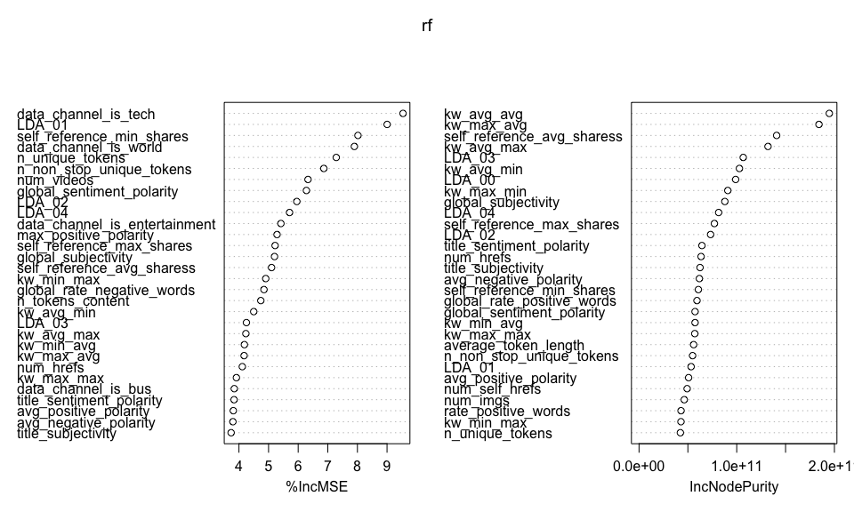

Project 2
================
Yilin Xie
July 3, 2020

  - [Introduction](#introduction)
      - [Data preprocessing](#data-preprocessing)
      - [Data split](#data-split)
      - [Summarizations](#summarizations)
  - [Ensemble model fit](#ensemble-model-fit)
      - [On train set](#on-train-set)
      - [On test set](#on-test-set)
  - [Linear regression fit](#linear-regression-fit)
      - [On train set](#on-train-set-1)
      - [On test set](#on-test-set-1)
  - [Conclusions](#conclusions)

## Introduction

The perpose of this project is going to analyze an online news
popularity data set
[here](https://archive.ics.uci.edu/ml/datasets/Online+News+Popularity)
and predict **shares** by backward linear regression and random forest.
Firstly I read it into R session and determine which variables that I
would deal with.

``` r
#Load the data
news <- read.csv("/Users/yilinxie/Desktop/ST558/Project/Project2/OnlineNewsPopularity.csv")
head(news)
```

    ##                                                              url timedelta n_tokens_title n_tokens_content
    ## 1   http://mashable.com/2013/01/07/amazon-instant-video-browser/       731             12              219
    ## 2    http://mashable.com/2013/01/07/ap-samsung-sponsored-tweets/       731              9              255
    ## 3 http://mashable.com/2013/01/07/apple-40-billion-app-downloads/       731              9              211
    ## 4       http://mashable.com/2013/01/07/astronaut-notre-dame-bcs/       731              9              531
    ## 5               http://mashable.com/2013/01/07/att-u-verse-apps/       731             13             1072
    ## 6               http://mashable.com/2013/01/07/beewi-smart-toys/       731             10              370
    ##   n_unique_tokens n_non_stop_words n_non_stop_unique_tokens num_hrefs num_self_hrefs num_imgs num_videos
    ## 1       0.6635945                1                0.8153846         4              2        1          0
    ## 2       0.6047431                1                0.7919463         3              1        1          0
    ## 3       0.5751295                1                0.6638655         3              1        1          0
    ## 4       0.5037879                1                0.6656347         9              0        1          0
    ## 5       0.4156456                1                0.5408895        19             19       20          0
    ## 6       0.5598886                1                0.6981982         2              2        0          0
    ##   average_token_length num_keywords data_channel_is_lifestyle data_channel_is_entertainment data_channel_is_bus
    ## 1             4.680365            5                         0                             1                   0
    ## 2             4.913725            4                         0                             0                   1
    ## 3             4.393365            6                         0                             0                   1
    ## 4             4.404896            7                         0                             1                   0
    ## 5             4.682836            7                         0                             0                   0
    ## 6             4.359459            9                         0                             0                   0
    ##   data_channel_is_socmed data_channel_is_tech data_channel_is_world kw_min_min kw_max_min kw_avg_min kw_min_max
    ## 1                      0                    0                     0          0          0          0          0
    ## 2                      0                    0                     0          0          0          0          0
    ## 3                      0                    0                     0          0          0          0          0
    ## 4                      0                    0                     0          0          0          0          0
    ## 5                      0                    1                     0          0          0          0          0
    ## 6                      0                    1                     0          0          0          0          0
    ##   kw_max_max kw_avg_max kw_min_avg kw_max_avg kw_avg_avg self_reference_min_shares self_reference_max_shares
    ## 1          0          0          0          0          0                       496                       496
    ## 2          0          0          0          0          0                         0                         0
    ## 3          0          0          0          0          0                       918                       918
    ## 4          0          0          0          0          0                         0                         0
    ## 5          0          0          0          0          0                       545                     16000
    ## 6          0          0          0          0          0                      8500                      8500
    ##   self_reference_avg_sharess weekday_is_monday weekday_is_tuesday weekday_is_wednesday weekday_is_thursday
    ## 1                    496.000                 1                  0                    0                   0
    ## 2                      0.000                 1                  0                    0                   0
    ## 3                    918.000                 1                  0                    0                   0
    ## 4                      0.000                 1                  0                    0                   0
    ## 5                   3151.158                 1                  0                    0                   0
    ## 6                   8500.000                 1                  0                    0                   0
    ##   weekday_is_friday weekday_is_saturday weekday_is_sunday is_weekend     LDA_00     LDA_01     LDA_02     LDA_03
    ## 1                 0                   0                 0          0 0.50033120 0.37827893 0.04000468 0.04126265
    ## 2                 0                   0                 0          0 0.79975569 0.05004668 0.05009625 0.05010067
    ## 3                 0                   0                 0          0 0.21779229 0.03333446 0.03335142 0.03333354
    ## 4                 0                   0                 0          0 0.02857322 0.41929964 0.49465083 0.02890472
    ## 5                 0                   0                 0          0 0.02863281 0.02879355 0.02857518 0.02857168
    ## 6                 0                   0                 0          0 0.02224528 0.30671758 0.02223128 0.02222429
    ##       LDA_04 global_subjectivity global_sentiment_polarity global_rate_positive_words global_rate_negative_words
    ## 1 0.04012254           0.5216171                0.09256198                 0.04566210                0.013698630
    ## 2 0.05000071           0.3412458                0.14894781                 0.04313725                0.015686275
    ## 3 0.68218829           0.7022222                0.32333333                 0.05687204                0.009478673
    ## 4 0.02857160           0.4298497                0.10070467                 0.04143126                0.020715631
    ## 5 0.88542678           0.5135021                0.28100348                 0.07462687                0.012126866
    ## 6 0.62658158           0.4374086                0.07118419                 0.02972973                0.027027027
    ##   rate_positive_words rate_negative_words avg_positive_polarity min_positive_polarity max_positive_polarity
    ## 1           0.7692308           0.2307692             0.3786364            0.10000000                   0.7
    ## 2           0.7333333           0.2666667             0.2869146            0.03333333                   0.7
    ## 3           0.8571429           0.1428571             0.4958333            0.10000000                   1.0
    ## 4           0.6666667           0.3333333             0.3859652            0.13636364                   0.8
    ## 5           0.8602151           0.1397849             0.4111274            0.03333333                   1.0
    ## 6           0.5238095           0.4761905             0.3506100            0.13636364                   0.6
    ##   avg_negative_polarity min_negative_polarity max_negative_polarity title_subjectivity title_sentiment_polarity
    ## 1            -0.3500000                -0.600            -0.2000000          0.5000000               -0.1875000
    ## 2            -0.1187500                -0.125            -0.1000000          0.0000000                0.0000000
    ## 3            -0.4666667                -0.800            -0.1333333          0.0000000                0.0000000
    ## 4            -0.3696970                -0.600            -0.1666667          0.0000000                0.0000000
    ## 5            -0.2201923                -0.500            -0.0500000          0.4545455                0.1363636
    ## 6            -0.1950000                -0.400            -0.1000000          0.6428571                0.2142857
    ##   abs_title_subjectivity abs_title_sentiment_polarity shares
    ## 1             0.00000000                    0.1875000    593
    ## 2             0.50000000                    0.0000000    711
    ## 3             0.50000000                    0.0000000   1500
    ## 4             0.50000000                    0.0000000   1200
    ## 5             0.04545455                    0.1363636    505
    ## 6             0.14285714                    0.2142857    855

``` r
#detect NA value
sum(is.na(news$shares) )
```

    ## [1] 0

As shown above, it is a huge data set with 39644 rows and 61 colomns. It
contains factor variables, numeric variables and dummy variables. The
task is to predict the 61st variable **shares**. Then I’m going to
preprocess the data to get it in the form I need.

### Data preprocessing

``` r
library(tidyverse)
#Remove the useless colomns
news1 <- select(news, -url, -timedelta, 
                -weekday_is_monday, -weekday_is_tuesday,
                -weekday_is_wednesday, -weekday_is_thursday, 
                -weekday_is_friday, -weekday_is_saturday, -weekday_is_sunday, 
                -is_weekend, params$weekday)
r = nrow(news1)
c = ncol(news1)
r
```

    ## [1] 39644

``` r
c
```

    ## [1] 52

Since r\>\>c, this is not a high dimension data set. I would use and to
predict **shares** by the entire variables.

### Data split

``` r
#Set seed to make work reproducible
set.seed(123)
#randomly sample from the data
sub <- sample(1:r, 0.7*r)
#store training dataset (70% of the data) and test dataset (30% of the data)
train <- news1[sub,]
test <- news1[-sub,]
```

### Summarizations

We can look at the distribution of **shares** through the histogram and
see some statistics of the total variables in a summary table.

``` r
#number of rows of training dataset
nrow(train)
```

    ## [1] 27750

``` r
#draw histograms
hist(train$shares)
```

<!-- -->

``` r
hist(log(train$shares))
```

<!-- -->

``` r
#summary the training dataset
t(summary(train))
```

    ##                                                                                                          
    ## n_tokens_title                Min.   : 3.00      1st Qu.: 9.00      Median :10.00      Mean   :10.41     
    ## n_tokens_content              Min.   :   0.0     1st Qu.: 246.0     Median : 409.0     Mean   : 546.6    
    ## n_unique_tokens               Min.   :  0.0000   1st Qu.:  0.4707   Median :  0.5391   Mean   :  0.5554  
    ## n_non_stop_words              Min.   :   0.000   1st Qu.:   1.000   Median :   1.000   Mean   :   1.007  
    ## n_non_stop_unique_tokens      Min.   :  0.0000   1st Qu.:  0.6253   Median :  0.6905   Mean   :  0.6958  
    ##   num_hrefs                   Min.   :  0.00     1st Qu.:  4.00     Median :  8.00     Mean   : 10.96    
    ## num_self_hrefs                Min.   :  0.000    1st Qu.:  1.000    Median :  3.000    Mean   :  3.314   
    ##    num_imgs                   Min.   :  0.000    1st Qu.:  1.000    Median :  1.000    Mean   :  4.533   
    ##   num_videos                  Min.   : 0.000     1st Qu.: 0.000     Median : 0.000     Mean   : 1.248    
    ## average_token_length          Min.   :0.000      1st Qu.:4.477      Median :4.664      Mean   :4.545     
    ##  num_keywords                 Min.   : 1.000     1st Qu.: 6.000     Median : 7.000     Mean   : 7.219    
    ## data_channel_is_lifestyle     Min.   :0.00000    1st Qu.:0.00000    Median :0.00000    Mean   :0.05359   
    ## data_channel_is_entertainment Min.   :0.0000     1st Qu.:0.0000     Median :0.0000     Mean   :0.1767    
    ## data_channel_is_bus           Min.   :0.0000     1st Qu.:0.0000     Median :0.0000     Mean   :0.1595    
    ## data_channel_is_socmed        Min.   :0.00000    1st Qu.:0.00000    Median :0.00000    Mean   :0.05888   
    ## data_channel_is_tech          Min.   :0.0000     1st Qu.:0.0000     Median :0.0000     Mean   :0.1843    
    ## data_channel_is_world         Min.   :0.0000     1st Qu.:0.0000     Median :0.0000     Mean   :0.2134    
    ##   kw_min_min                  Min.   : -1.00     1st Qu.: -1.00     Median : -1.00     Mean   : 26.16    
    ##   kw_max_min                  Min.   :     0     1st Qu.:   444     Median :   659     Mean   :  1154    
    ##   kw_avg_min                  Min.   :   -1.0    1st Qu.:  141.6    Median :  235.2    Mean   :  312.5   
    ##   kw_min_max                  Min.   :     0     1st Qu.:     0     Median :  1400     Mean   : 13874    
    ##   kw_max_max                  Min.   :     0     1st Qu.:843300     Median :843300     Mean   :751872    
    ##   kw_avg_max                  Min.   :     0     1st Qu.:173184     Median :244999     Mean   :259451    
    ##   kw_min_avg                  Min.   :  -1       1st Qu.:   0       Median :1028       Mean   :1119      
    ##   kw_max_avg                  Min.   :     0     1st Qu.:  3564     Median :  4358     Mean   :  5653    
    ##   kw_avg_avg                  Min.   :    0      1st Qu.: 2383      Median : 2876      Mean   : 3134     
    ## self_reference_min_shares     Min.   :     0.0   1st Qu.:   640.2   Median :  1200.0   Mean   :  3972.7  
    ## self_reference_max_shares     Min.   :     0     1st Qu.:  1000     Median :  2800     Mean   : 10287    
    ## self_reference_avg_sharess    Min.   :     0.0   1st Qu.:   975.4   Median :  2200.0   Mean   :  6350.6  
    ##     LDA_00                    Min.   :0.00000    1st Qu.:0.02505    Median :0.03339    Mean   :0.18615   
    ##     LDA_01                    Min.   :0.00000    1st Qu.:0.02501    Median :0.03334    Mean   :0.14033   
    ##     LDA_02                    Min.   :0.00000    1st Qu.:0.02857    Median :0.04000    Mean   :0.21606   
    ##     LDA_03                    Min.   :0.00000    1st Qu.:0.02857    Median :0.04000    Mean   :0.22337   
    ##     LDA_04                    Min.   :0.00000    1st Qu.:0.02857    Median :0.04072    Mean   :0.23405   
    ## global_subjectivity           Min.   :0.0000     1st Qu.:0.3959     Median :0.4533     Mean   :0.4430    
    ## global_sentiment_polarity     Min.   :-0.39375   1st Qu.: 0.05761   Median : 0.11851   Mean   : 0.11894  
    ## global_rate_positive_words    Min.   :0.00000    1st Qu.:0.02830    Median :0.03904    Mean   :0.03957   
    ## global_rate_negative_words    Min.   :0.000000   1st Qu.:0.009615   Median :0.015385   Mean   :0.016668  
    ## rate_positive_words           Min.   :0.0000     1st Qu.:0.6000     Median :0.7097     Mean   :0.6806    
    ## rate_negative_words           Min.   :0.0000     1st Qu.:0.1860     Median :0.2800     Mean   :0.2884    
    ## avg_positive_polarity         Min.   :0.0000     1st Qu.:0.3063     Median :0.3590     Mean   :0.3536    
    ## min_positive_polarity         Min.   :0.00000    1st Qu.:0.05000    Median :0.10000    Mean   :0.09534   
    ## max_positive_polarity         Min.   :0.0000     1st Qu.:0.6000     Median :0.8000     Mean   :0.7559    
    ## avg_negative_polarity         Min.   :-1.0000    1st Qu.:-0.3280    Median :-0.2528    Mean   :-0.2594   
    ## min_negative_polarity         Min.   :-1.0000    1st Qu.:-0.7000    Median :-0.5000    Mean   :-0.5212   
    ## max_negative_polarity         Min.   :-1.0000    1st Qu.:-0.1250    Median :-0.1000    Mean   :-0.1076   
    ## title_subjectivity            Min.   :0.0000     1st Qu.:0.0000     Median :0.1500     Mean   :0.2843    
    ## title_sentiment_polarity      Min.   :-1.00000   1st Qu.: 0.00000   Median : 0.00000   Mean   : 0.07096  
    ## abs_title_subjectivity        Min.   :0.0000     1st Qu.:0.1667     Median :0.5000     Mean   :0.3414    
    ## abs_title_sentiment_polarity  Min.   :0.000000   1st Qu.:0.000000   Median :0.005682   Mean   :0.157838  
    ##     shares                    Min.   :     1     1st Qu.:   943     Median :  1400     Mean   :  3356    
    ## weekday_is_tuesday            Min.   :0.0000     1st Qu.:0.0000     Median :0.0000     Mean   :0.1873    
    ##                                                                    
    ## n_tokens_title                3rd Qu.:12.00      Max.   :23.00     
    ## n_tokens_content              3rd Qu.: 716.0     Max.   :8474.0    
    ## n_unique_tokens               3rd Qu.:  0.6088   Max.   :701.0000  
    ## n_non_stop_words              3rd Qu.:   1.000   Max.   :1042.000  
    ## n_non_stop_unique_tokens      3rd Qu.:  0.7551   Max.   :650.0000  
    ##   num_hrefs                   3rd Qu.: 14.00     Max.   :304.00    
    ## num_self_hrefs                3rd Qu.:  4.000    Max.   :116.000   
    ##    num_imgs                   3rd Qu.:  4.000    Max.   :111.000   
    ##   num_videos                  3rd Qu.: 1.000     Max.   :74.000    
    ## average_token_length          3rd Qu.:4.857      Max.   :8.042     
    ##  num_keywords                 3rd Qu.: 9.000     Max.   :10.000    
    ## data_channel_is_lifestyle     3rd Qu.:0.00000    Max.   :1.00000   
    ## data_channel_is_entertainment 3rd Qu.:0.0000     Max.   :1.0000    
    ## data_channel_is_bus           3rd Qu.:0.0000     Max.   :1.0000    
    ## data_channel_is_socmed        3rd Qu.:0.00000    Max.   :1.00000   
    ## data_channel_is_tech          3rd Qu.:0.0000     Max.   :1.0000    
    ## data_channel_is_world         3rd Qu.:0.0000     Max.   :1.0000    
    ##   kw_min_min                  3rd Qu.:  4.00     Max.   :377.00    
    ##   kw_max_min                  3rd Qu.:  1000     Max.   :298400    
    ##   kw_avg_min                  3rd Qu.:  356.8    Max.   :42827.9   
    ##   kw_min_max                  3rd Qu.:  7900     Max.   :843300    
    ##   kw_max_max                  3rd Qu.:843300     Max.   :843300    
    ##   kw_avg_max                  3rd Qu.:330479     Max.   :843300    
    ##   kw_min_avg                  3rd Qu.:2063       Max.   :3613      
    ##   kw_max_avg                  3rd Qu.:  6015     Max.   :298400    
    ##   kw_avg_avg                  3rd Qu.: 3598      Max.   :43568     
    ## self_reference_min_shares     3rd Qu.:  2600.0   Max.   :843300.0  
    ## self_reference_max_shares     3rd Qu.:  7900     Max.   :843300    
    ## self_reference_avg_sharess    3rd Qu.:  5100.0   Max.   :843300.0  
    ##     LDA_00                    3rd Qu.:0.24492    Max.   :0.92699   
    ##     LDA_01                    3rd Qu.:0.15002    Max.   :0.91998   
    ##     LDA_02                    3rd Qu.:0.33499    Max.   :0.92000   
    ##     LDA_03                    3rd Qu.:0.37378    Max.   :0.92653   
    ##     LDA_04                    3rd Qu.:0.40010    Max.   :0.92708   
    ## global_subjectivity           3rd Qu.:0.5082     Max.   :1.0000    
    ## global_sentiment_polarity     3rd Qu.: 0.17734   Max.   : 0.72784  
    ## global_rate_positive_words    3rd Qu.:0.05028    Max.   :0.15549   
    ## global_rate_negative_words    3rd Qu.:0.021779   Max.   :0.184932  
    ## rate_positive_words           3rd Qu.:0.8000     Max.   :1.0000    
    ## rate_negative_words           3rd Qu.:0.3846     Max.   :1.0000    
    ## avg_positive_polarity         3rd Qu.:0.4117     Max.   :1.0000    
    ## min_positive_polarity         3rd Qu.:0.10000    Max.   :1.00000   
    ## max_positive_polarity         3rd Qu.:1.0000     Max.   :1.0000    
    ## avg_negative_polarity         3rd Qu.:-0.1863    Max.   : 0.0000   
    ## min_negative_polarity         3rd Qu.:-0.3000    Max.   : 0.0000   
    ## max_negative_polarity         3rd Qu.:-0.0500    Max.   : 0.0000   
    ## title_subjectivity            3rd Qu.:0.5000     Max.   :1.0000    
    ## title_sentiment_polarity      3rd Qu.: 0.15000   Max.   : 1.00000  
    ## abs_title_subjectivity        3rd Qu.:0.5000     Max.   :0.5000    
    ## abs_title_sentiment_polarity  3rd Qu.:0.250000   Max.   :1.000000  
    ##     shares                    3rd Qu.:  2800     Max.   :843300    
    ## weekday_is_tuesday            3rd Qu.:0.0000     Max.   :1.0000

## Ensemble model fit

A random forest is a forest constructed in a random way, and the forest
is composed of many unrelated decision trees. Therefore, in theory, the
performance of random forest is generally better than that of a single
decision tree, because the results of random forest are determined by
voting on the results of multiple decision trees. But here, I’m using a
random forest for regression.

### On train set

``` r
#load package
library(randomForest)
#Get random forest model fit on training dataset
rf <- randomForest(shares ~ ., data = train, importance=TRUE)
rf
```

    ## 
    ## Call:
    ##  randomForest(formula = shares ~ ., data = train, importance = TRUE) 
    ##                Type of random forest: regression
    ##                      Number of trees: 500
    ## No. of variables tried at each split: 17
    ## 
    ##           Mean of squared residuals: 117342382
    ##                     % Var explained: -0.5

``` r
#variable importance measures
importance(rf)
```

    ##                                  %IncMSE IncNodePurity
    ## n_tokens_title                -0.2479843   37915947192
    ## n_tokens_content               4.7382524   37412807470
    ## n_unique_tokens                7.2853766   42311741103
    ## n_non_stop_words               3.2409864   37923841870
    ## n_non_stop_unique_tokens       6.8656113   54825306981
    ## num_hrefs                      4.1135361   63510666153
    ## num_self_hrefs                 3.1749672   49216149095
    ## num_imgs                       2.2765801   46285166885
    ## num_videos                     6.3316179   40268634032
    ## average_token_length           3.4044994   55866640685
    ## num_keywords                   3.0380575   15979075603
    ## data_channel_is_lifestyle      2.2192243    4352591450
    ## data_channel_is_entertainment  5.4164212    4173547695
    ## data_channel_is_bus            3.8422105   22816381111
    ## data_channel_is_socmed         3.4398771    2465566135
    ## data_channel_is_tech           9.5405902    1715443259
    ## data_channel_is_world          7.8972386    3146823707
    ## kw_min_min                     2.0762109   21661935884
    ## kw_max_min                     3.2161132   90857925659
    ## kw_avg_min                     4.4990703  102745647393
    ## kw_min_max                     4.9047293   42913726472
    ## kw_max_max                     3.9140745   57059562284
    ## kw_avg_max                     4.2341100  132011003269
    ## kw_min_avg                     4.1839315   57323345236
    ## kw_max_avg                     4.1738388  184188161939
    ## kw_avg_avg                     3.0584241  194767838772
    ## self_reference_min_shares      8.0182723   60717391012
    ## self_reference_max_shares      5.2207680   77142574223
    ## self_reference_avg_sharess     5.1010296  140853297974
    ## LDA_00                         3.6902074   98898908923
    ## LDA_01                         9.0034638   53282877459
    ## LDA_02                         5.9541564   73239188753
    ## LDA_03                         4.2521771  106644881997
    ## LDA_04                         5.7082479   81492485944
    ## global_subjectivity            5.2011657   87826050350
    ## global_sentiment_polarity      6.2781678   57332142185
    ## global_rate_positive_words     1.5165444   59317955983
    ## global_rate_negative_words     4.8444526   40523750976
    ## rate_positive_words            2.3404264   42979223315
    ## rate_negative_words            2.2081101   41557330065
    ## avg_positive_polarity          3.8096780   50721613627
    ## min_positive_polarity          3.5490261   19991548357
    ## max_positive_polarity          5.2858800   11505628403
    ## avg_negative_polarity          3.7958339   61755742167
    ## min_negative_polarity          2.7422260   28673661421
    ## max_negative_polarity          2.6205432   28459604216
    ## title_subjectivity             3.7356961   62437468305
    ## title_sentiment_polarity       3.8359030   64384531938
    ## abs_title_subjectivity         1.8700338   15990955789
    ## abs_title_sentiment_polarity   3.1983783   35320883557
    ## weekday_is_tuesday             0.2165802    4695116749

``` r
#draw dotplot of variable importance as measured by Random Forest
varImpPlot(rf)
```

<!-- -->

Calculate the predicted mean square error on the train set:

``` r
train.pred <- predict(rf, train)
mean((train.pred - train$shares)^2)
```

    ## [1] 25796526

### On test set

``` r
rf.test <- predict(rf, newdata = test)
mean((test$shares-rf.test)^2)
```

    ## [1] 177044761

## Linear regression fit

I choose stepwise regression to fit this model, more specificly, the
backward way. This data set contains too many variables. And since I’m
not an expert on journalism, I can’t tell which factors should have a
real effect on the predicted variables. If I manually removed the
variables by their significance in the model and compared the
differences between the models, this would be a lot of work. So I want
to use a backward regression model based on the AIC criteria to
automatically determine which variables should be included or removed
from the model.

### On train set

``` r
#fit model
lm.step <- step(lm(shares ~ .,data = train))
```

    ## Start:  AIC=514897.2
    ## shares ~ n_tokens_title + n_tokens_content + n_unique_tokens + 
    ##     n_non_stop_words + n_non_stop_unique_tokens + num_hrefs + 
    ##     num_self_hrefs + num_imgs + num_videos + average_token_length + 
    ##     num_keywords + data_channel_is_lifestyle + data_channel_is_entertainment + 
    ##     data_channel_is_bus + data_channel_is_socmed + data_channel_is_tech + 
    ##     data_channel_is_world + kw_min_min + kw_max_min + kw_avg_min + 
    ##     kw_min_max + kw_max_max + kw_avg_max + kw_min_avg + kw_max_avg + 
    ##     kw_avg_avg + self_reference_min_shares + self_reference_max_shares + 
    ##     self_reference_avg_sharess + LDA_00 + LDA_01 + LDA_02 + LDA_03 + 
    ##     LDA_04 + global_subjectivity + global_sentiment_polarity + 
    ##     global_rate_positive_words + global_rate_negative_words + 
    ##     rate_positive_words + rate_negative_words + avg_positive_polarity + 
    ##     min_positive_polarity + max_positive_polarity + avg_negative_polarity + 
    ##     min_negative_polarity + max_negative_polarity + title_subjectivity + 
    ##     title_sentiment_polarity + abs_title_subjectivity + abs_title_sentiment_polarity + 
    ##     weekday_is_tuesday
    ## 
    ##                                 Df  Sum of Sq        RSS    AIC
    ## - global_sentiment_polarity      1 2.5548e+05 3.1616e+12 514895
    ## - title_subjectivity             1 3.9376e+05 3.1616e+12 514895
    ## - n_unique_tokens                1 1.5625e+06 3.1616e+12 514895
    ## - global_rate_negative_words     1 2.3674e+06 3.1616e+12 514895
    ## - LDA_00                         1 4.7538e+06 3.1616e+12 514895
    ## - LDA_04                         1 4.7586e+06 3.1616e+12 514895
    ## - LDA_03                         1 4.7606e+06 3.1616e+12 514895
    ## - LDA_02                         1 4.7650e+06 3.1616e+12 514895
    ## - LDA_01                         1 4.7658e+06 3.1616e+12 514895
    ## - avg_negative_polarity          1 6.5056e+06 3.1616e+12 514895
    ## - num_keywords                   1 6.7844e+06 3.1616e+12 514895
    ## - rate_positive_words            1 7.6506e+06 3.1616e+12 514895
    ## - max_positive_polarity          1 8.1383e+06 3.1616e+12 514895
    ## - rate_negative_words            1 8.4783e+06 3.1616e+12 514895
    ## - n_non_stop_words               1 1.1727e+07 3.1616e+12 514895
    ## - n_tokens_content               1 1.3867e+07 3.1616e+12 514895
    ## - avg_positive_polarity          1 2.2671e+07 3.1616e+12 514895
    ## - min_negative_polarity          1 2.4353e+07 3.1616e+12 514895
    ## - title_sentiment_polarity       1 3.7266e+07 3.1616e+12 514895
    ## - self_reference_avg_sharess     1 4.5446e+07 3.1616e+12 514896
    ## - max_negative_polarity          1 4.7051e+07 3.1616e+12 514896
    ## - global_rate_positive_words     1 5.3357e+07 3.1616e+12 514896
    ## - n_non_stop_unique_tokens       1 7.5360e+07 3.1617e+12 514896
    ## - kw_min_min                     1 8.8157e+07 3.1617e+12 514896
    ## - kw_min_max                     1 9.1331e+07 3.1617e+12 514896
    ## - kw_max_max                     1 1.0520e+08 3.1617e+12 514896
    ## - average_token_length           1 1.6338e+08 3.1618e+12 514897
    ## - num_imgs                       1 1.7515e+08 3.1618e+12 514897
    ## <none>                                        3.1616e+12 514897
    ## - self_reference_max_shares      1 2.3470e+08 3.1618e+12 514897
    ## - min_positive_polarity          1 2.4624e+08 3.1618e+12 514897
    ## - num_videos                     1 2.4924e+08 3.1618e+12 514897
    ## - kw_avg_max                     1 3.0041e+08 3.1619e+12 514898
    ## - kw_max_min                     1 3.2229e+08 3.1619e+12 514898
    ## - self_reference_min_shares      1 3.2708e+08 3.1619e+12 514898
    ## - kw_avg_min                     1 3.8129e+08 3.1620e+12 514899
    ## - weekday_is_tuesday             1 4.2304e+08 3.1620e+12 514899
    ## - abs_title_sentiment_polarity   1 4.9770e+08 3.1621e+12 514900
    ## - abs_title_subjectivity         1 7.5487e+08 3.1623e+12 514902
    ## - data_channel_is_world          1 7.7984e+08 3.1624e+12 514902
    ## - n_tokens_title                 1 8.7542e+08 3.1625e+12 514903
    ## - num_self_hrefs                 1 8.9522e+08 3.1625e+12 514903
    ## - global_subjectivity            1 9.7429e+08 3.1626e+12 514904
    ## - data_channel_is_socmed         1 1.0007e+09 3.1626e+12 514904
    ## - data_channel_is_tech           1 1.0100e+09 3.1626e+12 514904
    ## - data_channel_is_lifestyle      1 1.4777e+09 3.1631e+12 514908
    ## - kw_min_avg                     1 1.8877e+09 3.1635e+12 514912
    ## - data_channel_is_bus            1 1.8880e+09 3.1635e+12 514912
    ## - num_hrefs                      1 2.9775e+09 3.1646e+12 514921
    ## - data_channel_is_entertainment  1 3.3042e+09 3.1649e+12 514924
    ## - kw_max_avg                     1 5.6602e+09 3.1673e+12 514945
    ## - kw_avg_avg                     1 1.1467e+10 3.1731e+12 514996
    ## 
    ## Step:  AIC=514895.2
    ## shares ~ n_tokens_title + n_tokens_content + n_unique_tokens + 
    ##     n_non_stop_words + n_non_stop_unique_tokens + num_hrefs + 
    ##     num_self_hrefs + num_imgs + num_videos + average_token_length + 
    ##     num_keywords + data_channel_is_lifestyle + data_channel_is_entertainment + 
    ##     data_channel_is_bus + data_channel_is_socmed + data_channel_is_tech + 
    ##     data_channel_is_world + kw_min_min + kw_max_min + kw_avg_min + 
    ##     kw_min_max + kw_max_max + kw_avg_max + kw_min_avg + kw_max_avg + 
    ##     kw_avg_avg + self_reference_min_shares + self_reference_max_shares + 
    ##     self_reference_avg_sharess + LDA_00 + LDA_01 + LDA_02 + LDA_03 + 
    ##     LDA_04 + global_subjectivity + global_rate_positive_words + 
    ##     global_rate_negative_words + rate_positive_words + rate_negative_words + 
    ##     avg_positive_polarity + min_positive_polarity + max_positive_polarity + 
    ##     avg_negative_polarity + min_negative_polarity + max_negative_polarity + 
    ##     title_subjectivity + title_sentiment_polarity + abs_title_subjectivity + 
    ##     abs_title_sentiment_polarity + weekday_is_tuesday
    ## 
    ##                                 Df  Sum of Sq        RSS    AIC
    ## - title_subjectivity             1 4.0847e+05 3.1616e+12 514893
    ## - n_unique_tokens                1 1.5649e+06 3.1616e+12 514893
    ## - global_rate_negative_words     1 3.2207e+06 3.1616e+12 514893
    ## - LDA_00                         1 4.7632e+06 3.1616e+12 514893
    ## - LDA_04                         1 4.7680e+06 3.1616e+12 514893
    ## - LDA_03                         1 4.7700e+06 3.1616e+12 514893
    ## - LDA_02                         1 4.7744e+06 3.1616e+12 514893
    ## - LDA_01                         1 4.7753e+06 3.1616e+12 514893
    ## - num_keywords                   1 6.7667e+06 3.1616e+12 514893
    ## - rate_positive_words            1 7.6604e+06 3.1616e+12 514893
    ## - max_positive_polarity          1 8.1746e+06 3.1616e+12 514893
    ## - avg_negative_polarity          1 8.3107e+06 3.1616e+12 514893
    ## - rate_negative_words            1 8.3585e+06 3.1616e+12 514893
    ## - n_non_stop_words               1 1.1728e+07 3.1616e+12 514893
    ## - n_tokens_content               1 1.3744e+07 3.1616e+12 514893
    ## - min_negative_polarity          1 2.4490e+07 3.1616e+12 514893
    ## - avg_positive_polarity          1 3.0715e+07 3.1616e+12 514893
    ## - title_sentiment_polarity       1 3.8059e+07 3.1616e+12 514894
    ## - self_reference_avg_sharess     1 4.5427e+07 3.1616e+12 514894
    ## - max_negative_polarity          1 4.9510e+07 3.1616e+12 514894
    ## - global_rate_positive_words     1 6.0745e+07 3.1617e+12 514894
    ## - n_non_stop_unique_tokens       1 7.5214e+07 3.1617e+12 514894
    ## - kw_min_min                     1 8.8108e+07 3.1617e+12 514894
    ## - kw_min_max                     1 9.1451e+07 3.1617e+12 514894
    ## - kw_max_max                     1 1.0525e+08 3.1617e+12 514894
    ## - average_token_length           1 1.6362e+08 3.1618e+12 514895
    ## - num_imgs                       1 1.7524e+08 3.1618e+12 514895
    ## <none>                                        3.1616e+12 514895
    ## - self_reference_max_shares      1 2.3461e+08 3.1618e+12 514895
    ## - num_videos                     1 2.4909e+08 3.1618e+12 514895
    ## - min_positive_polarity          1 2.5255e+08 3.1618e+12 514895
    ## - kw_avg_max                     1 3.0031e+08 3.1619e+12 514896
    ## - kw_max_min                     1 3.2216e+08 3.1619e+12 514896
    ## - self_reference_min_shares      1 3.2708e+08 3.1619e+12 514896
    ## - kw_avg_min                     1 3.8114e+08 3.1620e+12 514897
    ## - weekday_is_tuesday             1 4.2314e+08 3.1620e+12 514897
    ## - abs_title_sentiment_polarity   1 4.9774e+08 3.1621e+12 514898
    ## - abs_title_subjectivity         1 7.5589e+08 3.1623e+12 514900
    ## - data_channel_is_world          1 7.7959e+08 3.1624e+12 514900
    ## - n_tokens_title                 1 8.7547e+08 3.1625e+12 514901
    ## - num_self_hrefs                 1 8.9525e+08 3.1625e+12 514901
    ## - data_channel_is_socmed         1 1.0006e+09 3.1626e+12 514902
    ## - data_channel_is_tech           1 1.0098e+09 3.1626e+12 514902
    ## - global_subjectivity            1 1.0163e+09 3.1626e+12 514902
    ## - data_channel_is_lifestyle      1 1.4776e+09 3.1631e+12 514906
    ## - kw_min_avg                     1 1.8874e+09 3.1635e+12 514910
    ## - data_channel_is_bus            1 1.8880e+09 3.1635e+12 514910
    ## - num_hrefs                      1 2.9861e+09 3.1646e+12 514919
    ## - data_channel_is_entertainment  1 3.3041e+09 3.1649e+12 514922
    ## - kw_max_avg                     1 5.6609e+09 3.1673e+12 514943
    ## - kw_avg_avg                     1 1.1469e+10 3.1731e+12 514994
    ## 
    ## Step:  AIC=514893.2
    ## shares ~ n_tokens_title + n_tokens_content + n_unique_tokens + 
    ##     n_non_stop_words + n_non_stop_unique_tokens + num_hrefs + 
    ##     num_self_hrefs + num_imgs + num_videos + average_token_length + 
    ##     num_keywords + data_channel_is_lifestyle + data_channel_is_entertainment + 
    ##     data_channel_is_bus + data_channel_is_socmed + data_channel_is_tech + 
    ##     data_channel_is_world + kw_min_min + kw_max_min + kw_avg_min + 
    ##     kw_min_max + kw_max_max + kw_avg_max + kw_min_avg + kw_max_avg + 
    ##     kw_avg_avg + self_reference_min_shares + self_reference_max_shares + 
    ##     self_reference_avg_sharess + LDA_00 + LDA_01 + LDA_02 + LDA_03 + 
    ##     LDA_04 + global_subjectivity + global_rate_positive_words + 
    ##     global_rate_negative_words + rate_positive_words + rate_negative_words + 
    ##     avg_positive_polarity + min_positive_polarity + max_positive_polarity + 
    ##     avg_negative_polarity + min_negative_polarity + max_negative_polarity + 
    ##     title_sentiment_polarity + abs_title_subjectivity + abs_title_sentiment_polarity + 
    ##     weekday_is_tuesday
    ## 
    ##                                 Df  Sum of Sq        RSS    AIC
    ## - n_unique_tokens                1 1.5766e+06 3.1616e+12 514891
    ## - global_rate_negative_words     1 3.2319e+06 3.1616e+12 514891
    ## - LDA_00                         1 4.7375e+06 3.1616e+12 514891
    ## - LDA_04                         1 4.7422e+06 3.1616e+12 514891
    ## - LDA_03                         1 4.7442e+06 3.1616e+12 514891
    ## - LDA_02                         1 4.7486e+06 3.1616e+12 514891
    ## - LDA_01                         1 4.7495e+06 3.1616e+12 514891
    ## - num_keywords                   1 6.7376e+06 3.1616e+12 514891
    ## - rate_positive_words            1 7.6516e+06 3.1616e+12 514891
    ## - max_positive_polarity          1 8.1519e+06 3.1616e+12 514891
    ## - avg_negative_polarity          1 8.2946e+06 3.1616e+12 514891
    ## - rate_negative_words            1 8.3410e+06 3.1616e+12 514891
    ## - n_non_stop_words               1 1.1682e+07 3.1616e+12 514891
    ## - n_tokens_content               1 1.3670e+07 3.1616e+12 514891
    ## - min_negative_polarity          1 2.4545e+07 3.1616e+12 514891
    ## - avg_positive_polarity          1 3.0463e+07 3.1616e+12 514891
    ## - title_sentiment_polarity       1 3.9518e+07 3.1616e+12 514892
    ## - self_reference_avg_sharess     1 4.5445e+07 3.1616e+12 514892
    ## - max_negative_polarity          1 4.9510e+07 3.1616e+12 514892
    ## - global_rate_positive_words     1 6.0967e+07 3.1617e+12 514892
    ## - n_non_stop_unique_tokens       1 7.5236e+07 3.1617e+12 514892
    ## - kw_min_min                     1 8.8199e+07 3.1617e+12 514892
    ## - kw_min_max                     1 9.1502e+07 3.1617e+12 514892
    ## - kw_max_max                     1 1.0511e+08 3.1617e+12 514892
    ## - average_token_length           1 1.6365e+08 3.1618e+12 514893
    ## - num_imgs                       1 1.7510e+08 3.1618e+12 514893
    ## <none>                                        3.1616e+12 514893
    ## - self_reference_max_shares      1 2.3461e+08 3.1618e+12 514893
    ## - num_videos                     1 2.4902e+08 3.1618e+12 514893
    ## - min_positive_polarity          1 2.5289e+08 3.1618e+12 514893
    ## - kw_avg_max                     1 3.0043e+08 3.1619e+12 514894
    ## - kw_max_min                     1 3.2231e+08 3.1619e+12 514894
    ## - self_reference_min_shares      1 3.2720e+08 3.1619e+12 514894
    ## - kw_avg_min                     1 3.8140e+08 3.1620e+12 514895
    ## - weekday_is_tuesday             1 4.2333e+08 3.1620e+12 514895
    ## - data_channel_is_world          1 7.7956e+08 3.1624e+12 514898
    ## - abs_title_sentiment_polarity   1 8.1485e+08 3.1624e+12 514898
    ## - abs_title_subjectivity         1 8.5006e+08 3.1624e+12 514899
    ## - n_tokens_title                 1 8.7506e+08 3.1625e+12 514899
    ## - num_self_hrefs                 1 8.9538e+08 3.1625e+12 514899
    ## - data_channel_is_socmed         1 1.0003e+09 3.1626e+12 514900
    ## - data_channel_is_tech           1 1.0099e+09 3.1626e+12 514900
    ## - global_subjectivity            1 1.0247e+09 3.1626e+12 514900
    ## - data_channel_is_lifestyle      1 1.4775e+09 3.1631e+12 514904
    ## - kw_min_avg                     1 1.8870e+09 3.1635e+12 514908
    ## - data_channel_is_bus            1 1.8877e+09 3.1635e+12 514908
    ## - num_hrefs                      1 2.9859e+09 3.1646e+12 514917
    ## - data_channel_is_entertainment  1 3.3038e+09 3.1649e+12 514920
    ## - kw_max_avg                     1 5.6606e+09 3.1673e+12 514941
    ## - kw_avg_avg                     1 1.1469e+10 3.1731e+12 514992
    ## 
    ## Step:  AIC=514891.2
    ## shares ~ n_tokens_title + n_tokens_content + n_non_stop_words + 
    ##     n_non_stop_unique_tokens + num_hrefs + num_self_hrefs + num_imgs + 
    ##     num_videos + average_token_length + num_keywords + data_channel_is_lifestyle + 
    ##     data_channel_is_entertainment + data_channel_is_bus + data_channel_is_socmed + 
    ##     data_channel_is_tech + data_channel_is_world + kw_min_min + 
    ##     kw_max_min + kw_avg_min + kw_min_max + kw_max_max + kw_avg_max + 
    ##     kw_min_avg + kw_max_avg + kw_avg_avg + self_reference_min_shares + 
    ##     self_reference_max_shares + self_reference_avg_sharess + 
    ##     LDA_00 + LDA_01 + LDA_02 + LDA_03 + LDA_04 + global_subjectivity + 
    ##     global_rate_positive_words + global_rate_negative_words + 
    ##     rate_positive_words + rate_negative_words + avg_positive_polarity + 
    ##     min_positive_polarity + max_positive_polarity + avg_negative_polarity + 
    ##     min_negative_polarity + max_negative_polarity + title_sentiment_polarity + 
    ##     abs_title_subjectivity + abs_title_sentiment_polarity + weekday_is_tuesday
    ## 
    ##                                 Df  Sum of Sq        RSS    AIC
    ## - global_rate_negative_words     1 3.3644e+06 3.1616e+12 514889
    ## - LDA_00                         1 4.3288e+06 3.1616e+12 514889
    ## - LDA_04                         1 4.3333e+06 3.1616e+12 514889
    ## - LDA_03                         1 4.3353e+06 3.1616e+12 514889
    ## - LDA_02                         1 4.3395e+06 3.1616e+12 514889
    ## - LDA_01                         1 4.3403e+06 3.1616e+12 514889
    ## - num_keywords                   1 6.8223e+06 3.1616e+12 514889
    ## - rate_positive_words            1 7.7816e+06 3.1616e+12 514889
    ## - avg_negative_polarity          1 8.2936e+06 3.1616e+12 514889
    ## - rate_negative_words            1 8.4778e+06 3.1616e+12 514889
    ## - max_positive_polarity          1 9.4526e+06 3.1616e+12 514889
    ## - n_non_stop_words               1 1.1591e+07 3.1616e+12 514889
    ## - n_tokens_content               1 2.3013e+07 3.1616e+12 514889
    ## - min_negative_polarity          1 2.6416e+07 3.1616e+12 514889
    ## - avg_positive_polarity          1 3.0565e+07 3.1616e+12 514889
    ## - title_sentiment_polarity       1 3.9833e+07 3.1616e+12 514890
    ## - self_reference_avg_sharess     1 4.5699e+07 3.1616e+12 514890
    ## - max_negative_polarity          1 4.8157e+07 3.1616e+12 514890
    ## - global_rate_positive_words     1 6.2650e+07 3.1617e+12 514890
    ## - kw_min_min                     1 8.8169e+07 3.1617e+12 514890
    ## - kw_min_max                     1 9.1261e+07 3.1617e+12 514890
    ## - kw_max_max                     1 1.0451e+08 3.1617e+12 514890
    ## - num_imgs                       1 1.7516e+08 3.1618e+12 514891
    ## - average_token_length           1 1.8704e+08 3.1618e+12 514891
    ## <none>                                        3.1616e+12 514891
    ## - n_non_stop_unique_tokens       1 2.3489e+08 3.1618e+12 514891
    ## - self_reference_max_shares      1 2.3528e+08 3.1618e+12 514891
    ## - num_videos                     1 2.4764e+08 3.1618e+12 514891
    ## - min_positive_polarity          1 2.6772e+08 3.1619e+12 514892
    ## - kw_avg_max                     1 3.0216e+08 3.1619e+12 514892
    ## - kw_max_min                     1 3.2224e+08 3.1619e+12 514892
    ## - self_reference_min_shares      1 3.2775e+08 3.1619e+12 514892
    ## - kw_avg_min                     1 3.8116e+08 3.1620e+12 514893
    ## - weekday_is_tuesday             1 4.2376e+08 3.1620e+12 514893
    ## - data_channel_is_world          1 7.7959e+08 3.1624e+12 514896
    ## - abs_title_sentiment_polarity   1 8.1361e+08 3.1624e+12 514896
    ## - abs_title_subjectivity         1 8.5190e+08 3.1624e+12 514897
    ## - n_tokens_title                 1 8.7504e+08 3.1625e+12 514897
    ## - num_self_hrefs                 1 8.9631e+08 3.1625e+12 514897
    ## - data_channel_is_socmed         1 9.9871e+08 3.1626e+12 514898
    ## - data_channel_is_tech           1 1.0092e+09 3.1626e+12 514898
    ## - global_subjectivity            1 1.0238e+09 3.1626e+12 514898
    ## - data_channel_is_lifestyle      1 1.4796e+09 3.1631e+12 514902
    ## - data_channel_is_bus            1 1.8886e+09 3.1635e+12 514906
    ## - kw_min_avg                     1 1.8902e+09 3.1635e+12 514906
    ## - num_hrefs                      1 3.0025e+09 3.1646e+12 514916
    ## - data_channel_is_entertainment  1 3.3067e+09 3.1649e+12 514918
    ## - kw_max_avg                     1 5.6644e+09 3.1673e+12 514939
    ## - kw_avg_avg                     1 1.1472e+10 3.1731e+12 514990
    ## 
    ## Step:  AIC=514889.2
    ## shares ~ n_tokens_title + n_tokens_content + n_non_stop_words + 
    ##     n_non_stop_unique_tokens + num_hrefs + num_self_hrefs + num_imgs + 
    ##     num_videos + average_token_length + num_keywords + data_channel_is_lifestyle + 
    ##     data_channel_is_entertainment + data_channel_is_bus + data_channel_is_socmed + 
    ##     data_channel_is_tech + data_channel_is_world + kw_min_min + 
    ##     kw_max_min + kw_avg_min + kw_min_max + kw_max_max + kw_avg_max + 
    ##     kw_min_avg + kw_max_avg + kw_avg_avg + self_reference_min_shares + 
    ##     self_reference_max_shares + self_reference_avg_sharess + 
    ##     LDA_00 + LDA_01 + LDA_02 + LDA_03 + LDA_04 + global_subjectivity + 
    ##     global_rate_positive_words + rate_positive_words + rate_negative_words + 
    ##     avg_positive_polarity + min_positive_polarity + max_positive_polarity + 
    ##     avg_negative_polarity + min_negative_polarity + max_negative_polarity + 
    ##     title_sentiment_polarity + abs_title_subjectivity + abs_title_sentiment_polarity + 
    ##     weekday_is_tuesday
    ## 
    ##                                 Df  Sum of Sq        RSS    AIC
    ## - LDA_00                         1 4.3575e+06 3.1616e+12 514887
    ## - LDA_04                         1 4.3621e+06 3.1616e+12 514887
    ## - LDA_03                         1 4.3640e+06 3.1616e+12 514887
    ## - LDA_02                         1 4.3682e+06 3.1616e+12 514887
    ## - LDA_01                         1 4.3691e+06 3.1616e+12 514887
    ## - num_keywords                   1 6.9078e+06 3.1616e+12 514887
    ## - rate_negative_words            1 7.3254e+06 3.1616e+12 514887
    ## - avg_negative_polarity          1 8.1775e+06 3.1616e+12 514887
    ## - rate_positive_words            1 8.2371e+06 3.1616e+12 514887
    ## - max_positive_polarity          1 9.0562e+06 3.1616e+12 514887
    ## - n_non_stop_words               1 1.1620e+07 3.1616e+12 514887
    ## - n_tokens_content               1 2.3512e+07 3.1616e+12 514887
    ## - min_negative_polarity          1 2.5949e+07 3.1616e+12 514887
    ## - avg_positive_polarity          1 3.0799e+07 3.1616e+12 514887
    ## - title_sentiment_polarity       1 4.1669e+07 3.1616e+12 514888
    ## - self_reference_avg_sharess     1 4.5820e+07 3.1616e+12 514888
    ## - max_negative_polarity          1 4.9536e+07 3.1616e+12 514888
    ## - kw_min_min                     1 8.7615e+07 3.1617e+12 514888
    ## - kw_min_max                     1 9.1329e+07 3.1617e+12 514888
    ## - kw_max_max                     1 1.0502e+08 3.1617e+12 514888
    ## - global_rate_positive_words     1 1.3909e+08 3.1617e+12 514888
    ## - num_imgs                       1 1.7388e+08 3.1618e+12 514889
    ## - average_token_length           1 1.8533e+08 3.1618e+12 514889
    ## <none>                                        3.1616e+12 514889
    ## - n_non_stop_unique_tokens       1 2.3407e+08 3.1618e+12 514889
    ## - self_reference_max_shares      1 2.3578e+08 3.1618e+12 514889
    ## - num_videos                     1 2.4430e+08 3.1618e+12 514889
    ## - min_positive_polarity          1 2.6503e+08 3.1619e+12 514890
    ## - kw_avg_max                     1 3.0258e+08 3.1619e+12 514890
    ## - kw_max_min                     1 3.2226e+08 3.1619e+12 514890
    ## - self_reference_min_shares      1 3.2761e+08 3.1619e+12 514890
    ## - kw_avg_min                     1 3.8161e+08 3.1620e+12 514891
    ## - weekday_is_tuesday             1 4.2366e+08 3.1620e+12 514891
    ## - data_channel_is_world          1 7.7642e+08 3.1624e+12 514894
    ## - abs_title_sentiment_polarity   1 8.1182e+08 3.1624e+12 514894
    ## - abs_title_subjectivity         1 8.5718e+08 3.1625e+12 514895
    ## - n_tokens_title                 1 8.7720e+08 3.1625e+12 514895
    ## - num_self_hrefs                 1 8.9585e+08 3.1625e+12 514895
    ## - data_channel_is_socmed         1 9.9621e+08 3.1626e+12 514896
    ## - data_channel_is_tech           1 1.0066e+09 3.1626e+12 514896
    ## - global_subjectivity            1 1.0223e+09 3.1626e+12 514896
    ## - data_channel_is_lifestyle      1 1.4767e+09 3.1631e+12 514900
    ## - data_channel_is_bus            1 1.8853e+09 3.1635e+12 514904
    ## - kw_min_avg                     1 1.8900e+09 3.1635e+12 514904
    ## - num_hrefs                      1 3.0307e+09 3.1646e+12 514914
    ## - data_channel_is_entertainment  1 3.3046e+09 3.1649e+12 514916
    ## - kw_max_avg                     1 5.6624e+09 3.1673e+12 514937
    ## - kw_avg_avg                     1 1.1471e+10 3.1731e+12 514988
    ## 
    ## Step:  AIC=514887.2
    ## shares ~ n_tokens_title + n_tokens_content + n_non_stop_words + 
    ##     n_non_stop_unique_tokens + num_hrefs + num_self_hrefs + num_imgs + 
    ##     num_videos + average_token_length + num_keywords + data_channel_is_lifestyle + 
    ##     data_channel_is_entertainment + data_channel_is_bus + data_channel_is_socmed + 
    ##     data_channel_is_tech + data_channel_is_world + kw_min_min + 
    ##     kw_max_min + kw_avg_min + kw_min_max + kw_max_max + kw_avg_max + 
    ##     kw_min_avg + kw_max_avg + kw_avg_avg + self_reference_min_shares + 
    ##     self_reference_max_shares + self_reference_avg_sharess + 
    ##     LDA_01 + LDA_02 + LDA_03 + LDA_04 + global_subjectivity + 
    ##     global_rate_positive_words + rate_positive_words + rate_negative_words + 
    ##     avg_positive_polarity + min_positive_polarity + max_positive_polarity + 
    ##     avg_negative_polarity + min_negative_polarity + max_negative_polarity + 
    ##     title_sentiment_polarity + abs_title_subjectivity + abs_title_sentiment_polarity + 
    ##     weekday_is_tuesday
    ## 
    ##                                 Df  Sum of Sq        RSS    AIC
    ## - num_keywords                   1 6.7744e+06 3.1616e+12 514885
    ## - avg_negative_polarity          1 8.1320e+06 3.1616e+12 514885
    ## - rate_negative_words            1 8.6862e+06 3.1616e+12 514885
    ## - max_positive_polarity          1 8.8737e+06 3.1616e+12 514885
    ## - rate_positive_words            1 1.3346e+07 3.1616e+12 514885
    ## - n_tokens_content               1 2.2705e+07 3.1616e+12 514885
    ## - min_negative_polarity          1 2.5911e+07 3.1616e+12 514885
    ## - avg_positive_polarity          1 3.0448e+07 3.1616e+12 514886
    ## - title_sentiment_polarity       1 4.1559e+07 3.1616e+12 514886
    ## - self_reference_avg_sharess     1 4.6044e+07 3.1616e+12 514886
    ## - max_negative_polarity          1 4.9574e+07 3.1616e+12 514886
    ## - kw_min_min                     1 8.7698e+07 3.1617e+12 514886
    ## - kw_min_max                     1 9.1124e+07 3.1617e+12 514886
    ## - kw_max_max                     1 1.0505e+08 3.1617e+12 514886
    ## - global_rate_positive_words     1 1.3898e+08 3.1617e+12 514886
    ## - num_imgs                       1 1.7439e+08 3.1618e+12 514887
    ## - average_token_length           1 2.0319e+08 3.1618e+12 514887
    ## - LDA_04                         1 2.0516e+08 3.1618e+12 514887
    ## <none>                                        3.1616e+12 514887
    ## - n_non_stop_words               1 2.2886e+08 3.1618e+12 514887
    ## - n_non_stop_unique_tokens       1 2.3180e+08 3.1618e+12 514887
    ## - self_reference_max_shares      1 2.3614e+08 3.1618e+12 514887
    ## - num_videos                     1 2.4413e+08 3.1618e+12 514887
    ## - min_positive_polarity          1 2.6540e+08 3.1619e+12 514888
    ## - kw_avg_max                     1 3.0221e+08 3.1619e+12 514888
    ## - kw_max_min                     1 3.2267e+08 3.1619e+12 514888
    ## - self_reference_min_shares      1 3.2815e+08 3.1619e+12 514888
    ## - LDA_03                         1 3.4214e+08 3.1619e+12 514888
    ## - kw_avg_min                     1 3.8205e+08 3.1620e+12 514889
    ## - weekday_is_tuesday             1 4.2491e+08 3.1620e+12 514889
    ## - data_channel_is_world          1 7.7604e+08 3.1624e+12 514892
    ## - abs_title_sentiment_polarity   1 8.1251e+08 3.1624e+12 514892
    ## - abs_title_subjectivity         1 8.5663e+08 3.1625e+12 514893
    ## - n_tokens_title                 1 8.7709e+08 3.1625e+12 514893
    ## - num_self_hrefs                 1 8.9870e+08 3.1625e+12 514893
    ## - LDA_02                         1 9.3479e+08 3.1625e+12 514893
    ## - LDA_01                         1 9.7037e+08 3.1626e+12 514894
    ## - data_channel_is_socmed         1 9.9962e+08 3.1626e+12 514894
    ## - data_channel_is_tech           1 1.0086e+09 3.1626e+12 514894
    ## - global_subjectivity            1 1.0181e+09 3.1626e+12 514894
    ## - data_channel_is_lifestyle      1 1.4789e+09 3.1631e+12 514898
    ## - data_channel_is_bus            1 1.8887e+09 3.1635e+12 514902
    ## - kw_min_avg                     1 1.8928e+09 3.1635e+12 514902
    ## - num_hrefs                      1 3.0465e+09 3.1646e+12 514912
    ## - data_channel_is_entertainment  1 3.3085e+09 3.1649e+12 514914
    ## - kw_max_avg                     1 5.6659e+09 3.1673e+12 514935
    ## - kw_avg_avg                     1 1.1478e+10 3.1731e+12 514986
    ## 
    ## Step:  AIC=514885.3
    ## shares ~ n_tokens_title + n_tokens_content + n_non_stop_words + 
    ##     n_non_stop_unique_tokens + num_hrefs + num_self_hrefs + num_imgs + 
    ##     num_videos + average_token_length + data_channel_is_lifestyle + 
    ##     data_channel_is_entertainment + data_channel_is_bus + data_channel_is_socmed + 
    ##     data_channel_is_tech + data_channel_is_world + kw_min_min + 
    ##     kw_max_min + kw_avg_min + kw_min_max + kw_max_max + kw_avg_max + 
    ##     kw_min_avg + kw_max_avg + kw_avg_avg + self_reference_min_shares + 
    ##     self_reference_max_shares + self_reference_avg_sharess + 
    ##     LDA_01 + LDA_02 + LDA_03 + LDA_04 + global_subjectivity + 
    ##     global_rate_positive_words + rate_positive_words + rate_negative_words + 
    ##     avg_positive_polarity + min_positive_polarity + max_positive_polarity + 
    ##     avg_negative_polarity + min_negative_polarity + max_negative_polarity + 
    ##     title_sentiment_polarity + abs_title_subjectivity + abs_title_sentiment_polarity + 
    ##     weekday_is_tuesday
    ## 
    ##                                 Df  Sum of Sq        RSS    AIC
    ## - avg_negative_polarity          1 8.1424e+06 3.1616e+12 514883
    ## - max_positive_polarity          1 8.7219e+06 3.1616e+12 514883
    ## - rate_negative_words            1 9.7999e+06 3.1616e+12 514883
    ## - rate_positive_words            1 1.4560e+07 3.1616e+12 514883
    ## - n_tokens_content               1 2.2393e+07 3.1616e+12 514884
    ## - min_negative_polarity          1 2.6022e+07 3.1616e+12 514884
    ## - avg_positive_polarity          1 3.0882e+07 3.1616e+12 514884
    ## - title_sentiment_polarity       1 4.1326e+07 3.1616e+12 514884
    ## - self_reference_avg_sharess     1 4.6618e+07 3.1617e+12 514884
    ## - max_negative_polarity          1 4.9472e+07 3.1617e+12 514884
    ## - kw_min_min                     1 8.7962e+07 3.1617e+12 514884
    ## - kw_min_max                     1 8.9333e+07 3.1617e+12 514884
    ## - kw_max_max                     1 1.1579e+08 3.1617e+12 514884
    ## - global_rate_positive_words     1 1.4135e+08 3.1617e+12 514885
    ## - num_imgs                       1 1.7490e+08 3.1618e+12 514885
    ## - average_token_length           1 2.0554e+08 3.1618e+12 514885
    ## - LDA_04                         1 2.0820e+08 3.1618e+12 514885
    ## <none>                                        3.1616e+12 514885
    ## - n_non_stop_words               1 2.3008e+08 3.1618e+12 514885
    ## - n_non_stop_unique_tokens       1 2.3302e+08 3.1618e+12 514885
    ## - self_reference_max_shares      1 2.3709e+08 3.1618e+12 514885
    ## - num_videos                     1 2.4247e+08 3.1618e+12 514885
    ## - min_positive_polarity          1 2.6478e+08 3.1619e+12 514886
    ## - kw_avg_max                     1 3.1067e+08 3.1619e+12 514886
    ## - kw_max_min                     1 3.1724e+08 3.1619e+12 514886
    ## - self_reference_min_shares      1 3.2990e+08 3.1619e+12 514886
    ## - LDA_03                         1 3.4453e+08 3.1620e+12 514886
    ## - kw_avg_min                     1 3.7572e+08 3.1620e+12 514887
    ## - weekday_is_tuesday             1 4.2437e+08 3.1620e+12 514887
    ## - data_channel_is_world          1 7.7259e+08 3.1624e+12 514890
    ## - abs_title_sentiment_polarity   1 8.1140e+08 3.1624e+12 514890
    ## - abs_title_subjectivity         1 8.5637e+08 3.1625e+12 514891
    ## - n_tokens_title                 1 8.7249e+08 3.1625e+12 514891
    ## - num_self_hrefs                 1 9.1197e+08 3.1625e+12 514891
    ## - LDA_02                         1 9.3338e+08 3.1625e+12 514892
    ## - LDA_01                         1 9.6635e+08 3.1626e+12 514892
    ## - data_channel_is_socmed         1 9.9419e+08 3.1626e+12 514892
    ## - data_channel_is_tech           1 1.0049e+09 3.1626e+12 514892
    ## - global_subjectivity            1 1.0165e+09 3.1626e+12 514892
    ## - data_channel_is_lifestyle      1 1.4762e+09 3.1631e+12 514896
    ## - data_channel_is_bus            1 1.8822e+09 3.1635e+12 514900
    ## - kw_min_avg                     1 1.9372e+09 3.1635e+12 514900
    ## - num_hrefs                      1 3.0402e+09 3.1646e+12 514910
    ## - data_channel_is_entertainment  1 3.3159e+09 3.1649e+12 514912
    ## - kw_max_avg                     1 5.6647e+09 3.1673e+12 514933
    ## - kw_avg_avg                     1 1.1660e+10 3.1733e+12 514985
    ## 
    ## Step:  AIC=514883.4
    ## shares ~ n_tokens_title + n_tokens_content + n_non_stop_words + 
    ##     n_non_stop_unique_tokens + num_hrefs + num_self_hrefs + num_imgs + 
    ##     num_videos + average_token_length + data_channel_is_lifestyle + 
    ##     data_channel_is_entertainment + data_channel_is_bus + data_channel_is_socmed + 
    ##     data_channel_is_tech + data_channel_is_world + kw_min_min + 
    ##     kw_max_min + kw_avg_min + kw_min_max + kw_max_max + kw_avg_max + 
    ##     kw_min_avg + kw_max_avg + kw_avg_avg + self_reference_min_shares + 
    ##     self_reference_max_shares + self_reference_avg_sharess + 
    ##     LDA_01 + LDA_02 + LDA_03 + LDA_04 + global_subjectivity + 
    ##     global_rate_positive_words + rate_positive_words + rate_negative_words + 
    ##     avg_positive_polarity + min_positive_polarity + max_positive_polarity + 
    ##     min_negative_polarity + max_negative_polarity + title_sentiment_polarity + 
    ##     abs_title_subjectivity + abs_title_sentiment_polarity + weekday_is_tuesday
    ## 
    ##                                 Df  Sum of Sq        RSS    AIC
    ## - max_positive_polarity          1 8.4629e+06 3.1616e+12 514881
    ## - rate_negative_words            1 9.1565e+06 3.1616e+12 514881
    ## - rate_positive_words            1 1.4471e+07 3.1616e+12 514882
    ## - min_negative_polarity          1 2.1062e+07 3.1616e+12 514882
    ## - n_tokens_content               1 2.7697e+07 3.1616e+12 514882
    ## - avg_positive_polarity          1 3.0398e+07 3.1616e+12 514882
    ## - title_sentiment_polarity       1 4.5393e+07 3.1617e+12 514882
    ## - self_reference_avg_sharess     1 4.6937e+07 3.1617e+12 514882
    ## - max_negative_polarity          1 5.5159e+07 3.1617e+12 514882
    ## - kw_min_min                     1 8.8238e+07 3.1617e+12 514882
    ## - kw_min_max                     1 8.8804e+07 3.1617e+12 514882
    ## - kw_max_max                     1 1.1486e+08 3.1617e+12 514882
    ## - global_rate_positive_words     1 1.4072e+08 3.1618e+12 514883
    ## - num_imgs                       1 1.7298e+08 3.1618e+12 514883
    ## - average_token_length           1 2.0475e+08 3.1618e+12 514883
    ## - LDA_04                         1 2.0725e+08 3.1618e+12 514883
    ## <none>                                        3.1616e+12 514883
    ## - n_non_stop_words               1 2.3090e+08 3.1618e+12 514883
    ## - n_non_stop_unique_tokens       1 2.3385e+08 3.1618e+12 514883
    ## - self_reference_max_shares      1 2.3760e+08 3.1619e+12 514883
    ## - num_videos                     1 2.3835e+08 3.1619e+12 514883
    ## - min_positive_polarity          1 2.6157e+08 3.1619e+12 514884
    ## - kw_avg_max                     1 3.1300e+08 3.1619e+12 514884
    ## - kw_max_min                     1 3.1670e+08 3.1619e+12 514884
    ## - self_reference_min_shares      1 3.3077e+08 3.1619e+12 514884
    ## - LDA_03                         1 3.4483e+08 3.1620e+12 514884
    ## - kw_avg_min                     1 3.7484e+08 3.1620e+12 514885
    ## - weekday_is_tuesday             1 4.2430e+08 3.1620e+12 514885
    ## - data_channel_is_world          1 7.7050e+08 3.1624e+12 514888
    ## - abs_title_sentiment_polarity   1 8.0384e+08 3.1624e+12 514888
    ## - abs_title_subjectivity         1 8.5462e+08 3.1625e+12 514889
    ## - n_tokens_title                 1 8.7233e+08 3.1625e+12 514889
    ## - num_self_hrefs                 1 9.1429e+08 3.1625e+12 514889
    ## - LDA_02                         1 9.3046e+08 3.1625e+12 514890
    ## - LDA_01                         1 9.6828e+08 3.1626e+12 514890
    ## - data_channel_is_socmed         1 9.9142e+08 3.1626e+12 514890
    ## - data_channel_is_tech           1 1.0020e+09 3.1626e+12 514890
    ## - global_subjectivity            1 1.0151e+09 3.1626e+12 514890
    ## - data_channel_is_lifestyle      1 1.4737e+09 3.1631e+12 514894
    ## - data_channel_is_bus            1 1.8783e+09 3.1635e+12 514898
    ## - kw_min_avg                     1 1.9361e+09 3.1636e+12 514898
    ## - num_hrefs                      1 3.0387e+09 3.1647e+12 514908
    ## - data_channel_is_entertainment  1 3.3268e+09 3.1649e+12 514911
    ## - kw_max_avg                     1 5.6695e+09 3.1673e+12 514931
    ## - kw_avg_avg                     1 1.1663e+10 3.1733e+12 514984
    ## 
    ## Step:  AIC=514881.5
    ## shares ~ n_tokens_title + n_tokens_content + n_non_stop_words + 
    ##     n_non_stop_unique_tokens + num_hrefs + num_self_hrefs + num_imgs + 
    ##     num_videos + average_token_length + data_channel_is_lifestyle + 
    ##     data_channel_is_entertainment + data_channel_is_bus + data_channel_is_socmed + 
    ##     data_channel_is_tech + data_channel_is_world + kw_min_min + 
    ##     kw_max_min + kw_avg_min + kw_min_max + kw_max_max + kw_avg_max + 
    ##     kw_min_avg + kw_max_avg + kw_avg_avg + self_reference_min_shares + 
    ##     self_reference_max_shares + self_reference_avg_sharess + 
    ##     LDA_01 + LDA_02 + LDA_03 + LDA_04 + global_subjectivity + 
    ##     global_rate_positive_words + rate_positive_words + rate_negative_words + 
    ##     avg_positive_polarity + min_positive_polarity + min_negative_polarity + 
    ##     max_negative_polarity + title_sentiment_polarity + abs_title_subjectivity + 
    ##     abs_title_sentiment_polarity + weekday_is_tuesday
    ## 
    ##                                 Df  Sum of Sq        RSS    AIC
    ## - rate_negative_words            1 1.0583e+07 3.1616e+12 514880
    ## - rate_positive_words            1 1.7253e+07 3.1616e+12 514880
    ## - avg_positive_polarity          1 2.2461e+07 3.1616e+12 514880
    ## - min_negative_polarity          1 2.4427e+07 3.1616e+12 514880
    ## - n_tokens_content               1 3.3637e+07 3.1617e+12 514880
    ## - title_sentiment_polarity       1 4.5057e+07 3.1617e+12 514880
    ## - self_reference_avg_sharess     1 4.7172e+07 3.1617e+12 514880
    ## - max_negative_polarity          1 5.2721e+07 3.1617e+12 514880
    ## - kw_min_min                     1 8.8348e+07 3.1617e+12 514880
    ## - kw_min_max                     1 8.8830e+07 3.1617e+12 514880
    ## - kw_max_max                     1 1.1389e+08 3.1617e+12 514880
    ## - global_rate_positive_words     1 1.3314e+08 3.1618e+12 514881
    ## - num_imgs                       1 1.7292e+08 3.1618e+12 514881
    ## - LDA_04                         1 2.0725e+08 3.1618e+12 514881
    ## - average_token_length           1 2.0936e+08 3.1618e+12 514881
    ## - n_non_stop_words               1 2.2549e+08 3.1618e+12 514881
    ## <none>                                        3.1616e+12 514881
    ## - n_non_stop_unique_tokens       1 2.2840e+08 3.1619e+12 514881
    ## - self_reference_max_shares      1 2.3795e+08 3.1619e+12 514882
    ## - num_videos                     1 2.4173e+08 3.1619e+12 514882
    ## - kw_avg_max                     1 3.1326e+08 3.1619e+12 514882
    ## - kw_max_min                     1 3.1585e+08 3.1619e+12 514882
    ## - min_positive_polarity          1 3.2177e+08 3.1619e+12 514882
    ## - self_reference_min_shares      1 3.3105e+08 3.1620e+12 514882
    ## - LDA_03                         1 3.4526e+08 3.1620e+12 514882
    ## - kw_avg_min                     1 3.7328e+08 3.1620e+12 514883
    ## - weekday_is_tuesday             1 4.2342e+08 3.1620e+12 514883
    ## - data_channel_is_world          1 7.7219e+08 3.1624e+12 514886
    ## - abs_title_sentiment_polarity   1 8.0280e+08 3.1624e+12 514887
    ## - abs_title_subjectivity         1 8.5309e+08 3.1625e+12 514887
    ## - n_tokens_title                 1 8.7519e+08 3.1625e+12 514887
    ## - num_self_hrefs                 1 9.1597e+08 3.1625e+12 514887
    ## - LDA_02                         1 9.3254e+08 3.1626e+12 514888
    ## - LDA_01                         1 9.7013e+08 3.1626e+12 514888
    ## - data_channel_is_socmed         1 9.9855e+08 3.1626e+12 514888
    ## - data_channel_is_tech           1 1.0052e+09 3.1626e+12 514888
    ## - global_subjectivity            1 1.0078e+09 3.1626e+12 514888
    ## - data_channel_is_lifestyle      1 1.4764e+09 3.1631e+12 514892
    ## - data_channel_is_bus            1 1.8843e+09 3.1635e+12 514896
    ## - kw_min_avg                     1 1.9384e+09 3.1636e+12 514896
    ## - num_hrefs                      1 3.0496e+09 3.1647e+12 514906
    ## - data_channel_is_entertainment  1 3.3264e+09 3.1649e+12 514909
    ## - kw_max_avg                     1 5.6706e+09 3.1673e+12 514929
    ## - kw_avg_avg                     1 1.1661e+10 3.1733e+12 514982
    ## 
    ## Step:  AIC=514879.5
    ## shares ~ n_tokens_title + n_tokens_content + n_non_stop_words + 
    ##     n_non_stop_unique_tokens + num_hrefs + num_self_hrefs + num_imgs + 
    ##     num_videos + average_token_length + data_channel_is_lifestyle + 
    ##     data_channel_is_entertainment + data_channel_is_bus + data_channel_is_socmed + 
    ##     data_channel_is_tech + data_channel_is_world + kw_min_min + 
    ##     kw_max_min + kw_avg_min + kw_min_max + kw_max_max + kw_avg_max + 
    ##     kw_min_avg + kw_max_avg + kw_avg_avg + self_reference_min_shares + 
    ##     self_reference_max_shares + self_reference_avg_sharess + 
    ##     LDA_01 + LDA_02 + LDA_03 + LDA_04 + global_subjectivity + 
    ##     global_rate_positive_words + rate_positive_words + avg_positive_polarity + 
    ##     min_positive_polarity + min_negative_polarity + max_negative_polarity + 
    ##     title_sentiment_polarity + abs_title_subjectivity + abs_title_sentiment_polarity + 
    ##     weekday_is_tuesday
    ## 
    ##                                 Df  Sum of Sq        RSS    AIC
    ## - rate_positive_words            1 8.1192e+06 3.1616e+12 514878
    ## - avg_positive_polarity          1 1.9381e+07 3.1617e+12 514878
    ## - min_negative_polarity          1 3.1594e+07 3.1617e+12 514878
    ## - n_tokens_content               1 4.1215e+07 3.1617e+12 514878
    ## - title_sentiment_polarity       1 4.3942e+07 3.1617e+12 514878
    ## - self_reference_avg_sharess     1 4.6714e+07 3.1617e+12 514878
    ## - max_negative_polarity          1 5.1629e+07 3.1617e+12 514878
    ## - kw_min_max                     1 8.9036e+07 3.1617e+12 514878
    ## - kw_min_min                     1 8.9636e+07 3.1617e+12 514878
    ## - kw_max_max                     1 1.1325e+08 3.1617e+12 514879
    ## - global_rate_positive_words     1 1.3374e+08 3.1618e+12 514879
    ## - num_imgs                       1 1.7042e+08 3.1618e+12 514879
    ## - LDA_04                         1 2.0328e+08 3.1618e+12 514879
    ## <none>                                        3.1616e+12 514880
    ## - self_reference_max_shares      1 2.3708e+08 3.1619e+12 514880
    ## - n_non_stop_words               1 2.4395e+08 3.1619e+12 514880
    ## - num_videos                     1 2.4411e+08 3.1619e+12 514880
    ## - n_non_stop_unique_tokens       1 2.4670e+08 3.1619e+12 514880
    ## - kw_avg_max                     1 3.1340e+08 3.1619e+12 514880
    ## - kw_max_min                     1 3.1382e+08 3.1619e+12 514880
    ## - min_positive_polarity          1 3.1488e+08 3.1619e+12 514880
    ## - self_reference_min_shares      1 3.3082e+08 3.1620e+12 514880
    ## - LDA_03                         1 3.4392e+08 3.1620e+12 514881
    ## - kw_avg_min                     1 3.7107e+08 3.1620e+12 514881
    ## - weekday_is_tuesday             1 4.2264e+08 3.1621e+12 514881
    ## - average_token_length           1 5.7158e+08 3.1622e+12 514883
    ## - data_channel_is_world          1 7.7027e+08 3.1624e+12 514884
    ## - abs_title_sentiment_polarity   1 7.9961e+08 3.1624e+12 514885
    ## - abs_title_subjectivity         1 8.5160e+08 3.1625e+12 514885
    ## - n_tokens_title                 1 8.9915e+08 3.1625e+12 514885
    ## - num_self_hrefs                 1 9.0643e+08 3.1625e+12 514886
    ## - LDA_02                         1 9.3617e+08 3.1626e+12 514886
    ## - LDA_01                         1 9.6747e+08 3.1626e+12 514886
    ## - data_channel_is_socmed         1 9.8985e+08 3.1626e+12 514886
    ## - data_channel_is_tech           1 9.9699e+08 3.1626e+12 514886
    ## - global_subjectivity            1 1.0929e+09 3.1627e+12 514887
    ## - data_channel_is_lifestyle      1 1.4690e+09 3.1631e+12 514890
    ## - data_channel_is_bus            1 1.8759e+09 3.1635e+12 514894
    ## - kw_min_avg                     1 1.9323e+09 3.1636e+12 514895
    ## - num_hrefs                      1 3.1018e+09 3.1647e+12 514905
    ## - data_channel_is_entertainment  1 3.3188e+09 3.1650e+12 514907
    ## - kw_max_avg                     1 5.6605e+09 3.1673e+12 514927
    ## - kw_avg_avg                     1 1.1652e+10 3.1733e+12 514980
    ## 
    ## Step:  AIC=514877.6
    ## shares ~ n_tokens_title + n_tokens_content + n_non_stop_words + 
    ##     n_non_stop_unique_tokens + num_hrefs + num_self_hrefs + num_imgs + 
    ##     num_videos + average_token_length + data_channel_is_lifestyle + 
    ##     data_channel_is_entertainment + data_channel_is_bus + data_channel_is_socmed + 
    ##     data_channel_is_tech + data_channel_is_world + kw_min_min + 
    ##     kw_max_min + kw_avg_min + kw_min_max + kw_max_max + kw_avg_max + 
    ##     kw_min_avg + kw_max_avg + kw_avg_avg + self_reference_min_shares + 
    ##     self_reference_max_shares + self_reference_avg_sharess + 
    ##     LDA_01 + LDA_02 + LDA_03 + LDA_04 + global_subjectivity + 
    ##     global_rate_positive_words + avg_positive_polarity + min_positive_polarity + 
    ##     min_negative_polarity + max_negative_polarity + title_sentiment_polarity + 
    ##     abs_title_subjectivity + abs_title_sentiment_polarity + weekday_is_tuesday
    ## 
    ##                                 Df  Sum of Sq        RSS    AIC
    ## - avg_positive_polarity          1 1.7541e+07 3.1617e+12 514876
    ## - min_negative_polarity          1 2.3656e+07 3.1617e+12 514876
    ## - n_tokens_content               1 4.5972e+07 3.1617e+12 514876
    ## - self_reference_avg_sharess     1 4.6819e+07 3.1617e+12 514876
    ## - title_sentiment_polarity       1 4.9180e+07 3.1617e+12 514876
    ## - max_negative_polarity          1 6.3068e+07 3.1617e+12 514876
    ## - kw_min_max                     1 8.8773e+07 3.1617e+12 514876
    ## - kw_min_min                     1 8.9888e+07 3.1617e+12 514876
    ## - kw_max_max                     1 1.1308e+08 3.1618e+12 514877
    ## - global_rate_positive_words     1 1.3650e+08 3.1618e+12 514877
    ## - num_imgs                       1 1.6770e+08 3.1618e+12 514877
    ## - LDA_04                         1 2.0286e+08 3.1618e+12 514877
    ## <none>                                        3.1616e+12 514878
    ## - self_reference_max_shares      1 2.3735e+08 3.1619e+12 514878
    ## - num_videos                     1 2.3956e+08 3.1619e+12 514878
    ## - n_non_stop_words               1 2.4139e+08 3.1619e+12 514878
    ## - n_non_stop_unique_tokens       1 2.4408e+08 3.1619e+12 514878
    ## - kw_avg_max                     1 3.1248e+08 3.1620e+12 514878
    ## - kw_max_min                     1 3.1385e+08 3.1620e+12 514878
    ## - min_positive_polarity          1 3.2591e+08 3.1620e+12 514878
    ## - self_reference_min_shares      1 3.3139e+08 3.1620e+12 514879
    ## - LDA_03                         1 3.4638e+08 3.1620e+12 514879
    ## - kw_avg_min                     1 3.7089e+08 3.1620e+12 514879
    ## - weekday_is_tuesday             1 4.2168e+08 3.1621e+12 514879
    ## - average_token_length           1 6.3345e+08 3.1623e+12 514881
    ## - data_channel_is_world          1 7.6675e+08 3.1624e+12 514882
    ## - abs_title_sentiment_polarity   1 7.9273e+08 3.1624e+12 514883
    ## - abs_title_subjectivity         1 8.6338e+08 3.1625e+12 514883
    ## - num_self_hrefs                 1 9.0266e+08 3.1625e+12 514884
    ## - n_tokens_title                 1 9.0519e+08 3.1625e+12 514884
    ## - LDA_02                         1 9.4532e+08 3.1626e+12 514884
    ## - LDA_01                         1 9.7295e+08 3.1626e+12 514884
    ## - data_channel_is_socmed         1 9.8378e+08 3.1626e+12 514884
    ## - data_channel_is_tech           1 9.9046e+08 3.1626e+12 514884
    ## - global_subjectivity            1 1.1324e+09 3.1628e+12 514886
    ## - data_channel_is_lifestyle      1 1.4632e+09 3.1631e+12 514888
    ## - data_channel_is_bus            1 1.8694e+09 3.1635e+12 514892
    ## - kw_min_avg                     1 1.9342e+09 3.1636e+12 514893
    ## - num_hrefs                      1 3.1115e+09 3.1648e+12 514903
    ## - data_channel_is_entertainment  1 3.3112e+09 3.1650e+12 514905
    ## - kw_max_avg                     1 5.6542e+09 3.1673e+12 514925
    ## - kw_avg_avg                     1 1.1644e+10 3.1733e+12 514978
    ## 
    ## Step:  AIC=514875.8
    ## shares ~ n_tokens_title + n_tokens_content + n_non_stop_words + 
    ##     n_non_stop_unique_tokens + num_hrefs + num_self_hrefs + num_imgs + 
    ##     num_videos + average_token_length + data_channel_is_lifestyle + 
    ##     data_channel_is_entertainment + data_channel_is_bus + data_channel_is_socmed + 
    ##     data_channel_is_tech + data_channel_is_world + kw_min_min + 
    ##     kw_max_min + kw_avg_min + kw_min_max + kw_max_max + kw_avg_max + 
    ##     kw_min_avg + kw_max_avg + kw_avg_avg + self_reference_min_shares + 
    ##     self_reference_max_shares + self_reference_avg_sharess + 
    ##     LDA_01 + LDA_02 + LDA_03 + LDA_04 + global_subjectivity + 
    ##     global_rate_positive_words + min_positive_polarity + min_negative_polarity + 
    ##     max_negative_polarity + title_sentiment_polarity + abs_title_subjectivity + 
    ##     abs_title_sentiment_polarity + weekday_is_tuesday
    ## 
    ##                                 Df  Sum of Sq        RSS    AIC
    ## - min_negative_polarity          1 2.2498e+07 3.1617e+12 514874
    ## - n_tokens_content               1 4.0532e+07 3.1617e+12 514874
    ## - title_sentiment_polarity       1 4.5964e+07 3.1617e+12 514874
    ## - self_reference_avg_sharess     1 4.7152e+07 3.1617e+12 514874
    ## - max_negative_polarity          1 6.6837e+07 3.1617e+12 514874
    ## - kw_min_max                     1 8.9278e+07 3.1617e+12 514875
    ## - kw_min_min                     1 9.0441e+07 3.1618e+12 514875
    ## - kw_max_max                     1 1.1248e+08 3.1618e+12 514875
    ## - global_rate_positive_words     1 1.5392e+08 3.1618e+12 514875
    ## - num_imgs                       1 1.6500e+08 3.1618e+12 514875
    ## - LDA_04                         1 2.0022e+08 3.1619e+12 514876
    ## <none>                                        3.1617e+12 514876
    ## - num_videos                     1 2.3363e+08 3.1619e+12 514876
    ## - self_reference_max_shares      1 2.3775e+08 3.1619e+12 514876
    ## - n_non_stop_words               1 2.3936e+08 3.1619e+12 514876
    ## - n_non_stop_unique_tokens       1 2.4208e+08 3.1619e+12 514876
    ## - kw_avg_max                     1 3.1013e+08 3.1620e+12 514877
    ## - kw_max_min                     1 3.1492e+08 3.1620e+12 514877
    ## - self_reference_min_shares      1 3.3235e+08 3.1620e+12 514877
    ## - LDA_03                         1 3.4651e+08 3.1620e+12 514877
    ## - kw_avg_min                     1 3.7102e+08 3.1620e+12 514877
    ## - weekday_is_tuesday             1 4.2030e+08 3.1621e+12 514877
    ## - min_positive_polarity          1 4.9082e+08 3.1622e+12 514878
    ## - average_token_length           1 7.1925e+08 3.1624e+12 514880
    ## - data_channel_is_world          1 7.6362e+08 3.1624e+12 514880
    ## - abs_title_sentiment_polarity   1 7.8013e+08 3.1624e+12 514881
    ## - abs_title_subjectivity         1 8.4939e+08 3.1625e+12 514881
    ## - num_self_hrefs                 1 9.0002e+08 3.1626e+12 514882
    ## - n_tokens_title                 1 9.0242e+08 3.1626e+12 514882
    ## - LDA_02                         1 9.3945e+08 3.1626e+12 514882
    ## - LDA_01                         1 9.6977e+08 3.1626e+12 514882
    ## - data_channel_is_socmed         1 9.8264e+08 3.1626e+12 514882
    ## - data_channel_is_tech           1 9.9063e+08 3.1627e+12 514882
    ## - global_subjectivity            1 1.1514e+09 3.1628e+12 514884
    ## - data_channel_is_lifestyle      1 1.4729e+09 3.1631e+12 514887
    ## - data_channel_is_bus            1 1.8707e+09 3.1635e+12 514890
    ## - kw_min_avg                     1 1.9356e+09 3.1636e+12 514891
    ## - num_hrefs                      1 3.0980e+09 3.1648e+12 514901
    ## - data_channel_is_entertainment  1 3.3244e+09 3.1650e+12 514903
    ## - kw_max_avg                     1 5.6579e+09 3.1673e+12 514923
    ## - kw_avg_avg                     1 1.1641e+10 3.1733e+12 514976
    ## 
    ## Step:  AIC=514874
    ## shares ~ n_tokens_title + n_tokens_content + n_non_stop_words + 
    ##     n_non_stop_unique_tokens + num_hrefs + num_self_hrefs + num_imgs + 
    ##     num_videos + average_token_length + data_channel_is_lifestyle + 
    ##     data_channel_is_entertainment + data_channel_is_bus + data_channel_is_socmed + 
    ##     data_channel_is_tech + data_channel_is_world + kw_min_min + 
    ##     kw_max_min + kw_avg_min + kw_min_max + kw_max_max + kw_avg_max + 
    ##     kw_min_avg + kw_max_avg + kw_avg_avg + self_reference_min_shares + 
    ##     self_reference_max_shares + self_reference_avg_sharess + 
    ##     LDA_01 + LDA_02 + LDA_03 + LDA_04 + global_subjectivity + 
    ##     global_rate_positive_words + min_positive_polarity + max_negative_polarity + 
    ##     title_sentiment_polarity + abs_title_subjectivity + abs_title_sentiment_polarity + 
    ##     weekday_is_tuesday
    ## 
    ##                                 Df  Sum of Sq        RSS    AIC
    ## - title_sentiment_polarity       1 3.8821e+07 3.1617e+12 514872
    ## - self_reference_avg_sharess     1 4.7403e+07 3.1617e+12 514872
    ## - n_tokens_content               1 7.4690e+07 3.1618e+12 514873
    ## - max_negative_polarity          1 7.8975e+07 3.1618e+12 514873
    ## - kw_min_max                     1 8.8737e+07 3.1618e+12 514873
    ## - kw_min_min                     1 9.0195e+07 3.1618e+12 514873
    ## - kw_max_max                     1 1.1166e+08 3.1618e+12 514873
    ## - num_imgs                       1 1.6030e+08 3.1618e+12 514873
    ## - global_rate_positive_words     1 1.6536e+08 3.1618e+12 514873
    ## - LDA_04                         1 2.0311e+08 3.1619e+12 514874
    ## <none>                                        3.1617e+12 514874
    ## - self_reference_max_shares      1 2.3907e+08 3.1619e+12 514874
    ## - n_non_stop_words               1 2.4288e+08 3.1619e+12 514874
    ## - num_videos                     1 2.4292e+08 3.1619e+12 514874
    ## - n_non_stop_unique_tokens       1 2.4559e+08 3.1619e+12 514874
    ## - kw_avg_max                     1 3.0963e+08 3.1620e+12 514875
    ## - kw_max_min                     1 3.1441e+08 3.1620e+12 514875
    ## - self_reference_min_shares      1 3.3269e+08 3.1620e+12 514875
    ## - LDA_03                         1 3.4585e+08 3.1620e+12 514875
    ## - kw_avg_min                     1 3.7081e+08 3.1621e+12 514875
    ## - weekday_is_tuesday             1 4.2193e+08 3.1621e+12 514876
    ## - min_positive_polarity          1 5.2282e+08 3.1622e+12 514877
    ## - average_token_length           1 7.0618e+08 3.1624e+12 514878
    ## - data_channel_is_world          1 7.6232e+08 3.1624e+12 514879
    ## - abs_title_sentiment_polarity   1 8.0556e+08 3.1625e+12 514879
    ## - abs_title_subjectivity         1 8.5089e+08 3.1625e+12 514879
    ## - num_self_hrefs                 1 9.0559e+08 3.1626e+12 514880
    ## - n_tokens_title                 1 9.0765e+08 3.1626e+12 514880
    ## - LDA_02                         1 9.3722e+08 3.1626e+12 514880
    ## - LDA_01                         1 9.6599e+08 3.1626e+12 514880
    ## - data_channel_is_socmed         1 9.9205e+08 3.1627e+12 514881
    ## - data_channel_is_tech           1 1.0060e+09 3.1627e+12 514881
    ## - global_subjectivity            1 1.3110e+09 3.1630e+12 514883
    ## - data_channel_is_lifestyle      1 1.4739e+09 3.1632e+12 514885
    ## - data_channel_is_bus            1 1.8905e+09 3.1636e+12 514889
    ## - kw_min_avg                     1 1.9376e+09 3.1636e+12 514889
    ## - num_hrefs                      1 3.1063e+09 3.1648e+12 514899
    ## - data_channel_is_entertainment  1 3.3224e+09 3.1650e+12 514901
    ## - kw_max_avg                     1 5.6592e+09 3.1673e+12 514922
    ## - kw_avg_avg                     1 1.1649e+10 3.1733e+12 514974
    ## 
    ## Step:  AIC=514872.3
    ## shares ~ n_tokens_title + n_tokens_content + n_non_stop_words + 
    ##     n_non_stop_unique_tokens + num_hrefs + num_self_hrefs + num_imgs + 
    ##     num_videos + average_token_length + data_channel_is_lifestyle + 
    ##     data_channel_is_entertainment + data_channel_is_bus + data_channel_is_socmed + 
    ##     data_channel_is_tech + data_channel_is_world + kw_min_min + 
    ##     kw_max_min + kw_avg_min + kw_min_max + kw_max_max + kw_avg_max + 
    ##     kw_min_avg + kw_max_avg + kw_avg_avg + self_reference_min_shares + 
    ##     self_reference_max_shares + self_reference_avg_sharess + 
    ##     LDA_01 + LDA_02 + LDA_03 + LDA_04 + global_subjectivity + 
    ##     global_rate_positive_words + min_positive_polarity + max_negative_polarity + 
    ##     abs_title_subjectivity + abs_title_sentiment_polarity + weekday_is_tuesday
    ## 
    ##                                 Df  Sum of Sq        RSS    AIC
    ## - self_reference_avg_sharess     1 4.8068e+07 3.1618e+12 514871
    ## - n_tokens_content               1 7.3268e+07 3.1618e+12 514871
    ## - max_negative_polarity          1 7.9138e+07 3.1618e+12 514871
    ## - kw_min_max                     1 8.8142e+07 3.1618e+12 514871
    ## - kw_min_min                     1 9.1211e+07 3.1618e+12 514871
    ## - kw_max_max                     1 1.1179e+08 3.1618e+12 514871
    ## - global_rate_positive_words     1 1.5119e+08 3.1619e+12 514872
    ## - num_imgs                       1 1.6372e+08 3.1619e+12 514872
    ## - LDA_04                         1 2.0534e+08 3.1619e+12 514872
    ## <none>                                        3.1617e+12 514872
    ## - n_non_stop_words               1 2.3782e+08 3.1620e+12 514872
    ## - self_reference_max_shares      1 2.4037e+08 3.1620e+12 514872
    ## - n_non_stop_unique_tokens       1 2.4050e+08 3.1620e+12 514872
    ## - num_videos                     1 2.4437e+08 3.1620e+12 514872
    ## - kw_avg_max                     1 3.1031e+08 3.1620e+12 514873
    ## - kw_max_min                     1 3.1490e+08 3.1620e+12 514873
    ## - self_reference_min_shares      1 3.3468e+08 3.1621e+12 514873
    ## - LDA_03                         1 3.4806e+08 3.1621e+12 514873
    ## - kw_avg_min                     1 3.7164e+08 3.1621e+12 514874
    ## - weekday_is_tuesday             1 4.2065e+08 3.1621e+12 514874
    ## - min_positive_polarity          1 5.1314e+08 3.1622e+12 514875
    ## - average_token_length           1 7.1230e+08 3.1624e+12 514877
    ## - data_channel_is_world          1 7.6471e+08 3.1625e+12 514877
    ## - abs_title_subjectivity         1 8.2688e+08 3.1625e+12 514878
    ## - num_self_hrefs                 1 9.0395e+08 3.1626e+12 514878
    ## - n_tokens_title                 1 9.0403e+08 3.1626e+12 514878
    ## - LDA_02                         1 9.3657e+08 3.1627e+12 514879
    ## - LDA_01                         1 9.7334e+08 3.1627e+12 514879
    ## - data_channel_is_socmed         1 9.8578e+08 3.1627e+12 514879
    ## - data_channel_is_tech           1 9.9724e+08 3.1627e+12 514879
    ## - abs_title_sentiment_polarity   1 1.0452e+09 3.1628e+12 514879
    ## - global_subjectivity            1 1.2953e+09 3.1630e+12 514882
    ## - data_channel_is_lifestyle      1 1.4618e+09 3.1632e+12 514883
    ## - data_channel_is_bus            1 1.8836e+09 3.1636e+12 514887
    ## - kw_min_avg                     1 1.9373e+09 3.1637e+12 514887
    ## - num_hrefs                      1 3.1153e+09 3.1648e+12 514898
    ## - data_channel_is_entertainment  1 3.3198e+09 3.1650e+12 514899
    ## - kw_max_avg                     1 5.6614e+09 3.1674e+12 514920
    ## - kw_avg_avg                     1 1.1654e+10 3.1734e+12 514972
    ## 
    ## Step:  AIC=514870.7
    ## shares ~ n_tokens_title + n_tokens_content + n_non_stop_words + 
    ##     n_non_stop_unique_tokens + num_hrefs + num_self_hrefs + num_imgs + 
    ##     num_videos + average_token_length + data_channel_is_lifestyle + 
    ##     data_channel_is_entertainment + data_channel_is_bus + data_channel_is_socmed + 
    ##     data_channel_is_tech + data_channel_is_world + kw_min_min + 
    ##     kw_max_min + kw_avg_min + kw_min_max + kw_max_max + kw_avg_max + 
    ##     kw_min_avg + kw_max_avg + kw_avg_avg + self_reference_min_shares + 
    ##     self_reference_max_shares + LDA_01 + LDA_02 + LDA_03 + LDA_04 + 
    ##     global_subjectivity + global_rate_positive_words + min_positive_polarity + 
    ##     max_negative_polarity + abs_title_subjectivity + abs_title_sentiment_polarity + 
    ##     weekday_is_tuesday
    ## 
    ##                                 Df  Sum of Sq        RSS    AIC
    ## - n_tokens_content               1 7.3758e+07 3.1618e+12 514869
    ## - max_negative_polarity          1 7.8701e+07 3.1618e+12 514869
    ## - kw_min_max                     1 8.6556e+07 3.1619e+12 514869
    ## - kw_min_min                     1 9.0870e+07 3.1619e+12 514870
    ## - kw_max_max                     1 1.1240e+08 3.1619e+12 514870
    ## - global_rate_positive_words     1 1.4944e+08 3.1619e+12 514870
    ## - num_imgs                       1 1.6172e+08 3.1619e+12 514870
    ## - LDA_04                         1 2.0569e+08 3.1620e+12 514871
    ## <none>                                        3.1618e+12 514871
    ## - n_non_stop_words               1 2.4006e+08 3.1620e+12 514871
    ## - n_non_stop_unique_tokens       1 2.4271e+08 3.1620e+12 514871
    ## - num_videos                     1 2.5106e+08 3.1620e+12 514871
    ## - kw_avg_max                     1 3.1253e+08 3.1621e+12 514871
    ## - kw_max_min                     1 3.2041e+08 3.1621e+12 514872
    ## - LDA_03                         1 3.4782e+08 3.1621e+12 514872
    ## - kw_avg_min                     1 3.7603e+08 3.1621e+12 514872
    ## - weekday_is_tuesday             1 4.2112e+08 3.1622e+12 514872
    ## - min_positive_polarity          1 5.1084e+08 3.1623e+12 514873
    ## - self_reference_max_shares      1 5.3621e+08 3.1623e+12 514873
    ## - average_token_length           1 7.2080e+08 3.1625e+12 514875
    ## - data_channel_is_world          1 7.6027e+08 3.1625e+12 514875
    ## - self_reference_min_shares      1 7.7225e+08 3.1625e+12 514876
    ## - abs_title_subjectivity         1 8.2731e+08 3.1626e+12 514876
    ## - num_self_hrefs                 1 8.6383e+08 3.1626e+12 514876
    ## - n_tokens_title                 1 8.9813e+08 3.1627e+12 514877
    ## - LDA_02                         1 9.3576e+08 3.1627e+12 514877
    ## - LDA_01                         1 9.7328e+08 3.1627e+12 514877
    ## - data_channel_is_socmed         1 9.8462e+08 3.1628e+12 514877
    ## - data_channel_is_tech           1 9.9892e+08 3.1628e+12 514878
    ## - abs_title_sentiment_polarity   1 1.0462e+09 3.1628e+12 514878
    ## - global_subjectivity            1 1.2868e+09 3.1631e+12 514880
    ## - data_channel_is_lifestyle      1 1.4575e+09 3.1632e+12 514882
    ## - data_channel_is_bus            1 1.8770e+09 3.1636e+12 514885
    ## - kw_min_avg                     1 1.9471e+09 3.1637e+12 514886
    ## - num_hrefs                      1 3.1420e+09 3.1649e+12 514896
    ## - data_channel_is_entertainment  1 3.3157e+09 3.1651e+12 514898
    ## - kw_max_avg                     1 5.6818e+09 3.1675e+12 514919
    ## - kw_avg_avg                     1 1.1663e+10 3.1734e+12 514971
    ## 
    ## Step:  AIC=514869.4
    ## shares ~ n_tokens_title + n_non_stop_words + n_non_stop_unique_tokens + 
    ##     num_hrefs + num_self_hrefs + num_imgs + num_videos + average_token_length + 
    ##     data_channel_is_lifestyle + data_channel_is_entertainment + 
    ##     data_channel_is_bus + data_channel_is_socmed + data_channel_is_tech + 
    ##     data_channel_is_world + kw_min_min + kw_max_min + kw_avg_min + 
    ##     kw_min_max + kw_max_max + kw_avg_max + kw_min_avg + kw_max_avg + 
    ##     kw_avg_avg + self_reference_min_shares + self_reference_max_shares + 
    ##     LDA_01 + LDA_02 + LDA_03 + LDA_04 + global_subjectivity + 
    ##     global_rate_positive_words + min_positive_polarity + max_negative_polarity + 
    ##     abs_title_subjectivity + abs_title_sentiment_polarity + weekday_is_tuesday
    ## 
    ##                                 Df  Sum of Sq        RSS    AIC
    ## - max_negative_polarity          1 5.6637e+07 3.1619e+12 514868
    ## - kw_min_max                     1 8.4353e+07 3.1619e+12 514868
    ## - kw_min_min                     1 9.2037e+07 3.1619e+12 514868
    ## - kw_max_max                     1 1.0819e+08 3.1620e+12 514868
    ## - global_rate_positive_words     1 1.3035e+08 3.1620e+12 514869
    ## - n_non_stop_words               1 1.7176e+08 3.1620e+12 514869
    ## - n_non_stop_unique_tokens       1 1.7423e+08 3.1620e+12 514869
    ## - num_imgs                       1 1.9102e+08 3.1620e+12 514869
    ## - LDA_04                         1 2.0986e+08 3.1621e+12 514869
    ## <none>                                        3.1618e+12 514869
    ## - num_videos                     1 2.9587e+08 3.1621e+12 514870
    ## - kw_avg_max                     1 3.1228e+08 3.1622e+12 514870
    ## - kw_max_min                     1 3.2022e+08 3.1622e+12 514870
    ## - LDA_03                         1 3.7162e+08 3.1622e+12 514871
    ## - kw_avg_min                     1 3.7430e+08 3.1622e+12 514871
    ## - weekday_is_tuesday             1 4.2464e+08 3.1623e+12 514871
    ## - self_reference_max_shares      1 5.3393e+08 3.1624e+12 514872
    ## - min_positive_polarity          1 5.7963e+08 3.1624e+12 514872
    ## - average_token_length           1 6.9311e+08 3.1625e+12 514873
    ## - data_channel_is_world          1 7.3790e+08 3.1626e+12 514874
    ## - self_reference_min_shares      1 7.7089e+08 3.1626e+12 514874
    ## - num_self_hrefs                 1 8.2215e+08 3.1627e+12 514875
    ## - abs_title_subjectivity         1 8.4093e+08 3.1627e+12 514875
    ## - n_tokens_title                 1 9.1687e+08 3.1628e+12 514875
    ## - LDA_02                         1 9.2839e+08 3.1628e+12 514876
    ## - data_channel_is_socmed         1 9.6606e+08 3.1628e+12 514876
    ## - data_channel_is_tech           1 9.7845e+08 3.1628e+12 514876
    ## - LDA_01                         1 9.8464e+08 3.1628e+12 514876
    ## - abs_title_sentiment_polarity   1 1.0453e+09 3.1629e+12 514877
    ## - global_subjectivity            1 1.3684e+09 3.1632e+12 514879
    ## - data_channel_is_lifestyle      1 1.4210e+09 3.1633e+12 514880
    ## - data_channel_is_bus            1 1.8455e+09 3.1637e+12 514884
    ## - kw_min_avg                     1 1.9427e+09 3.1638e+12 514884
    ## - data_channel_is_entertainment  1 3.2458e+09 3.1651e+12 514896
    ## - num_hrefs                      1 3.4781e+09 3.1653e+12 514898
    ## - kw_max_avg                     1 5.6586e+09 3.1675e+12 514917
    ## - kw_avg_avg                     1 1.1615e+10 3.1735e+12 514969
    ## 
    ## Step:  AIC=514867.9
    ## shares ~ n_tokens_title + n_non_stop_words + n_non_stop_unique_tokens + 
    ##     num_hrefs + num_self_hrefs + num_imgs + num_videos + average_token_length + 
    ##     data_channel_is_lifestyle + data_channel_is_entertainment + 
    ##     data_channel_is_bus + data_channel_is_socmed + data_channel_is_tech + 
    ##     data_channel_is_world + kw_min_min + kw_max_min + kw_avg_min + 
    ##     kw_min_max + kw_max_max + kw_avg_max + kw_min_avg + kw_max_avg + 
    ##     kw_avg_avg + self_reference_min_shares + self_reference_max_shares + 
    ##     LDA_01 + LDA_02 + LDA_03 + LDA_04 + global_subjectivity + 
    ##     global_rate_positive_words + min_positive_polarity + abs_title_subjectivity + 
    ##     abs_title_sentiment_polarity + weekday_is_tuesday
    ## 
    ##                                 Df  Sum of Sq        RSS    AIC
    ## - kw_min_max                     1 8.6188e+07 3.1620e+12 514867
    ## - kw_min_min                     1 9.3048e+07 3.1620e+12 514867
    ## - kw_max_max                     1 1.0937e+08 3.1620e+12 514867
    ## - global_rate_positive_words     1 1.3509e+08 3.1620e+12 514867
    ## - num_imgs                       1 1.8946e+08 3.1621e+12 514868
    ## - n_non_stop_words               1 1.9570e+08 3.1621e+12 514868
    ## - n_non_stop_unique_tokens       1 1.9836e+08 3.1621e+12 514868
    ## - LDA_04                         1 2.1168e+08 3.1621e+12 514868
    ## <none>                                        3.1619e+12 514868
    ## - num_videos                     1 2.8135e+08 3.1622e+12 514868
    ## - kw_avg_max                     1 3.0745e+08 3.1622e+12 514869
    ## - kw_max_min                     1 3.1940e+08 3.1622e+12 514869
    ## - LDA_03                         1 3.6653e+08 3.1623e+12 514869
    ## - kw_avg_min                     1 3.7419e+08 3.1623e+12 514869
    ## - weekday_is_tuesday             1 4.2517e+08 3.1623e+12 514870
    ## - self_reference_max_shares      1 5.3411e+08 3.1624e+12 514871
    ## - min_positive_polarity          1 5.5955e+08 3.1625e+12 514871
    ## - average_token_length           1 6.5947e+08 3.1626e+12 514872
    ## - data_channel_is_world          1 7.4730e+08 3.1626e+12 514872
    ## - self_reference_min_shares      1 7.8040e+08 3.1627e+12 514873
    ## - num_self_hrefs                 1 8.2579e+08 3.1627e+12 514873
    ## - abs_title_subjectivity         1 8.4087e+08 3.1627e+12 514873
    ## - n_tokens_title                 1 9.1932e+08 3.1628e+12 514874
    ## - LDA_02                         1 9.3468e+08 3.1628e+12 514874
    ## - data_channel_is_socmed         1 9.6770e+08 3.1629e+12 514874
    ## - LDA_01                         1 9.8140e+08 3.1629e+12 514874
    ## - data_channel_is_tech           1 9.8771e+08 3.1629e+12 514875
    ## - abs_title_sentiment_polarity   1 1.0480e+09 3.1629e+12 514875
    ## - global_subjectivity            1 1.4355e+09 3.1633e+12 514878
    ## - data_channel_is_lifestyle      1 1.4357e+09 3.1633e+12 514878
    ## - data_channel_is_bus            1 1.8593e+09 3.1638e+12 514882
    ## - kw_min_avg                     1 1.9460e+09 3.1638e+12 514883
    ## - data_channel_is_entertainment  1 3.2637e+09 3.1652e+12 514895
    ## - num_hrefs                      1 3.4401e+09 3.1653e+12 514896
    ## - kw_max_avg                     1 5.6630e+09 3.1676e+12 514916
    ## - kw_avg_avg                     1 1.1632e+10 3.1735e+12 514968
    ## 
    ## Step:  AIC=514866.6
    ## shares ~ n_tokens_title + n_non_stop_words + n_non_stop_unique_tokens + 
    ##     num_hrefs + num_self_hrefs + num_imgs + num_videos + average_token_length + 
    ##     data_channel_is_lifestyle + data_channel_is_entertainment + 
    ##     data_channel_is_bus + data_channel_is_socmed + data_channel_is_tech + 
    ##     data_channel_is_world + kw_min_min + kw_max_min + kw_avg_min + 
    ##     kw_max_max + kw_avg_max + kw_min_avg + kw_max_avg + kw_avg_avg + 
    ##     self_reference_min_shares + self_reference_max_shares + LDA_01 + 
    ##     LDA_02 + LDA_03 + LDA_04 + global_subjectivity + global_rate_positive_words + 
    ##     min_positive_polarity + abs_title_subjectivity + abs_title_sentiment_polarity + 
    ##     weekday_is_tuesday
    ## 
    ##                                 Df  Sum of Sq        RSS    AIC
    ## - kw_max_max                     1 8.4443e+07 3.1621e+12 514865
    ## - kw_min_min                     1 8.9997e+07 3.1621e+12 514865
    ## - global_rate_positive_words     1 1.3928e+08 3.1621e+12 514866
    ## - num_imgs                       1 1.8626e+08 3.1622e+12 514866
    ## - n_non_stop_words               1 1.9963e+08 3.1622e+12 514866
    ## - n_non_stop_unique_tokens       1 2.0232e+08 3.1622e+12 514866
    ## - LDA_04                         1 2.1858e+08 3.1622e+12 514867
    ## <none>                                        3.1620e+12 514867
    ## - num_videos                     1 2.8614e+08 3.1623e+12 514867
    ## - kw_max_min                     1 3.2820e+08 3.1623e+12 514868
    ## - LDA_03                         1 3.6300e+08 3.1623e+12 514868
    ## - kw_avg_min                     1 3.8136e+08 3.1624e+12 514868
    ## - weekday_is_tuesday             1 4.2446e+08 3.1624e+12 514868
    ## - self_reference_max_shares      1 5.4099e+08 3.1625e+12 514869
    ## - kw_avg_max                     1 5.4580e+08 3.1625e+12 514869
    ## - min_positive_polarity          1 5.6497e+08 3.1626e+12 514870
    ## - average_token_length           1 6.7151e+08 3.1627e+12 514871
    ## - self_reference_min_shares      1 7.7664e+08 3.1628e+12 514871
    ## - data_channel_is_world          1 7.8492e+08 3.1628e+12 514872
    ## - num_self_hrefs                 1 8.1295e+08 3.1628e+12 514872
    ## - abs_title_subjectivity         1 8.4570e+08 3.1628e+12 514872
    ## - LDA_02                         1 9.2940e+08 3.1629e+12 514873
    ## - n_tokens_title                 1 9.3056e+08 3.1629e+12 514873
    ## - LDA_01                         1 9.9510e+08 3.1630e+12 514873
    ## - data_channel_is_tech           1 1.0153e+09 3.1630e+12 514874
    ## - data_channel_is_socmed         1 1.0459e+09 3.1630e+12 514874
    ## - abs_title_sentiment_polarity   1 1.0484e+09 3.1630e+12 514874
    ## - global_subjectivity            1 1.4407e+09 3.1634e+12 514877
    ## - data_channel_is_lifestyle      1 1.4869e+09 3.1635e+12 514878
    ## - data_channel_is_bus            1 1.8698e+09 3.1639e+12 514881
    ## - kw_min_avg                     1 2.1900e+09 3.1642e+12 514884
    ## - data_channel_is_entertainment  1 3.3815e+09 3.1654e+12 514894
    ## - num_hrefs                      1 3.4287e+09 3.1654e+12 514895
    ## - kw_max_avg                     1 5.7623e+09 3.1677e+12 514915
    ## - kw_avg_avg                     1 1.1813e+10 3.1738e+12 514968
    ## 
    ## Step:  AIC=514865.4
    ## shares ~ n_tokens_title + n_non_stop_words + n_non_stop_unique_tokens + 
    ##     num_hrefs + num_self_hrefs + num_imgs + num_videos + average_token_length + 
    ##     data_channel_is_lifestyle + data_channel_is_entertainment + 
    ##     data_channel_is_bus + data_channel_is_socmed + data_channel_is_tech + 
    ##     data_channel_is_world + kw_min_min + kw_max_min + kw_avg_min + 
    ##     kw_avg_max + kw_min_avg + kw_max_avg + kw_avg_avg + self_reference_min_shares + 
    ##     self_reference_max_shares + LDA_01 + LDA_02 + LDA_03 + LDA_04 + 
    ##     global_subjectivity + global_rate_positive_words + min_positive_polarity + 
    ##     abs_title_subjectivity + abs_title_sentiment_polarity + weekday_is_tuesday
    ## 
    ##                                 Df  Sum of Sq        RSS    AIC
    ## - global_rate_positive_words     1 1.3747e+08 3.1622e+12 514865
    ## - num_imgs                       1 1.8150e+08 3.1623e+12 514865
    ## - n_non_stop_words               1 2.0633e+08 3.1623e+12 514865
    ## - n_non_stop_unique_tokens       1 2.0908e+08 3.1623e+12 514865
    ## - LDA_04                         1 2.2497e+08 3.1623e+12 514865
    ## <none>                                        3.1621e+12 514865
    ## - num_videos                     1 2.9334e+08 3.1624e+12 514866
    ## - kw_max_min                     1 3.1090e+08 3.1624e+12 514866
    ## - LDA_03                         1 3.4510e+08 3.1624e+12 514866
    ## - kw_avg_min                     1 3.6164e+08 3.1624e+12 514867
    ## - weekday_is_tuesday             1 4.2572e+08 3.1625e+12 514867
    ## - self_reference_max_shares      1 5.4996e+08 3.1626e+12 514868
    ## - min_positive_polarity          1 5.6475e+08 3.1626e+12 514868
    ## - kw_min_min                     1 6.3984e+08 3.1627e+12 514869
    ## - average_token_length           1 6.8045e+08 3.1628e+12 514869
    ## - kw_avg_max                     1 7.3103e+08 3.1628e+12 514870
    ## - self_reference_min_shares      1 7.6948e+08 3.1628e+12 514870
    ## - num_self_hrefs                 1 8.0431e+08 3.1629e+12 514870
    ## - data_channel_is_world          1 8.3900e+08 3.1629e+12 514871
    ## - abs_title_subjectivity         1 8.5191e+08 3.1629e+12 514871
    ## - n_tokens_title                 1 9.1748e+08 3.1630e+12 514871
    ## - LDA_02                         1 9.2854e+08 3.1630e+12 514872
    ## - LDA_01                         1 9.9550e+08 3.1631e+12 514872
    ## - data_channel_is_tech           1 1.0481e+09 3.1631e+12 514873
    ## - abs_title_sentiment_polarity   1 1.0540e+09 3.1631e+12 514873
    ## - data_channel_is_socmed         1 1.0852e+09 3.1632e+12 514873
    ## - global_subjectivity            1 1.4376e+09 3.1635e+12 514876
    ## - data_channel_is_lifestyle      1 1.5183e+09 3.1636e+12 514877
    ## - data_channel_is_bus            1 1.8820e+09 3.1640e+12 514880
    ## - kw_min_avg                     1 2.1168e+09 3.1642e+12 514882
    ## - num_hrefs                      1 3.3935e+09 3.1655e+12 514893
    ## - data_channel_is_entertainment  1 3.5499e+09 3.1656e+12 514895
    ## - kw_max_avg                     1 5.6814e+09 3.1678e+12 514913
    ## - kw_avg_avg                     1 1.1759e+10 3.1738e+12 514966
    ## 
    ## Step:  AIC=514864.6
    ## shares ~ n_tokens_title + n_non_stop_words + n_non_stop_unique_tokens + 
    ##     num_hrefs + num_self_hrefs + num_imgs + num_videos + average_token_length + 
    ##     data_channel_is_lifestyle + data_channel_is_entertainment + 
    ##     data_channel_is_bus + data_channel_is_socmed + data_channel_is_tech + 
    ##     data_channel_is_world + kw_min_min + kw_max_min + kw_avg_min + 
    ##     kw_avg_max + kw_min_avg + kw_max_avg + kw_avg_avg + self_reference_min_shares + 
    ##     self_reference_max_shares + LDA_01 + LDA_02 + LDA_03 + LDA_04 + 
    ##     global_subjectivity + min_positive_polarity + abs_title_subjectivity + 
    ##     abs_title_sentiment_polarity + weekday_is_tuesday
    ## 
    ##                                 Df  Sum of Sq        RSS    AIC
    ## - n_non_stop_words               1 1.7902e+08 3.1624e+12 514864
    ## - n_non_stop_unique_tokens       1 1.8164e+08 3.1624e+12 514864
    ## - num_imgs                       1 1.9472e+08 3.1624e+12 514864
    ## - LDA_04                         1 2.1370e+08 3.1624e+12 514864
    ## <none>                                        3.1622e+12 514865
    ## - num_videos                     1 2.7408e+08 3.1625e+12 514865
    ## - kw_max_min                     1 3.1450e+08 3.1625e+12 514865
    ## - LDA_03                         1 3.2285e+08 3.1625e+12 514865
    ## - kw_avg_min                     1 3.6519e+08 3.1626e+12 514866
    ## - weekday_is_tuesday             1 4.2718e+08 3.1626e+12 514866
    ## - min_positive_polarity          1 4.5295e+08 3.1627e+12 514867
    ## - self_reference_max_shares      1 5.5642e+08 3.1628e+12 514867
    ## - kw_min_min                     1 6.3111e+08 3.1628e+12 514868
    ## - kw_avg_max                     1 6.9480e+08 3.1629e+12 514869
    ## - average_token_length           1 7.6779e+08 3.1630e+12 514869
    ## - self_reference_min_shares      1 7.8014e+08 3.1630e+12 514869
    ## - data_channel_is_world          1 7.9640e+08 3.1630e+12 514870
    ## - num_self_hrefs                 1 8.5572e+08 3.1631e+12 514870
    ## - LDA_02                         1 8.8864e+08 3.1631e+12 514870
    ## - n_tokens_title                 1 9.4617e+08 3.1632e+12 514871
    ## - abs_title_subjectivity         1 9.6145e+08 3.1632e+12 514871
    ## - LDA_01                         1 9.8172e+08 3.1632e+12 514871
    ## - abs_title_sentiment_polarity   1 1.0323e+09 3.1632e+12 514872
    ## - data_channel_is_tech           1 1.0473e+09 3.1633e+12 514872
    ## - data_channel_is_socmed         1 1.1007e+09 3.1633e+12 514872
    ## - global_subjectivity            1 1.3031e+09 3.1635e+12 514874
    ## - data_channel_is_lifestyle      1 1.5212e+09 3.1637e+12 514876
    ## - data_channel_is_bus            1 1.8705e+09 3.1641e+12 514879
    ## - kw_min_avg                     1 2.1327e+09 3.1643e+12 514881
    ## - num_hrefs                      1 3.5092e+09 3.1657e+12 514893
    ## - data_channel_is_entertainment  1 3.5216e+09 3.1657e+12 514893
    ## - kw_max_avg                     1 5.6867e+09 3.1679e+12 514912
    ## - kw_avg_avg                     1 1.1759e+10 3.1740e+12 514966
    ## 
    ## Step:  AIC=514864.2
    ## shares ~ n_tokens_title + n_non_stop_unique_tokens + num_hrefs + 
    ##     num_self_hrefs + num_imgs + num_videos + average_token_length + 
    ##     data_channel_is_lifestyle + data_channel_is_entertainment + 
    ##     data_channel_is_bus + data_channel_is_socmed + data_channel_is_tech + 
    ##     data_channel_is_world + kw_min_min + kw_max_min + kw_avg_min + 
    ##     kw_avg_max + kw_min_avg + kw_max_avg + kw_avg_avg + self_reference_min_shares + 
    ##     self_reference_max_shares + LDA_01 + LDA_02 + LDA_03 + LDA_04 + 
    ##     global_subjectivity + min_positive_polarity + abs_title_subjectivity + 
    ##     abs_title_sentiment_polarity + weekday_is_tuesday
    ## 
    ##                                 Df  Sum of Sq        RSS    AIC
    ## - n_non_stop_unique_tokens       1 2.3254e+07 3.1624e+12 514862
    ## - num_imgs                       1 8.5460e+07 3.1625e+12 514863
    ## - LDA_04                         1 2.1546e+08 3.1626e+12 514864
    ## <none>                                        3.1624e+12 514864
    ## - num_videos                     1 2.5213e+08 3.1626e+12 514864
    ## - LDA_03                         1 3.0132e+08 3.1627e+12 514865
    ## - kw_max_min                     1 3.1375e+08 3.1627e+12 514865
    ## - kw_avg_min                     1 3.6503e+08 3.1628e+12 514865
    ## - min_positive_polarity          1 3.6941e+08 3.1628e+12 514865
    ## - weekday_is_tuesday             1 4.2618e+08 3.1628e+12 514866
    ## - self_reference_max_shares      1 5.6978e+08 3.1630e+12 514867
    ## - kw_min_min                     1 6.6815e+08 3.1631e+12 514868
    ## - kw_avg_max                     1 6.7328e+08 3.1631e+12 514868
    ## - average_token_length           1 7.0190e+08 3.1631e+12 514868
    ## - self_reference_min_shares      1 7.7647e+08 3.1632e+12 514869
    ## - data_channel_is_world          1 8.1689e+08 3.1632e+12 514869
    ## - num_self_hrefs                 1 8.6703e+08 3.1633e+12 514870
    ## - LDA_02                         1 8.9332e+08 3.1633e+12 514870
    ## - n_tokens_title                 1 9.2246e+08 3.1633e+12 514870
    ## - LDA_01                         1 9.3785e+08 3.1633e+12 514870
    ## - abs_title_subjectivity         1 9.5005e+08 3.1633e+12 514870
    ## - abs_title_sentiment_polarity   1 1.0111e+09 3.1634e+12 514871
    ## - data_channel_is_tech           1 1.0687e+09 3.1635e+12 514872
    ## - data_channel_is_socmed         1 1.1134e+09 3.1635e+12 514872
    ## - global_subjectivity            1 1.3550e+09 3.1637e+12 514874
    ## - data_channel_is_lifestyle      1 1.5256e+09 3.1639e+12 514876
    ## - data_channel_is_bus            1 1.8897e+09 3.1643e+12 514879
    ## - kw_min_avg                     1 2.1501e+09 3.1645e+12 514881
    ## - num_hrefs                      1 3.3302e+09 3.1657e+12 514891
    ## - data_channel_is_entertainment  1 3.6076e+09 3.1660e+12 514894
    ## - kw_max_avg                     1 5.6924e+09 3.1681e+12 514912
    ## - kw_avg_avg                     1 1.1774e+10 3.1742e+12 514965
    ## 
    ## Step:  AIC=514862.4
    ## shares ~ n_tokens_title + num_hrefs + num_self_hrefs + num_imgs + 
    ##     num_videos + average_token_length + data_channel_is_lifestyle + 
    ##     data_channel_is_entertainment + data_channel_is_bus + data_channel_is_socmed + 
    ##     data_channel_is_tech + data_channel_is_world + kw_min_min + 
    ##     kw_max_min + kw_avg_min + kw_avg_max + kw_min_avg + kw_max_avg + 
    ##     kw_avg_avg + self_reference_min_shares + self_reference_max_shares + 
    ##     LDA_01 + LDA_02 + LDA_03 + LDA_04 + global_subjectivity + 
    ##     min_positive_polarity + abs_title_subjectivity + abs_title_sentiment_polarity + 
    ##     weekday_is_tuesday
    ## 
    ##                                 Df  Sum of Sq        RSS    AIC
    ## - num_imgs                       1 8.8015e+07 3.1625e+12 514861
    ## - LDA_04                         1 2.1945e+08 3.1626e+12 514862
    ## <none>                                        3.1624e+12 514862
    ## - num_videos                     1 2.5274e+08 3.1627e+12 514863
    ## - LDA_03                         1 3.0830e+08 3.1627e+12 514863
    ## - kw_max_min                     1 3.1380e+08 3.1627e+12 514863
    ## - kw_avg_min                     1 3.6503e+08 3.1628e+12 514864
    ## - min_positive_polarity          1 3.6860e+08 3.1628e+12 514864
    ## - weekday_is_tuesday             1 4.2372e+08 3.1628e+12 514864
    ## - self_reference_max_shares      1 5.6945e+08 3.1630e+12 514865
    ## - kw_min_min                     1 6.6906e+08 3.1631e+12 514866
    ## - kw_avg_max                     1 6.7182e+08 3.1631e+12 514866
    ## - average_token_length           1 6.9342e+08 3.1631e+12 514866
    ## - self_reference_min_shares      1 7.7674e+08 3.1632e+12 514867
    ## - data_channel_is_world          1 8.2027e+08 3.1632e+12 514868
    ## - num_self_hrefs                 1 8.6532e+08 3.1633e+12 514868
    ## - LDA_02                         1 9.0300e+08 3.1633e+12 514868
    ## - n_tokens_title                 1 9.2060e+08 3.1633e+12 514868
    ## - abs_title_subjectivity         1 9.4625e+08 3.1634e+12 514869
    ## - LDA_01                         1 9.5095e+08 3.1634e+12 514869
    ## - abs_title_sentiment_polarity   1 1.0090e+09 3.1634e+12 514869
    ## - data_channel_is_tech           1 1.0735e+09 3.1635e+12 514870
    ## - data_channel_is_socmed         1 1.1208e+09 3.1635e+12 514870
    ## - global_subjectivity            1 1.3470e+09 3.1638e+12 514872
    ## - data_channel_is_lifestyle      1 1.5309e+09 3.1639e+12 514874
    ## - data_channel_is_bus            1 1.9056e+09 3.1643e+12 514877
    ## - kw_min_avg                     1 2.1478e+09 3.1646e+12 514879
    ## - num_hrefs                      1 3.3209e+09 3.1657e+12 514889
    ## - data_channel_is_entertainment  1 3.6037e+09 3.1660e+12 514892
    ## - kw_max_avg                     1 5.6907e+09 3.1681e+12 514910
    ## - kw_avg_avg                     1 1.1771e+10 3.1742e+12 514963
    ## 
    ## Step:  AIC=514861.1
    ## shares ~ n_tokens_title + num_hrefs + num_self_hrefs + num_videos + 
    ##     average_token_length + data_channel_is_lifestyle + data_channel_is_entertainment + 
    ##     data_channel_is_bus + data_channel_is_socmed + data_channel_is_tech + 
    ##     data_channel_is_world + kw_min_min + kw_max_min + kw_avg_min + 
    ##     kw_avg_max + kw_min_avg + kw_max_avg + kw_avg_avg + self_reference_min_shares + 
    ##     self_reference_max_shares + LDA_01 + LDA_02 + LDA_03 + LDA_04 + 
    ##     global_subjectivity + min_positive_polarity + abs_title_subjectivity + 
    ##     abs_title_sentiment_polarity + weekday_is_tuesday
    ## 
    ##                                 Df  Sum of Sq        RSS    AIC
    ## - LDA_04                         1 2.0754e+08 3.1627e+12 514861
    ## - num_videos                     1 2.0920e+08 3.1627e+12 514861
    ## <none>                                        3.1625e+12 514861
    ## - LDA_03                         1 2.7863e+08 3.1628e+12 514862
    ## - kw_max_min                     1 3.1936e+08 3.1628e+12 514862
    ## - kw_avg_min                     1 3.7445e+08 3.1629e+12 514862
    ## - min_positive_polarity          1 3.8214e+08 3.1629e+12 514862
    ## - weekday_is_tuesday             1 4.2407e+08 3.1629e+12 514863
    ## - self_reference_max_shares      1 5.6863e+08 3.1631e+12 514864
    ## - kw_min_min                     1 6.5352e+08 3.1632e+12 514865
    ## - average_token_length           1 6.8355e+08 3.1632e+12 514865
    ## - kw_avg_max                     1 7.0071e+08 3.1632e+12 514865
    ## - self_reference_min_shares      1 7.8036e+08 3.1633e+12 514866
    ## - num_self_hrefs                 1 8.0642e+08 3.1633e+12 514866
    ## - data_channel_is_world          1 8.4602e+08 3.1633e+12 514867
    ## - LDA_02                         1 8.7857e+08 3.1634e+12 514867
    ## - n_tokens_title                 1 9.1680e+08 3.1634e+12 514867
    ## - LDA_01                         1 9.2296e+08 3.1634e+12 514867
    ## - abs_title_subjectivity         1 9.4679e+08 3.1634e+12 514867
    ## - abs_title_sentiment_polarity   1 1.0269e+09 3.1635e+12 514868
    ## - data_channel_is_tech           1 1.0874e+09 3.1636e+12 514869
    ## - data_channel_is_socmed         1 1.1439e+09 3.1636e+12 514869
    ## - global_subjectivity            1 1.3387e+09 3.1638e+12 514871
    ## - data_channel_is_lifestyle      1 1.5450e+09 3.1640e+12 514873
    ## - data_channel_is_bus            1 1.9269e+09 3.1644e+12 514876
    ## - kw_min_avg                     1 2.1466e+09 3.1646e+12 514878
    ## - data_channel_is_entertainment  1 3.5998e+09 3.1661e+12 514891
    ## - num_hrefs                      1 3.8284e+09 3.1663e+12 514893
    ## - kw_max_avg                     1 5.7451e+09 3.1682e+12 514909
    ## - kw_avg_avg                     1 1.1907e+10 3.1744e+12 514963
    ## 
    ## Step:  AIC=514861
    ## shares ~ n_tokens_title + num_hrefs + num_self_hrefs + num_videos + 
    ##     average_token_length + data_channel_is_lifestyle + data_channel_is_entertainment + 
    ##     data_channel_is_bus + data_channel_is_socmed + data_channel_is_tech + 
    ##     data_channel_is_world + kw_min_min + kw_max_min + kw_avg_min + 
    ##     kw_avg_max + kw_min_avg + kw_max_avg + kw_avg_avg + self_reference_min_shares + 
    ##     self_reference_max_shares + LDA_01 + LDA_02 + LDA_03 + global_subjectivity + 
    ##     min_positive_polarity + abs_title_subjectivity + abs_title_sentiment_polarity + 
    ##     weekday_is_tuesday
    ## 
    ##                                 Df  Sum of Sq        RSS    AIC
    ## - LDA_03                         1 1.1904e+08 3.1628e+12 514860
    ## - num_videos                     1 2.0815e+08 3.1629e+12 514861
    ## <none>                                        3.1627e+12 514861
    ## - kw_max_min                     1 3.1379e+08 3.1630e+12 514862
    ## - kw_avg_min                     1 3.6635e+08 3.1631e+12 514862
    ## - min_positive_polarity          1 4.2207e+08 3.1631e+12 514863
    ## - weekday_is_tuesday             1 4.3307e+08 3.1631e+12 514863
    ## - self_reference_max_shares      1 5.6582e+08 3.1633e+12 514864
    ## - average_token_length           1 6.5873e+08 3.1634e+12 514865
    ## - kw_avg_max                     1 6.6189e+08 3.1634e+12 514865
    ## - kw_min_min                     1 6.7364e+08 3.1634e+12 514865
    ## - LDA_02                         1 6.7563e+08 3.1634e+12 514865
    ## - LDA_01                         1 7.1547e+08 3.1634e+12 514865
    ## - self_reference_min_shares      1 7.8124e+08 3.1635e+12 514866
    ## - num_self_hrefs                 1 8.3613e+08 3.1635e+12 514866
    ## - n_tokens_title                 1 8.8982e+08 3.1636e+12 514867
    ## - data_channel_is_world          1 8.9780e+08 3.1636e+12 514867
    ## - abs_title_subjectivity         1 9.5191e+08 3.1637e+12 514867
    ## - data_channel_is_socmed         1 1.0101e+09 3.1637e+12 514868
    ## - abs_title_sentiment_polarity   1 1.0356e+09 3.1637e+12 514868
    ## - global_subjectivity            1 1.3225e+09 3.1640e+12 514871
    ## - data_channel_is_tech           1 1.5735e+09 3.1643e+12 514873
    ## - data_channel_is_bus            1 1.7223e+09 3.1644e+12 514874
    ## - data_channel_is_lifestyle      1 1.7675e+09 3.1645e+12 514874
    ## - kw_min_avg                     1 2.1977e+09 3.1649e+12 514878
    ## - data_channel_is_entertainment  1 3.5605e+09 3.1663e+12 514890
    ## - num_hrefs                      1 3.8835e+09 3.1666e+12 514893
    ## - kw_max_avg                     1 5.7663e+09 3.1685e+12 514910
    ## - kw_avg_avg                     1 1.1986e+10 3.1747e+12 514964
    ## 
    ## Step:  AIC=514860
    ## shares ~ n_tokens_title + num_hrefs + num_self_hrefs + num_videos + 
    ##     average_token_length + data_channel_is_lifestyle + data_channel_is_entertainment + 
    ##     data_channel_is_bus + data_channel_is_socmed + data_channel_is_tech + 
    ##     data_channel_is_world + kw_min_min + kw_max_min + kw_avg_min + 
    ##     kw_avg_max + kw_min_avg + kw_max_avg + kw_avg_avg + self_reference_min_shares + 
    ##     self_reference_max_shares + LDA_01 + LDA_02 + global_subjectivity + 
    ##     min_positive_polarity + abs_title_subjectivity + abs_title_sentiment_polarity + 
    ##     weekday_is_tuesday
    ## 
    ##                                 Df  Sum of Sq        RSS    AIC
    ## - num_videos                     1 1.8027e+08 3.1630e+12 514860
    ## <none>                                        3.1628e+12 514860
    ## - kw_max_min                     1 3.0471e+08 3.1631e+12 514861
    ## - kw_avg_min                     1 3.5299e+08 3.1632e+12 514861
    ## - weekday_is_tuesday             1 4.3036e+08 3.1633e+12 514862
    ## - min_positive_polarity          1 4.5864e+08 3.1633e+12 514862
    ## - LDA_02                         1 5.6335e+08 3.1634e+12 514863
    ## - self_reference_max_shares      1 5.6886e+08 3.1634e+12 514863
    ## - average_token_length           1 6.2354e+08 3.1634e+12 514863
    ## - kw_min_min                     1 6.2939e+08 3.1635e+12 514864
    ## - LDA_01                         1 6.8538e+08 3.1635e+12 514864
    ## - kw_avg_max                     1 7.0566e+08 3.1635e+12 514864
    ## - self_reference_min_shares      1 7.8235e+08 3.1636e+12 514865
    ## - data_channel_is_world          1 7.8511e+08 3.1636e+12 514865
    ## - num_self_hrefs                 1 8.1620e+08 3.1636e+12 514865
    ## - n_tokens_title                 1 8.7983e+08 3.1637e+12 514866
    ## - data_channel_is_socmed         1 9.2791e+08 3.1638e+12 514866
    ## - abs_title_subjectivity         1 9.3255e+08 3.1638e+12 514866
    ## - abs_title_sentiment_polarity   1 1.0094e+09 3.1638e+12 514867
    ## - global_subjectivity            1 1.2957e+09 3.1641e+12 514869
    ## - data_channel_is_lifestyle      1 1.9190e+09 3.1647e+12 514875
    ## - data_channel_is_tech           1 2.0097e+09 3.1648e+12 514876
    ## - kw_min_avg                     1 2.1235e+09 3.1649e+12 514877
    ## - data_channel_is_bus            1 2.2581e+09 3.1651e+12 514878
    ## - data_channel_is_entertainment  1 3.4807e+09 3.1663e+12 514889
    ## - num_hrefs                      1 3.8265e+09 3.1667e+12 514892
    ## - kw_max_avg                     1 5.6654e+09 3.1685e+12 514908
    ## - kw_avg_avg                     1 1.1881e+10 3.1747e+12 514962
    ## 
    ## Step:  AIC=514859.6
    ## shares ~ n_tokens_title + num_hrefs + num_self_hrefs + average_token_length + 
    ##     data_channel_is_lifestyle + data_channel_is_entertainment + 
    ##     data_channel_is_bus + data_channel_is_socmed + data_channel_is_tech + 
    ##     data_channel_is_world + kw_min_min + kw_max_min + kw_avg_min + 
    ##     kw_avg_max + kw_min_avg + kw_max_avg + kw_avg_avg + self_reference_min_shares + 
    ##     self_reference_max_shares + LDA_01 + LDA_02 + global_subjectivity + 
    ##     min_positive_polarity + abs_title_subjectivity + abs_title_sentiment_polarity + 
    ##     weekday_is_tuesday
    ## 
    ##                                 Df  Sum of Sq        RSS    AIC
    ## <none>                                        3.1630e+12 514860
    ## - kw_max_min                     1 3.0578e+08 3.1633e+12 514860
    ## - kw_avg_min                     1 3.5103e+08 3.1634e+12 514861
    ## - weekday_is_tuesday             1 4.2731e+08 3.1634e+12 514861
    ## - min_positive_polarity          1 4.7552e+08 3.1635e+12 514862
    ## - LDA_02                         1 5.8409e+08 3.1636e+12 514863
    ## - self_reference_max_shares      1 6.1345e+08 3.1636e+12 514863
    ## - kw_avg_max                     1 6.2505e+08 3.1636e+12 514863
    ## - average_token_length           1 6.2731e+08 3.1636e+12 514863
    ## - kw_min_min                     1 7.0225e+08 3.1637e+12 514864
    ## - self_reference_min_shares      1 7.5597e+08 3.1638e+12 514864
    ## - LDA_01                         1 7.6849e+08 3.1638e+12 514864
    ## - num_self_hrefs                 1 7.8677e+08 3.1638e+12 514864
    ## - data_channel_is_world          1 8.1905e+08 3.1638e+12 514865
    ## - n_tokens_title                 1 8.9791e+08 3.1639e+12 514865
    ## - abs_title_subjectivity         1 9.2978e+08 3.1639e+12 514866
    ## - data_channel_is_socmed         1 9.7339e+08 3.1640e+12 514866
    ## - abs_title_sentiment_polarity   1 1.0224e+09 3.1640e+12 514867
    ## - global_subjectivity            1 1.3519e+09 3.1644e+12 514869
    ## - data_channel_is_lifestyle      1 2.0107e+09 3.1650e+12 514875
    ## - kw_min_avg                     1 2.1497e+09 3.1652e+12 514876
    ## - data_channel_is_tech           1 2.1546e+09 3.1652e+12 514876
    ## - data_channel_is_bus            1 2.4403e+09 3.1654e+12 514879
    ## - data_channel_is_entertainment  1 3.3868e+09 3.1664e+12 514887
    ## - num_hrefs                      1 3.9391e+09 3.1669e+12 514892
    ## - kw_max_avg                     1 5.6542e+09 3.1687e+12 514907
    ## - kw_avg_avg                     1 1.1836e+10 3.1748e+12 514961

``` r
#summary the model
summary(lm.step)
```

    ## 
    ## Call:
    ## lm(formula = shares ~ n_tokens_title + num_hrefs + num_self_hrefs + 
    ##     average_token_length + data_channel_is_lifestyle + data_channel_is_entertainment + 
    ##     data_channel_is_bus + data_channel_is_socmed + data_channel_is_tech + 
    ##     data_channel_is_world + kw_min_min + kw_max_min + kw_avg_min + 
    ##     kw_avg_max + kw_min_avg + kw_max_avg + kw_avg_avg + self_reference_min_shares + 
    ##     self_reference_max_shares + LDA_01 + LDA_02 + global_subjectivity + 
    ##     min_positive_polarity + abs_title_subjectivity + abs_title_sentiment_polarity + 
    ##     weekday_is_tuesday, data = train)
    ## 
    ## Residuals:
    ##    Min     1Q Median     3Q    Max 
    ## -24558  -2142  -1202   -133 836755 
    ## 
    ## Coefficients:
    ##                                 Estimate Std. Error t value Pr(>|t|)    
    ## (Intercept)                    2.651e+02  7.025e+02   0.377 0.705905    
    ## n_tokens_title                 8.833e+01  3.149e+01   2.805 0.005030 ** 
    ## num_hrefs                      3.811e+01  6.486e+00   5.876 4.26e-09 ***
    ## num_self_hrefs                -4.929e+01  1.877e+01  -2.626 0.008644 ** 
    ## average_token_length          -2.462e+02  1.050e+02  -2.345 0.019042 *  
    ## data_channel_is_lifestyle     -1.453e+03  3.461e+02  -4.198 2.70e-05 ***
    ## data_channel_is_entertainment -1.484e+03  2.724e+02  -5.448 5.13e-08 ***
    ## data_channel_is_bus           -1.280e+03  2.767e+02  -4.625 3.77e-06 ***
    ## data_channel_is_socmed        -9.968e+02  3.413e+02  -2.921 0.003493 ** 
    ## data_channel_is_tech          -1.191e+03  2.742e+02  -4.346 1.39e-05 ***
    ## data_channel_is_world         -9.826e+02  3.667e+02  -2.679 0.007381 ** 
    ## kw_min_min                     2.847e+00  1.148e+00   2.481 0.013110 *  
    ## kw_max_min                     8.202e-02  5.010e-02   1.637 0.101622    
    ## kw_avg_min                    -5.361e-01  3.056e-01  -1.754 0.079433 .  
    ## kw_avg_max                    -1.728e-03  7.383e-04  -2.341 0.019260 *  
    ## kw_min_avg                    -3.414e-01  7.865e-02  -4.341 1.43e-05 ***
    ## kw_max_avg                    -1.913e-01  2.717e-02  -7.040 1.97e-12 ***
    ## kw_avg_avg                     1.545e+00  1.517e-01  10.185  < 2e-16 ***
    ## self_reference_min_shares      9.847e-03  3.826e-03   2.574 0.010056 *  
    ## self_reference_max_shares      4.244e-03  1.830e-03   2.319 0.020414 *  
    ## LDA_01                        -9.792e+02  3.773e+02  -2.595 0.009456 ** 
    ## LDA_02                        -9.854e+02  4.355e+02  -2.263 0.023667 *  
    ## global_subjectivity            2.574e+03  7.478e+02   3.442 0.000578 ***
    ## min_positive_polarity         -1.979e+03  9.694e+02  -2.042 0.041209 *  
    ## abs_title_subjectivity         1.072e+03  3.756e+02   2.855 0.004311 ** 
    ## abs_title_sentiment_polarity   9.366e+02  3.129e+02   2.994 0.002760 ** 
    ## weekday_is_tuesday            -3.183e+02  1.645e+02  -1.935 0.052967 .  
    ## ---
    ## Signif. codes:  0 '***' 0.001 '**' 0.01 '*' 0.05 '.' 0.1 ' ' 1
    ## 
    ## Residual standard error: 10680 on 27723 degrees of freedom
    ## Multiple R-squared:  0.0238, Adjusted R-squared:  0.02289 
    ## F-statistic:    26 on 26 and 27723 DF,  p-value: < 2.2e-16

Calculate the predicted mean square error on the train set:

``` r
train.pred <- predict(lm.step, train)
mean((train.pred - train$shares)^2)
```

    ## [1] 113982157

### On test set

Calculate the predicted mean square error on the test set:

``` r
test.pred <- predict(lm.step, test)
mean((test.pred - test$shares)^2)
```

    ## [1] 175206864

## Conclusions

In this project, random forest and backward stepwise regression were
used to predict the number of shares in social networks (popularity)
about articles published by Mashable in a period of two years. Random
forest is a kind of ensemble learning, which uses decision tree as weak
classifier. Backward stepwise regression gradually removes the less
significant variables on the basis that all variables are included in
the regression model. As for data collected about Monday, shares of
referenced articles in Mashable, average keyword and average shares of
worst keyword are variables considered important to the results by both
models. The random forest showed slight overfitting and backward
stepwise regression showed severe underfitting. However, the two
eventually performed similarly on the test set with random forest
slightly superior to backward stepwise regression. But this is not the
strictest way to compare the performance of the two models. Multiple
data sets can be divided and predicted to calculate the mean MSE.
